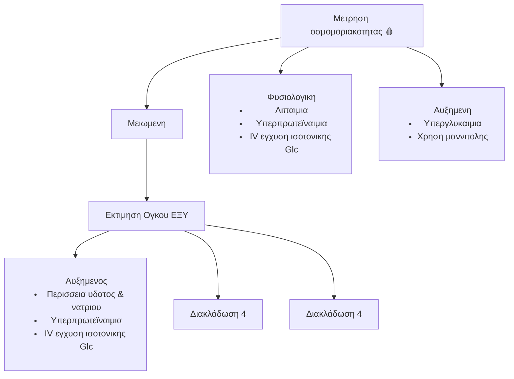

$\text{Τριγλυκερίδιο} \xrightarrow{\text{HSL}} \text{Γλυκερόλη} + 3 \, \text{Ελεύθερα λιπαρά οξέα}$

tbc τριχοειδες, πνευμονας

tbc mt

tbc -♺  (αρνητικη ανατροφοδοτηση)

tbc PLTs

tbc Ag

tbc Cre (κρεατινινη)

tbc αιμα

tbc GLUT (🚦)

tbc 💨 ΠΕΠΤΙΚΟυ φυσ β

tbc ιστορικο 

tbc υπνος

tbc 😵‍💫 (ζαλη)

Nord </FONTCOLOR>

ojeidash + micro

τβψ 🔉

tbc CTX

tbc HSR (υπερευαισθησια)

} + karbapanemes

TBC τερατογονα

