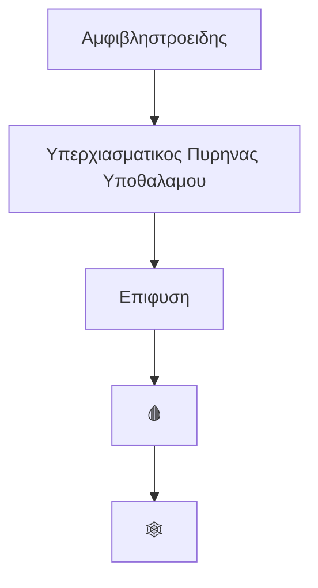
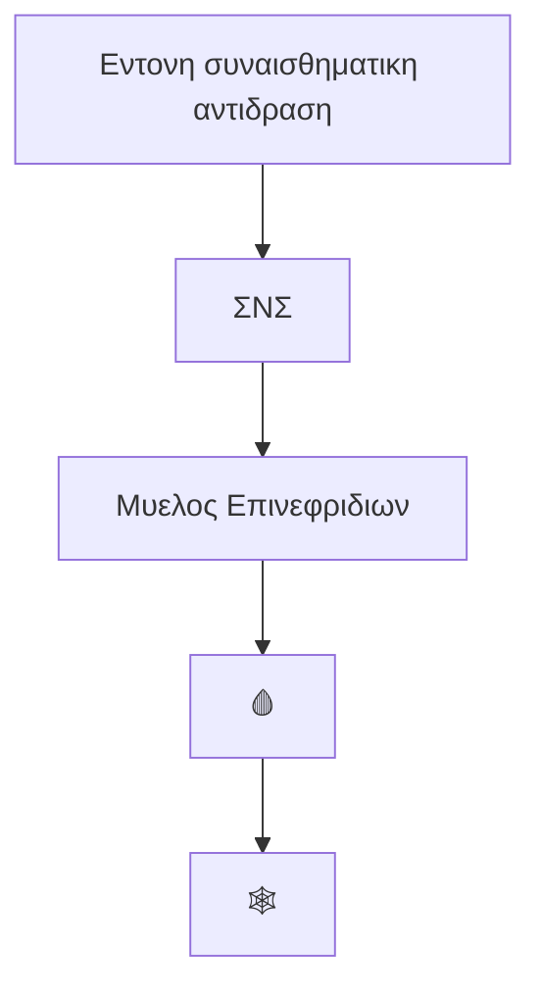

***
## SOS

ΑΕΔ = Αδρο Ενδοπλασματικο Δικτυο

ΔΕ = Δυναμικο Ενεργειας

ΓΕΣ = Γαστρεντερικος Σωληνας 

ΕΝΣ = Εντερικο Νευρικο Συστημα

⭕️
	Κερατινοποιημενο ~> Μεγαλη ποσοτητα κερατινης, χωρις πυρηνες
	Παρακερατινοποιημενο ~> Μετρια ποσοτητα κερατινης, με πυρηνες
	Μη Κερατινοποιημενο ~> Καθολου κερατινη, με πυρηνες

Τελικη Σχισμη = Γευστικο Λαμδα

ΒΜ = Βασικη Μεμβρανη

PG = Πρωτεογλυκανη  |  GAG = Γλυκοζαμινογλυκανη

VIP = Αγγειοδραστικο Εντερικο Πεπτιδιο
	Ορμονη του ΓΕΣ

Δενδριτικα Κυτταρα = DC

ECM = ΕΘΟ = Εξωκυτταρια Θεμελια Ουσια

DC = Δενδριτικο Κυτταρο

ΣΠ = Σπλαχνικο Περιτοναιο

Stratified = Πολυστιβο

ΜΦ = Μακροφαγο

GF = Αυξητικος Παραγοντας
	EGF = Επιδερμιδικος 
	FGF = Ινοβλαστικος 
	VEGF = Ενδοθηλιακος 
	IGF = Τυπου ins
	PDGF = Προερχομενος απο PLTs
	TGF-β = Μετατρεπτικος (-β)

Μονοπυρηνα = Μονοκυτταρα/ΜΦ + Λεμφοκυτταρα ^363bc1

***
## 1ο ΜΑΘΗΜΑ ~ { ΝΕΥΡΙΚΟ ΣΥΣΤΗΜΑ }

[[Νευροανατομία#^2303dd]]

[[Νευροανατομία#ΘΕΣΗ ΣΥΝΑΨΕΩΝ]]

[[Νευροανατομία#ΕΙΔΗ ΝΕΥΡΟΓΛΟΙΑΚΩΝ ΚΥΤΤΑΡΩΝ]]

[[Νευροανατομία#ΖΩΝΕΣ ΦΛΟΙΟΥ ΠΑΡΕΓΚΕΦΑΛΙΔΑΣ]]

Νευροπιλημα -> Συσταδες αξονων & αποφυαδων στο νευρικο συστημα
	ΔΕΝ περιεχει περικαρυα

Σωμα = Περικαρυο

Σωματιο Nissl -> Βασεοφιλη δομη απο ΑΕΔ και πολυριβοσωματια
	Πλουσια πρωτεινοσυνθεση

Αποπολωση = Εκπολωση

Αδρεναλινη & Νοραδρεναλινη ~> Μεταξυ νευρικων κυτταρων
Ακετυλοχολινη ~> Για τις νευρομυικες συναψεις

❁  Τα νευρογλοιακα δεν χρωματιζονται με Α&Ε, αλλα με **χρυσο ή αργυρο**
	Μονο οι **πυρηνες των μικρογλοιων**

✥  Η αραχνοειδης μηνιγγα ειναι δικτυωτη

-  Η μυελινη προσδιδει λευκο χρωμα στην λευκη ουσια

Μυελινη -> Κυτταρικες μεμβρανες στενα συνδεδεμενες, τυλιγμενες γυρω απο ενα νευραξονα
	Πλουσια σε **λιπιδια & πρωτεινες**

ΕΓΚΕΦΑΛΟΣ
	Φαια Ουσια ~> Νευρογλοια & Νευρικα κυτταρα
	Λευκη Ουσια ~> Νευρογλοια & Εμμυελοι νευραξονες

ΝΜ
	Φαια Ουσια ~> Αστροκυτταρα & Περικαρυο νευρωνων
	Λευκη Ουσια ~> Ολιγοδενδροκυτταρα & Εμμυελοι νευραξονες (**Δεματια**)

**Γαγγλια** αποτελουνται απο:
	-  Περικαρυα
	-  Δορυφορικα κυτταρα
	-  Κυτταρα Schwann
	-  Χαλαρος συνδετικος ιστος

Αισθητικα Γαγγλια = Γαγγλια CN + Νωτιαια Γαγγλια
	Νευρωνας ~> **Ψευδομονοπολος**

Αυτονομα Γαγγλια
	Νευρωνας ~> **Πολυπολος**

―――――
##### ΚΑΤΗΓΟΡΙΕΣ ΝΕΥΡΩΝΩΝ (ΔΟΜΗ)

1.  Πολυπολοι
	-  1 Νευραξονας  |  2 ή παραπανω Δενδριτες
	☞  Κινητικοι, Διαμεσοι

2.  Διπολοι
	-  1 Νευραξονας  |  1 Δενδριτης
	☞  Αμφιβληστροειδης, Γαγγλια VIIΙ, οσφρητικος βλεννογονος

3.  Μονοπολοι
	-  1 Νευραξονας  |  Χωρις Δενδριτες
	☞  Αισθητικοι

4.  Ψευδομονοπολοι
	-  1 Αποφυαδα ~> Διχαζεται στο περικαρυο (το ενα ακρο εκτεινεται προς ΚΝΣ και το αλλο προς καποια περιφερικη αποληξη)
	☞  Αισθητικα νωτιαια γαγγλια, περισσοτερα CN
	
5.  Αναξονικοι
	-  Χωρις Νευραξονα  |  Πολλοι Δενδριτες
	}-  **Δεν παραγουν ΔΕ, αλλα ρυθμιζουν τα ηλεκτρικα φορτια παρακειμενων νευρωνων**
	☞  Στο ΚΝΣ 

―――――
##### ΚΑΤΗΓΟΡΙΕΣ ΝΕΥΡΩΝΩΝ (ΛΕΙΤΟΥΡΓΙΑ)

1.  Κινητικοι
2.  Αισθητικοι
3.  Διαμεσοι
	**Εγκαθιστουν σχεσεις αναμεσα σε αλλους νευρωνες (μεταξυ αισθητικων & κινητικων νευρωνων)**
	Σχηματιζουν περιπλοκα λειτουργικα δικτυα (**κυκλωματα**)
		-  Πχ στο ΚΝΣ & αμφιβληστροειδη
	➤  1)  Πολυπολοι  |  2)  Αναξονικοι ^1dffdb

☆  Οι νευραξονες των διαμεσων και ορισμενων κινητικων νευρωνων εχουν παραπλευρους κλαδους

―――――
##### ΑΞΟΝΙΚΗ ΜΕΤΑΦΟΡΑ

-  Προσθιοδρομικη Μεταφορα
	1.  Συνθεση μικρων & μεγαλων μοριων στο περικαρυο
	2.  Μεταφορα κατα μηκος του νευραξονα μεχρι τις αποληξεις
	▿  Κινητηρια Πρωτεινη ~> **Κινησινη**

-  Οπισθοδρομικη Μεταφορα
	1.  Μεταφορα μοριων απο αποληξεις μεχρι περικαρυο
	▿  Κινητηρια Πρωτεινη ~> **Δυνεινη**

―――――
##### ΠΕΡΙΟΧΕΣ

Αξονικο Λοφιδιο -> Περιοχη περικαρυου απο οπου εκφυονται οι νευραξονες
	Δεν εχει οργανιδια ουτε σωματια Nissl

Αρχικο Τμημα -> Περιοχη μεταξυ αξονικου λοφιδιου και αρχης ελυτρου μυελινης
	Εδω αθροιζονται τα EPSP και IPSP και προκυπτει η αποφαση ή οχι για ΔΕ

―――――
##### ΝΕΥΡΟΓΛΟΙΑ

| Τυπος              | Εντοπιση                       | Κυριες Λειτουργιες                                      |
| ------------------ | ------------------------------ | ------------------------------------------------------- |
| ΟΛΙΓΟΔΕΝΔΡΟΚΥΤΤΑΡΟ | ΚΝΣ                            | 1.  Παραγωγη μυελινης 2.  Ηλεκτρικη μονωση           |
| ΚΥΤΤΑΡΟ SCHWANN    | ΠΝΣ                            | 1.  Παραγωγη μυελινης 2.  Ηλεκτρικη μονωση           |
| ΑΣΤΡΟΚΥΤΤΑΡΟ       | ΚΝΣ                            | Δομικη και μεταβολικη υποστηριξη των νευρωνων           |
| ΔΟΡΥΦΟΡΟ           | Περιφερικα γαγγλια             | Δομικη και μεταβολικη υποστηριξη των περικαρυων         |
| ΕΠΕΝΔΥΜΑΤΙΚΟ       | Κοιλιες, κεντρικος σωληνας ΚΝΣ | Βοηθα στην παραγωγη και διακινηση του ΕΝΥ               |
| ΜΙΚΡΟΓΛΟΙΑ         | ΚΝΣ                            | Αμυνα και δραστηριοτητες σχετιζομενες με ανοσια (ΜΦ) |

――――――
###### ΙΣΤΟΛΟΓΙΚΑ

**Αστροκυτταρα**
	-  Μεγαλα
	-  Αστεροειδες Σχημα
	-  Μακρες Αποφυαδες
	-  Ωοειδης ή ελαφρα λοβωτος πυρηνας
	1.  Πλασμωδη (φαια ουσια ΚΝΣ)
	2.  Ινωδη (λευκη ουσια ΚΝΣ)

**Ολιγοδενδροκυτταρα**
	-  Μικροτερα
	-  Λιγοτερες αποφυαδες
	-  Στρογγυλος πυρηνας

**Μικρογλοια**
	-  Μικρα
	-  Πυκνα
	-  Κοντες "αγκαθωτες" αποφυαδες
	-  Ραβδοειδης πυρηνας
	-  Υπαρχουν και στη φαια και στη λευκη ουσια

**Επενδυματικα**
	-  Κυλινδρικα
	-  Χωρις αποφυαδες

―――――
##### ΧΟΡΙΟΕΙΔΗ ΠΛΕΓΜΑΤΑ

**Επενδυμα + αγγιοβρειθης Χοριοειδης Μηνιγγα**

Βρισκονται σε καθε μια απο τις 4 κοιλιες

Παραγουν το ΕΝΥ

Επενδυμα ~> Ψηλα κυλινδρικα (⭕️)
	Εχουν κροσσους στην κορυφαια επιφανεια (κινηση ΕΝΥ)

***

## 2ο ΜΑΘΗΜΑ ~ { ΠΕΠΤΙΚΟ ΣΥΣΤΗΜΑ - Ι }

――――
#### ΑΝΑΤΟΜΙΚΑ ΧΑΡΑΚΤΗΡΙΣΤΙΚΑ 

ΓΕΣ -> Κοιλος σωληνας με ποικιλης διαμετρου αυλο και τοιχωμα με 4 χιτωνες (στιβαδες)

―――――
##### ΣΤΙΒΑΔΕΣ ΓΕΣ

1.  Βλεννογονος
	1)  ⭕️
	2)  Χοριο
	3)  Βλεννογονια μυικη στιβαδα

2.  Υποβλεννογονιος (συνδετικος ιστος)
	-  Περιεχει μεγαλα αιμοφορα και λεμφικα αγγεια
	-  Περιεχει και το Πλεγμα Meissner (ΕΝΣ)

3.  Μυικος Χιτωνας

4.  Ορογονος Χιτωνας (ΣΠ)
	1)  Χαλαρος συνδετικος ιστος
	2)  Μεσοθηλιο
	👁️‍🗨️  Οπου ο ΓΕΣ συνδεεται με παρακειμενες δομες ο ορογονος χιτωνας αντικαθισταται απο τον **Εξω Χιτωνα (παχυς, χωρις μεσοθηλιο)**

![[Στιγμιότυπο οθόνης 2024-03-19, 20.12.48.pdf]]

―――――
##### ΠΡΟΕΛΕΥΣΗ ΓΕΣ

Ενδοδερμα ➱ ⭕️

Σπλαχνικο Μεσοδερμα ➱ Ολοι οι υπολοιποι ιστοι

――――
#### ΣΤΟΜΑΤΙΚΗ ΚΟΙΛΟΤΗΤΑ

1.  Προδρομος Κοιλοτητα
	**Αναμεσα στα χειλη, παρειες και δοντια**

2.  Ιδιως Στοματικη Κοιλοτητα
	**Πισω απο τα δοντια (σκληρα & μαλακη υπερωα, γλωσσα, εδαφος στοματος, εισοδος στοματοφαρυγγα)**

――
##### ΒΛΕΝΝΟΓΟΝΟΙ

❁  Μασητικος Βλεννογονος
	✗  Ουλα, σκληρα υπερωα
	⭕️  Κερατινοποιημενο, Παρακερατινοποιημενο
	Χοριο ~> Αμεση επαφη με το **περιοστεο** του υποκειμενου ιστου
	**Αντεχει στην εντονη τριβη κατα την διαρκεια της μασησης**

❁  Επενδυτικος Βλεννογονος
	✗  Χειλη, παρειες, εδαφος στοματος, κατω επιφ. γλωσσας, μαλακη υπερωα, φαρυγγας
	⭕️  Μη Κερατινοποιημενο (πιο λεπτο)
	**Δεν ερχονται σε επαφη με τροφη**

❁  Εξειδικευμενος Βλεννογονος
	✗  Ανω επιφ. γλωσσας (γευστικοι καλυκες)
	⭕️  Κερατινοποιημενο (πιο λεπτο)
	**Βοηθα στη διαδικασια της αρχικης πολτοποιησης της τροφης και στην αντιληψη της γευσης**

――
##### ΧΕΙΛΗ

3 Επιφανειες

1.  ΕΞΩΤΕΡΙΚΗ ΕΠΙΦΑΝΕΙΑ (ΔΕΡΜΑ)
	-  Λεπτο Δερμα
	⭕️  Πολυστιβο Πλακωδες Κερατινοποιημενο
	]  Χοριο ~> Περιεχει **ιδρωτοποιους αδενες**
	]  Τριχοθυλακια ~> Περιεχουν **σμηγματογονους αδενες**
		[[#ΤΡΙΧΟΘΥΛΑΚΙΑ]]     |     [[#ΣΜΗΓΜΑΤΟΓΟΝΟΙ ΑΔΕΝΕΣ]]

2.  ΕΡΥΘΡΟ ΚΡΑΣΠΕΔΟ
	⭕️  Πολυστιβο Πλακωδες Κερατινοποιημενο (πολυ λεπτο)
	Δεν εχει σιελογονους ή ιδρωτοποιους αδενες
	]  Συνδετικος Ιστος ~> Αισθητικα Νευρα, Αρτηριες, Φλεβες
		Δινει **ροζ** χρωμα

3.  ΕΣΩΤΕΡΙΚΗ ΒΛΕΝΝΟΓΟΝΙΑ ΕΠΙΦΑΝΕΙΑ
	⭕️  Πολυστιβο Πλακωδες Μη Κερατινοποιημενο (παχυ)
	Εχει μικρους χειλικους **σιελογονους αδενες** (προδρομη κοιλοτητα)

ΓΥΡΩ ΑΠΟ ΤΑ ΧΕΙΛΗ
	Σφιγκτηρας Στοματος

![[Στιγμιότυπο οθόνης 2024-03-19, 21.31.39.pdf]]

――
##### ΓΛΩΣΣΑ

**Βλεννογονος**
	Κατω Επιφανεια ~> Λειος
	Ανω Επιφανεια ~> Διαθετει προεξοχες (θηλες) στο μπροστα 2/3 και χαμηλες λειες ημισφαιρικες υπεγερσεις (ιστος γλωσσικης αμυγδαλης)
		Μεταξυ προσθιου 2/3 και οπσθιου 1/3 η τελικη σχισμη
	▵  Καλυπτει λεμφικο ιστο

⭕️  Πολυστιβο Πλακωδες 

**Υποβλεννογονιος**
	Πυκνος Ακανονιστος Συνδετικος ιστος
		Περιεχει οροβλεννωδεις αδενες

**Κεντρικο Τμημα (Σκελετικος Μυς)**
	Ινες ~> προσανατολισμενες σε ολες τις κατεθυνσεις

![[Στιγμιότυπο οθόνης 2024-03-19, 21.58.11.pdf]]

Γεστικος Καλυκας -> Υποδοχεας γευσης της γλωσσας

―
###### ΓΕΥΣΤΙΚΟΙ ΚΑΛΥΚΕΣ

Ωοειδεις  |  Βρισκονται μεσα στο πολυστιβο ⭕️

Μοιαζουν με 🌷

Περιεχουν 50-100 κυτταρα

1.  Γευστικα κυτταρα
	-  `Συναψεις με τους προσαγωγους αισθητικους νευραξονες`
	**Πυρηνες: Υποστρογγυλοι**

2.  Υποστηρικτικα κυτταρα
	-  `Στηριζουν τα γευστικα`
	**Πυρηνες: Επιμηκεις**

3.  Βασικα κυτταρα
	-  Αρχεγονα

![[Στιγμιότυπο οθόνης 2024-03-20, 12.48.20.pdf]]

⌶  Μορια περνανε μεσα απο τους γευστικους πορους (ανοιγματα ⭕️)

⌶⌶  Απορροφουνται απο τις μικρολαχνες και αντιδρουν με τους υποδοχεις των γευστικων κυτταρων

⌶⌶⌶  Γευστικα κυτταρα ~> ΠΝΣ ~> ΚΝΣ

**Δεν περιοριζονται στις θηλες**

Ανιχνευουν 5 γευσεις:
	1)  Γλυκο (σακχαρα και συνθετα συναφη)
	2)  Αλμυρο (Na+)
	3)  Ξινο (Η+ απο οξεα)
	4)  Πικρο (τοξινες και αλκαλοειδη)
	5)  Umami (συγκεκριμενα αα πχ **asp**, **glu**)

**2000 - 8000** στην ενηλικη γλωσσα

❗  Η οπισθια επιφανεια της γλωσσας εχει αθροισεις λεμφικου ιστου
	ΓΛΩΣΣΙΚΗ ΑΜΥΓΔΑΛΗ

―
###### ΓΛΩΣΣΙΚΕΣ ΘΗΛΕΣ

..
###### Περιχαρακωμενες

6-10 ημισφαιρικες προσεκβολες

✗  Τελικη Σχισμη

}-  Υποστρογγυλες

⭕️  Πολυστιβο Πλακωδες Κερατινοποιημενο 
	Κανει θηλες (προεκταση ⭕️ στο χοριο)

✾  Περιβαλλεται απο αυλακα
	Αυτη διαθετει τα στομια των σιελογονων αδενων
	`Ξεπλενονται τα υπολειμματα της τροφης`

Πιο αραιοχρωματικες περιοχες ~> **Γευστικοι Καλυκες**

![[Στιγμιότυπο οθόνης 2024-03-20, 11.57.47.pdf]]

..
###### Φυλλοειδεις

✗  Πλαγιες Περιοχες

❕  Σπανιες στους ανθρωπους

Παραλληλες μεταξυ τους  |   Δημιουργουν χαμηλες ακρολοφιες

Πλαγιες επιφανειες ~> **Γευστικοι Καλυκες**

Πυθμενας αυλακων ~> **Ορωδεις αδενες**
	`Καθαριζουν`

![[Στιγμιότυπο οθόνης 2024-03-20, 12.04.19.pdf]]

..
###### Τριχοειδεις

✗  Σε ολη τη πανω επιφανεια της γλωσσας

-/-  Οι περισσοτερες

ΔΕΝ διαθετουν γευστικους καλυκες

Επιμηκεις  |  Κωνικες

`Επενδυουν την επιφανεια (την κανουν τραχια)`
`Διευκολυνουν την κινηση της τροφης κατα τη μασηση`

![[Στιγμιότυπο οθόνης 2024-03-20, 12.24.14.pdf]]

..
###### Μυκητοειδεις

✗  Διασπαρτες με τις τριχοειδεις

Ελαφρως αποστρογγυλοποιημενες  |  Πολυ λεπτη κερατινοποιημενη επιφανεια

Εχουν γευστικους καλυκες

![[Στιγμιότυπο οθόνης 2024-03-20, 12.27.54.pdf]]
	Ερυθρες κουκκιδες ~> Αγγειοβριθης κολλαγονωδης ιστος

――
##### ΔΟΝΤΙΑ

32 στον ενηλικα

Τοποθετημενα πανω στις φατνιακες αποφυσεις της ανω & κατω γναθου

Σκληρα  |  Εντονα ασβεστοποιημενα

1.  Μυλη 
	-  **Προβαλλει πανω απο τα ουλα**
2.  Αυχενας
	-  **Επιπεδο ουλων**
3.  Ριζα (1 ή περισσοτερες)
	-  **Σταθερη προσαρμογη στα οστικα φατνια**

ΔΟΜΙΚΑ ΣΤΟΙΧΕΙΑ ΟΔΟΝΤΩΝ (Εσω ~> Εξω)

1)  Πολφικη Κοιλοτητα
	-  Πολφικος Θαλαμος (μυλη & αυχενας) + Ριζικος Σωληνας (ριζα)
	-  Κατω μερος ριζικου σωληνα επιτρεπει διοδο (🔵🔴🟡🟢)
	-  **Χαλαρος Συνδετικος Ιστος**
		Κολλαγονο, ινοβλαστες, αγγεια, νευρα, ΕΘΟ, κυτταρα ανοσοποιητικου

2)  Οδοντινη
	-  Ασβεστοποιημενος ιστος (PGs, GAGs, ινιδικες πρωτεινες)
		-  Αρχικα ειναι **προοδοντινη** (μερικως ασβεστοποιημενη)
	-  Εκκρινεται απο **οδοντινοβλαστες**
		}-  Επιμηκη  |  Πυρηνες στον βασικο πολο
		}-  Παραλληλα τοποθετημενα  |  Πασσαλοειδη διαταξη
		Στην κορυφαια επιφανεια ~> Οδοντινοβλαστικες αποφυαδες
	-  Περιβαλλουν την πολφικη κοιλοτητα
	-  Προσκολλωνται σε μια ΒΜ που υποστηριζεται απο το χοριο της πολφικης κοιλοτητας
	![[Στιγμιότυπο οθόνης 2024-03-20, 14.07.54.pdf]]
		Κ ~> Πολφικη Κοιλοτητα
		Ο ~> Οδοντινοβλαστες
		ΠΟ ~> Προοδοντινη
		ΑΟ ~> Οδοντινη

3)  Αδαμαντινη
	-  Εντονα ασβεστοποιημενος ιστος (96% αλατα)  |  Η πιο σκληρη ουσια του σωματος
	-  Εξω απο **μυλη**
	-  F- μπορει να ενσωματωθουν ή απορροφηθουν
		-  Τοτε η αδαμαντινη ειναι περισσοτερο ανθεκτικη στα οξεα
	-  Εκκρινεται απο **αδαμαντινοβλαστες**
		}-  Ψηλα κυτταρα 
		}-  Ειναι πιο εξω απο την αδαμαντινη (την εκκρινουν προς τα εσω)
		}-  Μετα την ολοκληρωση της αναπτυξης **εκφυλιζονται**
			ΔΕΝ αναπληρωνονται
		}-  Δεν εχουν κυτταρικες αποφυαδες 

――
##### ΠΕΡΙΔΟΝΤΙΟ

Δομες απαραιτητες για την **συγκρατηση των δοντιων στις φατνιακες αποφυσεις**

1.  Οστεινη
	-  Καλυπτει την οδοντινη της ριζας
	-  Αποτιτανωμενος  |  Περιεχει κολλαγονο
	-  Παραγεται απο τα **οστεινοκυτταρα**
	-  Προς την οδοντινη ειναι ασβεστοποιημενη  |  Προς τους συνδεσμους ειναι μερικως ασβεστοποιημενη (οστεινοκυτταρα, οστεινοβλαστες, κολλαγονο, ινοκυτταρα)

2.  Περιοδοντικος Συνδεσμος
	-  Ινωδης συνδετικος ιστος  |  Κυτταροβριθης & αγγειοβριθης
	-  **Ινιδια κολλαγονου στερεωνουν την οστεινη στο φατνιακο 🦴**
	-  Προστασια απο επαναλαμβανομενη πιεση στη μασηση
	-  Περιορισμενη κινητικοτητα του δοντιου

	Ο αυχενας δεν περιβαλλεται απο αδαμαντινη αλλα απο οστεινη
	![[Στιγμιότυπο οθόνης 2024-03-20, 14.53.25.pdf]]
	ΠΣ ~> Περιοδοντικος Συνδεσμος
	ΟΒ ~> Οστεοβλαστες
	Ο ~> Οδοντινη
	ΑΟστ ~> Ασβεστοποιημενη οστεινη
	ΚΟστ

3.  Φατνιακο 🦴

4.  Ουλα
	1)  Τμημα που ΔΕΝ ερχεται σε επαφη με τη μυλη
		**Μασητικος Βλεννογονος**
	2)  Τμημα που ερχεται σε επαφη με τη μυλη
		**⭕️  Λεπτο πολυστιβο πλακωδες κερατινοποιημενο**
		-  Σε επαφη με αδαμαντινη & οστεινη
	![[Στιγμιότυπο οθόνης 2024-03-20, 15.00.12.pdf]]

――
##### ΣΙΕΛΟΓΟΝΟΙ ΑΔΕΝΕΣ

1.  Υπογναθιοι
2.  Παρωτιδα
3.  Υπογλωσσιοι

ΔΕΝ ειναι μελος της στοματικης κοιλοτητας (συνδεονται με αυτη)

☑︎  Εφυγρανση & Λιπανση στοματικου βλεννογονου
☑︎  Πεψη υδατανθρακων & λιπιδιων
☑︎  Εκκριση συστατικων φυσικης ανοσιας
	Αμυλαση, λιπαση, κλασμα IgA, λυσοζυμη, λακτοφερινη

◎  Καψα συνδετικου ιστου

Οργανωνονται σε λοβια απο διαφραγματα συνδετικου ιστου

―
###### ΥΠΟΓΝΑΘΙΟΙ

Ωοειδεις  |  Μεικτοι

Ορωδεις ~> Πυραμιδικο σχημα, στρογγυλος πυρηνας
	Κοκκια με πρωτεινες στο κορυφαιο τμημα
	**Ορωδης Μηνισκος** -> Περιφερειακη, ημισεληνοειδης ομαδα κυτταρων

Βλεννωδεις ~> Κυλινδρικο σχημα, μικροι πλακωδεις πυρηνες (στη βαση)

Υποστηριζονται με χαλαρο ή πυκνο ακανονιστο συνδετικο ιστο

![[Στιγμιότυπο οθόνης 2024-03-20, 15.22.26.pdf]]

Μυοεπιθηλιακα Κυτταρα
	Πλακωδη  |  Συσταλτες αποφυαδες που περιβαλλουν τον πορο
	Επι τα εντος της ΒΜ που περιβαλλει τις αδενοκυψελες, τα σωληναρια και τις αρχικες μοιρες του συστηματος των πορων
	**Μετακινουν το εκκριμα διαμεσου των πορων**

..
ΚΕΝΩΣΗ ΕΚΚΡΙΜΑΤΟΣ

Εμβολιμοι Ποροι (κυβοειδη κυτταρα) ~> Γραμμωτοι Ποροι (Κυλινδρικα κυτταρα) ~> Μεσολοβιοι ποροι (διαφορα ⭕️) ~> Κυριος πορος (μη κερατινοποιημενο πλακωδες και μπορει κροσσωτο )
..

―
###### ΠΑΡΩΤΙΔΑ

Πεπλατυσμενοι | Ορωδεις

Ζυμογονα κοκκια με πρωτεινες (αφθονη α-αμυλαση)

Το παρεγχυμα υποστηριζεται απο συνδετικο ιστο με διαφραγματια

Ποικιλη ποσοτητα λιπους

![[Στιγμιότυπο οθόνης 2024-03-20, 17.05.36.pdf]]

―
###### ΥΠΟΓΛΩΣΣΙΟΙ

Βλεννωδεις

Σωληνωδης διαταξη βλεννωδων κυτταρων αλλα και σωληνοκυψελοειδεις αδενες

Αλλοι βλεννωδεις ειναι: Γλωσσικοι, μικροι υπογλωσσιοι, χειλικοι, υπερωιοι, παρειακοι

――――
#### ΦΑΡΥΓΓΑΣ - ΣΤΟΜΑΧΟΣ

Ειναι απλοι διοδοι του πεπτικου σωληνα:
1.  Φαρυγγας
2.  Οισοφαγος
3.  Πρωκτος

**Μυικοι σωληνες με επενδυση απο ⭕️ πολυστιβο πλακωδες και με μικρους βλεννωδεις αδενες για λιπανση**

――
##### ΦΑΡΥΓΓΑΣ

1.  Ρινοφαρυγγας (⭕️ πολυστιβο πλακωδες)
2.  Στοματοφαρυγγας
3.  Λαρυγγοφαρυγγας

―
###### ΣΤΟΜΑΤΟΦΑΡΥΓΓΑΣ

Ερχεται σε επαφη με την τροφη

⭕️ Πολυστιβο Πλακωδες μη Κερατινοποιημενο

Χοριο ~> Πολλες ελαστικες ινες

ΔΕΝ εχει υποβλεννογονιο χιτωνα

Ο μυικος χιτωνας ειναι **γραμμωτος**

![[Στιγμιότυπο οθόνης 2024-03-20, 17.18.51.pdf]]

――
##### ΟΙΣΟΦΑΓΟΣ

Στη μεση γραμμη  |  25 εκατοστα

Εσω ~> Εξω

1.  Βλεννογονος
	⭕️  Πολυστιβο Πλακωδες Μη Κερατινοποιημενο
	Αραιοχρωματικη οψη (κοκκια γλυκογονου)
	Χοριο ~> Ινοβλαστες, κολλαγονο, GAGs, λεμφοκυτταρα, ηωσινοφιλα, σιτευτικα, πλασματοκυτταρα
		Κοντα στον στομαχο ~> Οισοφαγικοι καρδιακοι αδενες (επιπροσθετη βλεννη)

2.  Βλεννογονια μυικη στιβαδα

3.  Υποβλεννογονιος
	-  Συνδετικος ιστος
		**Οισοφαγικοι αδενες** ~> Μικροι βλεννωδεις αδενες
			`Λιπανση, προστασια βλεννογονου`
	-  Πολλα 🔵🔴🟢
	-  Λεμφοκυτταρα, πλασματοκυτταρα, ηωσινοφιλα, βλεννωδεις αδενες, μικρα λεμφοζιδια

4.  Μυικος Χιτωνας
	Α.  Σκελετικες μυικες ινες (ανω 1/3)
	Β.  Αναμεικτες σκελετικες/λειες μυικες ινες (μεσο 1/3)
	Γ.  Λειες μυικες ινες (κατω 1/3)
	**Εσω ~> Κυκλοτερης**
	**Εξω ~> Επιμηκης**

5.  Εξω Χιτωνας
	Χαλαρος συνδετικος ιστος (συνεχεται με ιστους γειτονικων οργανων)

![[Στιγμιότυπο οθόνης 2024-03-20, 17.34.02.pdf]]

Γαστροοισοφαγικη Συμβολη -> Μεταβολη 	(⭕️  Πολυστιβου Πλακωδες Μη Κερατινοποιημενου) του οισοφαγου σε  (⭕️  Μονοστιβο Κυλινδρικο) του στομαχου
	Το 1ο ειχε **προστατευτικο ρολο**
	Το 2ο εχει **λειτουργικο ρολο**
	![[Στιγμιότυπο οθόνης 2024-03-20, 18.04.37 1.pdf]]

>  Το ⭕️ του οισοφαγου δεν μπορει να αμυνθει στο οξινο περιβαλλον του στομαχου

📛  Βλαβη ⭕️
	Αρχικα φλεγμονωδης αντιδραση
	Εχει σαν αποτελεσμα την κακωση, τοπικη νεκρωση του βλεννογονου
	Αυξανεται η πιθανοτητα **του κακοηθους μετασχηματισμου των κυτταρων**

――
##### ΣΤΟΜΑΧΟΣ

Διευρυμενη περιοχη του ΓΣ

1.  Καρδια (μεταβατικη ζωνη αναμεσα σε στομαχο και οισοφαγο)
2.  Θολος
3.  Σωμα
4.  Πυλωρος
	-  Κωνοειδους σχηματος περιοχη προς 12δακτυλο

ΤΥΠΟΙ ΒΛΕΝΝΟΓΟΝΟΥ  [[#^b1b3cc]]
	1.  Καρδιακη περιοχη (2-3 εκ)
		-  Ισο παχος επιπολης και εν τω βαθει ζωνης
	2.  Περιοχη θολου/σωματος
		-  Επιπολης ζωνη < Εν τω βαθει ζωνη
			Στην εν τω βαθει ζωνη εχει **τα περισσοτερα τοιχωματικα και κυρια**
	3.  Πυλωρικη περιοχη 
		-  Επιπολης ζωνη > Εν τω βαθει ζωνη

✺  Ο βλεννογονος και υποβλεννογονος εχουν μεγαλες επιμηκεις αναδιπλωσεις (πτυχες)
	Επιτρεπουν τη διαταση του στομαχου

―
###### ΧΙΤΩΝΕΣ ΣΤΟΜΑΧΟΥ

1.  Ορογονος Χιτωνας (⭕️ μεσοθηλιο)

2.  Μυικος Χιτωνας
	Α.  Εξω επιμηκης
	Β.  Μεση κυκλοτερης
	Γ.  Εσω Λοξη (+ περισσοτερη δυναμη στον μυικο χιτωνα)

	Στον πυλωρο η μεση στιβαδα ειναι πιο παχια, σχηματιζει το πυλωρικο σφιγκτηρα 

	Οταν συστελλονται οι μυες ~> Πτυχες ειναι επιμηκεις
	Οταν χαλαρωνουν οι μες ~> Πτυχες επιπεδωνονται

3.  Βλεννογονος
	α.  ⭕️  Μονοστιβο Κυλινδρικο (εκκριτικο)
		Καταδυεται βαθια στο χοριο
	Εκατομμυρια βοθρια (σωληνοειδεις **γαστρικοι αδενες**)
		1.  Επιπολης ζωνη
		2.  Αυχενικη ζωνη
		3.  Εν τω βαθει ζωνη
	β.  Χοριο ~> Υποστηριζει τα γαστρικα βοθρια και τους αδενες
		Κολλαγονο, ινοβλαστες, λειες μυικες ινες, λεμφοκυτταρα
		ΜΦ, 💈, 🟢, 🟡
	γ.  Βλεννογονια μυικη στιβαδα
 ^b1b3cc
4.  Υποβλεννογονος
	Ινοβλαστες, κολλαγονο, διαμεσο υγρο, αγγεια,  λεμφαγγεια, νευρα, γαγγλιακα κυτταρα ΑΝΣ, λεμφικος ιστος
		[[Ανοσολογία#^01cf16]]

―
###### ΚΥΤΤΑΡΑ ⭕️ (ΣΤΟΜΑΧΟΣ)

1)  Βλεννοπαραγωγα
	-  **Επιφανειακα**
		Καλυπτουν την επιφανεια
		Κυλινδρικα  |  Ωοειδεις πυρηνες στη ΒΜ  |  Αραιοχρωματικο κυτταροπλασμα
		Υψος μειωνεται οσο πλησιαζουμε τον αυχενα
		Εκκρινουν `αλκαλικα κυστιδια βλεννης`
			Προστατευουν απο την τριβη των τροφων και απο τα οξεα
			Βραχεις μικρολαχνες
	-  **Αυχενικα**
		Σε ομαδες ή μεμονωμενα
		Ακανονιστο σχημα  |  Μικροτερα  |  Στρογγυλοι πυρηνες, κοντα στη βαση
		Μικρα διασπαρτα κυστιδια (PAS)
			Λιγοτερο αλκαλικα
	![[Στιγμιότυπο οθόνης 2024-03-20, 18.59.45.png]]

2)  Οξεοπαραγωγα / Τοιχωματικα
	-  Μεγαλα  |  Πυραμιδικα κυτταρα  |  Κεντρικοι στρογγυλοι πυρηνες
	-  Αραιοχρωματικα ηωσινοφιλο κυτταροπλασμα (πολλα μιτοχονδρια)
		Κενοτοπιωδες γυρω απο το πυρηνα
	-  Βαθιες εγκολπωσεις με μικρολαχνες
		Μικροσωληνισκοι (αυξηση επιφανειας, αυξηση εκκριτικης δραστηριοτητας)
	-  Διαθετουν πολυαριθμα στρογγυλα ή ωοειδη κυστιδια και μιτοχονδρια
	-  Παραγουν HCl και ενδογενη παραγοντα
	![[Στιγμιότυπο οθόνης 2024-03-20, 19.15.49.pdf]]

3)  Κυρια / Ζυμογονα
	-  Επικρατουν στις **βαθυτερες περιοχες** των γαστρικων αδενιων
	-  Παραγουν και αποθηκευουν τα ενζυμα που συμβαλλουν στη πεψη
	-  Ζυμογονα κοκκια με προδρομο ενζυμο (πεψινογονο) και λιπαση
	-  Ελαφρως **Βασεοφιλα**  |  Πυρηνας κοντα στη βαση
	![[Στιγμιότυπο οθόνης 2024-03-20, 19.21.50.pdf]]

4)  Αρχεγονα
	-  Εντοπιζονται στην αυχενικη περιοχη
	-  Μικρα αδιαφοροποιητα κυτταρα  |  Ωοειδης παραβασικος πυρηνας
	-  Αναλογα με το σε τι διαφοροποιουνται μετακινουνται προς τα πανω ή προς τα κατω
	-  Ο αριθμος φυσιολογικα αυξανεται κατα την επανανεπιθηλιοποιηση εξελκομενης περιοχης

5)  Εντεροενδοκρινη
	-  Τμημα ενδοκρινικου συστηματος  |  Παραγουν και εκκρινουν ορμονες
		- Ειτε παρακρινως ειτε ενδοκρινως
	-  Στρογγυλα ή απιοειδη  |  Βαθυχρωματικος, στρογυλος κεντρικος πυρηνας
	-  Διαυγες κυτταροπλασμα
	-  Στο θολο παραγουν σεροτονινη  |  Στο πυλωρο παραγουν γαστρινη
		-  Ειδικοτερα:
			-  Στη καρδια/σωμα ~> Σεροτονινη, VIP, γκρελινη
			-  Στο βαθος αδενων του πυλωρου ~> Μπομπεσινη, γαστρινη

Γκρελινη ~> Συμβαλλει στη διεγερση της ορεξης, στην αυξημενη προσληψη τροφης και στην αυξημενη αποθηκευση λιπους
	`Ορμονη της πεινας`

TBC ελκος στομαχου

***

## 3ο ΜΑΘΗΜΑ ~ { ΠΕΠΤΙΚΟ ΣΥΣΤΗΜΑ - ΙΙ }

――――
#### ΛΕΠΤΟ ΕΝΤΕΡΟ

ΛΕΙΤΟΥΡΓΙΕΣ
1.  Ολοκληρωση Πεψης
2.  Απορροφηση σακχαρων, αα, λιπων απο ⭕️

ΔΙΑΚΡΙΝΕΤΑΙ ΣΕ
1)  12δακτυλο (20-25 cm, στον οπισθοπεριτοναϊκο χωρο, σχημα πεταλου)
2)  Νηστιδα (240 cm, σημειο αναδυσης)
3)  Ειλεος (340 cm, αυξημενος αρυθμος βλεννοπαραγωγων κυτταρων)

――
##### ΔΟΜΕΣ ΛΕ

-  Πτυχες

-  Λαχνες (επιπολης ζωνη ⭕️)

-  Εντερικες Κρυπτες (εν τω βαθει ζωνη ⭕️)

Οτι δεν ειναι ουτε λαχνη ουτε στη κρυπτη ειναι αυχενικη ζωνη ⭕️

―
###### Πτυχες

Ειναι κυκλοτερεις ή και ημικυκλικες

Ειναι μονιμες

Σχηματιζονται απ τον **βλεννογονο** ή τον **υποβλεννογονιο**

Πολυ καλα ανεπτυγμενες στην **νηστιδα**

**3* την εντερικη επιφανεια και την απορροφητικη περιοχη**

―
###### Λαχνες

Σχηματιζονται απ τον **βλεννογονο**

Πυκνα τοποθετημενες 

**10* την εντερικη επιφανεια και την απορροφητικη περιοχη**

Καλυπτουν ολο τον βλεννογονο και το λεπτο εντερο

Ενω:
	Οι **μικρο**λαχνες 20* την εντερικη επιφανεια
		Τελικα ειναι πανω απο **200 m2**

⭕️  Μονοστιβο κυλινδρικο (εντεροκυτταρα & καλυκοειδη)
	[[Ιστολογία Α#Αναπνευστικο ⭕️]]

Χοριο ~> Ινοβλαστες, λειες μυικες ινες, λεμφοκυτταρα, 💈, χυλοφορα
	[[Φυσιολογία Β#^a0025f]]

[[#^ea9b9d]]

`Αλλαζουν κατα μηκος του λεπτου εντερου`
	1.  **Φυλλοειδεις** (12δακτυλο)
		-  Χαμηλοτερες, πλατυτερες, ανωμαλη αρχιτεκτονικη
		![[Στιγμιότυπο οθόνης 2024-03-26, 12.12.19.pdf]]
	2.  **Δακτυλιοειδεις** (Νηστιδα)
		-  Μεγιστη αναπτυξη πτυχων, πολυπλοκοτερο συστημα
		![[Στιγμιότυπο οθόνης 2024-03-26, 12.13.28.pdf]]
	3.  Ειλεος
		-  ↑ Βλεννοπαραγωγα (καλυκοειδη)
		![[Στιγμιότυπο οθόνης 2024-03-26, 12.15.01.pdf]]
	4.  **Ακρολοφιωδεις** (12δακτυλο & αρχικη νηστιδα)
		-  Στα βρεφη & στα νηπια ^b91f68

―
###### Εντερικεσ Κρυπτες

Βραχεις σωληνοειδεις αδενες

Λεγονται και **κρυπτες του Lieberkhum**

Μεταξυ των λαχνων

Το ⭕️ της καθε λαχνης αποτελει συνεχεια εκεινου των παρεμβαλλομενων αδενων ^ea9b9d

⭕️ Εντερικων αδενων
	-  Διαφοροποιημενα κυτταρα
	-  Αρχεγονα κυτταρα (πολυδυναμα)

――
##### ΚΥΤΤΑΡΑ ⭕️ (ΛΕ)

Τυπος κυτταρων διαφορετικος σε καθε ζωνη ⭕️

1.  Εντεροκυτταρα
2.  Καλυκοειδη (Βλεννοπαραγωγα)
3.  Paneth
4.  Εντεροενδοκρινη
5.  M
6.  Αρχεγονα

―
###### Εντεροκυτταρα

✘  Πολυπληθεστερος κυτταρικος τυπος λαχνων

-  `Απορροφητικα`

-  Υψηλα κυλινδρικα  |  Ωοειδης πυρηνας (στη βαση του κυτταρου)

-  2000-3000 / λαχνη

-  Στην κορυφη ~> σχηματιζουν τη **ψηκτροειδη παρυφη**
	Ψυκτροειδης Παρυφη -> Στιβαδα πυκνα τοποθετημενων μικρολαχνων

Αρα οι μικρολαχνες ειναι μερος των εντεροκυτταρων

-  Καλυπτονται απο **γλυκοκαλυκα**
	-  Μεσω αυτου προσλαμβανονται τα θρεπτικα συστατικα (στενες ενωσεις)

-  Στα πλαγια τοιχωματα ~> Περιπλοκες αλληλοεγκολπωσεις

`Παραγουν ενζυμα πεψης & μεταφορας`
	Λακταση, πεπτιδαση, λιπαση, αλκαλικη φωσφαταση (ALP)

―
###### Καλυκοειδη

✘  Στις λαχνες & στα ανω 2/3 των κρυπτων

-  Διασπαρτα αναμεσα στα εντεροκυτταρα

-  Διαθετουν σφαιρικα κυστιδια βλεννης στην επιφανεια

-  `Προστατευουν & λιπαινουν την εντερικη επιφανεια`

❕ Αυξανονται οσο προχωραμε προς το τυφλο (πολλα στον ειλεο)

―
###### Paneth

✘  Βασικη μοιρα εντερικων κρυπτων (κατω 1/3)

-  Εχουν παραβασικους πυρηνες & εντονα **μεγαλα ηωσινοφιλα** κοκκια

-  Εκκρινουν πρωτεϊνη πλουσια σε **arg** (βασεοφιλο κυτταροπλασμα στο βασικο τμημα)

-  Απελευθερωνουν λυσοζυμη (ελεγχουν τη βακτηριακη χλωριδα)

-  Παραγουν δυο α-ντεφενσινες (HD-5 ή DEFA5, HD-6 ή DEFA6)

-  HD-5 ~> Eυρύ φάσμα δράσης θανάτωσης 
	🐲  Gram + 
	🐲  Gram -
	🦠  Μύκητες

-  HD-6 ~> Συναρμολογει εξωκυτταρια διχτυα που **εγκλωβιζουν βακτηρια στο εντερο** (εμποδιζεται η μετακινηση τους κατα μηκος του επιθηλιακου φραγμου)

-  Παιζουν ρολο στη φυσικη ανοσια

―
###### Εντεροενδοκρινη

✘  Σε ολο το μηκος του λεπτου εντερου, κατω 1/3 κρυπτων

-  Ποικιλλει ο αριθμος του

-  Εχουν χημειουποδοχεις (ελεγχουν επιπεδο κυριων θρεπτικων συστατικων, ρυθμιζουν απελευθερωση συστατικων)

-  Εκκρινουν πεπτιδικες ορμονες (σεροτονινη, μοτιλινη, εντερογλυκανη, SST, GIP, γαστρινη, εκκριματινη)

―
###### Μ (Μικροπτυχων)

✗  Ειλεος (πανω στα λεμφοζιδια των πλακων Peyer)

-  Δεν εχουν μικρολαχνες, διαθετουν λεια επιφανεια (εκτος απο μερικες πτυχωσεις)

-  **Καταδυσεις** κυτταρικης μεμβρανης στο βασικο τμημα
	-  Περιεχει πολλα ενδοεπιθηλιακα και APCs

-  Ενδοκυτταρωνουν επιλεκτικα αντιγονα και τα μεταφερουν στα υποκειμενα λεμφοκυτταρα και DC 

-  Παρακολουθουν το περιβαλλον στον αυλο του λεπτου εντερου και παραδιδουν αντιγονα στα κυτταρα του ανοσοποιητικου ξεκινωντας μια ανοσοαποκριση

―
###### ΑΡΧΕΓΟΝΑ

✘  Ορια λαχνων-κρυπτων

-  Αντικαθιστουν τα αλλα κυτταρα

――
##### ΧΟΡΙΟ

Χαλαρος συνδετικος ιστος (κολλαγονο, δικτυωτες ινες) με 🔵🔴🟡🟢 και λειες μυικες ινες

Λεμφοκυτταρα, πλασματοκυτταρα, ηωσινοφιλα, μακροφαγα, σιτευτικα

-  Εισερχεται στον κεντρικο αξονα των λαχνων συμπαρασυροντας αγγεια & νευρα

-  Οι λειες ινες της βλεννογονιας μυικης στιβαδας προκαλουν 
	-  Ρυθμικες **κινησεις των λαχνων** (αυξηση απορροφητικης ικανοτητας)
	-  Τοπικες **κινησεις των πτυχων** (προωθηση λεμφου απο χυλοφορα μεσα σε υποβλεννογονια και μεσεντερια αγγεια)

――

##### ΥΠΟΒΛΕΝΝΟΓΟΝΙΟΣ

-  Μεγαλα 🔵🔴🟢

ΠΛΕΓΜΑ MEISSNER
	Ειναι ενα πλεγμα με διαμεσους νευρωνες
	[[#^1dffdb]]  |  [[Φυσιολογία Β#ΝΕΥΡΩΣΗ ΓΕΣ]]

-  Λεμφοζιδια

Αδενες Brunner -> Μεγαλοι, σωληνοειδεις βλεννοεκριτικοι αδενες
	Ομοιοι με αυτους της πυλωρικης περιοχης
	-  Επενδυονται με βλεννοπαραγωγα κυτταρα με βραχεις πορους
		Εκβαλλουν στα πλευρικα τοιχωματα των αδενικων κρυπτων
	**Το εκκριμα (αλκαλικο) προστατευτει το τοιχωμα του λεπτου εντερου (ουδετεροποιει τον οξινο χυμο) & επιτρεπει τη δραση των παγκρεατικων ενζυμων** ^02eb3f

――
##### ΜΥΙΚΟΣ ΧΙΤΩΝΑΣ

-  Καλα ανεπτυγμενος

Εσω ~> Κυκλοτερης  |  Εξω ~> Επιμηκης

-  Υποστηριζει την περισταλση
	[[Φυσιολογία Β#^e13c10]]

ΠΛΕΓΜΑ AUERBACH</fontcolor>
	 [[Φυσιολογία Β#ΝΕΥΡΩΣΗ ΓΕΣ]] ^1ff8ad

![[Στιγμιότυπο οθόνης 2024-03-26, 14.21.48.png]]

――
##### ΔΙΚΤΥΟ ΝΕΥΡΩΝ

![[Στιγμιότυπο οθόνης 2024-03-26, 14.24.37.pdf]]

――

##### ΤΟΙΧΩΜΑ 12ΔΑΚΤΥΛΟΥ

ΤΟΠΙΚΕΣ ΔΙΑΦΟΡΕΣ 12ΔΑΚΤΥΛΟΥ
1.  Ειναι οπισθοπεριτονϊκα
2.  Εχει φυλλοειδεις λαχνες
	[[#Λαχνες]]
3.  Εχει αδενες Brunner στον υποβλεννογονιο
	[[#^02eb3f]]
4.  Δεχεται εκκρισεις απο ηπαρ & παγκρεας

――

##### ΤΟΙΧΩΜΑ ΝΗΣΤΙΔΑΣ

Κυρια θεση απορροφησης

Δακτυλιοειδεις λαχνες
	[[#^b91f68]]

Μεγαλη αναπτυξη πτυχων 

![[Στιγμιότυπο οθόνης 2024-03-26, 14.48.49.pdf]]

tbc κοιλιοκακη

――
##### ΤΟΙΧΩΜΑ ΕΙΛΕΟΥ

Οι λαχνες ειναι **δακτυλιοειδους τυπου** 
	**Χαμηλοτερες απο τη νηστιδα**

ΑΝΟΣΟΛΟΓΙΚΗ ΑΜΥΝΑ
	-  Απο λεμφικο ιστο που συνοδευει τον βλεννγονο
	-  Εντος του χοριου / υποβλεννογονιου χιτωνα σχηματιζονται μεγαλα λεμφοζιδια (**βλαστικα κεντρα**)

Πλακες Peyer -> Πλακες λεμφικου ιστου
	Σχηματιζονται απο τη συνενωση των βλαστικων κεντρων
	-  Διευρυνουν το χοριο και επεκτεινονται στον υποβλεννογονιο

![[Στιγμιότυπο οθόνης 2024-03-26, 14.57.02.pdf]]

![[Στιγμιότυπο οθόνης 2024-03-26, 14.58.00.pdf]]

――――
#### ΠΑΧΥ ΕΝΤΕΡΟ - ΟΡΘΟ

**Σταθερη δομη**

Παχυ εντερο = 1/3 * Λεπτο εντερο

Παχυ εντερο εχει μεγαλυτερη διαμετρο απο λεπτο εντερο

`Μετατροπη υδαρους περιεχομενου (χυμου) σε στερεο απορριματικο υλικο (κοπρανα)`

Επαναρροφηση H2O & αλατων

Τα κοπρανα περιεχουν και βλεννη

![[Στιγμιότυπο οθόνης 2024-03-26, 22.37.01.pdf]]

Οι κρυπτες περιεχουν **απορροφητικα & βλεννοπαραγωγα**

**Δεν** εχει πτυχες

Το τοιχωμα του διαθετει **κολικες κυψελες**

Ο βλεννογονος διαθετει σωληνοειδεις εντερικους αδενες (κρυπτες)

>  Ελκωδης Κολιτιδα ~> Σχηματισμος ελκων, καραστροφη βλεννογονου, μερικη καταστροφη υποβλεννογονιου, **μη επαναρροφηση υδατος**, μεγαλες ποσοτητες υδαρους διαρροιας, αιμορραγια

――
##### ΚΥΤΤΑΡΑ ⭕️ (ΠΕ)

1.  Κυλινδρικα (**κολονοκυτταρα**)
2.  Βλεννοπαραγωγα (**καλυκοειδη**)
3.  Αρχεγονα
4.  Ενδοκρινη

![[Στιγμιότυπο οθόνης 2024-03-26, 23.14.32.pdf]]

―
###### Κυλινδρικα

Στενα  |  Λεπτα  |  Ανωμαλες μικρολαχνες 

Εχουν **αλατοαπορροφητικη - υδατοαπορροφητικη λειτουργια**

Εχουν ευδιακριτους μεσοκυτταριους χωρους

Πραγματοποιουν ενεργητικη μεταφορα H2O

Ειναι εξοπλισμενα με αντλιες Na+-K+
	Στις πλαγιες κυτταρικες επιφανειες

―
###### Βλεννοπαραγωγα

Ειναι κενοτοπια λογω βλεννης 

Ειναι **μεγαλυτερα** εντος του σιγμοειδους κολου και ορθου

Ειναι ΠΕΡΙΣΣΟΤΕΡΑ

Παραγουν βλεννη **για τη διελευση της στερεας μαζας**

―
###### Αρχεγονα

Εντοπιζονται στον πυθμενα σωληνωδων καταδυσεων

―
###### Ενδοκρινη

Σχετκα λιγα, εντοπιζονται στο κατω 1/2 καταδυσεων

`Παραγουν χρωμογρανινη, SST, γλυκαγονη`

――
##### ΧΟΡΙΟ

Διαθετει κολλαγονο, δικτυωτες ινες, GAGs, ινοβλαστες, πολλα λεμφοκυτταρα-λεμφοζιδια

Βλεννογονια μυικη στιβαδα

――
##### ΥΠΟΒΛΕΝΝΟΓΟΝΙΟΣ

Απο ινοκολλαγονωδη ιστο

――
##### ΜΥΙΚΟΣ ΧΙΤΩΝΑΣ

Εσω ~> Κυκλοτερης  |  Εξω ~> Επιμηκης

Η Επιμηκης συγκεντρωνεται σε 3 κολικες ταινιες

――
##### ΣΚΩΛΗΚΟΕΙΔΗΣ ΑΠΟΦΥΣΗ

Ειναι σωληνοειδης

Ειναι ενα **εκκολπωμα απο το τυφλο**

Το τοιχωμα αποτελειται απο:
1.  Βλεννογονο (κυλινδρικα, καλυκοειδη, εντεροενδοκρινικα)
	-  Δημιουργει **κρυπτες**
2.  Υποβλεννογονιο (αιμοφορα αγγεια, νευρα, μεταβλητη ποσοτητα λεμφικου ιστου)
3.  Εσω ~> Κυκλοτερης  |  Εξω ~> Επιμηκης
4.  Ορογονος Χιτωνας

![[Στιγμιότυπο οθόνης 2024-03-26, 23.26.21.pdf]]

![[Στιγμιότυπο οθόνης 2024-03-26, 23.27.09.pdf]]

――――
#### ΠΡΩΚΤΟΣ

Μηκος ~> 3-4 cm

Διαμετρος ελεγχεται απο 2 σφιγκτηρες

Εσω Πρωκτικος Σφιγκτηρας
	Τοπικη παχυνση Κυκλοτερους μυικης στιβαδας κατωτερου ορθου
	ΛΕΙΕΣ ΙΝΕΣ

Εξω Πρωκτικος Σφιγκτηρας
	Συνεχεται με την περιτονια & μυες πυελικου εδαφους
	ΓΡΑΜΜΩΤΕΣ ΙΝΕΣ

Ανω τμημα διαθετει μικρες ημισεληνοειδεις βλεννογονικες & υποβλεννογονικες προσεκβολες με καθετες πτυχες (**πρωκτικες στηλες**)
	-  Προσδιοριζουν την οδοντωτη γραμμη
	-  Περιεχουν φλεβωδεις κολπους απο το ΟΡΘΙΚΟ ΦΛΕΒΙΚΟ ΠΛΕΓΜΑ  

――
##### ΒΛΕΝΝΟΓΟΝΟΣ

**Πανω** απο την οδοντωτη γραμμη:
	⭕️  Κυλινδρικο

**Κατω** απο την οδοντωτη γραμμη:
	⭕️  Πολυστιβο πλακωδες μη κερατινοποιημενο

![[Στιγμιότυπο οθόνης 2024-04-16, 15.22.37.pdf]]

Πρωκτικοι Αδενες ~> Μικροι, **βλεννωδεις**, σωληνωδεις, διακλαδιζομενοι πανω στην οδοντωτη γραμμη

Περιπρωκτικοι Αδενες -> Αποκρινεις αδενες περιπρωκτικου δερματος

***

## 4ο ΜΑΘΗΜΑ ~ { ΗΠΑΡ - ΠΑΓΚΡΕΑΣ - ΧΟΛΗΦΟΡΟ }

――――
#### ΠΑΓΚΡΕΑΣ

✗  Ανω Κοιλια, Οπισθοπεριτοναϊκο

Κεφαλη  |  Αυχενας  |  Σωμα  |  Ουρα

}-  Κεφαλη **περιβαλλεται** απο 12δακτυλο

❂  Ουρα κοντα σε σπληνα

◎  Διαθετει συστημα πορων που καταληγουν στο 12δακτυλο

⦿  Περιβαλλεται απο **ινοκολλαγονωδη καψα**
	**Διαφραγματα** δημιουργουν Νησιδια & Αδενοκυψελες

Μεικτος αδενας με:
	-  Ενδοκρινης μοιρα
		❧  Νησιδια Langerhans
	-  Εξωκρινης Μοιρα
		❧  Αδενοκυψελες (Acini)

――
##### ΕΞΩΚΡΙΝΗΣ ΜΟΙΡΑ

Οι αδενοκυψελες ειναι **ορωδεις**

Περιεχει και συστημα πορων

![[Στιγμιότυπο οθόνης 2024-04-16, 15.56.26.pdf]]

Ενδοκυψελιδικος Πορος ~> Εμβολιμος Πορος ~> Ενδολοβιος Πορος ~> Μεσολοβιος Πορος ~> Κυριος Παγκρεατικος Πορος

Κυριος παγκρεατικος πορος καταληγει σε 12δακτυλο με το **Φυμα του Vater**

ΑΔΕΝΟΚΥΨΕΛΕΣ
	▲  Πυραμοειδη κυτταρα ("**Κυψελιδωτα**")
	🧬  Πυρηνες στη **βασικη πλευρα**
	-  Γυρω απο το πυρηνα: **βασεοφιλο** κυτταροπλασμα
	-  Κορυφαιο τμημα: **ηωσινοφιλο** κυτταροπλασμα
		Οφειλεται στα κοκκια
	◎  Αρχικα κυτταρα εμβολιμων πορων: **Μικρα, αραιοχρωματικα**
	🟢  CCK: Απελευθερωνει ενζυμα

📦  Κοκκια περιεχουν:
	💨  `Θρυψινογονο`, `💨 Χυμοθρυψινογονο`, `💨  Προκαρβοξυπεπτιδαση` , `💨 Προφωσφολιπαση`, `💨 Προλιπαση`, `💨 Αμυλαση`, `💨 Εστεραση`, Χοληστερολη `💨 Ριβονουκλεαση`

ΕΜΒΟΛΙΜΟΙ ΠΟΡΟΙ
	⭕️  Πλακωδες ή Κυβοειδες
		Εκκρινουν υγρο πλουσιο σε HCO3-
			Εξουδετερωνουν το pH της χολης (λιγοτερο επιβλαβες για το ⭕️ των Χοληφορων Σωληνισκων)
	🟢  Εκκριματινη: Διεγειρει παραγωγη παγκρεατικου υγρου

ΕΝΔΟΛΟΒΙΟΙ & ΜΕΣΟΛΟΒΙΟΙ ΠΟΡΟΙ
	⭕️  Κυλινδρικο

――――
#### ΗΠΑΡ

Το μεγαλυτερο εσωτερικο οργανο (1,5 kg)

✗  Δεξια Ανω 1/4 Κοιλιας

2 κυριοι λοβοι (ΔΕ,ΑΡ)  |  αλλοι 2 μικροτεροι (στην κατω επιφανεια)

➩  Συνθετει **πρωτεϊνες**
➩  Μετατρεπει αα σε **Glc**
➩  Αποθηκευει Glc ως **γλυκογονο**  |  TGs ως **λιποσταγονιδια**
➩  Αποδομει **τοξικες ουσιες** (τοξινες, 🍵, NH3)
➩  Μεταβολιζει **ορμονες** (πχ στεροειδεις)
➩  Παραγει **χολη** και εκκρινει **BR**
➩  Αποθηκευει **vit A**
➩  Απομακρυνει γερασμενα **RBCs**
➩  Αποθηκευει **Fe+2** σε συμπλοκα με τη **φερριτινη**
➩  Φαγοκυτταρωνει 🦠 & παιζει ρολο στη χυμικη ανοσια
➩  Επιτελει βιοχημικες λειτουργιες με τα ηπατοκυτταρα

Αλληλεπιδρασεις σε:
1.  Αγγειακο Δικτυο
2.  Ηπατοκυτταρα
3.  Συστημα αποχετευσης χολης

Ηπατικη</FONTCOLOR></FONTCOLOR>
	25% (↑ O2, μεταβολιτες, τοξινες)

Πυλαια</fontcolor></FONTCOLOR>
	75% (↓ O2, αα-λιπιδια-υδατανθρακες (εντερο), προϊοντα Hb (σπληνας))

![[Στιγμιότυπο οθόνης 2024-04-16, 16.57.09.pdf]]

Κεντρικη</fontcolor> ~> Υπολοβια</fontcolor> ~> Ηπατικη</fontcolor>

>  Κεντρολοβιακη Νεκρωση Ηπατος ~> Σε καρδιακη ανεπαρκεια, ζωνη 3 (περιοχη λοβιου κοντα στην Κεντρικη</fontcolor></FONTCOLOR>) λαμβανει 🩸 με ↓ O2
> 	 **Νεκρωση**, εκτεταμενη **αθροιση λιπιδιων**
> ![[Στιγμιότυπο οθόνης 2024-04-17, 14.14.04.pdf]]

――
##### ΗΠΑΤΟΚΥΤΤΑΡΑ

Πολυεδρικα

Κυτταροπλασμα με **πολλα οργανιδια**
	**Ηωσινοφιλο**

🧬  Μεγαλοι, σφαιρικοι, κεντρικοι
	Περιεχουν σωρους χρωματινης & ευδιακριτα πυρηνια
	50% πυρηνων ειναι **πολυπλοειδεις**

Golgi κοντα σε πυρηνα, προεκταση χοληφορων σωληνισκων</FONTCOLOR></FONTCOLOR>

🏭  Πανω απο 100 μιτοχονδρια/κυτταρο
	Ηωσινοφιλα, κοκκιωδη

★  Πολυαριθμα ριβοσωματα

Πολυ γλυκογονο & λιποσταγονιδια

Αφθονο ΑΕΔ
	Συνθετει πρωτεϊνες 🩸

Αφθονο ΛΕΔ
	Διαχυτο σε ολο το κυτταροπλασμα
	`Αποτοξινωνει ουσιες 🩸 που συνηθως εκκρινονται απο τη χολη`

Πολλα λυσωσωματα  |  200-300 υπεροξειδιοσωματα/κυτταρο
	Οξειδωνουν περισσεια FFA

―
###### Επιφανειες

1.  Κολποειδικη
	▴  70%
	Προς χωρο Disse
	`Βραχειες μικρολαχνες αυξανουν επιφανεια ανταλλαγης ουσιων * 6`

2.  Χολοαγγειακη
	Εμφανιζει αυλακες που σχηματιζει τους χοληφορους σωληνισκους</FONTCOLOR></FONTCOLOR>
		Μεσα σε αυτους εκκρινεται η χολη
			[[Φυσιολογία Β#ΗΠΑΡ]]

Χοληφοροι Σωληνισκοι</FONTCOLOR></FONTCOLOR> ~> Διαθετουν βραχειες μικρολαχνες (και αυτοι)
	⭕️  Κυβοειδες

[[Φυσιολογία Β#^dd4e8b]]

![[Στιγμιότυπο οθόνης 2024-04-17, 11.22.19.png]]

――
##### ΗΠΑΤΙΚΟ ΛΟΒΙΟ

0,7 * 2 mm

☑︎  Ηπατικο Λοβιο ~> Εκατονταδες δοκιδες ηπατοκυτταρων που φερονται **ακτινοειδως** γυρω απο μια Κεντρικη</fontcolor></FONTCOLOR>
	Μεταξυ των δοκιδων παρατηρουνται κολποειδη

}-  Οι δοκιδες υποστηριζονται απο δικτυωτες ινες (κολλαγονο ΙΙΙ)

📐  Στις γωνιες του περιεχει τα **πυλαια διαστηματα**
Πυλαια Τριαδα:
-  Τελικος Αρτηριακος Κλαδος</FONTCOLOR></FONTCOLOR>
-  Τελικο Πυλαιο Φλεβιδιο</fontcolor></FONTCOLOR>
-  Περιλοβιακος Χοληφορος Πορος</FONTCOLOR></FONTCOLOR>
-  Λεμφαγγεια</fontcolor></FONTCOLOR>
-  Νευρα (ΑΝΣ)</fontcolor></FONTCOLOR>

✢  Τα πυλαια διαστηματα περιεχουν **περισσοτερο** συνδετικο ιστο

Χωρος Mall -> Χωρος μεταξυ συνδετικου ιστου πυλαιου διαστηματος & εξωτατης ηπατοκυτταρικης στιβαδας
	Περισσεια υγρου εισερχεται απο εδω στα λεμφικα 💈</fontcolor></FONTCOLOR>
	Θα βγουν απο τη πυλη του ηπατος και θα καταληξουν σε ΜΘΠ</fontcolor></FONTCOLOR>

![[Στιγμιότυπο οθόνης 2024-04-17, 14.08.55.pdf]]

![[Στιγμιότυπο οθόνης 2024-04-16, 17.39.34.pdf]]

Κολποειδη ~> Αγγειακα καναλια που δημιουργουν συστημα
	Ενωνουν Ηπατικη</FONTCOLOR></FONTCOLOR> με Πυλαια</fontcolor></FONTCOLOR>
	Συγκλεινουν προς τη Κεντρικη</fontcolor></FONTCOLOR>
	[[Ιστολογία Α#Κατηγοριες 💈]]
	-  Σε στενη επαφη με τα ηπατοκυτταρα
	![[Στιγμιότυπο οθόνης 2024-04-17, 10.30.50.pdf]]

――
##### ΗΠΑΤΙΚΑ ΚΟΛΠΟΕΙΔΗ

⭕️  Ενδοθηλιο ~> Λεπτο, ασυνεχες,
	[[Ιστολογία Α#Κατηγοριες 💈]]
	✦  Περιβαλλεται απο ασυνεχη ΒΜ και δικτυωτες ινες

Χωρος Disse -> Χωρος μεταξυ κολποειδων & ηπατοκυτταρων
	▪︎  Στενος, με ανωμαλες μικρολαχνες (απο τα ηπατοκυτταρα)
	`Μεσω αυτου ανταλασσονται ουσιες (κολποειδη-ηπατοκυτταρα)`

![[Στιγμιότυπο οθόνης 2024-04-17, 10.41.35.pdf]]

**Κυκλοφορια**
Πυλαια</fontcolor></FONTCOLOR> ➟ Κολποειδη ➟ Κεντρικες</fontcolor></FONTCOLOR> ➟ Υπολοβιες</fontcolor></FONTCOLOR> ➟ Ηπατικη</fontcolor></FONTCOLOR> ➟ ΚΚΦ</fontcolor></FONTCOLOR>

――
##### ΑΣΤΕΡΟΕΙΔΗ (ITO)

✗  Χωρος Disse

Μεσεγχυματικα  ➱

🗝️
	1.  Αποθηκευει **vit A** σε μορφη **ρετινολης**
		Μεσα σε λιποσταγονιδια
		👁️  Μεταφερεται στον αμφιβληστροειδη 
			Συνδεεται με **οψινη** ~> Σχηματιζεται **ροδοψινη**
			[[Φυσιολογία Α#^daaa32]]
	2.  Παραγει ECM & κυττοκινες
	3.  Συνθετει & εναποθετει κολλαγονο Ι & ΙΙΙ

>  Χρονια φλεγμονη ~> **Χανουν** ικανοτητα εναποθεσης **λιπους** & **vit A**
> 	 Διαφοροποιουνται σε κυτταρα με χαρακτηριστικα **μυοϊνοβλαστων**

>  Προκαλει ηπατικη ινωση (Κιρρωση)

――
##### KUPFFER

✗  Αυλος κολποειδους

Ειναι **μακροφαγα**
	[[Ιστολογία Α#Μακροφαγα]]

▭  Επιμηκη
	**Φαγοκυτταρωνουν γερασμενα RBCs**

Ειναι APCs
	[[Ανοσολογία#^bf781c]]

![[Στιγμιότυπο οθόνης 2024-04-17, 11.06.19.pdf]]

――
##### ΑΝΑΓΕΝΝΗΣΗ ΗΠΑΤΟΣ

Το **μονο σπλαχνικο οργανο** που μπορει να αναγενναται

🩹  Μετα απο χειρουργικη αφαιρεση ή χημικο τραυματισμο

÷  Απαιτειται το 51%

ΤΙ γινεται;
1.  Μιτωση **υγειων** **ηπατοκυτταρων**
2.  Πολλαπλασιασμος και διαφοροποιηση **προγονικων** κυτταρων
	Αυτα βρισκονται αναμεσα στα χολοαγγειοκυτταρα

▷  Ετσι το οργανο **δεν** ανακτα το αρχικο του σχημα

――――
#### ΧΟΛΗΔΟΧΟΣ ΚΥΣΤΗ

Ωοειδης & Μυωδης **σακος**

✓  Αποθηκευει 30-50 ml χολης

Ενηλικες παραγουν **400-800 ml/ημερα**

[[Φυσιολογία Β#ΗΠΑΡ]]

ΧΟΛΗ:
1.  Απαιτειται για την **γαλακτωματοποιηση**, υδρολυση & προσληψη λιπων στο 12δακτυλο
2.  Βοηθαει στην **απορροφηση λιποδιαλυτων ουσιων** (vit A,D,E,K)

Παροχετευεται απο:
-  ΔΕ Ηπατικο Πορο
-  ΑΡ Ηπατικο Πορο

Στην πυλη γινονται: Κοινος Ηπατικος Πορος

Και αυτος θα αναστομωθει με τον Κυστικο Πορο
	꩜  Ο Κυστικος Πορος ειναι διατεταγμενος σπειροειδως
		-  Ονομαζεται **Βαλβιδα Heister**

🟢  CCK:  Διεγειρει κυστη να συστελλεται και να απελευθερωνει χολη στο εντερο

![[Στιγμιότυπο οθόνης 2024-04-17, 14.46.00.pdf]]

――
##### ΤΟΙΧΩΜΑ

-  Βλεννογονος
	-  ⭕️  Μονοστιβο Κυλινδρικο
		[[#Κυλινδρικα Κυτταρα]]
	-  Χοριο (πολλες **πτυχες**)
		Φαινονται κυριως οταν ειναι **αδεια**

-  Λεπτη Μυικη Στιβαδα

-  Ορογονος Χιτωνας (Περιτοναιο)

ΔΕΝ εχουμε: Βλεννογονιο μυικη στιβαδα & Υποβλεννογονο

Στο σημειο που συνδεεται με ηπαρ εχουν **κοινο συνδετικο ιστο**

―
###### Κυλινδρικα Κυτταρα

Περιπλοκη δομη πλαγιων τοιχωματων

Ενωτικα συμπλεγματα στη κορυφη

🏭  Πολυαριθμα μιτοχονδρια βασεοπλευρικα & κορυφαια

Πλαγια τοιχωματα: Αντλιες Na+-K+

Ιοντα Na+ & Cl- **αποβαλλονται ενεργητικα** απο το κυτταρο
	H2O καταληγει ωσμωτικα στον ΕΞΥ και απορροφαται απο τη κυκλοφορια

――
##### ΚΥΣΤΙΚΟΣ ΠΟΡΟΣ</FONTCOLOR>

-  ⭕️  Χολοαγγειοκυτταρα (υψηλα κυλινδρικα)

-  Μυικη Στιβαδα

-  Πτυχες Heister

――
##### ΚΟΙΝΟΣ ΧΟΛΗΔΟΧΟΣ ΠΟΡΟΣ</FONTCOLOR>

-  ⭕️  Χολοαγγειοκυτταρα (υψηλα κυλινδρικα)

-  Ινοκολλαγονωδης Ιστος

***

## 5ο ΜΑΘΗΜΑ ~ { ΜΥΟΣΚΕΛΕΤΙΚΟ ΣΥΣΤΗΜΑ }

――――
#### ΟΣΤΑ

Οστιτης Ιστος:
	⚙︎  Σταθερη στηριξη σωματος
	⚙︎  Προστατευει τα ζωτικα οργανα
	⚙︎  Περικλειει τις κοιλοτητες του μυελου των οστων
	⚙︎  Αποθηκη Ca2+, Pi και αλλων ιοντων

`Πολλαπλασιαζουν τις δυναμεις κατα τη` ΣΥΣΤΟΛΗ
`Μετατρεπουν τις κινησεις του σωματος`

[[Φυσιολογία Γ#🦴]]

――
##### ΟΣΤΙΤΗΣ ΙΣΤΟΣ

Συνδετικος ιστος απο:
	-  Ασβεστοποιημενη ΕΘΟ

ΤΥΠΟΙ ΚΥΤΤΑΡΩΝ:
	1.  Οστεοβλαστες ~> Παραγουν **οργανικα στοιχεια** ΕΘΟ
	2.  Οστεοκυτταρα ~> Σε κοιλοτητες μεταξυ στιβαδων ΕΘΟ
		Οι αποφυαδες τους δημιουργουν τα **σωληναρια**
	3.  Οστεοκλαστες ~> Απορροφουν και αναδιαμορφωνουν

ΤΥΠΟΙ ΟΣΤΙΤΗ ΙΣΤΟΥ:
	1)  Δικτυωτο 🦴
	2)  Πεταλιωδες 🦴

―
###### Στιβαδες Συνδετικου Ιστου

1.  Περιοστεο ~> Επενδυει εξωτερικη επιφανεια 🦴
	1)  Εξωτερικο ~> **Πυκνος ινωδης** συνδετικος ιστος
	2)  Εσωτερικο ~> **Κυτταροβριθης** συνθετικος ιστος
		}-  Κυτταρα μπορουν να διαφοροποιηθουν σε οστεοβλαστες

2.  Ενδοστεο ~> Επενδυει εσωτερικες επιφανειες 🦴 (πχ μυελικη κοιλοτητα)
	}-  Κυτταρα μπορουν να διαφοροποιηθουν σε οστεοβλαστες

――
##### ΟΣΤΕΟΒΛΑΣΤΕΣ

Συνθετουν κι εκκρινουν οργανικα συστατικα:
	-  Κολλαγονο Ι 
	-  Πρωτεογλυκανες
	-  Γλυκοπρωτεϊνες (Οστεονεκτινη)
		-  Ρυθμιζουν την εναποθεση ανοργανων συστατικων

★  Απο αυτα σχηματιζεται νεα στιβαδα, το **οστεοειδες**

Στη συνεχεια: **εναποθετονται αλατα** στο οστεοειδες
	Εκκρινονται ~> 
		1.  **οστεοκαλσινη** (και αλλες γλυκοπρωτεϊνες) που προσδενουν Ca2+ και αυξανουν τοπικα τη συγκεντρωση του
		2. **Κυστιδια ΕΘΟ** που περιεχουν `💨 ALP` και ενζυμα που αυξανουν τη συγκεντρωση PO4-
			-  Δημιουργειται υδροξυαπατιτης (Ca10(PO4)6(OH)2)

}-  Βρισκονται στις επιφανειες της ΕΘΟ
	ΣΑΝ μονοστιβο ⭕️

Ενεργοι
	**Κυβοειδεις** ή **Κυλινδρικοι**
	**Βασεοφιλοι**

Ανενεργοι
	**Πλακωδεις**
	**Λιγοτερο Βασεοφιλοι**

![[Στιγμιότυπο οθόνης 2024-04-24, 14.42.49.pdf]]

――
##### ΟΣΤΕΟΚΥΤΤΑΡΑ

**θ**  Αμυγδαλοειδες σχημα
	- Σε σχεση με οστεοβλαστες:
		-  Λιγοτερο ΕΔ
		-  Μικροτερες συσκευες Golgi
		🧬  Πιο συμπυκνωμενη χρωματινη

Οστεοβλαστες που σταδιακα **περιβαλλονται απο τις εκκρισεις τους**
	Κλεινονται σε ενα βοθριο και διασπειρονται στην ασβεστοποιημενη ΕΘΟ

Αποκτουν μακριες **δενδριτικες αποφυαδες**
	◎  Καταλαμβανουν σωληναρια (δ. 250-300 nm) που ξεκινουν απο καθε βοθριο

**Ανταλλαγη μεταβολιτων** με αγγεια & επικοινωνια με οστεοβλαστες και επενδυτικα κυτταρα
	Μεσω των σωληναριων

☞  Παραγουν **σκληροτινη** & κυτοκινες
	Ρυθμιζουν την οστικη αναδομηση ~> Ομοιοσταση Ca2+

――
##### ΟΣΤΕΟΚΛΑΣΤΕΣ

Μονοκυτταρο  ➱

Μεγαλα πολυπυρηνα κυτταρα που **κινουνται**

**Απορροφουν το 🦴** κατα την αναπτυξη και αναδομηση του

}>  Προερχονται απο συνενωση κυτταρων απο το μυελο των οστων

﹅  Ρυθμιζονται απο 2 πολυπεπτιδια των οστεοβλαστων:
	-  M-CSF
	-  RANKL
	[[Φυσιολογία Γ#^3c0e8b]]

Κοιλοτητα Απορροφησης (Βοθριο Howship) -> Κοιλοτητα στην ΕΘΟ που δημιουργειται απο ενζυμικη διασπαση
	Εδω εντοπιζονται οι οστεοκλαστες

📦  Εκκρινουν:
	-  `💨  Κολλαγεναση`
	-  `💨  Καθεψινη Κ`
	-  Αλλα 💨

Αντλει H+ για μειωση του pH  |  Διαλυει υδροξυαπατιτη

Πεπτει πρωτεϊνες ΕΘΟ τοπικα

――
##### ΔΙΚΤΥΩΤΟΣ (WOVEN) ΙΣΤΟΣ

Δεν αποτελειται απο πεταλια
	-  **Τυχαια** κατανομη κολλαγονων
	-  **Λιγοτερα αλατα**
	-  Μικροτερη αντοχη απο το πεταλιωδες 🦴

🍼  🦴 εμβρυου  |  Αποκατασταση καταγματος

Ειναι ο **προσωρινος τυπος 🦴** εκτος απο:
	▵  Ραφες κρανιου
	▵  Προσφυσεις τενοντων

――
##### ΠΕΤΑΛΙΩΔΗΣ (LAMELLAR) ΙΣΤΟΣ

Στην επιφανεια:
	-  Συμπαγες (φλοιωδες) 🦴

Βαθυτερα:
	-  Σπογγωδες (δοκιδωδες) 🦴

✓  Αλλεπαλληλες στιβαδες ασβεστοποιημενης ΕΘΟ (3-7 μm)
	❍  Διατασσονται παραλληλα ή συγκεντρικα
	❍  Ινες κολλαγονου εχουν υψηλη οργανωση
		Διατασσονται παραλληλα και αλλαζουν προσανατολισμο

Οστεωνας -> Συμπλεγμα συγκεντρικων πεταλιων που περιβαλλουν ενα μικρο κεντρικο σωληνα (🔴🔵🟡🟢, χοριο)
	Κεντρικος σωληνας λεγεται και **Σωληνας Havers**

![[Στιγμιότυπο οθόνης 2024-04-24, 16.08.52.pdf]]

―
###### Μακρυ 🦴

Επιφυση -> Ακρες 🦴
	Ειναι σπογγωδες 🦴

Διαφυση -> Μεση 🦴 (το μεγαλυτερο μερος του 🦴)
	Ειναι συμπαγες 🦴
	Εσωτερικη επιφανεια ειναι σπογγωδες 🦴

―
###### Βραχυ 🦴

Σπογγωδες 🦴 που περιβαλλεται απο συμπαγες 🦴

―
###### Πλατυ 🦴

2 Στιβαδες συμπαγους 🦴 (πλακες) και στο κεντρο μια παχυτερη στιβαδα σπογγωδους 🦴 (διπλοη)

――
##### ΟΣΤΕΟΓΕΝΕΣΗ

Η διαπλαση του 🦴 πραγματοποιειται με 2 διαδικασιες:

1.  **Ενδομεμβρανωδης Οστεοποιηση** ~> Οστεοβλαστες διαφοροποιουνται κατευθειαν απο μεσεγχυμα
	-  Εκκρινουν το οστεοειδες

2.  **Ενδοχονδρια Οστεοποιηση** ~> Προϋπαρχοντα στρωματα υαλοειδους χονδρου διαβρωνονται και καταλαμβανονται απο οστεοβλαστες 
	-  Στη συνεχεια παραγουν το οστεοειδες

🔤  Οστιτης 🕸️ αρχικα δικτυωτος και στη συνεχεια πεταλιωδης

――――
#### ΜΥΕΣ

Κυτταρα που μπορουν να ΣΥΣΤΕΛΛΟΝΤΑΙ

[[Ιστολογία Α#Μυικος]]

Τυποι Μυων
	-  **Σκελετικος** (ταχεια και ισχυρη συστολη - εκουσια)
	-  **Καρδιακος** (ρυθμικη και ζωηρη συστολη - ακουσια)
	-  **Λειος** (βραδεια συστολη - ακουσια)

――
##### ΣΚΕΛΕΤΙΚΟΣ ΜΥΣ

Μακρα, κυλινδρικα, πολυπυρηνα κυτταρα 

Δ ~> 10-100 μm

Επιμυιο, Περιμυιο, Ενδομυιο

Εγκαρσιες γραμμωσεις με εναλασσωμενες φωτεινες και σκοτεινες ζωνες
	![[Στιγμιότυπο οθόνης 2024-04-24, 16.27.28.pdf]]

![[Στιγμιότυπο οθόνης 2024-04-24, 16.28.33.pdf]]

Το νηματιο μυοσινης αποτελειται απο 200-500 μυοσινες
	[[Φυσιολογία Γ#ΠΑΧΥ ΝΗΜΑΤΙΟ]]

Το νηματιο ακτινης αποτελειται απο:
	-  Ακτινη
	-  Τροπομυοσινη (2 αλυσιδες ενδιαμεσες σε αυτες της ακτινης)
	-  Tn
		-  TnT
			Συνδεεται με τροπομυοσινη
		-  TnC
			Συνδεεται με Ca2+
		-  TnL
			Ρυθμιζει συνδεση ακτινης-μυοσινης
	[[Φυσιολογία Γ#ΛΕΠΤΟ ΝΗΜΑΤΙΟ]]

Νευρωση
	![[Στιγμιότυπο οθόνης 2024-04-24, 16.39.56.pdf]]

***

## 6ο ΜΑΘΗΜΑ ~ { ΑΝΟΣΟΠΟΙΗΤΙΚΟ ΣΥΣΤΗΜΑ }

Προσαρμοστικη Ανοσια = Επικτητη Ανοσια

[[Ανοσολογία#ΜΟΡΦΕΣ ΑΝΟΣΙΑΣ]]

[[Ανοσολογία#ΛΕΜΦΙΚΟ ΣΥΣΤΗΜΑ]]

APCs
	1.  DC
	2.  Μακροφαγα
	3.  Β-κυτταρα
	4.  Μαστικα
	5.  Βασεοφιλα
	6.  Ηωσινοφιλα
	7.  Επιθηλιακα δικτυωτα (θυμου)
	8.  Ενδοθηλιακα

HLA I
	✕  Ολα τα **εμπυρηνα κυτταρα**
	✲  Συντιθεται σε ΕΔ & Golgi
	☑︎  Συνδεεται με ποικιλια αντιγονων απο τα πρωτεοσωματα (δειγμα ιδιων παραγομενων πρωτεινων)
		[[Βιολογία Α#^9cc3c1]]

HLA II
	✕  **APCs**
	►  Συνδεονται με ενδολυσωσωματικα κυστιδια 
		}-  Αυτα περιεχουν αντιγονα απο ενδοκυτταρωση, πινοκυτταρωση ή φαγοκυτταρωση
	☑︎  Παρουσιαζουν τα αντιγονα κι ενεργοποιουν το ανοσοποιητικο

――
##### ΑΝΤΙΓΟΝΑ & ΑΝΤΙΣΩΜΑΤΑ

Αντιγονο -> Μοριο που αναγνωριζεται απο την επικτητη ανοσια
	-  Διαλυτα Μορια: **πρωτεϊνες & πολυσακχαριτες**
	-  Συστατικα κυτταρων: **βακτηρια, πρωτοζωα ή καρκινικα κυτταρα**

[[Ανοσολογία#^c6daf6]]     |     [[Ανοσολογία#^81c185]]

✧  Τα αντισωματα ειναι **γλυκοπρωτεϊνες** που εκκρινονται απο τα πλασματοκυτταρα

|                        | IgG                                          | IgA                                   | IgM                    | IgE                                                                           | IgD                                      |
| ---------------------- | -------------------------------------------- | ------------------------------------- | ---------------------- | ----------------------------------------------------------------------------- | ---------------------------------------- |
| **Δομη**               | Μονομερες                                    | Διμερες (J) -  Εκκριτικο συστατικο | Πενταμερες             | Μονομερες                                                                     | Μονομερες                                |
| **Ποσοστο στο 🩸** (%) | 75-85                                        | 10-15                                 | 5-10                   | 0,002                                                                         | 0,001                                    |
| **Παρουσια αλλου**     | Εμβρυικη κυκλοφορια                          | Εκκρισεις (σιελος, γαλα, δακρυα κλπ)  | Επιφανεια Β-κυτταρων   | Συνδεδεμενα στην επιφανεια των μαστοκυτταρων, των βασεοφιλων & των σιτευτικων | Επιφανεια Β-κυτταρων                     |
| **Λειτουργιες**        | Φαγοκυτταρωση   Εξουδετερωνει αντιγονα | Προστατευει βλεννογονους              | Ενεργοποιει συμπληρωμα | Υπερευαισθησια τυπου Ι  Καταστρεφει παρασιτα                            | Πυροδοτει αρχικη ενεργοποιηση Β-κυτταρων |

![[Pasted image 20241124123645.png]]

[[Ανοσολογία#ΛΕΙΤΟΥΡΓΙΕΣ ΑΝΤΙΣΩΜΑΤΩΝ]]

[[Ανοσολογία#10ο ΜΑΘΗΜΑ ~ { ΜΕΙΖΟΝ ΣΥΜΠΛΕΓΜΑ ΙΣΤΟΣΥΜΒΑΤΟΤΗΤΑΣ }]]

――――
#### ΛΕΜΦΟΕΙΔΗΣ ΙΣΤΟΣ

Δικτυωτος συνδετικος ιστος με μεγαλο αριθμο λεμφοκυτταρων
	-  Διαχυτος σε περιοχες χαλαρου συνδετικο ιστου
	-  Περιβαλλεται απο καψα (σχηματιζει λεμφοειδη οργανα)

▫︎  Περιεχει κολλαγονο **τυπου ΙΙΙ**

| Λεμφοειδες Οργανο                         | Τ κυτταρα (%) | Β κυτταρα (%) |
| ----------------------------------------- | ------------- | ------------- |
| Θυμος                                     | 100           | 0             |
| Μυελος των οστων                          | 10            | 90            |
| Σπληνας</fontcolor> | 45            | 55            |
| 🪀                                        | 60            | 40            |
| 🩸                                        | 70            | 30            |

――
##### Τ-ΚΥΤΤΑΡΑ

◇  TCRs
	[[Ανοσολογία#ΔΟΜΗ TCR]]

1.  TH
2.  TC
3.  Ρυθμιστικα Τ (**Treg**)
4.  γδT-κυτταρα
	✓  TCR (αλυσιδες α & γ)
	✓  Μεταναστευουν στην επιδερμιδα και σε ⭕️ βλεννογονου
	✓  Δεν επανακυκλοφορουν
	✓  Μερος εμφυτης ανοσιας - πρωτη γραμμη

―
###### ΤΗ

CD4+     |     TCR  🤝  HLA-II

}-  Παραγουν κυτοκινες
	-  Διαφοροποιουν:
		1.  Β-κυτταρα
		2.  Φαγοκυτταρα
		3.  TC

}-  Προαγουν τη φλεγμονη

✿  Παραγουν κυτταρα μνημης

―\
###### TC

CD8+     |     TCR  🤝  HLA-I

}-  Ενεργοποιουνται και πολλαπλασιασονται απο ΤΗ
	⚙︎  Σε αυτο συντελει η IL-2 των ΤΗ

}-  Προσκολλουνται σε ξενα ή μολυσμενα κυτταρα και τα απομακρυνουν

✿  Παραγουν κυτταρα μνημης

―
###### Treg

CD4+, CD25+     |     TCR  🤝  HLA-I     |     Foxp3

}-  Ελεγχος μη αποκρισης στα αυτοαντιγονα
	[[Ανοσολογία#^5a4241]]     |     [[Ανοσολογία#^4a6034]]

]-  Καταστολη ανοσολογικων αντιδρασεων

}-  Περιφερικη ανοσοανοχη

――
##### Β-ΚΥΤΤΑΡΑ

[[Ανοσολογία#Β-ΛΕΜΦΟΚΥΤΤΑΡΑ]]

Υποδοχεις = IgM ή IgD (BCR)

✧  Συνδεονται με αντιγονο και το ενδοκυτταρωνουν
	-  Παρουσιαζουν το αντιγονο σε HLA-II

Ενεργοποιουνται και αυξανουν πολλαπλασιασμο απο TH

Διαφοροποιουνται σε πλασματοκυτταρα
	-  Αυτα εκκρινουν αντισωματα εναντιον του επιτοπου ενεργοποιησης
		-  Αντισωματα κυκλοφορουν σε λεμφο & 🩸

✿  Παραγουν κυτταρα μνημης

――
##### ΛΕΜΦΟΖΙΔΙΑ

1° γενες Λεμφοζιδιο:
	✺  Μη πολλαπλασιαζομενα Β-κυτταρα (ομογενη κυτταρικη πυκνοτητα & χρωση)

2° γενες Λεμφοζιδιο:
	**Μανδυας** ~> Μη πολλαπλασιαζομενα Β-κυτταρα
		✕  Περιφερεια
	**Βλαστικο Κεντρο** ~> Μεγαλα πλασματοκυτταρα
		✕  Κεντρικα

――――
#### ΘΥΜΟΣ

1.  **Θυμοκυτταρα** (Τ-βλαστες)
2.  ΜΦ
3.  **ΘΕΚ** (Θυμικα Επιθηλιακα Κυτταρα)
	⁃  Ενωνονται με δεσμοσωματα 
	❧  Εχουν ινιδια κερατινης
		-  Προσφυονται ΜΦ & λεμφοκυτταρα
	✩  Χαρακτηριστικα **⭕️ & δικτυτων κυτταρων**

Αιματο-θυμικος φραγμος = Ενδοθηλιο + ΘΕΚ

Σωματιο Hassall -> Αθροισεις ΘΕΚ στον μυελο

[[Ανοσολογία#ΕΚΠΑΙΔΕΥΣΗ ΛΕΜΦΟΚΥΤΤΑΡΩΝ ΣΤΟΝ ΘΥΜΟ]]

――――
#### 2° ΓΕΝΕΙΣ ΛΕΜΦΟΕΙΔΕΙΣ ΔΟΜΕΣ

1.  MALT (Βλεννογονο-σχετιζομενος λεμφοειδης ιστος)
	-  ⭕️  ΓΕΣ (GALT)
	-  ⭕️  Αναπνευστικου συστηματος
	-  ⭕️  Ουροποιητικου συστηματος

2.  🪀

3.  Σπληνας</fontcolor>

――
##### MALT

❆  Πλακες Peyer συναντουνται σε **Βλεννογονο & Υποβλεννογονο Ειλεου**

tbc

――
##### 🪀

Μυελωδεις χορδες περιεχουν:
	1.  **Πλασματοκυτταρα**
		-  Τα περισσοτερα
	2.  **Τ-κυτταρα**
	3.  **Β-κυτταρα**

tbc

――
##### ΣΠΛΗΝΑΣ</fontcolor>

◘  Καψα πυκνου συνδετικου ιστου

**Λευκος Πολφος**
	◎  **ΠΑΛΕ** (Περιαρτηριακο Λεμφοειδες Ελυτρο)
		-  Κυριως Τ-κυτταρα
	◎  Λεμφοζιδια
		-  Κυριως Β-κυτταρα

tbc

***
## 7ο ΜΑΘΗΜΑ ~ { ΔΕΡΜΑ & ΜΑΖΙΚΟΣ ΑΔΕΝΑΣ }

――――
#### ΓΕΝΙΚΕΣ ΠΛΗΡΟΦΟΡΙΕΣ

Το μεγαλυτερο οργανο του σωματος 

Επιφανεια: **2 m2**

Βαρος: **10-20%**

――
##### ΔΟΜΗ ΔΕΡΜΑΤΟΣ

1.  Επιδερμιδα
	[[#ΕΠΙΔΕΡΜΙΔΑ]]

2.  Δερμιδα ή Χοριο
	-  Εξαρτηματα **(τριχοθυλακια & αδενες)**
	-  Αρτηριες, Φλεβες, Νευρα, Λεμφαγγεια
	-  Ινοκολλαγονωδες Στρωμα
	-  Μακροφαγα, Λεμφοκυτταρα, Σιτευτικα
	[[#ΔΕΡΜΙΔΑ]]

3.  Υποδοριος Ιστος (Επιπολης Περιτονια)
	}-  Λεγεται και **υποδερμιδα**
	]-  Συνδεει δερμα χαλαρα στους υποκειμενους ιστους
	[[#ΥΠΟΔΟΡΙΟΣ ΙΣΤΟΣ (ΕΠΙΠΟΛΗΣ ΠΕΡΙΤΟΝΙΑ)]]

――
##### ΛΕΙΤΟΥΡΓΙΑ ΔΕΡΜΑΤΟΣ

1)  Προστασια απο εξωτερικους επιβλαβεις παραγοντες
2)  Θερμορρυθμιση 
3)  Αισθηση (αφη, θ°, πιεση, πονος)
4)  Μεταβολικη λειτουργια (vit D3)
5)  Σεξουαλικη σηματοδοτηση (φερορμονες φυλου)
6)  Συμβαλλει στην απεκκριση

――――
#### ΕΠΙΔΕΡΜΙΔΑ

Διαμορφωνει τη σημαντικοτερη διακριση μεταξυ:
	1.  Παχεος δερματος ~> Παλαμες, πελματα
	2.  Λεπτου δερματος ~> Σε ολο το σωμα

Ελευθερη επιφανεια ~> Στενα διατεταγμενα αποπεπλατυσμενα πεταλα **πρωτεϊνης-κερατινης**

⭕️  Πολυστιβο Πλακωδες (**κερατινοκυτταρα**)

Επισης:
	α)  Κυτταρα Langerhans
		`Κατηγορια APCs`
		[[#Κυτταρα Langerhans]]
	β)  Κυτταρα Merkel
		`Μηχανοϋποδοχεις`

Τα κερατινοκυτταρα κατανεμονται στις εξης στιβαδες:

![[Στιγμιότυπο οθόνης 2024-05-23, 16.16.28.pdf]]

――
##### ΒΑΣΙΚΗ ΣΤΙΒΑΔΑ

Η βαθυτερη στιβαδα

Παραγωγη **αρχεγονων κυτταρων**  |  Εντονη μιτωση
	Βασεοφιλα κυβοειδη ή κυλινδρικα
	◆  Σε ολες τις επιδερμικες στιβαδες

❍  Προσκολλημενα στη ΒΜ με ημιδεσμοσωματια

❏  Ενω **μεταξυ τους** προσκολημμενα με **δεσμοσωματια**

🧬  Ωοειδεις ή στρογγυλοι

Κερατινοκυτταρα εδω περιεχουν **κυτταροπλασματικες κερατινες**
	Ειναι ενδιαμεσα νηματια (Δ: 10 nm)

△  Ανανεωνεται καθε 15-30 ημερες

★  Πολυαριθμα ριβοσωματα

―
###### Μελανοκυτταρα

Νευροεξωδερμα  ➱

○  Στρογγυλα, αραιοχρωματικα

🧬  Ωοειδεις

`Παραγωγη μελανινης`
	-  Προσδιοριζει χρωμα δερματος
	-  Προστατευει απο UV

`Παραγωγη ευμελανινης (καφε ή μαυρη χρωστικη ουσια)`
	-  Συνδεεται με δομικες πρωτεινες και δημιουργει **μελανοπρωτεϊνη**
		Η μελανοπρωτεϊνη συσσορευεται και δημιουργει τα **μελανοσωματα**

Εφαπτονται στη ΒΜ
	[[#^78581f]]

Αποφυαδες τους διατρεχουν βασικη και ακανθωτη στιβαδα
	}-  Καταληγουν στις εγκολπωσεις 4-10 κερατινοκυτταρων

Δεν σχηματιζουν δεσμοσωματα με τα γειτονικα κερατινοκυτταρα

――
##### ΑΚΑΝΘΩΤΗ ΣΤΙΒΑΔΑ

Η παχυτερη

Παραγωγη **κερατινης**

Κυτταρα πολυεδρικα

🧬  Κεντρικα, στρογγυλος

✖︎  Ροδοχροο κυτταροπλασμα

}-  Κυτταρα επιπολης στιβαδας πιο πεπλατυσμενα

Νηματια κερατινης οργανωνονται σε:
	**Τονοινιδια** ~> Μικρες δεσμες που καταληγουν σε δεσμοσωματια
	`Κρατανε στιβαδες κυτταρων ενωμενες`

🧪  Οι ακανθες οφειλονται στη συρρικνωση των κυτταρων κατα την ιστολογικη επεξεργασια

―
###### Κυτταρα Langerhans

✓  Σε ολες τις στιβαδες της επιδερμιδας, περισσοτερα στην ακανθωτη

Μονοπυρηνα (Μονοκυτταρο)  ➱
	✗  Μυελος 🦴
	[[Ανοσολογία#ΜΟΝΟΚΥΤΤΑΡΟ/ΜΑΚΡΟΦΑΓΟ]]

🌳  Μορφολογια DC

🧬  Ωοειδεις, αραιοχρωματικοι
  
}-  Αραιοχρωματικο κυτταροπλασμα

Εκφραζουν:
	-  MHC-I
	-  MHC-II
	-  Fc
	-  C3b
	-  CD1a

🗝️  **APCs**

Δεν σχηματιζουν δεσμοσωματα με τα γειτονικα κερατινοκυτταρα

――
##### ΚΟΚΚΙΩΔΗΣ ΣΤΙΒΑΔΑ

~3 στιβαδες πεπλατυσμενων κυτταρων

**Υφιστανται κερατινοποιηση**
	⏱️  2-6 h

]-  Κυτταρα περιεχουν **μικρα, βασεοφιλα, ωοειδη σωματια**
	**Κοκκια Κερατοϋαλινης** ~> Μαζες πρωτεϊνων-φιλαγκρινης & τριχουαλινη

Πεταλιωδη Κοκκια (Σωματια Odland) -> Μικρες ωοειδεις δομες γεματες με διαφορα λιπιδια
	Στη νεκρωση **εξωκυτταρωνονται**
		Δημιουργειται λιπωδης στιβαδα γυρω απο κυτταρα

Ανωτερα κυτταρα χανουν 🧬 & τα περισσοτερα κυτταροπλασματικα οργανιδια

Μεγαλυτερο μερος κυτταροπλασματος γεμιζει με αθροισεις κερατοϋαλινης 
	Συνδεονται με τονοϊνδια και δημιουργουν **ισχυρες δεσμες** 
	▭  Καθιστουν τα κυτταρα πλακωδη 

――
##### ΔΙΑΥΓΗΣ ΣΤΙΒΑΔΑ

}-  Μονο στο **παχυ δερμα**

Λεπτη

Απυρηνα, πεπλατυσμενα, ηωσινοφιλα κερατινοκυτταρα
	Εχουν χασει τα οργανιδια τους

Κυτταροπλασμα ~> Συσκευασμενα νηματια κερατινης

――
##### ΚΕΡΑΤΙΝΗ ΣΤΙΒΑΔΑ

15-20 στιβαδες με πλακωδη, πληρως κερατινοποιημενα κυτταρα-φολιδες
	Φολιδες κερατινης στιβαδας περιεχουν αμορφες πρωτεϊνικες μαζες απο τονοϊνιδια και πρωτεϊνες των κοκκιων κερατοϋαλινης

Αναμεσα στις φολιδες εχουμε ενα **συμπλοκο υδροφοβων ΦΛ**

}-  Προστατευει απο τριβη και απωλεια H2O

――――
#### ΣΥΜΒΟΛΗ ΕΠΙΔΕΡΜΙΔΑΣ ΔΕΡΜΙΔΑΣ

Ακανονιστη

Θηλες -> Προσεκβολες δερμιδας

Επιδερμικες Ακρολοφιες -> Καταδυσεις επιδερμιδας

Και οι δυο **ενισχυουν τη προσκολληση των δυο στιβαδων**

}-  **ΒΜ** διαχωριζει Επιδερμιδα απο Δερμιδα ^78581f

]-  Ημιδεσμοσωματια συνδεουν κερατινη κυτταροσκελετου στη ΒΜ

―
###### Κυτταρα Merkel

Στη ΒΜ

☞  Ευαισθητοι μηχανικοι υποδοχεις

◘  Περιεχουν στρογγυλα νευροενδοκρινικα κυτταροπλασματικα κοκκια

Δημιουργουν ενωσεις δεσμοσωματων με τα γειτονικα κερατινοκυτταρα

Τριχοειδεις Δισκοι -> Αθροισματα κυτταρων Merkel μαζι με αμυελες ινες

Βασεοπλευρικη επιφανεια εφαπτεται με τελικες πλακες 
(αποληξεις {Περιφερικων Νευρων}</fontcolor>)
	Ετσι σχηματιζονται οι **απτικοι δισκοι** ^0da9fb

――――
#### ΔΕΡΜΙΔΑ

Περιεχει δυο υποστιβαδες:

1.  Θηλωδης Δερμιδα
	-  Ανω, λεπτη, κοντα στη δερμοεπιδερμιδικη συμβολη
	﹆  Περιλαμβανει τις **θηλες**
	✴︎  Αραιοχρωματικη, με λιγοτερο, τυχαιο κολλαγονο
	▿  Ελαστινη καθετη στην επιφανεια του δερματος
	}-  💈, νευρικες αποληξεις

2.  Δικτυωτη Δερμιδα
	-  Το μεγαλυτερο τμημα
	✴︎  Πυκνο κολλαγονο, επιμηκης ελαστινη παραλληλη με το δερμα
	}-  🔴🔵🟡🟢

🟥 ΑΓΓΕΙΑΚΑ ΠΛΕΓΜΑΤΑ 🟥
	1.  Βαθυ, με μεγαλυτερα αγγεια στο οριο **δερμιδας-υποδοριου ιστου**
	2.  Επιφανειακο, στο οριο **θηλωδους δερμιδας-δικτυωτης δερμιδας**
	-  Μικρα αγγεια εισχωρουν και `τρεφουν την επιδερμιδα`

]-  Περιεχει πολλες **αρτηριοφλεβικες αναστομωσεις**
	Υποστηριζουν τη θερμορρυθμιση
	[[Ιστολογία Α#ΑΡΤΗΡΙΟΦΛΕΒΙΚΕΣ ΑΝΑΣΤΟΜΩΣΕΙΣ]]

**Ηωσινοφιλη**, λογω μεγαλου περιεχομενου σε κολλαγονο

🟨 ΠΛΟΥΣΙΑ ΝΕΥΡΩΣΗ 🟨
	1.  Πλουσιο, αμυελο δικτυο (ΣΥΜΠΑΘΗΤΙΚΟ)
	2.  Προσαγωγο εμμυελο & αμυελο συστημα
		Ειναι οι **αισθητικοι υποδοχεις** ↓
 
| Τυπος 🚦                         | Τυπος 🟡                                  | ✗                                                                  | Αισθησεις                                                          |
| -------------------------------- | ----------------------------------------- | ------------------------------------------------------------------ | ------------------------------------------------------------------ |
| Ελευθερες  Νευρικες Αποληξεις | -  C -  Αδ                             | -  Δερμα -  Σπλαχνα                                             | -  😫 -  🌡️                                                    |
| Meissner                         | Μεγαλες,  μυελικες ινες ⏱️  Γρηγορα | -  Λειο Δερμα                                                      | -  Λεπτη αφη -  Ιδιοδεκτικοτητα                                 |
| Pacini                           | Μεγαλες,  μυελικες ινες ⏱️  Γρηγορα | -  Δικτυωτη Δερμιδα -  Υποδοριος Ιστος -  Συνδεσμοι -  🦿 | -  Δονηση -  Πιεση                                              |
| Merkel                           | Μεγαλες,  μυελικες ινες ⏱️  Αργα    | -  Ακροδακτυλα -  ΒΜ επιδερμιδας                                | -  Πιεση -  Στατικη αφη (σχηματα, γωνιες) -  Ιδιοδεκτικοτητα |
| Ruffini                          | Δενδριτικα ακρα με καψα ⏱️  Αργα       | -  Ακροδακτυλα -  🦿                                            | -  Πιεση -  Αλλαγη γωνιας 🦿 -  Πτωση αντικειμενων           |
  
――
##### ΥΠΟΔΟΧΕΙΣ ΧΩΡΙΣ ΕΛΥΤΡΑ

Ειναι οι ελευθερες νευρικες αποληξεις

Αφθονες, επεκτεινονται στα χαμηλοτερα επιδερμιδικα στρωματα 

🧠  Υποδοχεις:
	-  Πονου
	-  Κνησμου
	-  Θερμοτητας

Συνδεονται με τα κυτταρα Merkel
	[[#^0da9fb]]

Πλεγμα ριζας τριχας ~> Αισθητικες ινες που περιβαλλουν τις βασεις τω τριχοθυλακιων
	✕  Δικτυωτη Δερμιδα
	`Ανιχνευει τις κινησεις των τριχων`

――
##### ΥΠΟΔΟΧΕΙΣ ΠΕΡΙΒΑΛΛΟΜΕΝΟΙ ΑΠΟ ΚΑΨΑ

―
###### Pacini

'Πεταλιωδη Σωματα'

Μεγαλα  |  Ωοειδη

0,5-1 mm

**Δικτυωτη Δερμιδα** ή **Υποδοριος Ιστος**

}- Εξωτερικη καψα (ομοκεντρα πεταλια απο **στηρικτικα κυτταρα**)
	Γυρω απω διακλαδισμενο αμυελο νευραξονα

 🧠  Υποδοχεις:
	 -  Πιεσης
	 -  Δονησης

―
###### Meissner

'Απτικα Σωματια'

Μικροτερα  |  Ελλειπτικα

Καθετα στις θηλες της δερμιδας

30-150 μm

**Κυτταρα Schwann** τυλιγουν **αισθητικους νευραξονες**
	Γυρω **περινευριο**

🧠  Υποδοχεις:
	 -  Αφης

―
###### Krausse

Ωοειδη

**Κολλαγονωδης Καψα** γυρω απο **αισθητηρια ινα**

―
###### Ruffini

**Κολλαγονωδης Καψα** συνδεεται με ινιδια αγκυροβολιας
	Σταθερα στον περιβαλλοντα συνδετικο ιστο

🧠  Υποδοχεις:
	-  Εκταση δερματος
	-  Στροφη δερματος

――――
#### ΥΠΟΔΟΡΙΟΣ ΙΣΤΟΣ (ΕΠΙΠΟΛΗΣ ΠΕΡΙΤΟΝΙΑ)

Εντος του:

❖  Λιποκυτταρα
	Χωριζονται με ινοκολλαγονωδη διαφραγματα

❖  Αποκρινεις & Εξωκρινεις αδενες

❖  🔴🔵🟡🟢
	Αιματωνουν & νευρωνουν **δερμιδα**

//

Χρησιμευει ως:

❏  Θερμομονωτικο υλικο

❏  Αποθηκευεση θρεπτικων ουσιων

❏  Απορροφητικο των δονησεων υλικο

――――
#### ΕΞΑΡΤΗΜΑΤΑ ΔΕΡΜΑΤΟΣ

-  Τριχοθυλακια
-  Σμηγματογονοι αδενες
-  Εξωκρινεις & Αποκρινεις ιδρωτοποιοι αδενες
-  Ονυχες
-  Μαστος

――
##### ΤΡΙΧΟΘΥΛΑΚΙΑ

Σωληνοειδεις δομες  |  Ανοιγουν προς τα πανω

Περιεχουν **τριχες** (επιμηκυσμενες, κερατινοποιημενες δομες)

Στελεχος Τριχας -> Οτι φαινεται στην επιφανεια του δερματος

Βολβος Τριχας -> Το κατω μερος της τριχας
	Περιεχει την **θηλη** (κοιλη κατωτερη επιφανεια)
		}-  Εκει καταληγουν νευρικες αποληξεις
		◉  Βλαστικα κυτταρα ~> Διαιρουνται κι ευθυνονται για την `αυξηση της τριχας`

Κερατινοκυτταρα βολβου τριχας
	Παρομοια με βασικης και ακανθωτης στιβαδας
	[[#ΒΑΣΙΚΗ ΣΤΙΒΑΔΑ]]

![[Στιγμιότυπο οθόνης 2024-05-26, 17.37.55.pdf]]
	Τα σκουρα (βασεοφιλα) κυτταρα ειναι τα **βλαστικα κυτταρα**

―
###### Στιβαδες Τριχοθυλακιου

Εξω ~> Εσω

1.  Ελυτρο Συνδετικου Ιστου (ΣΙ)

2.  Υαλοειδης Μεμβρανη (ΥΜ)
	-  Παχια οξεοφιλη ΒΜ

3.  Εξωτερικο Ελυτρο Ριζας (ΕξΕ)
	-  Συνεχες με βασικη & ακανθωτη στιβαδα επιδερμιδας
		[[#ΒΑΣΙΚΗ ΣΤΙΒΑΔΑ]]  |  [[#ΑΚΑΝΘΩΤΗ ΣΤΙΒΑΔΑ]]

4.  Εσωτερικο Ελυτρο Ριζας (ΕσΕ)
	1)  Στιβαδα Henle
		-  Μονηρη στιβαδα κυτταρων
	2)  Παχυτερη στιβαδα
		-  Μεγαλα οξεοφιλα κοκκια **τριχουαλινης**

5.  Περιτριχιο (Πτ)
	-  Πλακωδη **κερατινοποιημενα** κυτταρα

6.  Φλοιος (Φ)
	-  Πυκνα, **πολυ κερατινοποιημενα** κυτταρα

7.  Μυελος (Μ)
	-  **Μετριως κερατινοποιημενα** κυτταρα

![[Στιγμιότυπο οθόνης 2024-05-26, 17.51.11.pdf]]

―
###### Ορθωτηρας</FONTCOLOR> ή Ανελκτηρας</FONTCOLOR>

☞  Μικρη δεσμη απο λεια μυικα

Επεκτεινεται απο ΣΙ εως τις θηλες της δερμιδας

――
##### ΣΜΗΓΜΑΤΟΓΟΝΟΙ ΑΔΕΝΕΣ

Προσεκβολες ΕξΕ

❐  Κυψελοειδεις αδενες με αρκετες αδενοκυψελες

}-  Εκβαλλουν σε ενα βραχυ πορο (σμηγματογονος πορος)

]-  Παραγουν και εκκρινουν **σμηγμα**

▷  Σε ατριχες περιοχες εκβαλλουν αμεσα στην επιφανεια του δερματος

―
###### Αδενοκυψελες Σμηγματογονων Αδενων

※  **Ολοκρινης** εκκριση

✮  Κυβοειδη ή αποπεπλατυσμενα προδρομα κυτταρα
	Προσκολλαν στη ΒΜ
	-  Διαφοροποιουνται σε **σμηγματογονα**
		-  Γεματα **λιποσταγονιδια**
		-  Υποβαλλονται σε αυτοφαγια, αποσυντιθενται κι απελευθερωνουν τα λιπιδια ως εκκριτικο προιον 
		(**σμηγμα**)

Σμηγμα:
	◎  Βοηθα στη διατηρηση της κερατινης στιβαδας
	◎  Ηπιες αντιβακτηριακες & αντιμυκητιακες δρασεις

Παραγωγη σμηγματος διαρκει 8 μερες

――
##### ΕΞΩΚΡΙΝΕΙΣ ΙΔΡΩΤΟΠΟΙΟΙ ΑΔΕΝΕΣ

✗  Περινεϊκη χωρα & Δερμα μασχαλης

※  **Μεροκρινης** εκκριση

👦  Ενεργοι μετα την εφηβεια

}-  Εκκριτικα τους τμηματα βρισκονται στη **δερμιδα** & **υποδερμιδα**
	Μεγαλος αυλος

Αποτελουνται απο:
	1.  Εσωτερικη Στιβαδα
		-  Κυβοειδη, ηωσινοφιλα κυτταρα
	2.  Εξωτερικη Στιβαδα
		-  Ασυνεχη, πεπλατυσμενα κυτταρα
			-  Περιβαλλονται απο ΒΜ

Ευθειοι ποροι απο:
	⭕️  Διστιβο κυβοειδες
	}-  Εκβαλλουν στα τριχοθυλακια στην επιδερμιδα

**Ιξωδες, ελαφρα γαλακτωδες εκκριμα**
	◼︎  Περιεχει φερορμονες

🟨  Λαμβανουν αδρενεργικες αποληξεις

――
##### ΜΑΣΤΟΣ

Εξωδερμα  ➱

◘  Καταδυσεις επιδερμιδας που καταληγουν στη δερμιδα

Τροποποιημενοι **αποκρινεις αδενες**

[[Τοπογραφική Α#ΜΑΣΤΟΣ]]

Γαλακτοφοροι Κολποι
	⭕️  Πολυστιβο κυβοειδες

Πριν την εφηβεια, μικροι μαστοι & απλο συστημα πορων

Μετα, αυξημενα οιστρογονα ~> **Εναποθεση λιπους, συνθετο συστημα πορων** ~> Αυξηση μεγεθους μαστων

Λοβοι διαχωριζονται μεταξυ τους με ινωδεις ταινιες απο συνδετικο ιστο

Μεσολοβιακος ιστος ~> **Πυκνος, ινωδης συνδετικος**

Γαλακτοφοροι ποροι:
	1.  Εσωτερικη στιβαδα
		⭕️  Κυβοειδη, κυλινδρικα
		🧬  Ωοειδης
	2.  Εξωτερικη ασυνεχης στιβαδα
		⭕️  Μυοεπιθηλιακα
		}-  Διαυγες κυτταροπλασμα
		[[Ιστολογία Α#^3cef5c]]
	-  Πλουσιοι σε 💈

Στην εγκυμοσυνη ~> Πολλαπλασιαζονται οι εκκριτικες αδενοκυψελες

Στην γαλουχια ~> 
	1.  Ενεργη παραγωγη γαλακτος (προλακτινη)
		[[Φυσιολογία Γ#ΠΡΟΛΑΚΤΙΝΗ (PRL)]]
	2.  Συντιθενται πρωτεινες, συσκευαζονται εντος κυστιδιων, υφιστανται μεροκρινη εκκριση
	3.  Λακτοζη εκκρινεται με γαλακτολευκωματινη

Στην διακοπη της γαλουχιας ~> Οι περισσοτερες αδενοκυψελες εκφυλιζονται

***

## 8ο ΜΑΘΗΜΑ ~ { ΟΥΡΟΠΟΙΗΤΙΚΟ ΣΥΣΤΗΜΑ }

Νεφρικος Λοβος -> **Πυραμιδα** + Αντιστοιχος **Φλοιος**

Νεφρικο Λοβιο -> Αθροιστικο Σωληναριο + Γυρω Νεφρωνες

tbc

***

## 9ο ΜΑΘΗΜΑ ~ { ΕΝΔΟΚΡΙΝΙΚΟ ΣΥΣΤΗΜΑ }

――――
#### ΓΕΝΙΚΑ (ΕΝΔΟΚΡΙΝΙΚΟ)

Ορμονη -> Ενεργη βιολογικη ουσια που δρα σε συγκεκριμενα κυτταρα στοχους και ρυθμιζει την λειτουργια τους

✵  Ενδοκρινη κυτταρα δεν εχουν εκφορητικο πορο
	Πορεια ορμονης:  Κυτταρο ]> Διαμεσο Υγρο ]> 🩸 ]> 🕸️

◇  **Υδροφοβες** ορμονες εκκρινονται με **διαχυση**

[[Βιολογία Α#ΕΙΔΗ ΚΥΤΤΑΡΙΚΗΣ ΣΗΜΑΤΟΔΟΤΗΣΗΣ]]

――
##### ΚΑΤΗΓΟΡΙΕΣ ΟΡΜΟΝΩΝ

1.  **Μικρα Πεπτιδια** & **Πρωτεινες**
	・ Εγκεφαλινη
	・ ADH
	・ TRH
	・ GF

2.  **Παραγωγα αα & αραχιδονικου**
	・ AD
	・ NE
	・ T4
	・ Προσταγλανδινες

3.  **Παραγωγα χοληστερολης (Στεροειδη)**
	・ Κορτιζολη
	・ Αλδοστερονη
	・ Προγεστερονη
	・ Τεστοστερονη
	・ Οιστραδιολη

――――
#### ΥΠΟΦΥΣΗ

◘  **Κεντρικος** ενδοκρινης αδενας

Διαστασεις: 12 * 10 * 9 mm   |   Σχημα: Ωοειδες

🦴  Περιβαλλεται απο τουρικο εφιππιο (Σφηνοειδες)

Διαιρειται σε:
	-  **Προσθιο Λοβο (Αδενοϋποφυση)**
		Μοιρες:  Περιφερικη  |  Διαμεση  |  Χοανικη
		❆  Αδενικος 🕸️
		Στοματοφαρυγγας (Εξωδερμα)  ➱
	-  **Οπισθιο Λοβο (Νευροϋποφυση)**
		Μοιρες:  Νευρικη  |  Χοανη  |  Μεση Εξοχη
		❆  Νευρικος & Γλοιακος 🕸️
		Νευροεξωδερμα  ➱

?]-  Χοανικη μοιρα περιβαλλει Χοανη

ΥΠΟΘΑΛΑΜΟΣ
	**Υπεροπτικος Πυρηνας** ~> Παραγει **ADH**
	**Παρακοιλιακος Πυρηνας** ~> Παραγει **Ωκυτοκινη**, CRH, TRH
	**Τοξοειδης Πυρηνας** ~> Παραγει **GnRH**, **GHRH**, **DA**
	**Υπερχασματικος Πυρηνας** ~> **GHIH**, 

![[Στιγμιότυπο οθόνης 2024-12-09, 12.14.51.pdf]]
![[Στιγμιότυπο οθόνης 2024-12-09, 12.32.10.pdf]]
	**Αδενοϋποφυση**
	Ο ~> Οξυφιλα   |   Β ~> Βασεοφιλα   |   Χ ~> Χρωμοφοβα
	}-  Ολα τα κυτταρα εχουν εκκριτικα κοκκια
	[[Φυσιολογία Γ#ΕΙΔΗ ΚΥΤΤΑΡΩΝ ΠΡΟΣΘΙΑΣ ΥΠΟΦΥΣΗΣ]]
	
![[Στιγμιότυπο οθόνης 2024-12-09, 12.42.21.pdf]]

――――
#### ΕΠΙΦΥΣΗ (ΚΩΝΑΡΙΟ)

🏙️-🌃  Ρυθμιζει ημερισιο (κιρκαδιο) ρυθμο

✗  Οπισθιως 3ης Κοιλιας

Τυποι Κυτταρων:
	❖  **Επιφυσιοκυτταρα**
		<u>Μορφολογια:</u> Βασεοφιλο κυτταροπλασμα, αραιοχρωματικοι πυρηνες, εμφανη πυρηνια
		🗝️  Παραγουν **μελατονινη**
			🟢  Σκοταδι     |     🛑 Φως
	❖  **Διαμεσα Κυτταρα**
		-  Γλοια
		💯  5% 
		‣ Μοιαζουν με αστροκυτταρα
		[[Νευροανατομία#ΕΙΔΗ ΝΕΥΡΟΓΛΟΙΑΚΩΝ ΚΥΤΤΑΡΩΝ]]

Ψαμμωδη Σωματα (Εγκεφαλικη αμμος) ~> Αλλοιωσεις επιφυσης (εναποθεση Ca+2)
	🩻  MRIs

![[Στιγμιότυπο οθόνης 2024-12-09, 13.30.24.pdf]]

――――
#### ΘΥΡΕΟΕΙΔΗΣ

[[Τοπογραφική Α#ΘΥΡΕΟΕΙΔΗΣ ΑΔΕΝΑΣ]]

[[Φυσιολογία Γ#ΓΕΝΙΚΑ (ΘΥΡΕΟΕΙΔΗΣ)]]

Αρχεγονος Φαρυγγας (Ενδοδερμα)  ➱  Θυλακικα κυτταρα

Νευρικη Ακρολοφια  ➱  Παραθυλακικα (C) κυτταρα

![[Στιγμιότυπο οθόνης 2024-12-09, 13.50.15.pdf]]
	Principal = Θυλακιωδη
	Paraffolicular = Παραθυλακιωδη (C)

――――
#### ΠΑΡΑΘΥΡΕΟΕΙΔΕΙΣ

[[Φυσιολογία Γ#ΓΕΝΙΚΑ (ΠΑΡΑΘΥΡΕΟΕΙΔΕΙΣ ΑΔΕΝΕΣ)]]
[[Φυσιολογία Γ#ΠΑΡΑΘΟΡΜΟΝΗ (PTH)]]

Τυποι Κυτταρων:
	1.  **Κυρια** 
		<u>Μορφολογια</u>:  Μικρα, πολυγωνικα, διαυγη, βαθυχρωματικος πυρηνας, αραιοχρωματικο οξεοφιλο κυτταροπλασμα
	2.  **Οξεοφιλα**
		<u>Μορφολογια</u>:  Μεγαλα, σφαιρικος πυρηνας, εντονα οξεοφιλο κυτταροπλασμα
		-  Αυξανονται με ηλικια
	3.  **Λιποκυτταρα**
		Εμφανιζονται σε εφηβεια και αυξανονται με ηλικια
		Τελικα: 40-60% αδενα

![[Στιγμιότυπο οθόνης 2024-12-09, 14.08.36.pdf]]

――――
#### ΕΠΙΝΕΦΡΙΔΙΑ

✗  Ανω πολος Νεφρων</FONTCOLOR></FONTCOLOR>

Σχημα:  Αποπελατυσμενο, τριγωνικο 

❃  Πλουσια αγγειωση

1.  **Φλοιος** (90%)
	1)  Σπειροειδης
	2)  Στηλιδωτη
	3)  Δικτυωτη
2.  **Μυελος** (10%)

![[Στιγμιότυπο οθόνης 2024-12-09, 14.10.55.pdf]]

――
##### ΦΛΟΙΟΣ ΕΠΙΝΕΦΡΙΔΙΩΝ

Μεσοδερμα  ➱

Συνθετει **κορτικοστεροειδη**

| Σπειροειδης | Στηλιδωτη | Δικτυωτη  |
| ----------- | --------- | --------- |
| 5-15%       | 65-80%    | 10%       |
| Αλδοστερονη | Κορτιζολη | Ανδρογονα |

![[Στιγμιότυπο οθόνης 2024-12-09, 14.36.22.pdf]]

――
##### ΜΥΕΛΟΣ ΕΠΙΝΕΦΡΙΔΙΩΝ

Νευρικη Ακρολοφια  ➱

**Χρωμοφινικα κυτταρα** = Μετασυναπτικα 🟡
	Παραγουν κατεχολαμινες

Περιβαλλονται απο:
	-  Κολποειδη 💈
		[[Ιστολογία Α#Κατηγοριες 💈]]
	-  Συνδετικο ιστο
	-  Προσυναπτικα 🟡 (ΣΝΣ)

Κορτιζολη (Φλοιος) επαγει NE  ⇀  AD (Μυελος)

ΔΙΠΛΗ ΑΙΜΑΤΩΣΗ
	1.  Επινεφριδικη</FONTCOLOR></FONTCOLOR>
	2.  Διαχυση απο Φλοιο

![[Στιγμιότυπο οθόνης 2024-12-09, 14.59.25.pdf]]

――――
#### ΠΑΓΚΡΕΑΣ (ΕΝΔΟΚΡΙΝΗΣ ΜΟΙΡΑ)

[[Φυσιολογία Γ#ΓΕΝΙΚΑ (ΕΝΔΟΚΡΙΝΗΣ ΜΟΙΡΑ ΠΑΓΚΡΕΑΤΟΣ)]]

![[Στιγμιότυπο οθόνης 2024-12-09, 15.19.37.pdf]]

![[Στιγμιότυπο οθόνης 2024-12-09, 15.21.15.pdf]]

――――
#### ΔΙΑΧΥΤΟ ΝΕΥΡΟΕΝΔΟΚΡΙΝΙΚΟ ΣΥΣΤΗΜΑ

Διασπαρτα Νευροενδοκρινικα κυτταρα

🫁  |  ΓΕΣ  |  ΑΝΣ (παραγαγγλια πχ αορτικο σωματιο)

Δρουν **παρακρινως**

1.  Προσλαμβανουν & αποκαρβοξυλιωνουν προδρομα μορια αμινων
2.  Παραγουν δραστικα μορια αμινων
3.  Εμφανιζουν νευροεκκριτικα κοκκια
