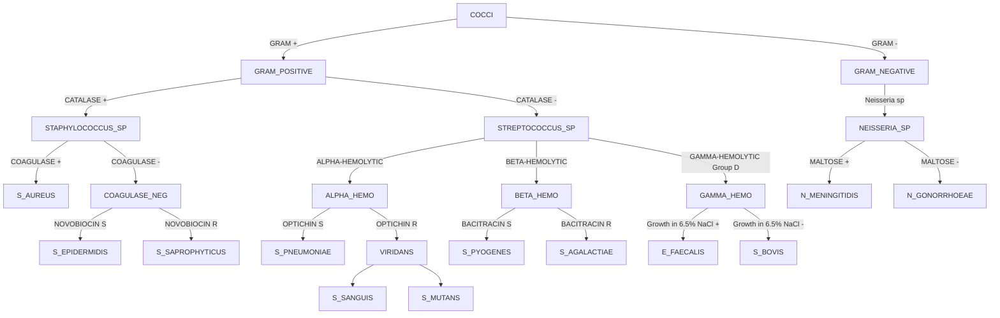
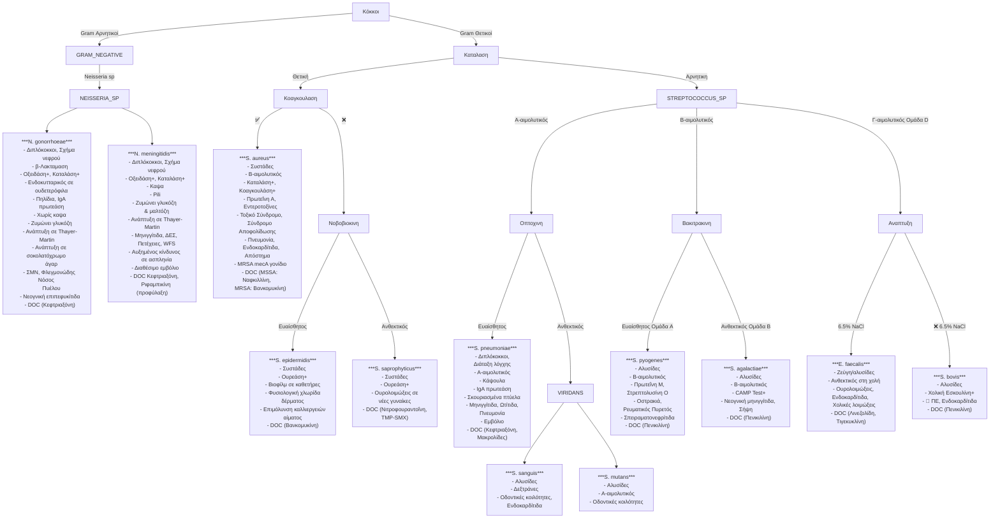

## SOS

χρμ = Χρωμοσωμα

MW = Μοριακο Βαρος

Βακτηριοσινες ~> Αντιμοκροβιακες ουσιες ^801719A

ΜΦ = Μακροφαγο     

[[Ανοσολογία#^0ef75b]]

Βιομεμβρανες -> Περιβλημα ουσιων που περικλειει συσσωματωματα 🐲
	Μηχανισμος αμυνας 🐲, αντιστεκονται σε 💊

Ξενιστης (👱‍♂️) -> Οποιοσδηποτε οργανισμος αλληλεπιδραει με ενα 🦠

Λοιμωξη -> Πολλαπλασιασμος παθογονου σε 👱‍♂️
	**Μπορει** να οδηγησει σε νοσο

Νοσος -> Κλινικη εκδηλωση βλαβης 🕸️

Λοιμωδης Νοσος (🥁) -> Κλινικη εκδηλωση βλαβης 🕸️ **λογω παθογονου**

Ευκαιριακο Παθογονο -> 🦠 που συμβιωνουν με 👱‍♂️ και σχεδον ποτε δεν προκαλουν νοσο
	Ο 👱‍♂️ φερει μηχανισμους ελεγχου του πληθυσμου των 🦠

Ευκαιριακα Παθογονα = 🦠 ΦΧ + Περιβαλλοντικα 🦠

Περιβαλλοντικο Παθογονο -> Το παθογονο που επιβιωνει και στο 🏕️
	🔧  Επιβιωνει σε πολλους οργανισμους γιατι μεταβολιζει πολλες ουσιες 

[[Ανοσολογία#^cd43e6]]

🦠
	-  🐲
	-  Αρχαια
	-  Ευκαρυα (πρωτοζωα, μυκητες)
	-  Ιοι

ΦΧ = Φυσιολογικη Χλωριδα

ΕΜΧ = Εντερικη Μικροβιακη Χλωριδα

Ενδιαιτημα -> Φυσικο περιβαλλον που ζει και αναπαραγεται ενα ειδος

SCFA = Βραχειας αλυσιδας λιπαρα οξεα

GOS = γαλακτο-ολιγοσακχαριτες  |  FOS = φρουκτο-ολιγοσακχαριτες

Ονομασια 🐲: *γενος ειδος*

PG = Πεπτιδογλυκανη

[[Ιστολογία Α#^ac1d4e]]

Ισοτυπος -> Οι διαφορετικες κατηγοριες Ig (IgA, IgM κλπ.)

Gram+     |     Gram-  

❌❌❌ ~> Ισχυρο δυναμικο παθογενειας

❌❌ ~> Εντοπισμενη παθογενεια

✅❌ ~> Δυνητικα Παθογονο

**Οικοεπιδημιολογια** -> Μερος 👱‍♂️ ή οικοσυστηματος που εντοπιζεται 🦠
	&  Τροπος μεταδοσης

**Επιδημιολογια** -> Ομαδες πληθυσμου & συνθηκες που ειναι ευαισθητες στο 🦠

🆘  *Bacteroides* εχουν επαμφοτεριζοντα μορια στο ελυτρο τους που **επαγουν την ανοσια απο τον 👱‍♂️ στην ΕΜΧ** 

Οξειδωτικος Μεταβολισμος -> **Οξειδωση** οργανικων μοριων (O2)

Ζυμωτικος Μεταβολισμος -> **Αποικοδομηση** οργανικων μοριων (-)

mt = μιτοχονδριο

Ινωδες -> Πρωτεινη  |  Αδιαλυτη  |  Πολυμερισμενο Ινωδογονο 
	🗝️  Σχηματιζει τους θρομβους

Ινικη -> 🕸️ που περιεχει ινωδες

![[Στιγμιότυπο οθόνης 2024-08-21, 20.23.40 2.pdf]]

![[Στιγμιότυπο οθόνης 2024-08-29, 15.47.13.pdf]]

Επιπλοκη -> Προσθετη παθολογικη κατασταση εμφανιζομενη κατα την εξελιξη της ασθενειας ενος ασθενη

Πλασμινογονο -> Αδρανες προδρομο 💨 `Πλασμινης`
	-  Στο 🩸

💨 `Πλασμινη`
	Ινωδες  ⇀  Ινωδογονο ^c17163

💨 `Θρομβινη`
	Ινωδογονο  ⇀  Ινωδες ^419df7

💨 `Λυσοζυμη`
	PG  ⇀  (ΥΔΡΟΛΥΣΗ)
	🗝️  Καταστρεφει 🐲
	✕  Σιελος, δακρυα, εσω ους

Τοξικο Σοκ ~> Απαιτουνται μονο τοξινες στο 🩸 για να συμβει
	Δεν απαιτειται βακτηριαιμια (τα 🐲 μπορει να ειναι νεκρωμενα)
≠
Σηπτικο Σοκ ~> Απαιτειται βακτηριαιμια

APCs με **αντιγονο** ενεργοποιουν **1/100.000 Τ-κυτταρα**
≠
APCs με **υπεραντιγονο** ενεργοποιουν **1/5 Τ-κυτταρα**

*Helicobacter Pylori* το μονο 🦠 που προκαλει 🦀 ^871a60

Φυσιολογικα ειναι **στειρα**: 
	-  🩸
	-  ΕΝΥ
	-  Αρθρικο 💧

◆  Πρωτεινες ειναι **πιο αντιγονικες** απο πολυσακχαριτες

🦠 ανθεκτικα σε χολικα αλατα, επιζουν σε ΓΕΣ

Αισθηση Απαρτιας -> Φαινομενο κατα το οποιο, μεσω εκκρινομενων φερομονων, τα 🐲 αντιλαμβανονται τον μεγαλο αριθμο του πληθυσμου τους

🧫 = Καλλιεργεια = Cx

Αντιβιοτικο = 💊 = Abx

NPV = Αρνητικη Προγνωτικη Αξια
	[[Βιοστατιστική#^0ccf51]]

PPV = Θετικη Προγνωστικη Αξια
	[[Βιοστατιστική#^689193]]

Ενδογενης 🥁 -> Πηγη μολυνσης η ΦΧ
Εξωγενης 🥁 -> Πηγη μολυνσης το περιβαλλον
Ενδο-εξωγενης 🥁 -> Πηγη μολυνσης η ΦΧ ή το περιβαλλον
	*C. difficile*

Κριγμος -> Ξηρος, τριγμωδης ηχος (πχ τριβη ακρων κατεταγμενου 🦴)

[[Γενική Παθαν#^a12155]]

Επωαση -> Δt απο εισοδο 🦠 μεχρι εμφανιση πρωτων συμπτωματων

Σηψη θεωρειται και η **τοξιναιμια** (υπαρξη τοξινων, οχι 🦠 στο 🩸)

Οξειες 🥁 ΚΝΣ
	1.  🐲  Μηνιγγιτιδα
	2.  Μηνιγγοεγκεφαλιτιδα
	3.  Αποστημα 🐲
	4.  Υποσκληριδιο εμπυημα
	5.  Επισκληριδιο αποστημα
	6.  Σηπτικη θρομβοφλεβιτιδα φλεβωδων κολπων</fontcolor> κρανιου

Μηνιγγιτιδα επικινδυνη γιατι προκαλει **αυξηση πιεσης**:
	❗️ Εγκολεασμο -> Προπτωση εγκεφαλικου 🕸️ σε καποιο τρημα
	❗️ Κυτταρικο θανατο
	❗️ Οιδημα

Βιοτυπος -> Ομαδα 🦠 με συγκεκριμενα βιολογικα χαρακτηριστικα και συμπεριφορα
	Πχ παραγωγη τοξινης

Οροτυπος -> Ομαδα 🦠 με συγκεκριμενα αντιγονα επιφανειας

Εντερικα 🐲  ≠  Εντεροβακτηριακα
	-  Εντερικα 🐲 ~> Συμβιωτικα, παθογονα & αποικιστες ΓΕΣ
	-  Εντεροβακτηριακα ~> Οικογενεια Gram-</fontcolor> (*Enterobacteriaceae)

Βασιλειο, Συνομοταξια, Ομοταξια, Ταξη, Οικογενεια, Γενος, Ειδος

💨 `Οξειδαση +` ~> Αναγνωριση αρωματικων αμινων (πχ **TPD**)
	🆘  (🟦)

spp ~> Μερικα ειδη μεταξυ ενος γενους, οχι ολα

Λακτοζη+ = 🐲 ζυμωνει λακτοζη | Λακτοζη- = 🐲 δεν ζυμωνει λακτοζη

Gram+</fontcolor>  🐲 ~>  Πλασματικη μεμβρανη  |  Περιπλασμα  |  PG
Gram-</fontcolor> 🐲 ~>  Πλασματικη μεμβρανη  |  Περιπλασμα  |  Εξωτερικη μεμβρανη ^878d89

| Κυστιτιδα        |
| ---------------- |
| *E. coli*        |
| *Proteus*        |
| *Klebsiella*     |
| *Enterobacter*   |
| *Staphylococcus* |

Σιδηροφορα ~> Δεσμευουν Fe
	❗️ Απενεργοποιηση πολλων 💨 👱‍♂️ που το εχουν συμπαραγοντα ^7a5ae9

Οσο ανεβαινουμε στον ΓΕΣ:
	-  pH ↓
	-  Αντιμικροβιακες ουσιες ↑
	-  O2 ↑
	☐  Γι αυτο, περισσοτερα 🦠 **χαμηλα** (ΠΕ κλπ)

Ανοσοτροποποιηση -> Ρυθμιση και τροποποιηση ανοσοποιητικου του οργανισμου με καποιον ανοσοτροποποιητικο παραγοντα ή φαρμακο

Τροφιμογενη παθογονα -> Αυτα που προσλαμβανονται απο 🍔 ή 💧

Διαρροια:
	-  **Οσμωτικη** ~> Κακη επαναρροφηση, αδυναμια μεταβολισμου
	-  **Εκκριτικη** ~> Παρατεταμενη ↑ cAMP, αποβολη Cl-
		❓  Βιολογικες ή χημικες τοξινες, φαρμακολογικα αιτια, ορμονικοι παραγοντες
	-  **Λοιμογονος** ~> Παθογονα, φλεγμονη & αυτοανοση απαντηση

Δεξαμενη -> Τμημα οικοσυστηματος που μπορει να αναπαραχθει το παθογονο

🐲  δεν παραγουν παραγοντες παθογενειας αν δεν αναπτυχθουν ικανοποιητικα

Διαπυηση -> Εμφανιση πυου καποια ωρα μετα το τραυμα

Προαιρετικα Αναεροβιος = Προαιρετικα Αεροβιος

Μικροαεροφιλα -> 🐲 που απαιτουν ↓ O2 (δεν ειναι 🏃🏽‍♂️‍➡️ αεροβια)
	Πχ *Campylobacter jejuni*
		✕  Διεπιφανεια **Πλακουντα - Μητρας</FONTCOLOR>** ^73dc3e

Αεροανεκτικα -> 🐲 που επιζουν σε ↓ O2 (🏃🏽‍♂️‍➡️ Υποχρεωτικα Αναεροβια)
	☞  Σε αναμονη μεχρι να επικρατησουν αναεροβιες συνθηκες
	⚔️  *Bacterioides fragilis*

Τοπικα αναεροβιες συνθηκες σε αεροβιο περιβαλλον
	✽  Περιοδοντικη Κοιλοτητα
	✽  Αμυγδαλες 
	✽  Αποφραγμενοι Βρογχοι
	✽  Νεκρωτικες περιοχες (μαλακοι 🕸️)
	✽  Πτυχωσεις δερματος

Εξωτοξινες παραγουν συνηθως τα σπορογονα 🐲

Νησιδιο -> Γενετικο τμημα στο 🧬 του 🐲
	ΟΧΙ πλασμιδιο

💨 `SOD`
	2H+ + 2O2-  ⇀  O2 + H2O2

[[Ανοσολογία#^443f49]]

Εξωτοξινη -> Πρωτεϊνη που παραγεται απο παθογονα 🐲
	▫︎  Εκκρινεται απο το 🐲

Ενδοτοξινη -> Λιπιδια (LPS) του κυτταρικου τοιχωματος του 🐲
	Gram-</fontcolor>  🐲

Αποχρεμψη -> Ο,τι αποβαλλεται απο το αναπνευστικο συστημα

Ενοφθαλμισμος -> Εισαγωγη 🦠 σε 👱‍♂️ 

Πνευμονιοκοκκος = *S.pneumoniae*     |     Μηνιγγιτοδοκοκκος = *N. meningitidis*

Συμπλεγμα 70S = Υπομοναδα 30S + Υπομοναδα 50S

`💊 Εσκουλινη` ~> Οι SDG και *Enterococcus spp* την υδρολυουν (παρουσια χολικων αλατων)
	☆  Ενδειξη οτι μπορουν να επιζησουν σε ΓΕΣ

🧫  **Σοκολατοχρωμο Αγαρ** ~> 🩸 που εχει θερμανθει και εχουν λυθει τα RBCs
	-  Απελευθερωση ουσιων, θρεπτικων για μερικα 🐲 
	⚔️  *H. influenzae*
	⚔️  *N. meningitidis*
	^c6fc75

 🧫  **MacConkey Αγαρ** ~> Χολικα αλατα & 💊, αναπτυσσονται μονο Gram-</fontcolor>  🐲

| 🧫                     | 🐲                                      |
| ---------------------- | --------------------------------------- |
| **Αιματουχο Αγαρ**     | Gram+</fontcolor> |
| **Σοκολατοχρωμο Αγαρ** | Gram+</fontcolor> |
| **MacConkey Αγαρ**     | Gram-</fontcolor> |

🥁  **Μεση Ωτιτιδα**
	⚔️  *S. pneumoniae*
	⚔️  *H. influenzae*

Δηγμα = Δαγκωμα     |     Αμυχη = Γρατζουνια

Υποθεραπευτικη C -> C 💊 αναποτελεσματικη για καταπολεμηση 🐲
	🌙  Αυξανει την πιθανοτητα αντοχης στο 💊

Σε ενδοκαρδιτιδα λογω 🏥 🐲, χορηγειται:
	`💊 Πενικιλλινη` & `💊 Αμινογλυκοσιδη`

*CMV* = tbc

📿  =  Μαστιγιο

👳‍♀️ με ασπληνια (πχ δρεπανοκυτταρικη αναιμια) εχουν ⚠️ απο 🐲 με ◎
	・ *S. pneumoniae*
	・ *N. meningitidis*
	・ *H. influenzae* ^147e49

`💊 Τριμεθοπριμη-Σουλφαμεθοξαζολη` = `💊 TMP-SMX`

| 🧫 VCN | `💊 Βανκομυκινη`                        | `💊 Κολιστινη`                                                                                              | `💊 Νυστατινη` |
| ------ | --------------------------------------- | ----------------------------------------------------------------------------------------------------------- | -------------- |
| ☠️     | Gram+</fontcolor> | Gram-</fontcolor> </FONTCOLOR> -  Εκτος απο *N. gonorrhoeae* | 🍄‍🟫          |

Ελυτρο = Καψα

WFS = **Συνδρομο Waterhouse – Friderichsen** (Επινεφριδιακη ανεπαρκεια)
	❓ Αιμορραγια ^2365d7

MAP = Mean Arterial Pressure = Μεση Αρτηριακη Πιεση

URI = Upper Respiratory Infection

![[Στιγμιότυπο οθόνης 2024-09-02, 20.43.31.pdf]]

![[Στιγμιότυπο οθόνης 2024-09-02, 20.44.14.pdf]]

![[Στιγμιότυπο οθόνης 2024-09-04, 16.17.28.pdf]]

![[Bacterial_morphology_diagram.pdf]]

![[Στιγμιότυπο οθόνης 2024-09-16, 11.40.33.pdf]]

***
## 1o ΜΑΘΗΜΑ ~ { ΒΑΚΤΗΡΙΟΛΟΓΙΑ }

―――――― 
### ΓΕΝΙΚΑ (ΒΑΚΤΗΡΙΟΛΟΓΙΑ)

🐲 = Βακτηριο     |     👱‍♂️ = Ξενιστης     |     🦠 = Μικροοργανισμος
🍄‍🟫 = Μυκητας     |     🗼 = Ιος                |     🪱 = Παρασιτο

🧐  Λοιμωξη ειναι παραπλευρη απωλεια
	🐲 **δεν θελει** να προκαλεσει προβλημα στον 👱‍♂️

ΦΥΣΙΟΛΟΓΙΚΑ συνανταμε 🐲 σε:
	-  Ουρογεννητικο
	-  ΓΕΣ
	-  👄
	-  Δερμα
	-  🫁

}>  Αρα 🐲 σε 🩸 ειναι προβλημα
	[[Γενική Παθαν#^26ce29]]

Μορφολογια 🐲
	1.  **Βακιλλος** (Ραβδος)
		-  *E. coli*
	2.  **Κοκκος**
		-  *Στρεπτοκοκκος*
		-  *Σταφυλοκοκκος*

Διαταξη 🐲
	1.  **Διπλοκοκκος**
	2.  **Αλυσιδα**
		-  *Στρεπτοκοκκος*
	3.  **Τετραδα**
	4.  **Συσταδα**
		-  *Σταφυλοκοκκος*

Ταυτοποιηση 🐲 ~> Ευρεση γενους & ειδους

Προκαρυωτικα κυτταρα: 
	-  🐲
	-  Αρχαια

❀  **Μερικα** 🐲 ειναι παθογονα

Προκαρυωτικο **vs** Ευκαρυωτικο
	1)  Οχι μεμβρανες  |  🧬 συγκεντρωμενο στο πυρηνοειδες
	2)  Δεν εχει στερολες στη κυτταρικη μεμβρανη
	3)  Ενα κυκλικο χρμ
	4)  Ριβοσωμα 70s

| Κατηγορια                               | Κυτταρικο Τοιχωμα                            | Χρωση        | Παραδειγμα      | Ονομασια |
| --------------------------------------- | -------------------------------------------- | ------------ | --------------- | -------- |
| Gram+</fontcolor> | 1.  PG (**παχια**)                           | Βαφονται     | *Streptococcus* | -        |
| Gram-</fontcolor> | 1.  Εξωτερικη Μεμβρανη 2.  PG (**λεπτη**) | Δεν βαφονται | *E. coli*       | Διδερμα  |

🖍️  PG δεν αφηνει χρωση να φυγει

PG
	☑︎  Ενιαιο μακρομοριο
	☑︎  Πολλαπλη διασυνδεση
	☑︎  Περιβαλλει το κυτταρο
	☑︎  Περιεχει σταθεροτητα

――――
#### ΕΞΩΤΕΡΙΚΗ ΜΕΜΒΡΑΝΗ Gram-

| Συστατικα                      | Λειτουργια                                                                      |
| ------------------------------ | ------------------------------------------------------------------------------- |
| Λιποπολυσακχαριτης (LPS)       | Την σταθεροποιει                                                                |
| Γεφυρες Mg2+        | -  Σταθεροποιει LPS -  Καθοριζει περατοτητα μεμβρανης                        |
| Λιποπρωτεινη Braun             | Αγκυρωνει εξωτερικη μεμβρανη με PG                                              |
| Πορινες  1. OmpC 2. OmpF | Σχηματιζουν πορους Εισοδος υδροφιλων μοριων                               |
| OmpA                           | -  Υποδοχεας για 🗼  και βακτηριοσινες -  Σταθεροποιει τα συζευγμενα κυτταρα |

^b05fbc

――
##### LPS

✕  Gram-</fontcolor> 🐲

*Listeria monocytogenes* 
	Μοναδικο Gram+</fontcolor> 🐲 με LPS
	[[#12o ΜΑΘΗΜΑ ~ { ΛΙΣΤΕΡΙΕΣ }]]

Λιπιδιο Α  ~~  Πολυσαχκαριτικο τμημα  ~~  Ο-αντιγονο ^4119ca

Λιπιδιο Α = Ενδοτοξινη

❂  Ο-αντιγονο διαφερει μεταξυ γενους, ειδους αλλα και στελεχων

―
###### Συμπτωματα LPS

❗️  Σηπτικο σοκ
	[[Γενική Παθαν#^9c94b3]]

❗️  🤒

❗️  Ενεργοποιηση ΜΦ & συμπληρωματος 👱‍♂️

❗️  Επαγωγη διαφοροποιησης Β-κυτταρων

❗️  Παραγωγη IFN

❗️  Νεκρωση 🕸️

❗️  Υποτροπη ογκων

―
###### Πως Προκαλειται Σηπτικο Σοκ

❓  Βακτηριαιμια

Στην μεμβρανη Β-κυτταρων: CD14 ~~ TLR4 ~~ MD2

1.  LPS ενωνεται με LBP
2.  Συμπλεγμα προσδενεται σε CD14
3.  Προκαλειται διμερισμος
4.  Αυξημενη φλεγμονωδης αντιδραση, εκκριση κυτοκινων, οξειδωτικο στρες
5.  Σηπτικο σοκ

――――
#### ΚΥΤΤΑΡΙΚΗ ΜΕΜΒΡΑΝΗ Gram+

a.  **Τειχοϊκο οξυ** 
b.  **Τειχουρονικο οξυ**
c.  **LTA**

――
##### ΛΕΙΠΟΤΕΙΧΟΪΚΑ ΟΞΕΑ (LTA)

✕  Gram+</fontcolor> 🐲

Επαμφοτεριζοντα μορια

Υποδοχεις φαγων

💉  Μεσω φαγων μπορουν να εισελθουν γονιδια στο 🐲

💉  Μπορει να αξιοποιηθει το 🧬 των φαγων
	Ωστε να τροποποιηθει γενετικα το 🐲

―
###### Ρολος Τειχοϊκων Οξεων

☞  Ρυθμιζουν κυτταρικη μορφολογιας και διαιρεση
☞  Ρυθμιζουν την αυτολυση (-WTA= αυξημενη αυτολυση)
☞  Ρυθμιση ομοιοστασης ιοντων
☞  Προστασια απο αμυνα 👱‍♂️ (αλλαγη υδροφοβικοτητας τοιχωματος)
☞  Ανοχη σε αλλαγες θ°
☞  Ανοχη σε αλλαγες αλατοτητας
☞  Ρυθμιση προσκολλησης και αποικισμου και σχηματισμου βιομεμβρανων

――――――
### ΚΙΝΗΣΗ 🐲

**Μηχανισμοι** Κινησης
	1.  📿
	2.  Αξονικο Νηματιο
	3.  Διολισθηση

**Λειτουργιες** Κινησης
	1.  Ανταποκριση σε τροφη/δηλητηριο
	2.  Χημειοτακτισμος

📿
	✢  Αγκυρωμενο στη κυτταρικη μεμβρανη
	✢  Αποτελειται απο μοναδες φλαγγελινης
	✢  Κινειται σαν προπελα, προσδιδει κινηση

🐲  κινουνται ολα μαζι & δεν συγκρουνται

Ινιδια
	❆  Τριχοειδεις προσεκβολες
	❆  Συμμετεχουν στη μεταφορα  🧬 μεταξυ 🐲
	❆  Μεσολαβουν για την προσκολληση σε κυτταρο

ΧΑΡΑΚΤΗΡΙΣΤΙΚΑ ΙΝΙΔΙΩΝ

| Ειδος 🐲                                       | Αριθμος/Κυτταρο | Διασπορα στην επιφανεια | Ρολος                                                                           |
| ---------------------------------------------- | --------------- | ----------------------- | ------------------------------------------------------------------------------- |
| *E. coli* (F ή sex pilus)                      | 1-4             | Ομοιομορφος             | Σταθεροποιηση 🐲 κατα τη συζευξη για τη μεταφορα 🧬                             |
| *E. coli* (Κοινα ινιδια ή τυπου 1)             | 100-200         | Ομοιομορφος             | Προσκολληση σε επιφανειες ⭕️ πεπτικου                                           |
| *Neisseria gonorrhoeae*                        | 100-200         | Ομοιομορφος             | Προσκολληση σε ⭕️ ουροποιητικου                                                 |
| *Streptococcus pyogenes* (ινιδια & πρωτεινη Μ) | ?               | Ομοιομορφος             | -  Προσκολληση -  Αντισταση στη φαγοκυτταρωση -  Αντιγονικη διαφοροποιηση |
| *Pseudomonas aeruginosa*                       | 10-20           | Πολικη                  | Προσκολληση                                                                     |
✓  Πρωτεϊνη Μ ειναι εξαιρετικα αντιγονικη

――――――
### ΑΛΛΑ ΧΑΡΑΚΤΗΡΙΣΤΙΚΑ 🐲

**Ελυτρο/Καψα/Γλυκοκαλυκας**
	✕  Εξω απο PG
	}-  Συστατικα εκκρινονται απο 🐲
	*Streptococcus pyogenes*:  υαλουρονικο οξυ
	*Bacillus anthracis*: poly-D-γλουταμικο

―
###### Σημασια ελυτρου

1.  Εμποδιζουν καταστροφη απο φαγοκυτταρα
	-  Προστατευουν απο λυσοζυμη
2.  Επιτρεπουν σε 🐲 να προσκολληθουν σε επιφανειες (πχ καθετηρες)
3.  Παρεχουν θρεπτικα συστατικα στο 🐲
	-  Παραγομενα προιοντα **τοξικα** για 👱‍♂️
4.  Προλαμβανουν την αφυδατωση του 🐲
5.  Εχουν τοξικοτητα για 👱‍♂️
	-  Μπορει να προκαλεσουν αποστημα
6.  Προστατευουν απο την μολυνση απο φαγους
7.  Εχουν αντιγονικο ρολο
8.  Παγιδευουν κατιοντα, συμβαλλουν στην ομοιοσταση

――
##### ΒΑΚΤΗΡΙΑΚΑ ΑΝΤΙΓΟΝΑ

}-  📿
}-  Γλυκοκαλυκας
}-  Ινιδια προσκολλησης (Pili)
}-  LPS/LOS
}-  Εξωτερικη μεμβρανη, υδατανθρακες
}-  Τοξινες

――――――
### ΜΗΧΑΝΙΣΜΟΙ ΑΝΤΙΣΤΑΣΗΣ

1.  **Γενετικοι**
	α)  **Χρωμοσωμικοι** ~> ✂️ αλλαζουν τη θεση προσδεσης ή τη διεισδυτικοτητα του 💊
	β)  **Εξωχρωμοσωμικοι**
		-  Πλασμιδιο ~> Περιεχει: 
			}-  **R factor** ~> Μεταγραφικος Παραγοντας 🧬 ανθεκτικοτητας
			}-  **r** ~>  🧬 ανθεκτικοτητας
		-  `💨 {β-Λακταμασες}`
		-  `💨 {Ακετυλτρανσφερασες}` ~> Μεταφερουν ακετυλομαδες σε 💊, αλλαζουν χημικη δομη
			・ `💊 {Αμινογλυκοσιδες}`
		-  `💨 {Αντλιες Προτωνιων}` ~>  Εκβαλλουν 💊 απο κυτταρικη μεμβρανη
			・ `💊 {Τετρακυκλινες}`

2.  **Μη Γενετικοι**
	α)  **Ενδοσπορια**
		❒  Λιγα ειδη 🐲 σχηματιζουν
		✺  Ανθεκτικα σε ακραιες περιβαλλοντικες συνθηκες (θ°, ακτινοβολια, ισχυρα οξεα, απολυμαντικα)
		✔︎  Βλαστανουν σε ευνοϊκες συνθηκες
		✭  Απαντηση σε μηνυματα του περιβαλλοντος (εξαλειψη θρεπτικου συστατικου & υγρασιας)
		❂  Περιβαλλουν ενα τμημα του κυτταροπλασματος
		❀  Μορφη & θεση σπορου χαρακτηριστικη για το 🐲
	β)  **Χασιμο στοχευμενων δομων**
		-  PBPs, `💨 RNA πολυμεραση`, ριβοσωματα, κυτταρικο τοιχωμα

***

## 2ο ΜΑΘΗΜΑ ~ { ΑΛΛΗΛΕΠΙΔΡΑΣΗ ΞΕΝΙΣΤΗ - ΠΑΘΟΓΟΝΟΥ }

Ευκαιρικα παθογονα μπορει να προκαλεσουν λοιμωδη νοσο

❆  Μερικες φορες, 🦠 τροποποιουν το μικροβιωμα κι ετσι προκαλουν νοσο
	Πχ *ιος γριπης*

Φλεγμονη
	-  Αυξανει αιματωση στο σημειο λοιμωξης
	-  Φερνει WBCs και αντιμικροβιακες ουσιες στο σημειο
	✺  **Οξεια**
		}-  Ραγδαιες μεταβολες τοπικα σε 🔴🔵🟢
		}-  Δυναμικες, με προβλεψιμη εξελιξη
	✺  **Χρονια**
		]-  Οφειλεται στο οτι εχει συμβει καποια βλαβη τοπικα, ή κατι εχει απορρυθμιστει
		]-  Επαγει βλαβες σε 🕸️

Ασηπτη Φλεγμονη -> Απαντηση του οργανισμου σε μη λοιμωδη κατασταση (πχ νεκρωση των κυτταρων)

**Μολυσματικοτητα** -> Ποσοτικη εκφραση παθογονικοτητας (πχ αριθμος 🦠 που απαιτουνται για την προκληση λοιμωξης)
	❍  Καθε 🦠 εχει διαφορετικη ^765f4a

**Διηθητικη Λοιμωξη** -> Παθογονο εισχωρει στον 🕸️, καταστρεφει τα φυσιολογικα κυτταρα, καταργει την φυσιολογικη δομη ενος οργανου κι επεκτεινεται

Επιφανειακη Λοιμωξη -> Αναπτυσσεται επιφανειακα στο δερμα, χωρις να διεισδυσει στο 🩸

❖  Ευκαιριακα παθογονα φυσιολογικα προκαλουν επιφανειακες λοιμωξεις
	Σε ανοσοκατεσταλμενο προκαλουν διηθητικη λοιμωξη

――
##### ΤΡΟΠΟΙ ΜΕΤΑΔΟΣΗΣ ΛΟΙΜΩΔΩΝ ΝΟΣΗΜΑΤΩΝ

✸  Απο τον αερα
✸  Αμεση επαφη με μολυσμενα αντικειμενα
✸  Μεταδοση μεσω σωματικων υγρων
✸  💧 & 🍔
✸  Με ζωα φορεις
	-  🪰
	-  🦅
	-  🦇
	-  🐕, 🐈, 🦁

――
##### ΠΙΘΑΝΕΣ ΚΑΤΑΛΗΞΕΙΣ ΛΟΙΜΩΞΗΣ ΓΙΑ ΤΟ ΠΑΘΟΓΟΝΟ

◘  Αποικισμος - δυνητικα επικινδυνο
□  Χρονια λοιμωξη
◘  Λανθανουσα λοιμωξη
□  Αμοιβαια επωφελης συμβιωση
◘  Εκριζωση του 🦠

――
##### ΛΟΙΜΩΔΗ ΝΟΣΗΜΑΤΑ ΜΕ ΒΑΣΗ **ΠΑΘΟΓΕΝΕΣΗ ΚΑΙ ΚΛΙΝΙΚΗ ΕΙΚΟΝΑ**

1.  Οξεια Λοιμωξη
	-  Δυνητικα μπορει να προκαλεσει συνδρομο σοβαρης σηψης
		}-  Σηπτικο σοκ
	☞  *Πνευμονια*, *Ουρολοιμωξη*

2.  Ευκαιριακη Λοιμωξη
	-  Σε ανοσοκατεσταλμεν0υς ασθενεις
	-  Προκαλουν βαρια νοσο & οχι συνδρομα σηψης
	-  Συχνα προκαλουν 🪦 απο μεγαλη καταστροφη & νεκρωση ζωτικων οργανων
	-  Στην αρχη δεν εμφανιζουν συμπτωματα

3.  Χρονια (Κοκκιωματωδης) Λοιμωξη

4.  Ειδικη (Ενδημικη) Λοιμωξη

5.  Μικτη (Πολυμικροβιακη) Λοιμωξη

――
##### ΕΥΝΟΪΚΕΣ ΣΥΝΘΗΚΕΣ ΓΙΑ ΑΝΑΕΡΟΒΙΑ 🐲

✰  🤕
	-  Ενδοκοιλιακο ελκος
	-  Ρηξη σκωληκοειδους (μολυνση περιτοναιου απο 💩)

✰  🦀
	-  Αποφραξη 🫁 (❌ O2)

✰  **Απωλεια κυκλοφοριας 🩸**
	❓ ΣΔ
	❓ Αγγειακες νοσοι

✰  **Αποφραξη αεραγωγων ή αγγειων**
	❓  Ξενο σωμα, εμβολη
		[[Γενική Παθαν#ΕΜΒΟΛΗ]]
	❓  Εμφραγμα
		[[Γενική Παθαν#^d2477c]]

✰  **Παραμελημενο αποστημα**
	❗️  Σταδιακη νεκρωση 🕸️

✰  **Ανοσοανεπαρκεια (πχ AIDS)**
	❗️  Υπεραναπτυξη αναεροβιων 👄

✰  **Χρηση 💊**
	❗️  Καταστροφη ΦΧ, αναπτυξη αναεροβιων ευκαιριακων

✰  **Ενδοπροσθετα**

***

## 3ο ΜΑΘΗΜΑ ~ { ΜΙΚΡΟΒΙΩΜΑ - ΦΥΣΙΟΛΟΓΙΚΗ ΧΛΩΡΙΔΑ }

**Microbiota** -> Συνολο 🦠 που αποικιζουν ανθρωπινο οργανισμο

**Microbiome** -> Συνολο γονιδιωματος 🦠 που αποικιζουν τον ανθρωπινο οργανισμο

| Ανθρωπινο Σωμα | Microbiota                                                                                |
| -------------- | ----------------------------------------------------------------------------------------- |
| Σταθερη θ°     | Μεταβολικο εργοστασιο παραγωγης vit, μεταβολιτων & ενεργειας (απο συνθετους υδατανθρακες) |
| Θρεπτικα υλικα | Συμβιωτικοι πληθυσμοι ανταγωνιζονται μεταβολικα και φυσικα τα παθογονα μικροβια           |
|                | Παραγωγη μεταβολιτων, προϊοντα για ανοσολογικα μονοπατια                                  |
🔆  Ανθρωπος κερδιζει γιατι αποκτα ιδιοτητες που δεν χρειαστηκε να εξελιξει μονος του

⚕️  Τελικα, η υγεια του ανθρωπου εξαρταται απο:
	-  Γονιδιωμα
	-  Μικροβιωμα

60-70% Microbiota παραμενει σταθερο, 30-40% μεταβαλλεται καθ'ολη τη διαρκεια ζωης

Ευβιωση -> Ισορροπια μικροβιακου οικοσυστηματος
≠
Δυσβιωση

――
##### ΧΑΡΑΚΤΗΡΙΣΤΙΚΑ MICROBIOTA

△  Ισχυρα προσαρμοσμενη στο καθε ειδος 👱‍♂️
△  Υψηλα εξαατομικευμενη για καθε ειδος 👱‍♂️ (**μικροβιακο αποτυπωμα**)
△  Σταθερα στα υγιη ατομα
△  Δρα υπο συνθηκες συμβιωσης ( 👱‍♂️ - 🦠  |  🦠 - 🦠)

――
##### ΠΑΡΑΛΛΗΛΗ ΣΥΝΕΞΕΛΙΞΗ

➣  Επιπεδο 🦠
	-  Παραγοντες 👱‍♂️ (πχ τροπος ζωης), επηρεαζει ατομικα τα 🦠 σε ενα ανταγωνιστικο περιβαλλον

➣  Επιπεδο 👱‍♂️
	-  Μη αριστη λειτουργια 🦠 επηρεαζει την υγεια του 👱‍♂️

――
##### ΤΙ ΕΠΗΡΕΑΖΕΙ ΤΗ ΣΥΣΤΑΣΗ ΤΗΣ ΕΝΤΕΡΙΚΗΣ MICROBIOTA?

❒  Γονοτυπος 👱‍♂️

❒  Διατροφη / Διαιτα

❒  Τροπος μαιευσης / θηλασμος

❒  Ηλικια, κατασταση υγειας

❒  Περιβαλλον

❒  Ληψη 💊 / Φαρμακων

❒  Ληψη προβιοτικων - πρεβιοτικων

❒  Περιθαλψη σε 🏥, χειρουργικες επεμβασεις, στρες

――
##### ΠΕΡΙΟΧΕΣ ΑΠΟΙΚΙΣΜΟΥ

﹆  Δερμα

﹆  Ανωτερη αναπνευστικη οδος

﹆  Πεπτικη οδος

﹆  Ουροποιητικη οδος

﹆  Γεννητικη οδος

――
##### ΣΥΝΗΘΗ ΓΕΝΗ/ΕΙΔΗ 🐲 ΦΥΣΙΟΛΟΓΙΚΗΣ ΧΛΩΡΙΔΑΣ

| Συνομοταξια (Φυλο) | Ομοταξια (Κλαση)                              | Χαρακτηριστικα                                                                              |
| ------------------ | --------------------------------------------- | ------------------------------------------------------------------------------------------- |
| *Firmicutes*       | *Bacilli Clostridi*                           | -  Gram+ -  αεροβιοι & αναεροβιοι -  Συμβιωτικα & ωφελιμα βακτηρια                    |
| *Bacteriodetes*    | *Bacteriodete*                                | -  Gram- -  Κυριως στο χωμα, νερο θαλασσας, χλωριδα ζωων                              |
| *Proteobacteria*   | *Betaproteobacteria* *Gammaproteobacteria* | -  Gram- -  Περιλαμβανουν πολλα ειδη παθογονων                                           |
| *Actinobacteria*   | *Actinoabacteria*                             | -  Gram+ -  Μεγαλη ποικιλια στη μορφη -  Χρησιμοποιουνται στη βιομηχανια παραγωγης 💊 |

――
##### 🦠 - ΔΕΡΜΑ

|                    |                                                                     |
| ------------------ | ------------------------------------------------------------------- |
| Gram+ βακτηρια     | *Staphylococcus*, *Corynebacterium* ⚔️  *S. epidermidis*         |
| Αναεροβια βακτηρια | *Propionibacterium*, *Peptococcus* ⚔️  *Propionibacterium acnes* |
| Βλαστομυκητας      | ⚔️  *Candida albicans*                                              |
| Gram- βακτηρια     | *E. coli*,  *Acinetobacter*                                         |

☛  Κυριως Gram+  🐲

Τα Gram-</fontcolor>  🐲 αναπτυσσονται σπανια (δημιουργουν παροδικη ΦΧ)
	Αυτο γιατι αδυνατουν να πολλαπλασιαστουν

――
##### 🦠 - ΑΝΑΠΝΕΥΣΤΙΚΗ ΟΔΟΣ

|          |                                                                                                 |
| -------- | ----------------------------------------------------------------------------------------------- |
| 👃       | *Streptococcus*, *Staphylococcus* ⚔️  *S.aureus*                                             |
| Φαρυγγας | *Streptococcus*, *Staphylococcus*, Λιφθεροειδεις βακιλλοι ⚔️  *S. viridans*, *Neisseria spp* |
| 🫁       | ❌                                                                                               |

Δυνητικα παθογονα: *S. aureus*, *Streptococcus spp*
	☣️  Ατομα φορεις ιατρονοσηλευτικου προσωπικου

――
##### 🦠 - ΣΤΟΜΑΤΙΚΗ ΚΟΙΛΟΤΗΤΑ

700< διαφορετικα ειδη (παρα τη δραση αντιμικροβιακων ουσιων πχ λυσοζυμη, γαλακτοϋπεροξειδαση)

|                |                                                                                                                                                          |
| -------------- | -------------------------------------------------------------------------------------------------------------------------------------------------------- |
| Οδοντικη Πλακα | *Streptococcus*  ⚔️  *S.mutans*                                                                                                                       |
| Σχισμες ουλων  | Αναεροβια βακτηρια, μυκητες ⚔️  *Bacteroides spp*, *Prevotella*, *Fusobacterium*, *Clostridium spp*, Peptostreptococcus ⚔️  *Actinomyces israelii* |
Κυριαρχουν απο το φυλο Firmicutes:
	◎  *Lactobacillus*
	◎  *Staphylococcus*
	◎  *Streptococcus*

Πρασινιζοντες Στρεπτοκοκκοι ~> Περ. 50% βακτηριων

✪  Μεμονωμενα 🐲 πολλαπλασιαζονται και σχηματιζουν **βιομεμβρανες**

Οδοντικη Πλακα -> Στιβαδα 🐲 στην επιφανεια δοντιων και ουλων
>	Μπορει να οδηγησει σε τερηδονα - ουλιτιδα - περιοδοντιτιδα
>		😳  Κυριως σε ασθενεις με AIDS

――
##### 🦠 - ΟΥΡΟΓΕΝΝΗΤΙΚΗ ΟΔΟΣ

|                                          |                                                                                                                   |
| ---------------------------------------- | ----------------------------------------------------------------------------------------------------------------- |
| Κυστη</FONTCOLOR>  | -  Συνηθως στειρα 🦠 -  Gram- προαιρετικα αναεροβια ⚔️  *E. coli*, *Proteus mirabilis*                      |
| Κολπος</FONTCOLOR> | *Lactobacillus*, Ζυμομυκητες, *Streptococcus* ⚔️  *Lactobacillus acidophilus* ⚔️  *E. coli*, *Enterobacter* |

*Lactobacillus*:
	➢  Ζυμωνονουν γλυκογονο & παραγουν γαλακτικο οξυ
		-  pH ↓
	➢  Παραγουν υπεροξειδιο υδρογονου (αντιμικροβιακο)

👧🏼 => Απουσια *Lactobacillus* (pH ↑)
	Αναπτυξη διαφορων 🦠
		Σταφυλοκοκκοι, Στρεπτοκοκκοι, Διφθεροειδη, *E.coli*

👩🏼 => Παρουσια γαλακτοβακιλλων (pH ↓)
	Παρεμποδιση αναπτυξης **παθογονων** 🦠

👩🏼‍🦳 => Μειωση γλυκογονου (pH ↑)
	Ποικιλια 🐲

――
##### 🦠 - ΓΕΣ

ΓΕΣ εχει τα περισσοτερα 🦠 στο ανθρωπινο σωμα

Συσταση:
	-  🐲
		}-  Bacteroidetes
		}-  Firmicutes
		}-  Actinobacteria, Proteobacteria, Fusobacteria
	-  Αρχαια
	-  Μυκητες
	-  Ιοι

|                                            |                                                                                                |
| ------------------------------------------ | ---------------------------------------------------------------------------------------------- |
| Στομαχος</fontcolor> | -  Περιορισμενοι πληθυσμοι 🦠  -  *Firmicutes*, *Actinobacteria* -  Μετρια ποικιλομορφια |
| 12Δακτυλο                                  | -  *Proteobacteria*, *Firmicutes* -  Χαμηλη ποικιλομορφια                                   |
| ΠΕ                                         | -  Αναεροβιο περιβαλλον -  *Bacteroidetes*, *Firmicutes* -  Μεγαλη ποικιλομορφια         |

*Bacteroides sp*
	-  Σπανια στον Στομαχο</fontcolor>
	-  103 - 107 g στον Ειλεο
	-  1010 - 1012 g στο ΠΕ

*Bacteroides fragilis*
	<10% ΕΜΧ
	●  Ομως, σημαντικο ευκαιριακο

*Bifidobacterium*
	-1012 g

*Peptostreptococcus*
	-1012 g

*Clostridium sp*
	106-1011 g

Αεροβιοι & προαιρετικα αναεροβιοι (πχ *E. coli*)
	1010 g (10% <)

Συγκεκριμενες ιδιοτητες 🐲 τους επιτρεπουν να επιβιωσουν σε διαφορετικα περιβαλλοντα μεσα στον ΓΕΣ

ΕΜΧ διατηρει:
	✤  Μεταβολικη ομοιοσταση
	✤  Ενεργειακο ισοζυγιο
	✤  Ομοιοσταση ανοσοποιητικου

Λειτουργιες μικροβιωματος:
	✫  Ρυθμιζει πεψη
		-  Συνθεση χολικων οξεων
		-  Απορροφηση λιπιδιων
		-  Μεταβολισμος αα
		-  Συνθεση vit
		-  Παραγωγη SCFA (σηματοδοτικα μορια)
		-  Απορροφηση ιοντων (Ca, Mg, Fe)
		-  Παραγωγη θρεπτικων συστατικων
		-  Μεταβολισμος ξενοβιοτικων
		-  Διασπαση καρκινογονων ουσιων
	✫  Ρυθμιζει ανοσοποιητικο συστημα
		-  👱‍♂️ εκκρινει κυτοκινες βασει των ερεθισματων του μικροβιωματος

✧  SCFA ειναι προιον μεταβολισμου φυτικων ινων

Δρασεις SCFA
	✓  Παροχη ενεργειας στσ κυτταρα/ιστους ΠΕ και στα 🐲
	✓  Ενεργοποιηση μηχανισμων που προαγουν την ακεραιοτητα 🕸️
	✓  Επηρεαζουν ανοσοποιηση & εμφανιση μεταβολικων παθησεων (οστεοαρθριτιδα, 🎅, ΣΔ, ΚΑΝ)
	✓  Αντιφλεγμονωδης δραση
	✓  Αντιαποπτωτικη δραση
	✓  Ρυθμιση λιπογενεσης
	✓  Ρυθμιση ορμονων ορεξης
	✓  Ρυθμιση pH
	✓  Απορροφηση θρεπτικων συστατικων

🆘  Μικροβιωμα σε προστασια, αμυνα & ανοσορρυθμιση οργανισμου
	☒  Καταληψη θεσεων επαφης
	☒  Καταναλωση θρεπτικων συστατικων
	☒  Παραγωγη αντιμικροβιακων ουσιων
	☒  Ρυθμιση φλεγμονωδων αντιδρασεων
	☒  Φυσικη & Επικτητη ανοσια
	☒  Ανοσοανοχη

Τα 🐲 (παθογονα ή μη) μπορουν να διασχισουν τη στιβαδα βλεννης
	![[Στιγμιότυπο οθόνης 2024-09-01, 14.32.54.pdf]]
	💨 `Μουσιναση` 
		📺  Διασπαει τη βλεννη ^895681

🧩  Τ-κυτταρα διαφοροποιουνται αναλογα με τα ειδη συμβιωτικων 🐲
|
 -> Ανοσοποιητικο διακρινει αναμεσα σε "φιλους" & "εχθρους"

🐲  ΕΜΧ επαγουν ανοσοτροποποιηση
	**ΠΧ**
		-  Εξωπολυσακχαριτες (*Bifidobacterium breve*)
			🗝️  Μειωση παραγωγης προφλεγμονωδων κυτοκινων
		-  Ελυτρο & SCFA (*Bacteroides fragilis*)
			🗝️  Παραγωγη IL-10 απο Treg
				[[Ιστολογία Β#Treg]]  |  [[Ανοσολογία#^8b03b8]]
		-  Τμηματοποιημενα νηματωδη βακτηρια
			🗝️  Ενεργοποιηση αναπτυξης TH17
				}-  Ανοσιακη αποκριση βλεννογονου σε παθογονα

ΕΜΧ επηρεαζει συγκεντρωσεις **trp**
	**trp** προδρομος σεροτονινης (βασικος νδβ σε ΕΝΣ & ΚΝΣ)

Σε ενδεχομενη βλαβη ⭕️, 🐲 βοηθουν στην αναπλαση 

Paneth εκκρινουν αντιμικροβιακες ουσιες
	}-  Μειωση υπεραναπτυξης 🐲

Ευβιωση => Δυσβιωση `οταν`
	1.  Υπεραναπτυξη παθογονων 🦠
	2.  Απωλεια ποικιλομορφιας 🦠

Αλλαγη συστασης ΕΜΧ μπορει να **σχετιζεται** με:
>	✦  Αυτοανοσα, αλλεργιες
>	✦  🦀 ΠΕ
>	✦  🎅, ΣΔ ΙΙ
>	✦  Φλεγμονωδεις νοσοι εντερου
>	✦  Ηπατοχολικες παθησεις
>	✦  Παθησεις ΝΣ

――
##### ΑΝΤΙΒΙΟΤΙΚΑ

😀  Αναστελλουν αναπτυξη παθογονων 🦠

🙃  Απομακρυνουν μελη ΦΧ

🌱  Η ΦΧ αποκαθισταται μετα απο διακοπη 💊

*Clostridium difficile*
	-  Σημαντικο 🏥 παθογονο 
	❓ Αγωγη με 💊 (**επιβιωνει**)
	❗️  Διαρροια σχετιζομενη με 💊
	❗️  Ψευδομεμβρανωδη κολιτιδα
		Μετα απο υπερχορηγηση `💊 Κλινδαμυκινης`, επιβιωνει και υπεραναπτυσσεται
	✕  ΠΕ
	🗝️  Παραγει τοξινες

Προβιοτικα -> Ζωντανα 🦠 που δρουν **ευεργετικα** στον 👱‍♂️
	🌱  Αποκαθιστουν ΕΜΧ
	✕  Προϊοντα που εχουν υποστει ζυμωση (πχ γιαουρτι)

Πρεβιοτικα -> Χημικες ουσιες που αποτελουν τροφη προβιοτικων\
	🪢  Χορηγουνται μαζι με προβιοτικα
	🍽️  Ειναι απεπτα συστατικα τροφης
	Πχ ins, GOS, FOS
	✕  🥛, 🍏

***

## 4ο ΜΑΘΗΜΑ ~ { ΑΜΥΝΑ 👱‍♂️ ΠΡΟΣ 🐲 }

]-  Φυσικη Ανοσια

]-  Επικτητη Ανοσια

[[Ανοσολογία#ΦΥΣΙΚΗ ΑΝΟΣΙΑ]]

[[Ανοσολογία#2ο ΜΑΘΗΜΑ ~ { ΦΥΣΙΚΗ ΑΝΟΣΙΑ ΚΥΤΤΑΡΑ }]]

PRRs μπορει να ειναι:
	◆  **Σηματοδοτικοι** ~> Προκαλουν καταρρακτη κυτοκινων
	◆  **Μη σηματοδοτικοι** ~> Προκαλουν οψωνινοποιηση, φαγοκυτταρωση ή ενεργοποιηση συμπληρωματος

Καθε φαγοκυτταρο μπορει να προσλαβει 10-20 🦠

Φαγολυσοσωμα δρα σε 20-30 λεπτα

[[Ανοσολογία#3ο ΜΑΘΗΜΑ ~ { ΕΠΙΚΤΗΤΗ ΑΝΟΣΙΑ Β-ΛΕΜΦΟΚΥΤΤΑΡΑ }]]

[[Ανοσολογία#4ο ΜΑΘΗΜΑ ~ { ΕΠΙΚΤΗΤΗ ΑΝΟΣΙΑ Τ-ΛΕΜΦΟΚΥΤΤΑΡΑ}]]

Συνδυασμος CDs καθε ανοσοκυτταρου ειναι χαρακτηριστικος:
	1.  Του τυπου του
	2.  Της διαφοροποιησης του
	3.  Της καταστασης ενεργοποιησης του

Σηψη ~> Δυνητικα θανασιμη οργανικη ανεπαρκεια λογω δυσλειτουργικης ανοσολογικης απαντησης σε 🥁
	🩺
		-  Ικτερο (Ηπαρ</FONTCOLOR></FONTCOLOR>)
		-  Υποταση & Ταχυκαρδια (🫀)
		-  ARDS & Ταχυπνοια (🫁)
		-  Ολιγουρια (Νεφροι</FONTCOLOR></FONTCOLOR>)
		-  Ωχροτητα (Δερμα)
		-  DIC
		-  Οιδημα

Σηπτικο σοκ ~> Πολυ επικινδυνη κατασταση λογω σηψης
	🩺
		-  **Υποταση** (MAP < 65 mmHg)
		-  **Γαλακτικη Οξεωση** (Γαλακτικο > 2 mmol/L)
	[[Γενική Παθαν#ΤΥΠΟΙ ΚΑΤΑΠΛΗΞΙΑΣ]]

***

## 5ο ΜΑΘΗΜΑ ~ { ΣΤΑΦΥΛΟΚΟΚΚΟΙ }

Gram+  🐲

0,8-1,2 μm

🏃🏽‍♂️‍➡️  Αεροβιος  |  Προαιρετικα Αναεροβιος

○  Κοκκος

🍇  Συσταδες

🧬  Χαμηλο περιεχομενο G+C

3️⃣0️⃣          |          1️⃣1️⃣     (ΦΧ) 

✕  Ολο το σωμα, αντικειμενα, αψυχες επιφανειες

Οξειδωτικος & Ζυμωτικος μεταβολισμος (κυριως **αναεροβιος**)

◎  Ελυτρο **εξω** απο PG
	🔧  Προστατευει απο φαγοκυτταρωση
	Οταν βγαινουν απο 🩸 και περνανε σε 🕸️ το αποβαλλουν

*S. epidermidis*
	✕  δερμα & βλεννογονοι
	✅❌ (Ενδοκαρδιτιδα, βακτηριαιμια, λοιμωξη ουροποιητικου)
	ΦΧ
	🔴

*S. aureus*
	✕ 👃, δερμα
	❌❌❌
	🟡

*S. saprophyticus*
	✕  δερμα (περιπρωκτικη περιοχη)
	❌❌ (Ουρολοιμωξη σε ♀, δυσουρια, πυοουρια)

*S. haemolyticus*  |  *S. simulans*  |  *S. warneri*  |  *S. lugdunensis*
	✅❌
	ΦΧ

*S. hominis*
	✕  αποκρινεις ιδρωτοποιοι αδενες
	❌❌ (λοιμωξη τραυματος)

*S. capitis*
	✕  δερμα κεφαλης, προσωπο, εξω ους
	❌❌ (λοιμωξη τραυματος)

🧂🛢️  Επιζουν σε υψηλες  C  NaCl & λιπιδιων (πχ δερμα)
	💨 `Λιπαση` &   💨 `Υδρολαση εστερων γλυκερολης`
		Διασπουν λιπη δερματος ^37e28c

🛠️  Αναστελλουν συντηξη φαγοσωματος-λυσοσωματος

💨 `Καταλαση
	H2O2  ⇀  H2O + 1/2 O2
	*Staphylococcus* +
	*Streptococcus* -

![[Στιγμιότυπο οθόνης 2025-01-12, 19.31.29.pdf]]

――――
#### ΦΥΣΙΟΛΟΓΙΑ ΣΤΑΦΥΛΟΚΟΚΚΩΝ

――
##### ΤΕΙΧΟΪΚΑ ΟΞΕΑ (WTA)

Στα Gram+  🐲

Παρομοια με LPS Gram-  🐲

Διαπερνουν τοιχωμα 🐲 και PG

Πολυμερη **ροβιτολης** (*Staphylococcus*) ή **γλυκερολης** (*Streptococcus*)

Δρουν σαν **αντιγονα**

}-  Επαμφοτεριζοντα μορια

⦿  Συνδεονται ομοιοπολικα με PG

□  Σημαντικα για την αμυνα των 🐲

✾  **Δεν** συνδεονται με την πλασματικη μεμβρανη (οπως τα LTA)

✪  Σταθεροποιουν & προσκολλουν το 🐲 σε επιφανειες (πχ καθετηρες)

✴︎  Φαγοι προσκολλουνται σε αυτα (νεα γονιδια)

☒  Ενεργοποιουν αυτολυσινες (προστασια απο οψωνινοποιηση)
	[[Ανοσολογία#^ef408b]]

――
##### ΠΑΡΑΓΟΝΤΕΣ ΠΑΘΟΓΕΝΕΙΑΣ

1.  💨 `Κοαγκουλαση (Πηκταση)
	}-  Σχηματιζουν πηγμα
	}-  Προστασια 🐲 απο WBCs
	[[#^cbf931]]

2.  💨 `Σταφυλοκιναση (Ινωδολυσινη)`
	}-  Σε καταλληλη στιγμη 🐲 λυνουν το πηγμα (εισοδος σε 🕸️) ↓
	}-  Δηλαδη δρα οπως και η 💨 `Στρεπτοκιναση`
		[[#^1de10e]]
	}-  Διασπα και IgG καθως και C3b συμπληρωματος

3.   💨 `Κολλαγεναση`
	Κολλαγονο  ⇀  (ΥΔΡΟΛΥΣΗ)
	}-  Ανοιγμα δρομου
	}-  Εισχωρηση  🐲 σε εσωτερικους 🕸️
	   ^deb79f

4.  💨 `Πενικιλλιναση`
	Πενικιλλινη  ⇀  (ΥΔΡΟΛΥΣΗ)
	 ^2c031c

――
##### ΠΑΘΟΓΕΝΕΙΑ *Staphylococcus Spp.*

Τα 2) & 4) Ονομαζονται και **υπεραντιγονα**
	Ενεργοποιουν παρα πολλα Τ-κυτταρα χωρις ειδικοτητα σε *Staphylococcus*
	]> Μαζικη απελευθερωση κυτοκινων απο ΜΦ, TSS

1)  **Κυτταροτοξινες** (Αιμολυσινες)
	ΚΥΤΤΑΡΟΛΥΤΙΚΗ ΔΡΑΣΗ (καταστροφη μεμβρανων 👱‍♂️)
	1.  **Τοξινη α** ~> Δημιουργια πορων στη μεμβρανη
	2.  **Τοξινη β** ~> Σχηματισμος βιομεμβρανης (στην ενδοκαρδιτιδα)
	3.  **Τοξινη γ** ~> Δημιουργια πορων στη μεμβρανη (& αιμολυει)
	4.  **Τοξινη δ** ~> Δημιουργια πορων στη μεμβρανη
	5.  **Panton-Valentine (PVL)** ~> Δημουργια πορων στη μεμβρανη mt
		Κυτοχρωμα C => 🟢 Κασπασες => 🚜 🧬 => Αποπτωση
			[[Βιολογία Α#^c87883]]     |     [[Βιολογία Α#^3a694b]]

2)  **Εντεροτοξινες (Α-Ε)** ~> Εμφανιση TSS & Τροφικης δηλητηριασης

3)  **Απολεπιστικες Τοξινες (ΕΤΑ & ΕΤΒ)** ~> Προκαλουν SSSS
	}-  Προκαλουν διαχωρισμο των στρωματων της επιδερμιδας στα δεσμοσωματα
		[[Ιστολογία Β#ΑΚΑΝΘΩΤΗ ΣΤΙΒΑΔΑ]]

4)  **Τοξινη 1 (TSST-1)** ~> Προκαλει TSS

――――
#### *S. aureus*

🧂  Ανθεκτικος

🌡️  **18-40° C**

✦  Ζυμωνει τη **μαννιτολη**
	🧫  Γι αυτο σε MSA (Mannitol Salt Agar) παραγει 🟡 αποικιες
	Οι υπολοιποι σταφυλοκοκκοι παραγουν 🩷 αποκιες (δεν αλλαζει το χρωμα)

🥁  Δερματος
	-  **Θυλακιτιδα** -> Φλεγμονη των τριχοθυλακιων
	-  **Δοθιηνας** -> Πυωδες εξανθημα του δερματος (βαθια θυλακιτιδα)
	-  **Ψευδανθρακας** -> Συνενωση πολλων δοθιηνων
	-  **Τοξικογενης Επιδερμικη Νεκρολυση (SSSS)** -> Εντονη αποφολιδωση δερματος σε νεογνα & παιδια < 4 ετων

🥁  Συστημικες
	-  **Σταφυλοκοκκικη Πνευμονια**  |  Τοξινες  |  🫁
	-  Τροφικη Δηλητηριαση  |  Τοξινες 🩸  |  θ° σταθερες  |  15-30 min
	-  **Συνδρομο Τοξικου Σοκ (TSS)**  |  Τοξινες 🩸  |  Πχ ταμπον

🥁  Εν τω Βαθει
	![[Στιγμιότυπο οθόνης 2024-08-21, 15.33.00.pdf]]
	-  Οστεομυελιτιδα
		💯  Πιο συχνο 🐲\
	-  Πνευμονια
		}-  Μετα απο 🥁 🗼 *H1N1*

💨 `Κοαγκουλαση (Πηκταση)`
	Πηξη 🩸 (Ινωδογονο ⇀  Ινωδες)
	*S. aureus* +
	*Staphylococcus* - ^cbf931

――
##### ΠΑΘΟΓΕΝΕΙΑ *S. aureus*

◎  **Πρωτεινη Α**
	☛  Περιβαλλει το 🐲
	☆  Συνδεεται ομοιοπολικα με PG
	1.  Προσδενει IgG στην περιοχη Fc
		☞  Ακυρωση φαγοκυτταρωσης
	2.  Προσδενεται στον παραγονα von Willebrand στους φλεβοκαθετηρες
	3.  Προσδενεται στο Fab του IgM των Β-κυτταρων
		☞  Πολλαπλασιασμος και αποπτωση Β-κυτταρων
	4.  Προσδενεται σε υποδοχεις TNF (TNFR1)
		Επαγει:
			-  NFkB
			-  IL-8
			}-  Προσελκυση κοκκιωδων
	5.  Επιτρεπει τον σχηματισμο βιομεμβρανων

◎  Ελυτρο 
	🗝️  Καλυπτει τις οψωνινες (οροτυποι 5, 8)
		❗️  Αποτρεπεται η οψωνινοποιηση

✰  💨 `β-λακταμαση` (πχ 💨 `Πενικιλλιναση`) επιφερει αντοχη στην πενικιλλινη
	[[#^2c031c]]

✰  **Πενικιλλινο-δεσμευτικη πρωτεινη (PBP)** επιφερει αντοχη σε ολα τα αντιβ: πενικιλλινη-κεφαλοσπορινη
	Αυτα ειναι τα *MRSA* (ανθεκτικα στην μεθυκιλλινη) 
	MSSA ~> Τα ευαισθητα στην μεθυκιλλινη
	^cdbd03

✓  Πρωτεινη **EFB** συνδεεται με το C3 ~> Αναστολη C3 κονβερτασης
	}-  Αναστολη συμπληρωματος

✦  💨 `Υαλουρονιδαση` (μονο ο *S. aureus*)
	Υαλουρονικο  ⇀  (ΥΔΡΟΛΥΣΗ)

  ❍  💨 `Νουκλεαση` (μονο ο *S. aureus*)
	🧬  ⇀  (ΥΔΡΟΛΥΣΗ)

***

## 6ο ΜΑΘΗΜΑ ~ { ΣΤΡΕΠΤΟΚΟΚΚΟΙ }

Gram+  🐲

⛓️  Σε αλυσιδες
Βλεννωδεις  |  Γκριζοι-Λευκοι

🚶🏼  **Ακινητοι** 

○  Κοκκος

| αιμολυση | ισχυς   | χρωμα | παραδειγμα                       |
| -------- | ------- | ----- | -------------------------------- |
| α        | μερικη  | 🟢    | *S.viridans* *S.pneumoniae*   |
| β        | πληρης  | 🟡    | *S.pyogenes* *S.agalactiae*   |
| γ        | καθολου | 🔴    | *Enterococcus spp* *S. bovis* |

| 🐲                             | `💊  Πενικιλλινη` | `💊  Βακιτρακινη` | `💊  Οπτοχινη` | 🧫  Χολικα αλατα | 🧫  6,5% NaCl | `💊  Εσκουλινη` |
| ------------------------------ | ----------------- | ----------------- | -------------- | ---------------- | ------------- | --------------- |
| *Staphylococcus*               | 😃                |                   |                |                  | 😃            | ☠️              |
| *S.pyogenes*                   | ☠️                | ☠️                |                |                  | ☠️            | ☠️              |
| *S.agalacticae*                | ☠️                | 😃                |                |                  | ☠️            | ☠️              |
| _**S.pneumoniae**_             | 😃                | 😃                | ☠️             | ☠️               | ☠️            | ☠️              |
| *S.viridans* (οι υπολοιποι) | ☠️                |                   | 😃             | 😃               | ☠️            | ☠️              |
| *Enterococcus*                 | 😃                |                   |                | 😃               | 😃            | 😃              |
| *S. bovis*                     | ☠️                | 😃                | 😃             |                  | ☠️            | 😃              |

//--//
**Lancefield** 
(αντιγονικη ομαδα)

| Α            | Β            | C                  | D            | E            | G                 |
| ------------ | ------------ | ------------------ | ------------ | ------------ | ----------------- |
| *S.pyogenes* | S.agalactiae | *S.equi*           | *S.bovis*    | *S. mutans*  | *S canis*         |
|              |              | *S.equisimillis*   | *S. equinus* | *S. milleri* | *S. dysgalactiae* |
|              |              | S.disgalactiae     |              |              |                   |
|              |              | *S. zooepidemicus* |              |              |                   |

*S.pneumoniae* δεν εχει αντιγονο lancefield

//--//

![[Στιγμιότυπο οθόνης 2025-01-12, 19.02.11.pdf]]

――――
#### *S. pyogenes* (GAS)

✕  Φαρυγγας, δερμα (ΦΧ)

❌❌❌

🟡

☹️  Υψηλη μολυσματικοτητα 

💊  Πενικιλλινη, Ερυθρομυκινη, Κλινδαμυκινη

――
##### ΑΝΤΙΓΟΝΙΚΗ ΔΟΜΗ *S. pyogenes*

―
###### Πρωτεινη Μ

🤝  Προσδεδ. στο κυτταρικο τοιχωμα

Ισχυρο αντιγονο

Αντιγονικη της ομαδα **ποικιλλει** (200 τυποι)

1.  Προσδενει το *S. pyogenes* στην επιδερμιδα
2.  Αποτρεπει τη φαγοκυτταρωση
	1)  Εμποδιζει το συμπληρωμα (εναλλακτικη οδος)
3.  Αλληλεπιδραει με πρωτεινη που συνδεει C4b με Fc των IgG
4.  Αλληλεπιδραει με κολλαγονο VI
	❗️ Υπο-επιθηλιακη διασπορα

Οροτυπος **Μ1** ~> Ο πιο συχνος στα διεισδυτικα στελεχη

☣️  Παγκοσμια εξαπλωση στελεχους **M1T1**

Μπορει να εισελθει ενδοκυτταρικα με το συμπλεγμα
	-  Μ1
	-  Φιμπρονεκτινη (Fn)
		- [[Ιστολογία Α#^f4e6b5]]
	-  Υποδοχεας Φιμπρονεκτινης (FnR)

💊  Ανταγωνιστες FnR

―
###### Ελυτρο

⦿  Περιεχει **υαλουρονικο οξυ**

🥴  Δεν ειναι ανοσογονο

✪  Προσκολλαται σε επιφανειες (στο ⭕️)

❏  Αντιφαγοκυτταρικη δομη
	Συμπληρωμα δεν οψονοποιει το 🐲

❆  Πανομοιοτυπο με επιφανεια κυτταρων 👱‍♂️ συνδετικου ιστου
	❖  Στην επιφανεια διαθετει "ιδιο-αντιγονο"
		[[Ανοσολογία#^4a6034]]

Οταν το 🐲 ενδοκυτταρωθει, ΧΑΝΕΙ το ελυτρο

| Διαφανεις Αποικιες  | Οπακ Αποικιες   |
| ------------------- | --------------- |
| 🐲 ΔΕΝ εχουν ελυτρο | 🐲 εχουν ελυτρο |

 ―
###### Εξωτοξινεσ

➣  **Στρεπτολυσινη Ο (SLO**)
	-  Αιμολυσινη
	-  Προκαλει β-αιμολυση (🟡)
	-  Οξυγονοεξαρτωμενη
	🗝️  Σχηματιζει πορους στην μεμβρανη
	▼  Καθοριστικος ρολος στις διεισδυτικες λοιμωξεις
	-  Αντιγονο  |  Αντισωμα: Αντιστρεπτολυσινη Ο (ASTO)

➣  **Στρεπτολυσινη S (SLS)**
	-  Βλαβες σε 🕸️, κυτταρα & 🐲 (βακτηριοσινη)
	-  ΟΧΙ αντιγονο
	-  Παραγεται κι απο αλλους *Streptococcus*

➣  **Πυρετογονος τοξινη (ερυθρογονος) SpeA**
	-  Κωδικοποιειται απο προφαγο
	-  Υπεραντιγονο
		❗️ 🤒
		❗️ 🕸️ βλαβη
		❗️ Σηπτικο σοκ
			Αντιθετα με 🍇, μονο με βακτηριαιμια προκαλειται 
				(ΟΧΙ τοξικο σοκ)
		❗️ Οστρακια (Scarlet fever) ~> Νοσος με δερματικο εξανθημα
			Δεν ειναι διεισδυτικη νοσος

➣  💨 `SpeB` 
	-  Πρωτεαση
	-  Προκαλει ενδοκυτταριο πολλαπλασιασμο
	-  Ρυθμιζεται αρνητικα (γιατι υδρολυει και πχ πρωτεινη Μ)

➣  💨 `Στρεπτοκιναση` 
	Πλασμινογονο  ⇀  Πλασμινη
		[[#^c17163]]
	🗝️  Θρομβολυτικο ^1de10e

➣  **DNase**
	-  Κωδικοπειται απο προφαγο
	🗝️  Καταστρεφει τα NETs
		[[Ανοσολογία#ΕΞΩΚΥΤΤΑΡΙΕΣ ΠΑΓΙΔΕΣ ΟΥΔΕΤΕΡΟΦΙΛΩΝ]]

➣  💨 `Πρωτεαση για IL-8` 
	-  Υδρολυει την σημαντικοτερη προφλεγμονωδη κυτοκινη 

➣  **Αναστολεας συμπληρωματος & αντιμικροβιακων ουσιων**
	Πχ ντεφενσινες, λυσοζυμη

➣  💨 `Ενδοπεπτιδαση IgG` 

➣  💨 `Εστεραση` 
	-  Επιτρεπει την συστημικη διασπορα απο το δερμα

――
##### ΝΟΣΟΙ *S. pyogenes*

❍  Ασυμπτωματικη φορεια

🥁 Μη διεισδυτικες (**Πυογενεις**)
	🤗  Συνηθως θεραπευονται
	-  **Φαρυγγιτιδα**
	-  **Αμυγδαλιτιδα**
		Αδυνατη η κλινικη διακριση λογω 🐲 ή ιου
	-  **Κυτταριτιδα**
	-  **Πυωδης δερματιτιδα**
	-  **Μολυσματικο κηριο** -> Κιτρινωπες κρουστες στο δερμα
	-  **Ερυσιπελας**

🥁 Διεισδυτικες (**Τοξιγενεις**)
	🐲 στους εν τω βαθει 🕸️ (🫁, 💪🏻) ή 🩸
	-  **Στρεπτοκοκκικο TSS (STSS)** 
		↓↓ BP  |  Καταρρευση οργανων  |  Τοπικος πονος
		Βακτηριαιμια  |  Καταπληξια  |  Ερυσιπελας  |  Οστρακια
	-  **Νεκρωτικη Περιτονιτιδα (Necotizing Fasciitis)**
		Νεκρωση 💪🏻, λιπους, δερματος
		Εκτεταμενη & γρηγορη εξαπλωση νεκρωσης
	-  Στρεπτοκοκκικη πνευμονια

🥁  Μη σηπτικες (**Ανοσογενεις**)
	🐲 εχει απομακρυνθει, εκδηλωσεις **μερικες εβδομαδες μετα**
	🔎  Ανιχνευση αντι-*Streptococcus* Ig
	💊  Οπως και τα αυτοανοσα
	-  **Οξυς Ρευματικος πυρετος**
		⏱️  1-3 εβδομαδες μετα
		❗️  Πανκαρδιτιδα
	-  **Σπειραματονεφριτιδα**
		❓  Περισσεια ανοσοσυμπλεγματος στη ΒΜ του σπειραματος</FONTCOLOR>
	-  Νευρολογικες επιπλοκες (συνδρομο PANDAS)
	-  **Συνδρομο Kawasaki**
		❗️ Οξεια συστηματικη αγγειιτιδα (φλεγμονη αγγειων)
	-  Χορεια Sydenham
		❓ Ig για GAS επικαθονται στα βασικα γαγγλια (ωχρα σφαιρα)
			[[Νευροανατομία#^b2c2f7]]

――――
#### *S. agalacticae* (GBS)

✕  👃, Κολεος</FONTCOLOR>, ΓΕΣ  (ΦΧ)

❌❌

🟡

☹️  Μολυσματικοτητα οφειλεται σε πολυσακχαριτικη τοξινη
	Οροτυποι: **Ia**, **Ib**, Ic, **II**, **III**, IV, **V**, VI. VII, VIII

⚠️  Σοβαρες λοιμωξεις σε:
	1.  **Νεογνα**
	2.  Ανοσοκατεσταλμενους

◎  Διαθετει ελυτρο

🔎
	🧫  Καλλιεργεια την **35η-37η εβδομαδα κυησης**
	🔬  **Τεστ CAMP**  (μεγαλωμα αποικιας *S. aureus*)

🤰🏻 Μεταδοση κατα τον τοκετο: **50%** 
🐣  Διειδυτικη λοιμωξη: **1-2%** μολυσμενων νεογνων

**`💊 Πενικιλλινη`**
	‣  Ενδομητριως (Intrapartum)

――
##### ΝΟΣΟΙ *S. agalacticae*

🥁  Διεισδυτικες
	-  **Νεογνικη Βακτηριακη Λοιμωξη**
		Κολεος</FONTCOLOR>  =>  Αμνιακο υγρο
		❗️ Πνευμονια (αμνιο εισρεει σε 🫁)
		❗️ Βακτηριαιμια
		❗️ Μηνιγγιτιδα

――――
#### *S. viridans*

✕  👃, 👄, ΓΕΣ, Ουρογεννητικο♀ (ΦΧ)

❌

🟢

Μερικοι ειναι 🔴
	1.  Ανθεκτικοι σε `💊 Οπτοχινη`, δεν διαλυονται σε χολικα αλατα
		ΑΝΤΙΘΕΤΑ με *S. pneumoniae*
	2.  Μη ανθεκτικοι σε NaCl
		ΑΝΤΙΘΕΤΑ με *Enterococci*

◎  ΔΕΝ διαθετουν ελυτρο

**Σουκροζη  ⇀  Δεξτρανες**

🙂  Χαμηλη μολυσματικοτητα

*S. viridans*
	]-  *S. mutans*
	]-  *S. mitis*
	]-  *S. pneumoniae*
	]-  *S. anginosus*
	...

――
##### ΝΟΣΟΙ *S. viridans*

🥁  Μη Διεισδυτικες
	-  **Οδοντικη Τερηδονα**
	-  **Περιοδοντικη Νοσος**
	-  **Εν τω βαθει αποστηματα**

🥁  Διεισδυτικες
	-  **Ενδοκαρδιτιδα**
		🗝️  Προσκολλαται στην φιμπρινη (βαλβιδες 🫀)
	-  **Σηψαιμια**

――――
#### *S. pneumoniae*

✕  👃

❌❌❌

🟢

○○  Διπλοκοκκος

◎  ΔΙΑΘΕΤΕΙ ελυτρο
	Πρεπει να απομακρυνθει ωστε να διεισδυσει σε βαθυτερους 🕸️
	✣  (-) φορτιο  |  Δεν παγιδευεται στην βλεννη του 👱‍♂️
	🧬  οπερονιο **cap**
		🚧  κωδικοποιει πολυσακχαριτες ελυτρου (αντιγονα)

*S. viridans* ]-

◘  Πανω απο **90** οροτυποι  |  💉 (για 20)

Ανθεκτικος σε:
	`💊  Πενικιλλινη`
	`💊  Βανκομυκινη`
	`💊  Βακιτρακινη`

25% μαθητες λυκειου  |  9% μαθητες γυμνασιου  |  6% ενηλικες
**29% ενηλικες με παιδια**

Αντιγονα:
	-  Πολυσακχαριτες Ελυτρου
	-  Πρωτεινη PspA
		‣  Κατω απο ελυτρο

🪦  10 εκατ / χρονο

🩹
	-  `💊  Ερυθρομυκινη`
	-  `💊 Τετρακυκλινη`

――
##### ΠΑΡΑΓΟΝΤΕΣ ΠΑΘΟΓΕΝΕΙΑΣ *S. Pneumoniae*

1.  Πνευμονιολυσινη
	}-  Κυτταρολυσινη
	🗝️  Προκαλει πορους στις μεμβρανες κυτταρων 👱‍♂️
	🗝️  Προκαλει εκλυση προφλεγμονωδων παραγοντων
	🗝️  Ενεργοποιει συμπληρωμα (κλασικο μονοπατι)

2.  💨 `Νευραμινιδαση`
3.  💨 `Β-γαλακτοσιδαση`
4.  💨 `Ν-ακετυλο-γλυκοζαμινιδαση`
	🗝️  Αφαιρεση σακχαρων απο μορια 👱‍♂️
	🗝️  Αποφυγη οψωνινοποιησης  |  Ευρεση πηγη C για τροφη

5.  💨 `IgA Πρωτεαση`
	IgA  ⇀  (ΥΔΡΟΛΥΣΗ)
	🗝️  Δεν προσκολλαται στον βλεννογονο
 ^c5e4a2
6.  Προσκολλητινη
	🗝️  Αποφυγη εκκρισεων 👱‍♂️

7.  Βακτηριοσινες
	Προσβαλλει 🦠 στο ενδιαιτημα 
	[[#^801719]]

Τελος, σημαντικος παραγοντας η **αντιγονικη ποικιλομορφια**

❖  Παραγει και εκκρινει **H2O2**
	🗝️  Σκοτωνει 🦠 που δεν διαθετουν 💨 `Καταλαση
	Παρολο που ειναι κι αυτο 💨 `Καταλαση -`, διαθετει μηχανισμους ελαχιστοποιησης του οξειδωτικου στρες

――
##### ΝΟΣΟΙ *S. Pneumoniae*

🥁  Μη Διεισδυτικες
	-  **Μεση Ωτιτιδα**
		*S. pneumoniae*  |  *Haemophilus*
	-  **Ιγμοριτιδα**
	-  **Επιγλωτιτιδα**

🥁  Διεισδυτικες
	-  **Πνευμονια**
		💀  1η αιτια θανατου παιδιων (αναπτυσσομενες χωρες)
	-  **Βακτηριαιμια**
	-  **Μηνιγγιτιδα**
		*S. pneumoniae*  |  *Haemophilus*  |  *Listeria*  |  *N. meningitidis*

――――
#### *S. bovis* (SDG)

✕  ΓΕΣ

Αναπτυσσονται σε `💊 Εσκουλινη`
	🧫  Αγαρ Χολης-Εσκουλινης

Ανθεκτικος σε:
	`💊 {Μακρολιδες}`

🥁
	-  **Βακτηριαιμια**
	-  **Ενδοκαρδιτιδα**
	-  **Αυθορμητη Βακτηριακη Περιτονιτιδα (ΑΒΠ)**
		❓ Μειωμενη στεγανοτητα ⭕️ ΓΕΣ
			Διεισδυση 🦠
		🪦  25%

🦀  Σχετιζεται με καρκινο ΠΕ (δεν τον προκαλει)

Στελεχη:
	-  Ι ~> Ενδοκαρδιτιδες, 🦀 ΠΕ
	-  ΙΙ/1 ~> Βακτηριαιμια ηπατικης προελευσης

Διαθετει **ινιδια προσκολλησης**
	▲  Συγγενεια στο κολλαγονο
	🗝️  Το προσκολλανε στο ΠΕ και στο ενδοκαρδιο

✺  Σχηματιζουν βιομεμβρανες

🔎  Αιμοκαλλιεργεια δειχνει **+ αποτελεσματα** σε **24-48 ωρες**

***

## 7ο ΜΑΘΗΜΑ ~ { ΕΝΤΕΡΟΚΟΚΚΟΙ }

Gram+</fontcolor>  🐲

⛓️  Σε αλυσιδες ή ζευγη

✕  ΓΕΣ 🐳, 🐍, 🦅, 🪰, δερμα, περιγεννητικη περιοχη, Κολεος</FONTCOLOR>

🏃🏽‍♂️‍➡️  Προαιρετικα Αναεροβιος

❌❌

🌡️  10-45 ºC  (**35ºC**)

🔴

Αναπτυσσονται σε 💊 Εσκουλινη
	🧫  Αγαρ Χολης-Εσκουλινης

◎  Στο κυτταρικο τοιχωμα, αντιγονο D (οπως και SDG)

| 🐲                   | Τοποθεσια                |
| -------------------- | ------------------------ |
| _**E. faecalis**_    | ✕  Κλινικα δειγματα, ΓΕΣ |
| _**E. faecium**_     | ✕  Κλινικα δειγματα, ΓΕΣ |
| *E. avium*           | ✕  ΓΕΣ 🐓, 🐶, 🙍‍♂️     |
| *E. durans*          | ✕  🥛, 🙍‍♂️             |
| *E. gallinarum*      | ✕  ΓΕΣ 🐓, 🙍‍♂️         |
| *E. casseliflavus*   | ✕  🪴, 🏕️, 🐓, 🙍‍♂️    |
| *E. flavescens*      | ✕  Κλινικα δειγματα      |
| *E. malodoratus*     | ✕  🥛, 🧀                |
| *E. hirae*           | ✕  ΓΕΣ 🐓                |
| *E. raffinosus*      | ✕  Κλινικα δειγματα      |
| *E. pseudoavium*     | ✕  Κλινικα δειγματα      |
| *E. sulfureus*       | ✕  🪴                    |
| *E. cecorum*         | ✕  ΓΕΣ 🐓                |
| *E. columbae*        | ✕  ΓΕΣ 🕊️               |
| *E. saccharolyticus* |                          |
*E. faecium*
	Ανθεκτικο σε `💊 Βανκομυκινη`

Ανθεκτικοι σε:
		`💊  Κλινδαμυκινη`
		`💊  Στρεπτογραμινες`
		`💊  Αμινογλυκοσιδες`
		`💊  Πενικιλλινη`
		`💊 TMP-SMX`

Απομονωνονται απο:
	-  🩸(10%)
	-  ουρα (75%)
	-  χειρουργικα τραυματα (22%)

Φαινοτυποι:
	☐  **VanA**
	☐  **VanB**
	☐  **VanC**
	☐  **VanD**
	☐  **VanE**

VRE = Vancomycin Resistant *Enterococcus*
	}-  **`💊  {Στρεπτογραμινες}`**

Ασθενεις που κινδυνευουν οι:
	﹆  Νεφροπαθεις
	﹆  Αιματολογικοι
	﹆  Μεταμοσχευθεντες

――
##### ΠΑΡΑΓΟΝΤΕΣ ΠΑΘΟΓΕΝΕΙΑΣ *Enterococcus*

1.  Ελυτρο
	}-  Αντιφαγοκυτταρικη δραση
	}-  Προστασια απο οψωνινοποιηση

2.  Επιφανειακη προσκολλητινη
	}-  Σχηματιζει βιομεμβρανες

3.  Κυτταρολυσινη
	}-  Εκφραζεται σε **αισθηση απαρτιας**

4.  Επιφανειακος παραγοντας συσσωρευσης
	❗️ Ενδοκαρδιτιδα

5.  💨 `Ζελατιναση` 

6.  💨 `Υαλουρονιδαση`  

7.  Γονιδια αντοχης στα 💊
	}-  Ευελικτα στην αποκτηση νεου 🧬 (**οριζοντια μεταφορα**)
		[[Βιολογία Α#^6c45de]]
		1.  Μεσω πλασμιδιων
		2. Με τη δραση φερομονων
			1)  Απελευθερωνονται απο 🐲-δοτη
			2)  Προσδεντονται σε 🐲-δεκτη
			3)  Επαγουν παραγωγη παραγοντων συσσωρευσης
			4)  Αναγνωριζουν στο 🐲-δεκτη ειδικο υποδοχεα
			5)  Επαφη 🐲-δοτη με 🐲-δεκτη (**συζευξη**)
		`💊  β-λακταμες`
		`💊  Αμινογλυκοσιδες`
		`💊  Γλυκοπεπτιδια`
		`💊  Στρεπτογραμινες`
		`💊  Λινεζολιδη`
		`💊  Δαπτομυκινη`
		`💊  Τιγκεκυκλινη`

――
##### ΝΟΣΟΙ *Enterococcus*

ΚΥΡΙΟ ΑΙΤΙΟ 
⇩
🥁  🏥
	✬  Σε ουροκαθετηρες ή ενδοαγγειακους καθετηρες
	-  **Ουρολοιμωξεις (UTIs)**
	-  **Ενδοκαρδιτιδα**
		❓ Βακτηριαιμια
		🪦  Υψηλη
	-  **Περιτονιτιδα**
		❓ Κοιλιακο τραυμα ή χειρουργειο

***

## 8o ΜΑΘΗΜΑ ~ { ΚΛΩΣΤΗΡΙΔΙΑ }

Gram+  🐲

𝍩  Ραβδοι (Βακιλλοι)

Μονηρη, ζευγη, αλυσιδες ή σωροι

🏃🏽‍♂️‍➡️  Υποχρεωτικα Αναεροβιος

🔘  Σπορογονα

✕  ΓΕΣ 🐳, 💩

🌳 *Firmicutes*
	]-  *Clostridia*

3️⃣0️⃣

😃  Τα περισσοτερα μη παθογονα

🌡️  100-120ºC

🧫  Aναεροβιο Αιματουχο Αγαρ (ΑΑΑ)
	pH: 7,0-7,4
	🌡️: 37ºC
	🆘

――――
#### *C. difficile*

🚶🏼  **Κινητο** 

✕  ΕΜΧ, 🌊, 💨, 🏥

❌❌❌

❗️ **Διαρροϊκο συνδρομο που σχετιζεται με ληψη 💊 (CDAD)**

❗️ **Ψευδομεμβρανωδης Κολιτιδα (PMC)**

Ασθενεις που κινδυνευουν:
	-  👴🏼
	-  Χρηστες 💊
	-  Ατομα με υποκειμενα νοσηματα
	-  Ατομα μεταχειρουργικα
	-  Ανοσοκατεσταλμενοι

😟  Δυσκολευουν τα πραγματα οι:
	➣  Ανθεκτικοτητα σπορων
	➣  Ευρεια χρηση 💊
	➣  Ελλιπης τηρηση κανονων υγιεινης

✴︎  Ακομη και αν παραχθουν τοξινες, 👱‍♂️ δεν νοσει απαραιτητα

| Στελεχος            | Επιπτωση                                                           |
| ------------------- | ------------------------------------------------------------------ |
| Μη τοξινογονο       | Μη κυτταροτοξικο Μη παθογονο                                    |
| Παραγωγη TcdB       | Ενδονοσοκομειακη 🥁 Παιδιατρικη 🥁 🥁 σε ανοσοκατεσταλμενους |
| Παραγωγη CDT        | Υπερλοιμογονος                                                     |
| Παραγωγη TcdA, TcdB | Κυτταροτοξικο Πλοιονοτητα περιστατικων                          |

`💊  Μετρονιδαζολη, Βανκομυκινη, Φιδαξομυκινη`

🩹
	-  Αλλα 💊
	-  Ρητινες & πολυμερη που προσδενουν τις τοξινες
	-  Προβιοτικα
	-  Ανοσοθεραπεια
	-  Μεταμοσχευση 💩 ~> Αποκαθιστα την ΕΜΧ
	-  Χειρουργειο (σε διατρηση κολου)

――
##### ΤΟΞΙΝΕΣ *C. difficile*

**Τοξινη Α (TcdA)**  |  **Τοξινη Β (TcdB)**  |  **Δυαδικη Τοξινη (CDT)**

☒  Βλαβες σε βλεννογονο ΓΕΣ

💨 `Rho`  |  💨 `Rac`  |  💨 `Cdc42`
	GTP  ⇀  (ΥΔΡΟΛΥΣΗ)
	⛔️  TcdA & TcdB τα καταστελλουν

Ετσι, κυτταρο 👱‍♂️ χανει την κυτταροσκελετικη δομη του

Δυο δομικα τμηματα
	1.  Προσδεση τοξινης στην μεμβρανη κυτταρου 👱‍♂️
	2.  Ενζυμικη δραση

ΔΡΑΣΗ
1)  Αποπολυσμερισμος ινιδιων ακτινης 
2)  Αποσταθεροποιηση των στεγανων συνδεσμων (βλεννογονος ΓΕΣ)
	[[Βιολογία Α#^18d6bd]]
	❗️  Αυξηση διαπερατοτητας βλεννογονου  |  Υδαρης **διαρροια**
3)  Προκληση φλεγμονης & συσσωρευση ουδετεροφιλων
	❗️  🚧  TNF, κυτοκινες  |  Σχηματισμος ψευδομεμβρανων (**PMC**)

CDT στο 5-6% (υπερλοιμογονος)

――
##### CDI

CDI = *Clostridium Difficile* Infection

😷  3 διαρροιες σε <24 ωρες  &  (TcdA+ , TcdB+) σε  💩  

❥  **Ασυμπτωματικος αποικισμος**

❥  **Διαρροια χωρις κολιτιδα (ηπια ή βαρια)**
	-  Υδαρης (💧)
	-  Βλεννα
	-  Οχι 🩸

❥  **Κολιτιδα**

❥  **Ψευδομεμβρανωδης Κολιτιδα (PMC)**
	**25%**
	Ψευδομεμβρανες -> Λευκοκιτρινες πλακες μεγεθους 2-10 mm
		Ινωδες  |  Βλεννη  |  Φλεγμονωδη κυτταρα ^3c10fa

❥  **Κεραυνοβολος Κολιτιδα**
	-  Διαρροια
	-  Κοιλιακο αλγος
	-  Κοιλιακη διαταση
	-  Πυρετος
	-  Υποογκαιμια
	-  Γαλακτικη οξεωση -> Υπερμετρη παραγωγη γαλακτικου
	-  Υπολευκωματιναιμια
	-  Εκσεσημασμενη λευκοκυτταρωση (Leukemoid Reaction)
	❗️ **Τοξικο Μεγακολο** (Οξεια Κολιτιδα) -> ΠΕ χανει μυικο τονο, εντονη διαταση, μπορει να οδηγησει σε ⇩
	❗️ **Διατρηση εντερου**
	❗️ **Περιτονιτιδα**
	💉 **Κολεκτομη**

✲  Υποτροπη στο 12-24% των CDI
	-  Συνηθως οφειλεται σε νεο στελεχος 

🆘  ΠΡΟΔΙΑΘΕΣΗ ΥΠΟΤΡΟΠΗΣ  🆘
	☐  Ανεπαρκης παραγωγη IgG εναντι τοξινων
	☐  Ανοσοκαταστολη
	☐  Επιμονη διαταραχη ΕΜΧ κολου
	☐  Μεγαλη ηλικια
	☐  Συνεχιση θεραπειας με 💊 μετα το πρωτο CDI
	☐  Ταυτοχρονη ληψη αντιεκκριτικων-αντιοξινων φαρμακων

――
##### ΕΡΓΑΣΤΗΡΙΑΚΗ ΔΙΑΓΝΩΣΗ

1.  **Ανιχνευση 💨 `Γλουταμικης Δεϋδρογονασης (GDH)`**
	⁍  Αντιγονο του *C. difficile*
	🧪  Ανοσοενζυμικη δοκιμασια
	↑ NPV (85-95%)     |     ↓ PPV
	⏱️ **1h**  |  💰 ↓

2.  **Ανιχνευση TcdA, TcdB**
	🧪  Ανοσοενζυμικη δοκιμασια
	↑ NPV (99%)     |   ↓ PPV (75%) 
	⏱️ **μερικες h**  |  💰 ↓

3.  **Ανιχνευση TcdA, TcdB (αναεροβιως)**
	🧫  Κυτταροκαλλιεργεια (CCFA ή CCBA)
	🆘  CCFA = Κυκλοσερινη, Κεφοξιτινη, Φρουκτοζη, Αγαρ, 5% 🍳
	🆘  CCBA = Κυκλοσερινη, Κεφοξιτινη, Αγαρ, 1-7% 🩸🐴
	🔎  Μορφολογικες αλλαγες σε ΠΕ
	↑ NPV (99%)     |   ↑ PPV (94-100%) 
	⏱️ **2-3d**  |  💰 ↑

4.  **Μοριακη ανιχνευση γονιδιων & τοξινων**
	🧬
	↑ NPV (95%)     |   ↑ PPV (95%) 
	⏱️ **1h**  |  💰 ↓
	😕  Ανιχνευει και φορεις
	🗺️  Χρησιμη σε επιδημιες

5.  **Συλλογη δειγματος 💩**
	▫︎  Φρεσκο (2 h)
	▫︎  4°C (2-3 d)
	▫︎  Εξεταση & επαναληψη σε 24h
	▫︎  Μονο σε συμπτωματικους, οχι σε φορεις

――――
#### *C. perfrigens*

🚶🏼  **Ακινητο** 

✕  ΕΜΧ, 🏕️

❌❌

Εισοδος σποριων σε **τραυμα**

Ταχεια αναπτυξη

🩹
	**🥁 (Κυτταριτιδα)**
		-  Συντηριτικο χειρουργειο
			}-  `💊 Πενικιλλινη`
			}-  `💊 Κλινδαμυκινη`
		-  Καλη προγνωση
	**🥁🥁 (Πυωδης μυοσιτιδα, μυονεκρωση)**
		-  Επιμελες χειρουργειο
			}-  `💊  Πενικιλλινη`
			}-  `💊 Κλινδαμυκινη` (μεγαλες δοσεις)
		😫  Εως και εγκαιρος ακρωτηριασμος
		-  Κακη προγνωση
	}-  Τροφικη δηλητηριαση ειναι αυτοπεριοριζομενη

――
##### ΤΟΞΙΝΕΣ *C. perfrigens*

12

Οι κυριοτερες:  **α**  |  **β**  |  **ε**  |  **ι**

➣  **Α-τοξινη (`💨 Λεκιθιναση`)**

`💨 Λεκιθιναση`
	ΦΛ  ⇀  {ΑΠΟΔΟΜΗΣΗ}
	✗  Κυτταρικες μεμβρανες
	✦  Υποκατηγορια `💨 Φωσφολιπασης C`

}-  Καταστρεφει τα RBCs, τα PLTs, τα WBCs, το ενδοθηλιο

}-  **Αιμολυση**, καταστροφη 🕸️

――
##### ΝΟΣΟΙ *C. perfrigens*

🥁 Μαλακων μοριων
	-  **Κλωστηριδιακη Κυτταριτιδα** -> Λοιμωξη υποδοριου συνδετικου 🕸️ & περιτονιας 💪🏻
		Τοπικο οιδημα  |  Ερυθημα  |  💪🏻= 🟥-🟦 προς ⬛️
	-  **Μυοσιτιδα**
	-  **Κλωστηριακη Μονονεκρωση (Αεριογονος Γαγγραινα, Gas Gangrene)**
		Εκτεταμενα Τραυματα  |  Εκτεταμενη καταστροφη 🕸️  
		Ταχεια καταστροφη 💪🏻  |  🤒  |  Κριγμος  |  Ικτερος 
		}-  Συνηθως 🪦
	-  **Κλωστηριδιακη Τροφικη Δηλητηριαση**
		Γαστρεντεριτιδα  |  Κοιλιακες Κραμπες  |  Υδαρης διαρροια  |
		ΧΩΡΙΣ 🤒 ή 🤢
	-  **Νεκρωτικη Εντεριτιδα** -> Οξεια νεκρωτικη καταστροφη νηστιδας με κοιλιακο αλγος, 🤮, αιματηρη διαρροια, περιτονιτιδα
		}-  Δραση β-τοξινης
		🇵🇬

ΔΙΑΦΟΡΟΔΙΑΓΝΩΣΗ γαστρεντεριτιδας απο *C. perfringens* απο σιγκελλωση και σαλμονελωση
	❖  Συντομη περιοδος επωασης, μικρη διαρκεια, απουσια 🤒
	🙁  Δυσκολος ο διαχωρισμος *C. perfringens* v *B. cereus*

――――
#### *C. botulinum*

✕  🍖, 🥗, 🐟

❌❌❌

❗️ Αλλαντιαση -> Εξαιρετικα σοβαρη τροφικη δηλητηριαση

❓ Βρωση ακαταλληλων τροφων (κυριως 🥓)

☣️  Πιθανο οπλο βιολογικης τρομοκρατιας
	Μεγαλη τοξικοτητα  |  Ευκολη διασπορα

🩹
	-  Αναπνευστικη υποστηριξη
	`💊  Πενικιλλινη` (τραυματικη αλλαντιαση)
	-  Ενδοφλεβια χορηγηση πολυδυναμης **αντιτοξινης**
	🆘  ΟΧΙ χορηγηση 💊 σε βρεφικη αλλαντιαση
		καταστρεφεται το σποριο, απελευθερωνεται τοξινη

――
##### ΤΟΞΙΝΕΣ *C. botulinum*  (ΑΛΛΑΝΤΟΤΟΞΙΝΕΣ)

8️⃣  Νευροτοξινες

**Α**  |  **Β**  |  Cα  |  Cβ  |  D  |  E  |  F  |  G

Καθε τοξινη εχει:
	-  Υπομοναδα Α
	-  Υπομοναδα Β

⚰️  **1 mg**          |          🌍 ⚰️  **0,4 kg** 

}-  Εμποδιζει την απελευθερωση ACh

}-  Φερεται με 🩸 στο ΠΝΣ και καταληγει στις νευρομυικες συναψεις

🗝️  Υπομοναδα Α αδρανοποιει πρωτεινες που ρυθμιζουν απελευθερωση `🛜 ACh` (εξωκυτωση)

❗️ Μη αντιστρεπτη ΧΑΛΑΣΗ</fontcolor></FONTCOLOR> 💪🏻  |  🧑🏻‍🦽  Παραλυση μετα απο 12-36h

💅 Botox

――
##### ΜΟΡΦΕΣ ΑΛΛΑΝΤΙΑΣΗΣ

1.  **Τροφογενης**
	✕  🍖, 🥗, 🐟
	❧  Καταλανωση προσχηματισμενης τοξινης
	Αυτο γιατι σε κονσερβες (❌ O2), σπορια βλασταινουν
	🪦 (10-25%)
	🤒  120°C (20 min)
	🕰️
	1.  12-36h  =>  Αδυναμια, ιλιγγος, διπλωπια, ξηροστομια,              δυσκαταποσια, δυσκολια στην αναπνοη, δυσαρθρια, δυσφωνια  (**5Δ**)
	2.  ↓ 💪🏻 (🙂, φαρυγγας, 👁️, 🫁, 🫀), δυσκολια κινησης ακρων
	3.  Γαστρεντερικες διαταραχες (🤢, 🤮, δυσκοιλιοτητα, διαρροια)
	4.  ☠️
	🔎  🩸, 💩, γαστρικες εκκρισεις, τροφιμο
	🧫  Γαστρικων εκκριματων ή 💩

2.  **Βρεφικη** (Floppy Baby Syndrome, Infantile Hypotonia)
	✕  🍯
	❧  Παραγωγη στο ΓΕΣ 👶🏻
	Επωαση: 12-36h
	]-  Σοβαρη παραλυση (αναπνευστικη υποστηριξη)
	Νεογνα <1 ετων
	❗️ Υποτονια, δυσκοιλιοτητα, αδυναμο κλαμα, εξασθενηση αντανακλαστικου θηλασμου, διακοπη αναπτυξης
	🙂  Θετικη εξελιξη συνηθως, χωρις ειδικη 🩹

3.  **Τραυματικη**
	}-  Πολυ σπανια
	❧  Επιμολυνση τραυματος απο σπορια *C. botulinum*
	Επωαση: μεγαλυτερη απο τροφογενη
	🔎  🩸
	🧫  Υλικου απο τραυμα

4.  **Αναπνευστικη**
	❧  Εισπνοη αλλαντοτοξινης υπο μορφη αερολυματος (☣️)

――――
#### *C. tetani*

✕  Δερμα (τραυματα, ελκη, εγκαυματα)

❌❌❌

❗️ Τετανος ~> Συχνα θανατηφορος, προκαλει εντονες ΣΥΣΤΟΛΕΣ και αυξηση αντανακλαστικων

Χρονος επωασης: 3-21 μερες

🩹
	-  Τετανικη αντιτοξινη
	⁍  Επικουρικα:
		-  Κατασταλτικα & μυοχαλαρωτικα φαρμακα
		-  Μηχανικη υποστηριξη αναπνοης
		-  Καθαρισμος τραυματος
		`💊  Πενικιλλινη` (τοπικα)  

💉
	👶🏻  Σε βρεφη, παιδια και εγκυους
	✩  Περιεχει **ατοξινη τετανου** (αδρανοποιημενη τοξινη με αντογονικοτητα)
	🎯  **100%**
	⏳  10 χρονια

🏥
	▲  Χορηγηση αντιτετανικου ορου
	🤕  Ατομα με τραυματα
	☞  Δεν προφυλασσει απο επαναλοιμωξη
	🗝️  Εξουδετερωνει μονο την **ελευθερη** τοξινη, οχι την δεσμευμενη
	Χρονος ημιζωης: 3-4 εβδομαδες

😱  Η τετανικη τοξινη εγκαθισταται αμετακλητα στους νευρωνες

🪦  50%

――
##### ΤΟΞΙΝΗ *C. tetani* (ΤΕΤΑΝΟΣΠΑΣΜΙΝΗ)

**Νευροτοξινη**

🐳 ~> Πολυ ευαισθητα     |     🦅 ~> Ανθεκτικα

🤒  56°C (5 min)

🗝️  
	1.  Προσκολλαται στα 🟡 (περιοχη πληγης)
	2.  Απο εκει μεταδιδεται στους κινητικους CN (ΝΜ & στελεχος)
	3.  ❌ απελευθερωση ανασταλτικων διαβιβαστων (γλυκινη, GABA)
		✗  Renshaw κυτταρα (ΝΜ)

❗️ 
	1)  Τονικοι σπασμοι γραμμωτων 💪🏻 (τοπικα)
	2)  Σπασμοι Μασητηρων</FONTCOLOR>
	3)  Σπασμοι {Τραχηλικων}</FONTCOLOR>, {Ραχιαιων}</FONTCOLOR>
	4)  Ακαμψια ακρων
	5)  Ταχυκαρδια, εφιδρωση, 🤒, πληρης συνειδηση
	6)  Παραλυση {Θωρακικων}</FONTCOLOR>, αναπνευστικη ανεπαρκεια (⚰️)

Γλυκινη ~> Απελευθερωνεται απο διαμεσους νευρωνες & αναστελλει 💪🏻
	[[Ιστολογία Β#^1dffdb]]

Σαρδονιος Γελως -> Παραμορφωμενο χαμογελο στην αρχη της νοσου

――
##### ΜΟΡΦΕΣ ΤΕΤΑΝΟΥ

1.  **Γενικευμενος**
	80%

2.  **Τοπικος**
	}-  Ηπιοτερος

3.  **Κεφαλικος**
	}-  Σπανιος

4.  **Νεογνικος**
	}-  Λοιμωξη ομφαλιου λωρου
	🪦  90%

***

## 9ο ΜΑΘΗΜΑ ~ { ΝΑΪΣΕΡΙΕΣ }

Gram-</fontcolor>  🐲

○○  Διπλοκοκκος

🏃🏽‍♂️‍➡️  Υποχρεωτικα Aεροβιος

✕  👃, γεννητικο συστημα

💨 `Οξειδαση +`          |          💨 `Καταλαση +`  

🚶🏼  **Ακινητο** 

✥  LOS αντι για LPS 

| Χαρακτηριστικα             | *N. gonorrhoeae*      | *N. meningitidis*     |
| -------------------------- | --------------------- | --------------------- |
| 💉                         | ❌                     | ✅                     |
| Μορφολογια                 | Νεφρου                | Επιπεδα ακρα          |
| Μεταβολισμος μαλτοζης      | ❌                     | ✅                     |
| Αναπτυξη σε αιματουχο αγαρ | +/-                   | ++                    |
| Ελυτρο                     | ❌                     | ✅                     |
| Σημειο μολυνσης            | Ουρογεννητικο         | Αναπνευστικο          |
| Παραγωγη 💨 `β-λακταμασης` | Συνηθως               | Σπανια                |
| Παθογενεια                 | Συχνοτητα: ↑ 🪦: ↓ | Συχνοτητα: ↓ 🪦: ↑ |

🧐  Περιλαμβανουν **TCT**
	[[#^09e4a1]]

――――
#### *N. meningitidis*

✕  👃

🚶🏼  **Ακινητο** 

◎  Ελυτρο με πολυσακχαριδικο αντιγονο (13 οροτυποι)

**A**  |  **B**  |  **C**  |  D  |  29E  |  H  |  I  |  K  |  L  |  **Y** |  **W-135**  |  **X**

☛  Προγενεστερη ιογενης λοιμωξη 👃 μπορει να συμβαλει (+) στην εξελιξη της λοιμωξης 

🧫  Thayer-Martin (VPN)  (Σοκολατοχρωμο Αγαρ με 💊)

🗝️  
	1.  Με **ινιδια προσκολλησης**, κολλαει στο ⭕️
		[[Ιστολογία Α#Αναπνευστικο Επιθηλιο]]
	2.  Ξεφευγει απο IgA βλεννογονου
		-  Πραγματοποιει **αντιγονικες παραλλαγες** (αλλαγη 🧬)
	3.  Ενεργοποιει **αναστολεις συμπληρωματος**
	4.  Ενδοκυτταρωνεται και περναει σε υπο-⭕️ 🕸️
		-  **Opa & Opc** αλληλεπιδρουν με υποδοχεις **HSPG & CEACAM**
	5.  Περναει στο 🩸
		-  Προσδενεται σε αναστολεις συμπληρωματος
	6.  Προσκολλαει στο ενδοθηλιο των εγκεφαλικων αγγειων

🩹
	**`💊  Πενικιλλινη`**, `💊 Κεφαλοσπορινη`
	💉  Τετραδυναμο (A, C, Y, W-135)
		-  Νεο μονοδυναμο (Β)

――
##### ΝΟΣΟΙ *N. meningitidis*

🥁  Μη Διεισδυτικες
	-  **Ωτιτιδα**
	-  **Επιγλωτιτιδα**
		↑↑ 🤒  |  Δυσφαγια  |  Σιελορροια  |  Εισπνευστικος Συριγμος  |  Επιστερνικες Συσπασεις  |  Θεση τριποδου 
TMP
🥁  Διεισδυτικες
	-  **Μηνιγγιτιδα**
		🤒  |  Πονοκεφαλος  |  Δυσκαμψια στον αυχενα
		🪦  **10%**
	-  **Βακτηριαιμια**
	-  **Σηψαιμια**
		🤒  |  Πορφυρικο Εξανθημα (Κατω Ακρα)  |  ↓ πιεση  |  Συστημικη καταρρευση  |  WFS
		[[#^2365d7]]
	-  **Πνευμονια**
	-  **Αρθριτιδα**

――――
#### *N. gonorrhoeae*

✕  Γεννητικο συστημα

**`💊  Κεφτριαξονη`**   |   `💊 Κεφιξιμη`   |   `💊 Φλουοροκιναλονη`

🔎  **Πυωδεις** εκκρισεις, ΦΧ Τραχηλου</FONTCOLOR> </FONTCOLOR>
	🔬  Χρωση Gram
	🧫  Thayer-Martin (VPN)  (Σοκολατοχρωμο Αγαρ με 💊)
	🧬  PCR

➢  💨 `IgA Πρωτεαση`
	[[#^c5e4a2]]

――
##### ΝΟΣΟΙ *N. gonorrhoeae*

🥁
	-  **Γονορροια**
		STD
		Επωαση: Μικρη
		✕ (♂) Ουρηθρα     |     Πυουρια, δυσουρια
		✕ (♀) Τραχηλος</FONTCOLOR>     |     Τραχηλιτιδα, Πυωδης εκκριση σε Κολεο</FONTCOLOR>, δυσουρια, κοιλιακο αλγος, μεσομηνιες αιμορραγιες, PID
	-  **Περιηπατιτιδα**
	🤰🏻
		📇  "Γονοκοκκικη Νεογνικη Οφθαλμια"
			-  **Πυωδης επιπεφυκιτιδα**
		⏱️  2-4 μερες μετα τον τοκετο
	-  **Φαρυγγιτιδα**
	-  **Προσβολες δερματος, 🦿 & τενοντων**
		-  Σηπτικη Αρθριτιδα

***

## 10ο ΜΑΘΗΜΑ ~ { ΑΙΜΟΦΙΛΟΙ }

Gram-</fontcolor>  🐲

𝜽  Κοκκοβακιλλος

🏃🏽‍♂️‍➡️  Αεροβιος  |  Προαιρετικα Αναεροβιος

🌳 *Pasteurellaceae*
	]-  *Haemophilus*

*H. aphrophilus*  |  *H. paraaphrophilus*  |  *H. parainfluenzae*
	🫀  Ενδοκαρδιτιδα

*H. influenzae*  |   *H. parainfluenzae*
	🐣  Ουρογεννητικες λοιμωξεις

*H. aegiptius*
	👁️ Επιπεφυκιτιδα

***H. ducreyi***
	STD
	🫦  Μαλακο ελκος (Chancroid)  (😫)
	🔎  Επιχρισμα ελκους, πυον 🪀

――――
#### *H. influenzae*

🚶🏼  **Ακινητο** 

✕  👃 (ΦΧ)

◎  Στελεχη με ελυτρο και χωρις ελυτρο
	-  **3-5 %** ελυτροφορα

a  |  **b**  |  c  |  d  |  e  |  f

🧫  **Σοκολατοχρωμο (Chocolate) Αγαρ**
	💨 `Οξειδαση +`     |     Απαιτει **παραγοντα V (NAD) & X (Αιματινη)**
	[[#^c6fc75]]

💉  Κρουσματα ελαττωθηκαν κατα **99%** μετα το εμβολιο
	-  Παραλληλα με το DTP (διφθεριτιδα, τετανος, κοκκυτης)
	🧑‍💼  2 μηνες, 4 μηνες, 6 μηνες, 15 μηνες ^6672f2

`💊  Κεφαλοσπορινη (3ης γενιας)`, `💊 Χλωραμφαινικολη`

ΔΕΝ σχετιζεται με γριπη (influenza)
	⭐︎  Αυτη ειναι **ιογενης**

――
##### ΝΟΣΟΙ *H. influenzae*

🥁  Μη σοβαρες
	-  **Μεση Ωτιτιδα**
	-  **Επιφεφυκιτιδα**
	-  **Παραρρινοκολπιτιδα**
	-  **Βρογχοπνευμονια**
		🔎  Πτυελα
	-  **Αρθριτιδα**

🥁  Σοβαρες
	-  **Μηνιγγιτιδα**
		👦  Σοβαροτερο αιτιο (6 μηνων-5 ετων)
			-  Προηγειται λοιμωξη 👃 ή 👂
			🔎  ΕΝΥ, 🩸  
			[[#ΠΑΡΑΓΟΝΤΕΣ 🐲 ΜΗΝΙΓΓΙΤΙΔΑΣ]]
	-  **Επιγλωτιτιδα / Λαρυγγιτιδα**
		・ Συνηθως, λαρυγγιτιδα ειναι ιογενης & μη θανατηφορα
		🪦  Εδω, θανατηφορα
		👦  (2-7 ετων)
		🔎  🩸, λαρυγγικα εκκριματα
		}-  Συνυπαρχει με βακτηριαιμια
	-  **Περιοφθαλμικη Κυτταριτιδα**
	-  **Γαγγραινωδης Σηψαιμια**

***

## 11ο ΜΑΘΗΜΑ ~ { ΕΝΤΕΡΟΒΑΚΤΗΡΙΑΚΑ }

Gram-</fontcolor>  🐲

𝍩  Ραβδοι (Βακιλλοι)

 🏃🏽‍♂️‍➡️  Προαιρετικα Αναεροβιος

✕  **ΓΕΣ**, 🫁, Ουροποιητικο (ΦΧ)

📿  Μαστιγιο
	Εκτος απο: 
		-  *Shigella*
		-  *Klebsiella*

💨 `Οξειδαση -`          |          💨 `Καταλαση +`

Νιτρικο  ⇀  Νιτρωδες

Παραγωγη Κιτρικων
	*E. coli* +
	*Klebsiella* -

Μεταβολισμος Λακτοζης
	*Shigella* -
	*Salmonella* -

❖  Οικογενεια, οχι γενος (*Enterobacteriaceae*)
	❍  Πανω απο 15 γενη

| 🥁                              | 🐲                                                                     |
| ------------------------------- | ---------------------------------------------------------------------- |
| 🧠 Μηνιγγιτιδα, Εγκεφαλιτιδα |    *E. coli*                                                        |
| 🫁 Πνευμονια, Αποστηματα     |  -  *Klebsiella* -  *Enterobacter* -  *E. coli*               |
| 🩸 Βακτηριαιμια, Σηψαιμια    |  -  *E. coli* -  *Klebsiella* -  *Enterobacter*               |
| ΓΕΣ Διαρροια                 |  -  *Salmonella* -  *Shigella* -  *E. coli* -  *Yersinia*  |
| 🐣 Ουρολοιμωξη               |  -  *E. coli* -  *Proteus* -  *Klebsiella* -  *Morganella* |

| 🆘  | Λακτοζη -              | Λακτοζη +            |
| --- | ---------------------- | -------------------- |
|     | *Salmonella typhi*     | *E. coli*            |
|     | *Shigella dysentariae* | *K. pneumoniae*      |
|     | *Y. enterocolitica*    | *E. aerogenes*       |
|     | *S. marcescens*        | *V. cholerae*        |
|     | *Proteus spp.*         | *Streptococcus spp.* |
|     | *P. aeruginosa*        | *Enterococcus spp.*  |

^d9cbbb

🧫  **ΕΜΒ (Εοσινη & Μπλε μεθυλενιου)**
	Gram+  🐲:  -
	Gram-</fontcolor>  🐲, λακτοζη + :  Βαθυ κοκκινο</fontcolor> ή Πρασινο μεταλλικο</fontcolor>
	Gram-</fontcolor>  🐲, λακτοζη -  :  Υποκιτρινο</fontcolor>
	![[Στιγμιότυπο οθόνης 2024-08-30, 20.09.52.pdf]]

 🧫  **MacConkey (Χολικα οξεα & Crystal Violet & Neutral Red)**
	Gram+  🐲:  -
	Gram-</fontcolor>  🐲, λακτοζη + :  Βαθυ κοκκινο</fontcolor>  
	Gram-</fontcolor>  🐲, λακτοζη -  :  Υποκιτρινο</fontcolor>
	![[Στιγμιότυπο οθόνης 2024-08-31, 20.05.16.pdf]]

🧫  **SS αγαρ (Salmonella-Shigella)**
	H2S + : *Salmonella spp.*  (⬛️ σημαδι στο κεντρο)
	H2S - :  *Shigella spp.*

Ειδη Αντιγονων
	◆  **Αντιγονο Ο**
		-  Πολυσακχαριδικο τμημα LPS
		-  Θερμοανθεκτικο
	◆  **Αντιγονο Η**
		✕  📿
		-  Θερμοευαισθητο
	◆  **Αντιγονο Κ**
		✕  ◎
		-  Υπερκαλυπτει αντιγονο Ο
		-  Θερμοευαισθητο ^3cb59a

🩹  Γαστρεντεριτιδας
	-  Ενυδατωση
	`💊  Σιπροφλοξασινη`  |  `💊 TMP-SMX`  |   `💊 Αμπικιλλινη`
		- Μονο σε ανοσοκατεσταλμενους

――――
#### *E. coli*

✕  ΓΕΣ

🥁
	-  **👶🏻 Μηνιγγιτιδα**
	-  **👶🏻 Σηψαιμια**
		🪦  8%
	-  **🏥 Πνευμονια**

Διαρροιογονα *E.coli*
	✷  **Εντεροπαθογονα (EPEC)**
	✷  **Εντεροτοξινογονα (ETEC)**
		-  Θερμοευαισθητη Τοξινη (LT)
		-  Θερμοσταθερη Τοξινη (ST)
	✷  **Εντεροαιμορραγικα (EHEC)**
		-  Τοξινη stx
		-  💨 `Εντερο-αιμολυσινη` 
			🗝️  Καταστρεφει μεμβρανες κυτταρων
	✷  **Εντεροδιεισδυτικα (EIEC)**
		🗝️  Εισβαλλει σε ⭕️ 
	✷  **Εντεροπροσκολλητικα (EAEC)**
		-  Εντεροσυσσωματικη πρωτεϊνη

WBCs στα 💩
	❓ 🐲  λοιμωξη

――
##### NMEC

✕  🧠

◎  Διαθετει ελυτρο

🥁  Μηνιγγιτιδα (👶🏻)

➢  **Κ1** Ag
	✗  Καψα 🐲
	🗝️  🛑 Φαγοκυτταρωση (🛑 Συμπληρωμα)

――
##### Ουροπαθογονος *E. coli* (UPEC)

✕  🐣
	90% 🥁 (♀)

Απο το ΓΕΣ, φτανουν στην ουρηθρα και απο εκει ανερχονται:
	🥁
		-  **Κυστιτιδα**
		-  **Πυελονεφριτιδα**
		-  **Βακτηριαιμια**

Σορβιτολη+

➣  **Ινιδιο Ι & Ινιδιο p**
	)-  **προσκολλητινη PapG & πρωτεϊνη Fim-H**
	🗝️  
		1.  Προσδενουν 🐲 στον υποδοχεα ⭕️ Κυστης</FONTCOLOR>
		2.  Ενδοκυτταρωση & πολλαπλασιασμος
		3.  Εντονη φλεγμονη & αποπτωση ⭕️ (**απολεπιση**)
		4.  🐲 περνανε υποεπιθηλιακα
		5.  Εκφραζουν διαφορες τοξινες:
			-  **α-αιμολυσινη**
			-  **νεκρωτικος κυτταροτοξικος παραγοντας (cnf)**
			-  **σιδηροφορα**
				[[#^7a5ae9]]
		😕  Μεγαλη πιθανοτητα υποτροπης (μεσω **βιομεμβρανων**)
	🩹
		Ροδι ~> Περιεχει σακχαρα στα οποια προσδενονται τα 🐲

――
##### Εντεροπαθογονος *E. coli* (EPEC)

✕  ΓΕΣ (🙎‍♂️, 🐱, 🍔, 💩, 💧)

👶🏻  Διαρροια σε **υποαναπτυκτες χωρες**

🗝️
	1.  Προσκολληση 🐲 στο ⭕️ του ΛΕ
	2.  Καταστροφη μικρολαχνων
	3.  Σχηματισμος "εδρων" πλουσιων σε ακτινη στο ⭕️
	4.  Απωλεια στεγανων συνδεσμων

Σορβιτολη+   |   Προκαλει **δυσαπορροφηση**

⁍  **Πρωτεινη Tir**
	}-  Εκκριση Τυπου ΙΙΙ
	🗝️  Υποδοχεας για τη προσκολλητινη **Ιντιμινη**
	🗝️  Προσελκυει την **Rho GTPαση**
		}-  Επαγει πολυμερισμο ακτινης & σχηματισμο εδρας

――
##### Εντεροτοξινογονος *E. coli* (ETEC)

✕  🍔, 💧

🧳  "Traveller's Diarrhea"

🥁
	**Υδαρης** Διαρροια  |  🤢  |  Κοιλιακο αλγος  |  🤒

Σορβιτολη+

◆  **Τοξινη LT (Labile)** 
	-  Θερμοευαισθητη
	🗝️
		1.  Δεσμευση σε γαγγλιοσιδια **Gm1**
			✕  ⭕️ ΛΕ
		2.  🟢  `💨 AC` 
		3.  ↑ **cAMP**
		4.  Τροποποιηση λειτουργιας διαυλων Na+, Cl-
		5.  Εντονη αποβολη 💧 στον αυλο ^ef3efe

◇  **Τοξινη ST (Stable)**
	-  Θερμοσταθερη
	🗝️
		1.  Δεσμευση σε ειδικους υποδοχεις
		2.  🟢  `💨 GC` 
		3. ↑ **cGMP**
		4.  Απεκκριση Cl-
		5.  Εντονη αποβολη 💧 στον αυλο
		⏩  Πιο γρηγορη απο την LT

🔠  e**L** **A**gua de **S**an **G**abriel

――
##### Εντεροαιμορραγικη *E. coli* (EHEC)

✕  🍔, 💧

🌆  Νοσος στις **ανεπτυγμενες χωρες**

❋  Κυριως ο οροτυπος **O157:H7**

Σορβιτολη-
	Δεν ζυμωνει σορβιτολη δηλαδη

🧫  **Σορβιτολη-MacConkey (SMAC)**
	![[Στιγμιότυπο οθόνης 2024-09-02, 17.36.43.pdf]]
	Βελος ~> EHEC

◆  Verotoxin (Τοξινη παρομοια με Shiga)
	📇  **"STEC"**  ~> Shiga toxin-producing Escerichia Coli 
	[[#^b107f8]]

🥁
	Αιμορραγικη Διαρροια  |  Κοιλιακο αλγος  |  🤒
	-  **Αιμολυτικο-ουρεμικο συνδρομο (HUS)**
		1.  AKI
		2.  Θρομβοπενια
		3.  Αιμολυτικη αναιμια
		4.  Διαρροια (μπορει με 🩸)

――
##### Εντεροδιεισδυτικη *E. coli* (EIEC)

✕  ΓΕΣ 🐱, 💩, 🍔, 💧

➣  Παραγει τοξινες

🥁
	-  Παρομοιο με **σιγγελωση**
		[[#^f349fc]]
	-  **Βακτηριαιμια**
	-  **Τοξικο Σοκ**
	-  Προσβολη διαφορων οργανων (μεσω 🩸)

――――
#### *Shigella spp*

✕  💩 (🙎‍♂️) & μολυσμενα απο αυτο (🍔, 💧, 🪰)

🚶🏼  **Ακινητα**

☹️  Υψηλη μολυσματικοτητα
	✸  10-200 🐲 προκαλουν 🥁
	[[#^765f4a]]

}-  Μη παραγωγη H2S (**H2S-**)

💨 `Ουρεαση-`

Ειδη:
	1.  _**Shigella dysenteriae** (Group A)
		▹  Υποτυπος 1 παραγει τοξινη Shiga
	2.  **Shigella flexneri**_ (Group B)
		-  1️⃣4️⃣
	3.  _**Shigella boydii**_ (Group C)
	4.  _**Shigella sonnei**_ (Group D)
		-  1️⃣
	❖  Οφειλονται στην οροτυπια του αντιγονου Ο  [[#^3cb59a]]

🇵🇰🇮🇳🇧🇩  Σημαντικο ρολο οι **κακες συνθηκες υγιεινης**

🗝️
	1.  Εισερχεται σε βλεννογονο ΓΕΣ
		✗  Μ κυτταρα (πλακες Peyer)
			[[Ιστολογία Β#Μ (Μικροπτυχων)]]
	2.  Καταστρεφει το ενδοσωμα
	3.  Πολλαπλασιαζεται στο κυτταροπλασμα
	4.  Επαγει αποπτωση του κυτταρου
	5.  Εξερχεται απο αυτο και πηγαινει σε αλλα κυτταρα

Παραγοντες παθογενειας
	➣  **Τοξινη Shiga**
		-  *Shigella dysenteriae*
		-  Υπομοναδες: 1Α & 5Β
		🗝️  Αναστελλει τη πρωτεϊνοσυνθεση
			🛑  Απενεργοποιει την 60s ριβοσωμικη υπομοναδα
	➣  **IpaA, IpaB, IpaC, IpaD**
		🗝️  Πτυχωση μεμβρανης κυτταρου-στοχου ^b107f8

🧫  **Αγαρ Ξυλοζης, Λυσινης, Δεσοχυλικου (XLD)**
	![[Στιγμιότυπο οθόνης 2024-08-31, 21.03.57.pdf]]
	*Salmonella*: **H2S+** (μαυρα στιγματα)
	*Shigella*: Ξυλοζη- (Υποκιτρινο</fontcolor>)

Ασθενεις:
	📚  Παιδια σε σχολεια (μολυνση ενηλικων)
	🧳  Ταξιδιωτες σε ενδημικες περιοχες
	🤢  Επαφη με 💩 μολυσμενου ατομου
	🤧  Ανοσοανεπαρκεις

🥁
	-  **Σιγγελωση** ~> Οξεια λοιμωξη ΓΕΣ
		Διαρροια  |  🤒  |  Κοιλιακο αλγος 
		❗️ Σοβαρη Φλεγμονωδης Δυσεντερια
			Κραμπες  |  Αιματηρα, βλεννωδη ή πυωδη 💩  | 
			Αιμολυτικο Ουραιμικο Συνδρομο (HUS), περιτονιτιδα (σπανια) 
		⏱️ συμπτωματων: 5-7 d ^f349fc

🩹
	`💊 Στρεπτομυκινη` 
	`💊 Τετρακυκλινη` 
	`💊 Αμπικιλλινη`
	`💊 Χλωραμφαινικολη`

――――
#### *Salmonella spp*

✕  ΓΕΣ, 🍔 (μη καλα μαγειρεμενα 🐱)

🚶🏼  **Κινητο**

▽  Δυνητικα **ενδοκυτταριο**

Λακτοζη-

✪  Ενδοτοξινη (εκκριση τυπου ΙΙΙ)
	🗝️  Ενδοκυτταρια επιβιωση
	﹅  Πολλαπλασιαζεται μεσα σε **κενοτοπιο**
	[[#^b98c4f]]

❀  Προσκολλητινες του 📿

✔︎  Σαλμονελικινη 
	-  Ικανοτητα παγιδευσης Fe

💨 `Ουρεαση-`
	Γι αυτο **δεν επιζουν** στο ουροποιητικο

🗝️  Παραγωγη H2S  | Διασπαση σε θειϊκα προιοντα (**H2S+**)
	●  Τελικος δεκτης e- για την αναπνοη της

🥁
	-  **Εντερικος πυρετος**
	-  **Εντεριτιδα**
		🤒  |  🤢  |  🤮  |  Κοιλιακο αλγος  |  Διαρροια
	-  **Βακτηριαιμια**

🔎  💩

――
##### *S. typhi*

✕  Μονο σε 🙎‍♂️

Δεν ειναι ειδος, αλλα οροτυπος
	Ενας απο 2️⃣5️⃣0️⃣0️⃣ οροτυπους του ειδους *Salmonella enterica*

◎  Ελυτρο

🗝️
	1.  Εισβολη στα κυτταρα Μ του ΓΕΣ
		[[Ιστολογία Β#Μ (Μικροπτυχων)]]
	2.  Υποεπιθηλιακα, εισερχονται σε ΜΦ
		-  Δεν φαγοκυτταρωνονται
	3.  Επιζουν και εισερχονται σε αγγεια
	4.  Καταληγουν (μεσω των ΜΦ) σε Ηπαρ</FONTCOLOR>, Σπληνα</fontcolor>, μυελο οστων
	5.  Πολλαπλασιαζονται
	6.  Εισερχονται ξανα σε🩸
	7.  Διασπειρονται παλι σε οργανα (⭕️ ΓΕΣ, Ηπαρ</FONTCOLOR>, Κυστη</FONTCOLOR> κλπ)
	8.  Απεκκρινονται μεσω της χολης</FONTCOLOR>
	☑︎  Μεταφερεται απο🩸 σε ΓΕΣ
		[[Φυσιολογία Β#Λειτουργιες Χολης]]

🥁
	-  **Τυφοειδης Πυρετος**
		🤒  |  Πονοκεφαλος  |  Μυαλγια  |  Γαστρεντεριτιδα  |  HSM  |  Αναιμια  | Λευκοπενια
		🟥 στιγματα  στην κοιλια  |  Οστεομυελιτιδα  |  Κυστιτιδα  |  Χολοκυστιτιδα  |  Διαρροια  |  Βακτηριαιμια
		❦  10%: βραχυχρονιοι φορεις  |  <10%: μακροχρονιοι φορεις
			🐲 παραμενει σε Κυστη ή Κυστη</FONTCOLOR> ^7c6111

🔎  💩 & 🩸
	🩸+ μετα την 2η εβδομαδα
	-  Δοκιμασια Widal

🩹
	-  Εντερικος πυρετος:
		`💊  Φλουοροκινολονες`
		`💊  Χλωραμφαινικολη`
	-  Γαστρεντεριτιδα:
		❌ 💊
	💧

――――
#### *Klebsiella spp*

✕  🏥

🚶🏼  **Ακινητο**

*K. pneumoniae*, *K. oxytoca*, *K. rhinoscleromatis*

Λακτοζη+

◎  Πολυσακχαριδικο ελυτρο (🧫  βλεννωδεις αποικιες)

✥  Προσκολλητινες

✔︎  Ικανοτητα παγιδευσης Fe

🥁
	Μεσω 🩸 (10% 🏥):
		-  **Πνευμονια**
		-  **Αποστημα στο ηπαρ**
		-  **Περιτονιτιδα**
		-  **Σηψαιμια**
		-  **Μηνιγγιτιδα**
		-  **Ουρολοιμωξη**
		-  **Ρινοσκληρωμα** -> Κοκκιωματωδης επεξεργασια 👃
			[[Γενική Παθαν#^6c0a79]]

Ανθεκτικα σε;
	`💊  Κεφταζιδιμη`
	`💊  Κεφοταξιμη`

――
##### *K. pneumoniae*

✕  🫁 (ΕΜΧ)

🥁
	-  **Πνευμονια**
	-  **Αιμορραγικη νεκρωτικη συντηξη 🫁**

🔠  🩺  "Current Jelly Sputum"

――――
#### *Proteus spp*

✕  🏕️, ΓΕΣ  (ΦΧ)

*Proteus mirabillis*, *Proteus vulgaris*, *Proteus penneri*, *Proteus hauseri*

Λακτοζη-  |  **H2S+**

▲  Νηματοειδεις μορφες με πολλα 📿  περιτριχα του κυτταρου
	🐍  Μπορει να ερπεται

*Proteus mirabillis* απο τα συχνοτερα αιτια **ουρολοιμωξης**
	-  💨 `Ουρεαση+`
		Ουρια  ⇀  NH4OH (Αμμωνια)
		🗝️  pHουρων ↑
		-  Καταστροφη νεφρικων κυτταρων, σχηματισμος 🪨
		🥁  **Πυελονεφριτιδα**

――――
#### *Enterobacter spp*

*E. cloacea*, *E. agglomerance*, *E aerogenes*, *E sakazaki*

――
##### *E. aerogenes*

✕  🏕️, ΓΕΣ  (👶🏻, 🏥)

◎ Εχει ελυτρο

🥁
	-  **Ουρολοιμωξη**
	-  **Σηψαιμια**

Ανθεκτικο σε:
	`💊  Αμπικιλλινη`
	`💊  Τετρακυκλινη`
	`💊  Χλωραμφαινικολη`
	`💊  Κεφαλοσπορινες`

――――
#### *Serratia spp*

――
##### *S. marcesens*

✕  🏕️, 🏥

}-  Πασχουν μετεγχειρητικοι ασθενεις

Ανθεκτικο σε: 
	`💊 Κεφαλοσπορινη`

――――
#### *Yersinia spp*

🐱  Ζωονοσος

1️⃣1️⃣          |          3️⃣  στον ανθρωπο

――
##### *Y. entercolitica* & *Y. pseudotuberculosis*

🚶🏼  **Κινητα  (22° C)**     |     **Ακινητα  (37ºC)** 

✕  🏕️, 🐱, 🍔  ή 💧

*Y. enterocolitica*:  🙎‍♂️          |          *Y. pseudotuberculosis*:  🐱

💩 (🐕)  -  🙎‍♂️  |  🍼  -  👶🏻

❄️  Ψυχροφιλα (σε ψυχρα κλιματα)

◎  Διαθετει καψα

🥁  ΓΙΕΡΣΙΝΙΑΣΗ
	-  😫 (Κοιλια)  |  🤒  |  Λευκοκυτωση
	-  **Δυσεντερια (Διαρροια με 🩸)**
	-  **Ψευδοσκωληκοειδιτιδα**
		Κατω ΔΕ 😫 κλπ

🗝️
	1.  Εισβολη στα κυτταρα Μ του ΓΕΣ
		[[Ιστολογία Β#Μ (Μικροπτυχων)]]
	2.  Προχωρουν στους υποκειμενους 🪀
		❗️  Μεσεντεριος Λεμφαδενιτιδα

🧫  **CIN**

🧬  Πλασμιδιο **pYV**

✦  Προσκολλητινες

▿  Αντιφαγοκυτταρικες πρωτεινες
	-  **T3SS**
		Απελευθερωνεται απευθειας στον 👱‍♂️ (εκκριση τυπου **ΙΙΙ**) ^b98c4f

✫  Σιδεροφορα

✣  Εντεροτοξινη (μονο της *Y. enterocolitica*)

―
###### Νοσοι *Y. entercolitica* & *Y. pseudotuberculosis*

🥁
	-  **Ψευδο-σκωληκοειδιτιδα** 
		Μεσεντεριος Λεμφαδενιτιδα  |  😫 (ΔΕ κατω επιγαστριο)
	-  🤒
	-  **Λεμφαδενιτιδα**
	-  **Πολυαρθριτιδα**
	-  **Αντιδραστικη Αρθριτιδα (Συνδρομο Reiter)**

――
##### *Y. pestis*

🚶🏼  **Ακινητα** 

🧫  Μορφολογια "ματι του ταυρου" ("**Bull's eye**")

🦟  Μεταδιδεται με **ψυλλους**
	-  Μεσω 🩸

🛑  Πολυ **μεταδοτικη**

▽  Δυνητικα **ενδοκυτταριο**

🥁
	**Πανωλη**
		1)  Βουβωνικη 
			🏰  Black Death
		2)  Σηψαιμικη
		3)  Πνευμονικη

🧬  pPCP1 (9.6 kb)
	}-  Περιεχει επαγωγεα ενεργοποιητη πλασμινογονου
	+  Βακτηριοσινη
	+  Πρωτεϊνη αμυνας

🧬  pMT1 ή pFra (96.2 kb)
	}- Περιεχει καψιδικο αντιγονο που εμποδιζει φαγοκυτταρωση
	+  Τοξινη Ymt
		}-  Απαραιτητη για επιβιωση στον 🦟

***
## 12o ΜΑΘΗΜΑ ~ { ΛΙΣΤΕΡΙΕΣ }

Gram+</fontcolor>  🐲

𝍩  Ραβδοι (Βακιλλοι)

🏃🏽‍♂️‍➡️  Αεροβιο

✕  ΓΕΣ, 🏕️, 💧, 🥛,  💩, 🍔 (ΦΧ)

🟡

💨 `Καταλαση +`

*L. monocytogenes*, *L ivanovii*, *L. innocua*, *L. welshimeri*, *L. seeligeri*, *L grayi*
 
🌳  *Listeriaceae*
	]-  *Listeriae*

❄️  Ψυχροτροφο
	🌡️  0-5º C
	Βελτιστη αναπτυξη: 30-35ºC

❈  Καλη προσαρμογη αναπτυξης στο περιβαλλον

📿  Αναπτυσσονται σε θερμοκρασια περιβαλλοντος (22° C)

🧫  CAMP

▽  Δυνητικα **ενδοκυτταριο**

🤰🏻, 👶🏻, 👴🏼, ανοσοκατεσταλμενοι
	👶🏻  κατα 90% θα νοσησει, αν νοσει και 🤰🏻

🙂  Χαμηλη μολυσματικοτητα (107)

*Listeria monocytogenes*
	🧂  Επιβιωση σε 5-10% NaCl
		[[#^37e28c]]
	🍋  Επιβιωση σε pH 4-5
	Χρονος επωασης: 1-70 ημερες

Διασχιζει 3 φραγμους:
	-  ⭕️  ΓΕΣ
	-  Μηνιγγοεγκεφαλικο φραγμο
	-  Πλακουντα

🇺🇸  800 περιστατικα / χρονο

Παραγοντες παθογενειας
	🧬  Γονιδια οργανωμενα στο ιδιο νησιδιο (9 kb)
	➢  **Λιστεριολυσινη-Ο**
		🗝️  Λυση φαγοσωματος
	➢  **Πρωτεινη ActA** ("Actin Rockets")
		🗝️  Επιτρεπει την μετακινηση 🐲 στο κυτταροπλασμα
	➢  **Φωσφολιπαση C**
		🗝️  Αποσταθεροποιει το πρωτο φαγοσωμα
	➢  **Λεκιθιναση**
		🗝️  Λυει διπλη μεμβρανη δευτερου φαγοσωματος
	➢  **Zn+2 Πρωτεαση**
		🗝️  Ενεργοποιει λεκιθιναση
	➢  **Πρωτεινη prfA**
		🗝️  Ελεγχει εκφραση γονιδιων συμπλεγματος

🗝️
	1.  Περασμα στον ΓΕΣ απο 🍔
	2.  Φαγοκυτταρωση απο ⭕️ & ΜΦ
	3.  Επιβιωνει ενδοκυτταρια
	4.  Μεταφερεται μεσω ΜΦ Ηπαρ</FONTCOLOR> & Σπληνα</fontcolor> 
	5.  Πολλαπλασιαζεται
	6.  Μεταφερεται μεσω 🩸 σε 🧠 & πλακουντα

🩹
	`💊 Πενικιλλινη, Γενταμικινη, Ριφαμπικινη, Τετρακυκλινη`
	✰  Συνηθως: **`💊 Αμπικιλλινη & Γενταμικινη`**

――
##### ΝΟΣΟΙ *Listeria spp.*

Παρατηρουμε κοκκιωματα οπου εξαπλωνεται το 🐲
	[[Γενική Παθαν#ΚΟΚΚΙΩΜΑΤΩΔΗΣ ΦΛΕΓΜΟΝΗ]]

🥁
	ΛΙΣΤΕΡΙΩΣΗ
	🤒  |  Μυικοι πονοι  |  🤢  |  Διαρροια
	-  **Γαστρεντεριτιδα**
	-  **Μηνιγγιτιδα**
		🪦  25% 
	-  **Εγκεφαλιτιδα**
		🪦  25%
	-  **Σηψαιμια**
		🚨  Σχεδον σε ολους τους ασθενεις
	-  **Ενδομητρια μολυνση**

⛑️  Σε υγιεις ενηλικες, μοιαζει με γριπη

***

## 13ο ΜΑΘΗΜΑ ~ { ΨΕΥΔΟΜΟΝΑΔΕΣ }

Gram-</fontcolor>  🐲

𝍩  Ραβδοι (Βακιλλοι)

 🏃🏽‍♂️‍➡️  Υποχρεωτικα Αεροβιο

🚶🏼  **Κινητο**

✕  ΓΕΣ, 🏕️, 💧, 💨, 🪴, πισινες, δεξαμενες, 🔥

💨 `Οξειδαση +`

*Pseudomonas aeruginosa* (🙎‍♂️)

☒  Κοινο & συχνοτατα ανθεκτικο

◎  Διαθετει ελυτρο
	}-  Αντιφαγοκυτταρικη δομη

⌛️  ΤΑΧΥΤΑΤΗ θεραπεια μετα την εμφανιση συμπτωματων
	Γιατι 6h μετα ~> Σχηματιζονται **βιομεμβρανες**
		😩  Μη αποτελεσματικη η θεραπεια

❂  Ανοσοκατεσταλμενοι πιο ευαλωτοι
	1)  🤕
		-  Καταστροφη αγγειων, μειωση προσελευσης ΜΦ
	2)  🦀
		-  Κυτταροτοξικα φαρμακα, καταστροφη ανοσοποιητικου
	3)  CF
		-  Μεταπλασια 🫁 🕸️ (αυξημενη βλεννη, αναεροβιες συνθηκες)
			🐲  προσαρμοζεται
	4)  Ουδετεροπενια -> Ουδετεροφιλα ↓

🚑  Στην **κυστικη ινωση**, (↓ Mg2+ ), 🐲 τροποποιειται ωστε να μην το χρειαζεται τοσο
	"Φαινοτυπος Ψευδομοναδας με κυστικη ινωση"
	[[#^b05fbc]]

❖  Αντοχη σε 💊, 🏥 παθογονο (οπως η *Klebsiella*)

Επιζει σε ΓΕΣ (αναεροβιο ενδιαιτημα) λογω αεροβιας επιφανειας ⭕️

🔠  **PSEUDOMONAS**
	**P**neumonia
	**S**epsis
	**E**cthyma gangrenosum
	**U**TIs
	**D**iabetes, drug use
	**O**steomyelitis
	**M**ucoid Polysaccharide capsule
	**O**titis externa
	**N**osocomial infections (catheters, equipment)
	Exotoxin **A**
	**S**kin infections

――
##### ΠΑΡΑΓΟΝΤΕΣ ΠΑΘΟΓΕΝΕΙΑΣ

➢  **Εξω-ενζυμα**
	💨 `ExoU`
	💨 `ExoS`
	💨 `ExoT`
	🗝️  Θανατωνουν κυτταρα 👱‍♂️

➢  **Τοξινη Α**
	🗝️  Αναστελλει πρωτεινοσυνθεση => Αποπτωση
		🛑  Παραγοντα Επιμηκυνσης (EF-2)
			🗝️  🟢  tRNA 🤝 Ριβοσωμα

➢  **Ινιδια, 📿, νευραμινιδαση**
	🗝️  Ενισχυουν προσκολληση 

➢  **Πυοκυανινη**
	🗝️  
		1.  Καταλυει παραγωγη H2O2 & O2
		2.  Δρανε σαν οξειδωτικες ριζες 
		3. Σκοτωνει κυτταρα 👱‍♂️
		[[Ανοσολογία#ΟΞΕΙΔΩΤΙΚΕΣ ΡΙΖΕΣ]]

➢  **💨 `Ελασταση`**
	Ελαστινη, Κολλαγονο, Ig, Συμπληρωμα  ⇀  (ΥΔΡΟΛΥΣΗ)
	[[Φυσιολογία Β#^bc1ed0]]

➢  **💨 `Αλκαλικη Φωσφαταση (ALP)`**
	🗝️  Συμβαλλει στις βλαβες 🕸️

➢  **💨 `Φωσφολιπαση C`**
	ΦΛ  ⇀  (ΥΔΡΟΛΥΣΗ) ^affbd7

➢  **Ραμνολιπιδιο** 
	🗝️  Επαγει απελευθερωση γλυκοζυλιωμενων μοριων
		✕  Βρογχοι
	 🗝️  Παγιδευει & ακινητοποιει τα τριχιδια του ⭕️ 🫁
	 🗝️  Καταστρεφει στεγανους συνδεσμους ⭕️ 🫁
	 🗝️  Δραει σαν αιμολυσινη
	 🗝️  Απαραιτητο στον σχηματισμο βιομεμβρανων

➢  **Πρωτεασες (IasA, IasB, IV, Αλκαλικη)**
	🗝️  Καταστρεφει στεγανους συνδεσμους ⭕️ 🫁
	🗝️  Επαγουν απελευθερωση κυτοκινων (πχ IL-8)
		[[Γενική Παθαν#^dd70ba]]

➢  **Φαιναζινη**
	🗝️  ATP ↓  |  RANTES  ↑
	🗝️  Προκαλουν δυσλειτουργια τριχιδιων

――
##### ΝΟΣΟΙ *P. aeruginosa*

🥁
	-  **Λοιμωξεις 🫁**
	-  **Διαπυησεις τραυματων & εγκαυματων (Ecthyma Gangrenosum)**
		🐲 μολυνει μετα την καταστροφη αγγειων & νεκρωση 🕸️
	-  **Ουρολοιμωξεις**
		💉  Μετα απο καθετηριασμο, κυστεοσκοπηση, εγχειρησεις
	-  **Κακοηθης Εξωτερικη Ωτιτιδα (MOE)**
		☞  Νεκρωτικη φλεγμονη Εξω ακουστικου πορου 
		ΣΔ  |  👴🏼  |  🦯
		🩺
			-  😫
			-  Βαρηκοϊα αγωγιμοτητας
			-  Περιωτιαιο οιδημα
			-  Ωτορροια
		⚠️  Παραλυση VII</fontcolor>
		👀  Κοκκιωδης 🕸️
	-  **Λοιμωξεις 👁️**
		-  **Επιπεφυκιτιδα**
		-  **Δακρυοκυστιτιδα**

tbc amboss first aid

***
## 14ο ΜΑΘΗΜΑ ~ { ΑΕΡΟΜΟΝΑΔΕΣ }

Gram-</fontcolor>  🐲

𝍩  Ραβδοι (Βακιλλοι)

🏃🏽‍♂️‍➡️  Προαιρετικα Αναεροβιος

✕  🍔 (ψυξη), 💧

1️⃣1️⃣

❄️  Ψυχροτροφο
	-  Παραγει τοξινες σε ↓ θ°

◎  Διαθετει ελυτρο

Παραγοντες Παθογενειας
	➢  **Ινιδια S & L**
	➢  **Τοξινες**
	➢  **Συστηματα αισθησης απαρτιας**
	➢  **Σχηματισμος βιομεμβρανων**
	➢  **T3SS**
		[[#^b98c4f]]

🥁
	-  **Λοιμωδης Διαρροια**
	-  **Απλη Εντεριτιδα**
	-  **Εντεριτιδα με 🩸 & βλεννωδη 💩**
	-  **Χρονια Εντεριτιδα**
	-  **Οξεια Εντεριτιδα**
		🙀  Παρομοια με χολερας
		＃  Σπανια
	-  **Διαρροια Ταξιδιωτη**
	🤕
		-  **Κυτταριτιδα**
		-  **Σηψαιμια**
		-  **Νεκρωτικη Περιτονιτιδα**
			Νεκρωση 💪🏻

***

## 15ο ΜΑΘΗΜΑ ~ { ΔΟΝΑΚΙΑ }

Gram-</fontcolor>  🐲

◠  Καμπυλωτοι
	-  Σχημα **Κομμα**

🏃🏽‍♂️‍➡️  Προαιρετικα Αναεροβιος

✕  🍔, 💧

🚶🏼  **Κινητο**
	-  Μεσω πολικης βλεφαριδας

💨 `Οξειδαση +`

Χωρις Ελυτρο

🧫  Ευκολη καλλιεργεια

――――
#### *V. cholerae*

✕  🌊, 🦞

| **Ο1**                                | Ο139          |
| ------------------------------------- | ------------- |
| 🗺️  Μεγαλη Πανδημια 🪦  Σημαντικη | 🗺️  Πανδημια |
 
😐  Μεση μολυσματικοτητα (108-1010)

Επωαση: 6 ωρες - 3 ημερες

Γενικα, το 🐲 επιβιωνει στην Κυστη</FONTCOLOR>

🙎‍♂️-🙎‍♂️ σπανια, μονο μεσω 🤮, 💩

🌏  Ενδημικο σε Νοτια Ασια, τριτο κοσμο γενικοτερα

🔎  💩, βλεννη
	👀  **"Rice water stool"**
	🧫  
		1.  **TCBS**
		2.  Αιμοσυγκολληση-Αιμολυση & Ευαισθησια σε φαγο IV
			El Tor+
			Υπολοιπα Δονακια-

🩹
	-  Ενυδατωση
	`💊  Δοξυκυκλινη` (🧑), `💊 TMP-SMX` (👦)
	💉  Ταξιδιωτες

――
##### ΠΑΡΑΓΟΝΤΕΣ ΠΑΘΟΓΕΝΕΙΑΣ *V. Cholerae*

➢  **Τοξινη Χολερας**
	-  1 Α υπομοναδα  |  5 Β υπομοναδες
	1.  Α1 τμημα: προσδενεται σε G πρωτεινη ~> cAMP ↑
		❗️ Δυσλειτουργια καναλιων Na+, Cl- ~> Εκκριση 💧 σε αυλο
	2.  Β υπομοναδα: προσκολλαει την τοξινη στον υποδοχεα

➢  **Ινιδιο**
	🧬  Συνεκφραση με τοξινη χολερας
	🗝️  Προσκολληση 🐲 σε ⭕️ ΓΕΣ

➢  **Βοηθητικη Τοξινη Χολερας**
	🗝️  ↑ εκκριση 💧 σε αυλο

➢  **Αποφρακτικη Τοξινη (Zonnula)** 
	🗝️  Καταστροφη στεγανων συνδεσμων
		❗️ Περατοτητα ΓΕΣ ↑

➢  **Παραγοντας Αποικισμου**
	🗝️  Προσκολληση 🐲 σε ⭕️ ΓΕΣ

➢  **Νευραμινιδαση**
	🗝️  Τροποποιηση κυτταρικης επιφανειας ⭕️ ΛΕ
		❗️ Αποκαλυψη GM1 (υποδοχεις τοξινης χολερας)
		[[#^ef3efe]]

☛  Δεν καταστρεφει το ⭕️ ΓΕΣ
	🔬  Δεν θα δουμε ↑ WBCs ή RBCs, μονο βλεννα

――
##### ΝΟΣΟΙ *V. Cholerae*

🥁
	-  **Χολερα** ~> Οξεια διαρροϊκη νοσος
		Ραγδαια εκκριση ιοντων και H2O στον ΓΕΣ
		🤮  |  Υδαρη 💩  |  Ταχεια Αφυδατωση  |  Υποτασικο Σοκ  |
		Ανουρια  |  Μεταβολικη Οξεωση
		❌  🤒, πονος
		☠️  24h
		[[Γενική Παθαν#^9c94b3]]  |  [[Γενική Παθαν#^cad899]]

――――
#### *V. parahemolyticus*

✕  🐙 (ωμα)

ΠΕ

🧂  Ανθεκτικος

🌏  Ασυνηθες σε δυτικες χωρες

❗️ Διαρροια

――――
#### *V. vulnificus*

✕  🦪

ΛΕ

❗️ Γαστρεντεριτιδα, σηψαιμια

****
## 16ο ΜΑΘΗΜΑ ~ { ΕΛΙΚΟΒΑΚΤΗΡΙΔΙΑ }

Gram-</fontcolor>  🐲

◠  Καμπυλωτοι

🏃🏽‍♂️‍➡️  Μικροαεροφιλο (5% O2, 10% CO2, 85% N2)
	[[#^73dc3e]]

| 🐲              | Δεξαμενη      | 🥁                                                                                    | Συχνοτητα |
| --------------- | ------------- | ------------------------------------------------------------------------------------- | --------- |
| *H. pylori*     | 🙎‍♂️, 🐒, 🐷 | -  Γαστριτιδα -  Πεπτικο ελκος -  🦀 Στομαχου</fontcolor> | Συχνο     |
| *H. cinaedi*    | 🙎‍♂️, 🐁     | -  Γαστρεντεριτιδα -  Σηψαιμια -  Πρωκτοκολιτιδα -  Κυτταριτιδα              | Οχι συχνο |
| *H. fennelliae* | 🙎‍♂️         | -  Γαστρεντεριτιδα -  Σηψαιμια -  Πρωκτοκολιτιδα                                | Οχι συχνο |
| *H. canadensis* | 🙎‍♂️         | -  Γαστρεντεριτιδα                                                                    | Σπανιο    |
| *H. canis*      | 🐶            | -  Γαστρεντεριτιδα                                                                    | Σπανιο    |
| *H. pullorum*   | 🐓            | -  Γαστρεντεριτιδα                                                                    | Σπανιο    |

📿  2-6 πολικα

*H. pylori* 
	💨 `Ουρεαση+`
	🗝️  pH ↑ (Στομαχος</fontcolor>)

🛖  Συχνο σε αναπτυσσομενες χωρες & σε φτωχους πληθυσμους

👦  70-90% αποικισμου < 10 ετων

🌆  Στις ανεπτυγμενες χωρες, 45% ενηλικων αποικιζεται απο *H. pylori* 

🙎‍♂️-🙎‍♂️

[[#^871a60]]

🔎
	🔬
		PPV ↑  |  NPV ↑
	🧫  Δοκιμασια 💨 `Ουρεασης`
	💩  Δοκιμασια αντιγονων για *H. pylori*
	-  Ορολογικη εξεταση για την μετρηση της εκθεσης σε *H. pylori*

🩹
	Συνδυασμος: 
		1.  `💊 Κλαριθρομυκινη`
		2.  `💊 Αμοξικιλλινη` ή `💊 Μετρονιδαζολη`
		3.  `🍵 {PPIs}`
		⏱️  2 εβδομαδες
	✣  Σε ασυμπτωματικους ασθενεις δεν εφαρμοζεται, ΓΙΑΤΙ;
		-  Γιατι μπορει να τους προστατευει απο 🦀 Οισοφαγου (μεσω παλινδρομησης)

――
##### ΠΑΘΟΓΕΝΕΙΑ *H. pylori*

➢  **💨 `Ουρεαση`**

➢  **💨 `Μουσιναση`**, **💨 `Φωσφολιπαση`**, **Κυτταροτοξινη**
	🗝️  Διαρρηξη 🕸️
	[[#^895681]]  |  [[#^affbd7]]

➢  **LPS** & **PG**
	🗝️  NOD1 => NF-kΒ => IL-8
		❗️ Φλεγμονη
		[[Ανοσολογία#Toll-like receptors (TLRs)]]

➢  **CagA**
	🧬  Λογω νησιδιου (CagPAI)
		-  Μεταφερεται με εκκριση τυπου IV (T4SS)
	1.  Ενεργοποιηση NF-kΒ
	2.  Παραγωγη παραγοντα ενεργοποιησης PLTs (PAF)
		❗️ Υπερ-εκκριση γαστρικου υγρου
	3.  Προαγωγη αποπτωσης ⭕️ Στομαχου</fontcolor> ^758a0d

➢  **💨 `Υπεροξειδικη Δισμουταση`**, **💨 `Καταλαση`**
	🗝️  Αποφυγη ενδοκυτταριας καταστροφης

➢  **VacA**
	🏭  mt οδος
	🗝️  Αποπτωση ⭕️ Στομαχου</fontcolor>
		[[#^758a0d]]

Η Χρονια Γαστριτιδα οφειλεται στο οτι αναστελλεται η ανοσια:
	🗝️  Μπλοκαρεται η παραγωγη NO απο ΜΦ ^056732

![[Στιγμιότυπο οθόνης 2024-09-04, 14.11.16.pdf]]

――
##### ΝΟΣΟΙ *H. pylori*

🥁
	-  **Οξεια Γαστριτιδα**
	-  **Χρονια Γαστριτιδα**
		💂🏻  Συρροη κοκκιωδων και μονοκυτταρων
		[[#^056732]]
	-  **Γαστρικα Ελκη**
	-  **Γαστρικο Αδενοκαρκινωμα**
	-  **Γαστρικο Λεμφωμα**

***
## 17ο ΜΑΘΗΜΑ ~ { ΚΑΜΠΥΛΟΒΑΚΤΗΡΙΔΙΑ }

Gram-</fontcolor>  🐲

◠  Καμπυλωτοι

🏃🏽‍♂️‍➡️  Μικροαεροφιλο

✕  🦅, 🐮, 🐑, 🥛, 🍗, 💧, 💩

📿  1 πολικο

🌡️  42ºC

🌆  Στις ανεπτυγμενες χωρες, το πιο συχνο αιτιο 🐲 διαρροιας

🇬🇧  Επιπτωση = 1,1% (ετησιως)
	☠️  200
	[[Βιοστατιστική#^1aa669]]

*C. jejuni*     |     *C. fetus*      |     *C. coli* 
80% (🙎‍♂️)                                     2,5% (🌆), 2,5%< (🛖)

💨 `Καταλαση +`     |     💨 `SOD+`

☹️  Χαμηλη μολυσματικοτητα
	✸  500-800 🐲 προκαλουν 🥁

🛖  Υπαρξη προστατευτικης ανοσιας (πολλοι φορεις)

◎  Διαθετει ελυτρο

Ολιγοσακχαριτης (LOS) παιζει ρολο στην αντοχη του 🐲 στον ορο
	❗️  Guilanne-Barre, Miller-Fisher

Επωαση: 1-7 ημερες

Συμπτωματα διαρκουν: 5-8 ημερες

❈  Ευαισθητα στο συμπληρωμα, αδυνατη η βακτηριαιμια
	Εκτος απο *C. fetus*
		➢  **Επιφανειακη πρωτεινη S**
			🗝️  Αναστελλει προσδεση C3b & φαγοκυτταρωση 

🔎
	🧫  **Campylosel**
	🧬  PCR

🥁
	Διαρροια  |  Κακουχια  |  🤒  |  Κοιλιακο αλγος  |  Συνδρομο Reiter
	**Συνδρομο Guillain-Barre**
		Αυτοανοσο | Αδυναμια μεταδοσης ωσεων απο και προς 🧠
		❗️ Παραλυση ανιοντων νευρωνων (**αρχικα** 🦵🏻)
		🔠  **ICE** **M**y**CZ**
			-  🗼  *H1N1*
			-  🗼  *CMV*
			-  🗼  *EBV*
			-  🐲  *M. pneumoniae*
			-  🐲  *C. jejuni*
			-  🗼  *ZIKV*

🩹  **Αυτοπεριοριζομενη** νοσος
	`💊 Αμοξυκιλλινη` & Κλαβουλανικο, 
	`💊 {Μακρολιδες}`
	`💊 Τετρακυκλινη`
	-  Περιστασιακα

***
## 18ο ΜΑΘΗΜΑ ~ { ΜΠΟΡΝΤΕΤΕΛΛΕΣ }

Gram-</fontcolor>  🐲

𝜽  Κοκκοβακιλλος

🏃🏽‍♂️‍➡️  Υποχρεωτικα αεροβιο

✕  Αναπνευστικο 🙎‍♂️

*B. pertussis*     |     *B. parapertussis*     |     *B. bronchiseptica*

――――
#### *B. pertussis*

🚶🏼  **Ακινητο**

💨 `Καταλαση +`     |     💨 `Οξειδαση +`

🙎‍♂️-🙎‍♂️: Βηχας, φταρνισμα, 🤮, 👕
	Πρεπει να γινει αμεσα η μολυνση (αλλιως πεθαινει)

🕰️
	1)  **Καταρροϊκο Σταδιο**
		Ρινιτιδα  |  Φταρνισμα  |  Αδιαθεσια |  Ανορεξια  |  🤒  
		Δακρυρροια  |  Βηχας
		﹅  1-2 εβδομαδες
		🤧  Μεταδοτικοτητα ↑
	2)  **Παροξυσμικο Σταδιο**
		-  Αποβολη ⭕️, εμποδιζεται η αποβολη βλεννας
		❗️ Παροξυσμικος βηχας  (whoop), αποχρεμψη, 🤮
		﹅  1-6 εβδομαδες
	3)  **Σταδιο Αναρρωσης**
		-  Σταδιακη ελαττωση παροξυσμων
		﹅  εβδομαδες-μηνες

🆘 🧫 🆘
	🌡️ 35º C
	🏃🏽‍♂️‍➡️  Αεροβιες
	-  Επωαση: 3 ημερες
	-  Λειες, γυαλιστερες, μικρες, περιγεγραμμενες
	🧈  Βουτυρωδης συσταση
	Μοιαζουν με σταγονες Hg

🔎
	🧫  **Bordet-Gengou ή Regan/Lowe**
		↓  PPV (12-60%)
	🧬  **PCR**
		↑  PPV (70-99%)
		⏱️  Πρεπει να γινει γρηγορα
	**Συνηθως**  🧫 & 🧬
		↑↑ PPV (80-100%)
	🧪  **ELISA (IgM, IgG, IgA)**
		[[#^6b8df9]]
		Δειγμα μετα τις 2 εβδομαδες, για να εχουν παραχθει Ig
		Σε ατομα που δεν εχουν κανει προσφατα 💉 (εχουν Ig)
	🧪  **Αμεσος Ανοσοφθορισμος**
		↓  NPV  |  ↓  PPV (50%)
		⏱️  Ταχυτατο

💉
	1.  **DTaP**
		[[#^6672f2]]
		DTP ~> Ολοκυτταρικο (🫨 Παρενεργειες)
		≠
		DTaP ~> Ακυτταρικο 
			Αποτελεσματικοτητα: 80-85%
			⏱️  5 χρονια
	2.  **Τdap**  (👨🏻‍🦱)

🩹
	`💊  Μακρολιδες (Κλαριθρομυκινη, Αζιθρομυκινη)`
		}-  Ελαττωνει Δt μεταδικοτητας, αλλα **οχι** συμπτωματα
		❌  Ερυθρομυκινη

 
――
##### ΠΑΘΟΓΕΝΕΙΑ *B. pertussis*

➢  **Νηματοειδης Αιμοσυγκολλητινη (FHA)**
	🗝️  Προσδενεται σε:
		1.  Ιντεγκρινες του αναπνευστικου ⭕️
			[[Ιστολογία Α#Αναπνευστικο ⭕️]]
		2.  Πρωτεινϊκο υποδοχεα ΜΦ (φαγοκυτταρωση) 

➢  **Περτακτινη (Prn)**
	🧬  Εκφραζεται μετα απο προσδεση FHA
	🗝️  Συμβαλλει στην προσκολληση

➢  **Προσκολλητικα Ινιδια**
	🗝️  Συμβαλλουν στην προσκολληση 

↑  Οι 3 αυτες πρωτεϊνες περιλαμβανονται στο ακυτταρικο 💉
	-  Ig εναντια σε αυτες (αποφυγη εγκαταστασης λοιμωξης) ^6b8df9

➢  **Τοξινη Κοκκυτη (PT)**
	✫  Α-Β τοξινη (Α-δραστικη, Β-συνδετικη)
	🗝️
	1)  A τμημα: ❌ Gi  ~> cAMP ↑
		❗️ Αυξηση εκκρισης βλεννης
	2)  Β τμημα: προσδενεται σε διαφορα κυτταρα 👱‍♂️
		❗️ Συστηματικες εκδηλωσεις κοκκυτη
			Πχ πνευμονια, αποφραξη βρογχων, ανοξια, εγκεφαλοπαθεια, λεμφοκυτταρωση

➢  **Τοξινη αδενυλικης κυκλασης**
	⚔️  Παραγεται και απο *B. parapertussis*
	🗝️  
		1.  ATP  ⇀  cAMP     (cAMP ↑)
		2.  Προσδεση σε CR3 (υποδοχεας συμπληρωματος)
			❗️ Αναστολη συμπληρωματος
		3.  Προσδεση σε καλμοδουλινη
			Αυτη ενεργοποει τη cAMP (cAMP ↑)

➢  **Τραχειακη κυτταροτοξινη (TCT)**
	☑︎  Οχι πρωτεινη, αλλα τμημα PG (μικρο MW)
	🗝️
		1.  Αναστελλει κινητικοτητα κροσσων αναπνευστικου ⭕️
			❗️ Παροξυσμικος βηχας (για να απομακρυνθει η βλεννη)
		2.  Αποπτωση αναπνευστικου ⭕️
		3.  Επαγωγη απελευθερωσης IL-1
			[[Ανοσολογία#^acda7d]] 
		☑︎  Σχηματιζεται απο την δραση της 💨 `PBP3` (καρβοξυπεπτιδαση)
		^09e4a1

➢  **Ενδοτοξινη (LOS)**
	🗝️
		1)  Επαγει εμφυτη ανοσια 👱‍♂️ & διεγειρει απελευθερωση φλεγμονοδων κυτοκινων (TNF, IL-1)
		2)  Ενεργοποιει εναλλακτικη οδο συμπληρωματος

――
##### ΝΟΣΟΙ *B. pertussis*

ΚΟΚΚΥΤΗΣ

🥁  Τοπικες εκδηλωσεις
	-  **Τραχειιτιδα**
	-  **Βρογχιτιδα**
	-  **Κυανωση**
	-  **Υποεπιπεφυκωτικη αιμορραγια**
		❓ Βιαιος βηχας	
	-  **Αφυδατωση**	

🥁  Συστηματικες εκδηλωσεις
	-  **🤒 (χαμηλος)**
	-  **Λεμφοκυτταρωση**
		❓ PT 🛑 🚦 Χημειοκινων  =>  Λεμφοκυτταρα δεν εισερχονται σε 🪀  =>  Μενουν στο 🩸

🥁  Επιπλοκες
	-  **Δευτεροπαθης πνευμονια**
		🪦  90% θανατων απο κοκκυτη σε 👶🏻
		🩺  "Staccato Cough" ~> Κοφτος βηχας
	-  **Εγκεφαλοπαθεια**
	-  **Κηλες**
	-  **Αφυδατωση**

***
## 19ο ΜΑΘΗΜΑ ~ { ΒΑΚΙΛΛΟΙ }

 Gram+  🐲

𝍩  Ραβδοι (Βακιλλοι)

🏃🏽‍♂️‍➡️  Προαιρετικα Αναεροβιο

💨 `Καταλαση +`  

🚶🏼  **Κινητο** 
	🆘  Εκτος απο *B. anthracis* ^d88cf9

🔘  Σπορογονα

2️⃣0️⃣0️⃣

*B. anthracis*     |     *B. cereus*

ΑΝΘΡΑΚΑΣ            ΤΡΟΦΙΚΗ ΔΗΛΗΤΗΡΙΑΣΗ (ΦΧ)

――――
#### *B. anthracis*

Μεγαλο

✕  🏕️, 🪴 (🙎‍♂️ μολυνεται απο φυτοφαγα ή μαλλι)

Μονο ή σε ζευγη

Ενοφθαλμισμος:
	1)  Μεσω δερματος
	2)  Μεσω εισπνοης
	3)  Μεσω καταποσης

❌  🙎‍♂️-🙎‍♂️

🛖  Σε αναπτυσσομενες χωρες

🇬🇷  50/ετος (κτηνοτροφοι, ναρκομανεις)

◎  Διαθετει ελυτρο
	🗝️  Προστατευει απο φαγοκυτταρωση

➢  **Εξωτοξινες**
	a.  Προστατευτικο αντιγονο (PA)
	b.  Θανατηφορος παραγοντας (LF)
	c.  Οιδηματογονος παραγοντας (EF)

🔎
	🔬  Ξεχωριζει (μεγαλος,  Gram+ βακιλλος)
	🧪  Αμεσος ανοσοφθορισμος
	🧫  (🩸)
		⏱️ 6-24 h
		🪼  Οι αποικιες μοιαζουν με "κεφαλη μεδουσας"
		+  Δοκιμασια κινητικοτητας [[#^d88cf9]]
	🧬  PCR

`💊  Πενικιλλινη, Δοξακυκλινη, Σιπροφλοξασινη`
	Παρατεταμενη 🩹 (60 ημερες)

――
##### ΝΟΣΟΙ *B. anthracis*

🥁  ΑΝΘΡΑΚΑΣ

Ζωονοσος -> Νοσος 🐱, που μπορει να μεταδοθει σε 🙎‍♂️

3 Μορφες:

☐  **Δερματικος Ανθρακας**
	-  Με αμεση δερματικη επαφη 
	☆  95%
	🕰️
		1.  Βλατιδα (ανωδυνη)
		2.  Ελκος περιβαλλομενο απο φυσαλιδες
		3.  Εκτεταμενο οιδημα
		🪦  20% (χωρις θεραπεια)   |   1% (αντιβιοτικα)

☐  **Αναπνευστικος Ανθρακας** 
	-  Εισπνοη 🔘 (απο αερολυμα)
	☹️  Υψηλη μολυσματικοτητα (5000 🔘)
	Επωαση: 1-60 ημερες
	🕰️
		1.  Ηπιος 🤒  |  Μυαλγιες  |  Αδιαθεσια
		2.  Βρογχοπνευμονια  |  Δυσλειτουργια 🫁 
			Μεσοθωρακιτιδα (Διογκωση μεσοθωρακικων 🪀)
			Μηνιγγιτιδα, Σηπτικο σοκ (50%)
	🪦  Πολυ υψηλη (η πιο επικινδυνη μορφη)

☐  **Γαστρεντερικος Ανθρακας**
	-  Καταποση 🔘 
	❗️  Κοιλιακο αλγος, 🤢, ανορεξια, 🤮, αιμοραγγικη διαρροια
	❗️  Μεσεντερια λεμφαδενιτιδα, ασκιτης

――――
#### *B. cereus*

✕  ΓΕΣ (ΦΧ)

🔎
	🔬  Με ευκολια

🩹
	Γαστρεντεριτιδα ~> Χωρις αγωγη
	`💊  Κλινδαμυκινη, Βανκομυκινη, Αμινογλυκοσιδες`

――
##### ΝΟΣΟΙ *B. cereus*

🥁
	-  **Γαστρεντεριτιδα** (Τροφικη δηλητηριαση)
		1)  Εμετικη μορφη
			❓  Θερμοανθεκτικη Εντεροτοξινη
			 Χρονος επωασης: 2h
			 ❗️  🤮  |  🤢  |  Κοιλιακο αλγος
		2)  Διαρροϊκη μορφη
			❓  Θερμοευαισθητη Εντεροτοξινη
				Παρομοια με LT [[#^ef3efe]]
			Χρονος επωασης: 9h
			❗️  🤒  |  Διαρροιες  |  🤢  |  Κοιλιακο αλγος
	-  **Οφθαλμιτιδα** (μετατραυματικη 🥁 👁️)
		❓  Νεκρωτικη τοξινη, σιριολυσινη, φωσφολιπαση C
		🕰️
			1.  Εισοδος στη κογχη
			2.  Αποικισμος
			3.  Ταχεια καταστροφη 👁️
			48 h μετα ~> ❌ 👁️
	-  **Ενδοκαρδιτιδα**
	-  **Πνευμονια** 
	-  **Βακτηριαιμια**
	-  **Μηνιγγιτιδα**

***
## 20ο ΜΑΘΗΜΑ ~ { ΠΑΣΤΕΡΕΛΛΕΣ }

Gram-</fontcolor>  🐲

○  Κοκκοι

🏃🏽‍♂️‍➡️  Μικροαεροφιλος ή Αερανεροβιος

🐱  Ζωονοσος

✕  👄 (🐱), 🍔

🌳  *Pasteurellaceae*
	]-  *Haemophilus*
	]-  *Actinobacillus*
	]-  *Pasteurella*  

*P. multocida*   |   *P. canis*   |   *P. bettyae*   |   *P. dagmatis*

◎  Διαθετει ελυτρο

Νιτρικο  ⇀  Νιτρωδες

❧  Ζυμωνουν τα σακχαρα (Μαννιτολη, Σουκροζη, Σουρβιτολη)

🧫  Δυσκολη (ορος ή 🩸 στα θρεπτικα υλικα)
	⏱️  Αποικιες σε 24h

――――
#### *P. multocida* 

🚶🏼  **Ακινητο**

🕵🏻  Στα πτυελα κανει ομοιες αποικες με *Haemophilus*

🐱 - 🙎‍♂️
	1.  Δηγμα ή αμυχη
	2.  Μολυσμενη σιελος
	3.  Βηχας (μολυσμενα 💦)

🌡️  55º C

💨 `Καταλαση +`     |     💨 `Οξειδαση +`

🔎  Πυον, ΕΝΥ, πτυελος
	🧫  **Αιματουχο ή Σοκολατοχρωμο Αγαρ**
	❌  🧫  MacConkey
	😖  Παραγει **ινδολη** (οσμη **μουχλας** στις 🧫)
	🧈  Βουτυρωδεις αποικιες

🩹
	`💊 Αμοξυκιλλινη` & Κλαβουλανικο
		[[#^a57b75]] 
	`💊 Κεφαλοσπορινες`
		-  Ευρεως φασματος
	`💊 Τετρακυκλινες`
	`💊 Κινολονες`
	Σε ταχεως εξελισσομενη κυτταριτιδα ~> Ενδοφλεβια θεραπεια

――
##### ΝΟΣΟΙ *P. multocida*

✿  Σπανιες στον 🙎‍♂️, κυριως προσβαλλονται τα 🐱

🥁  Εντοπισμενες (Δερματικες)
	❓  Δηγμα ή αμυχη 🐱
		Ερυθημα  |  Οιδημα  |  Ευαισθησια
		⏱️  Λιγες h μετα
	-  **Κυτταριτιδα**
	-  **Λεμφαδενιτιδα**

🥁  Αναπνευστικου
	-  **Πνευμονια**
	-  **Πλευριτιδα**
	-  **Βρογχιτιδα**

🥁  Συστηματικη
	}-  Μονο σε ανοσοκατεσταλμενους

***
## 21o ΜΑΘΗΜΑ ~ { ΦΡΑΝΚΙΣΚΕΛΛΕΣ }

Gram-</fontcolor>  🐲

𝜽  Κοκκοβακιλος

🏃🏽‍♂️‍➡️  Υποχρεωτικα Αεροβιο

✕  🐇, 🐁, 🏕️

🐱  Ζωονοσος

💨 `Οξειδαση -`     |     💨 `Ουρεαση -`                  

🦟 - 🐱     |     🐱 - 🙎‍♂️  ή  🦟 - 🙎‍♂️     |      ❌   🙎‍♂️ - 🙎‍♂️

❄️  Ψυχροφιλο
	🌡️  Εως και -15 ºC

◎  Διαθετει ελυτρο

🗺️  Παγκοσμια διασπορα

🔎 (🩸, ορος, πτυελα)
	🧫  ( 🍳, Σπληνας 🐇, αγαρ Glc & κυστεϊνης )
		⏱️ 24-48 h
		-  Μικρες, βλεννωδεις αποικιες
	🧪  Αμεσος ανοσοφθορισμος
	🧬  PCR

🩹
	`💊 Στρεπτομυκινη`
	`💊 Γενταμυκινη`
	💉 LVS
		-  Μονο για 🧑🏼‍🔬

――――
#### *F. tularensis*

🚶🏼  **Ακινητο**

▽  Δυνητικα **ενδοκυτταριο**

☹️  Υψηλη μολυσματικοτητα
	✸  10-50 🐲 προκαλουν 🥁 (εισπνοη ή λυση δερματος)
	✸  100 🐲 προκαλουν 🥁 (καταποση)

Επωαση: 1-14 ημερες

――
##### ΠΑΘΟΓΕΝΕΙΑ *F. tularensis*

}-  Πολλαπλασιαζεται ενδοκυτταρια (ΜΦ)

}-  Μολυνει Ηπαρ, Σπληνα & ⭕️

――
##### ΝΟΣΟΙ *F. tularensis*

🥁  ΤΟΥΛΑΡΑΙΜΙΑ

🥁 (🐇 - 🙎‍♂️):
	-  **Αδενιτιδα**
	-  **Ελκωτικες βλαβες σε δερμα και 👁️**

🥁 (🦟 - 🙎‍♂️):
	-  **Νοσος που μοιαζει με τυφοειδη πυρετο**
		[[#^7c6111]]
		Μηνιγγιτιδα  |  Ενδοκαρδιτιδα  |  Οστεομυελιτιδα  |  Νεφρικη ανεπαρκεια  |  Ηπατιτιδα  |  🤒  |  Ριγος  |  Κεφαλαλγια

| Μορφη Νοσου                            | Οδος μεταδοσης                          | Συμπτωματα                                                                                                                              |
| -------------------------------------- | --------------------------------------- | --------------------------------------------------------------------------------------------------------------------------------------- |
| **Ελκοαδενικη**                        | -  Νεκρο 🐱 -  Δηγμα 🦟              | -  Τοπικες βλαβες -  LAD                                                                                                             |
| **Αδενικη**                            | -  Νεκρο 🐱 -  Δηγμα 🦟              | -  LAD                                                                                                                                  |
| **Οφθαλμοαδενικη**                     | -  Μολυνση 👁️                          | -  Πονος -  Ερυθροτητα -  Οιδημα                                                                                                  |
| **Στοματοφαρυγγικη**                   | -  Καταποση 🍔, 💧 -  Εισπνοη σκονης | -  Πονολαιμος -  Αμυγδαλιτιδα -  🤮, διαρροια -  Διογκωση Τραχηλικων</fontcolor> (LAD)                   |
| **Πνευμονικη**  (Πιο επικινδυνη) | -  Εισπνοη σκονης                       | -  Πονολαιμος -  Αιφνιδιος 🤒 -  Ριγη, ξηρος βηχας, κεφαλαλγια -  Διογκωση Πνευμονικων</fontcolor> (LAD) |
| Συστηματικη                            | ?                                       | -  Μοιαζει με τυφοειδη πυρετο                                                                                                           |
| Σηπτικη                                | ?                                       | -  🤒, ριγη, κεφαλαλγια -  Συγχυση, κωμα -  Χωρις αμεση 🩹, σηπτικο σοκ 🪦  (μεγαλο)                                           |

***

## 22ο ΜΑΘΗΜΑ ~ { ΟΜΑΔΕΣ ΑΝΤΙΒΙΟΤΙΚΩΝ }

Τα 🐲 μπορει να ειναι:
	1.  Τελειως ανθεκτικα
	2.  Μειωμενης ευαισθησιας
		α.  Μεσω αλλαγης 🧬 (τυχαια μεταλλαξη - `σπανιο`)
		β.  **Μεσω προσαρμογης του μεταβολισμου**
	3.  Τελειως ευαισθητα

💊  παραγουν και οι 🙎‍♂️

Ονομαζονται αντιμικροβιακα πεπτιδια (δερμα, ΓΕΣ)

Συνηθως, στοχευουν σε κυτταρικες μεμβρανες

Πχ  *Staphylococcus lugdensis*
	`💊 Λουγδουνινη`
		🗝️  Προσβαλλει τα υπολοιπα Gram+  🐲

🎯
	-  Κυτταρικη μεμβρανη (αναστολη συνθεσης)
	-  Ριβοσωμα
	-  Μεταβολισμος
	-  🧬
	-  Κυτταρικη μεμβρανη (αποσταθεροποιηση)

Κατηγοριες
	﹅  **Βακτηριοκτονα** ~> Σκοτωνουν το 🦠 χωρις να το λυουν
	﹅  **Βακτηριοστατικα** ~> Αναστελλουν την αναπτυξη του 🦠 χωρις να το σκοτωνουν
		✓  Καλυπτουν χρονο μεχρι την ενεργοποιηση της αμυνας του 👱‍♂️
	﹅  **Βακτηριολυτικα** ~> Σκοτωνουν το 🦠 λυοντας το ^6c69a7

![[Στιγμιότυπο οθόνης 2024-09-12, 21.23.27.pdf]]
	Μυκοπλασματα -> 🐲 χωρις κυτταρικο τοιχωμα
	◘  Ρικετσιες & Χλαμυδια συναντωνται ενδοκυτταρια 
	❖  Τα πρωτοζωα ειναι ευκαρυωτικα ^a4ddf4

![[Στιγμιότυπο οθόνης 2024-09-12, 21.40.32.pdf]]
	Φασμα -> Αριθμος διαφορετικων ειδων 🦠 που προσβαλλονται απο 💊

――――
#### 💊 (🎯 ΜΕΤΑΒΟΛΙΚΑ ΜΟΝΟΠΑΤΙΑ )

tbc
――――
#### 💊 (🎯 ΚΥΤΤΑΡΙΚΟ ΤΟΙΧΩΜΑ )

﹅ Βακτηριοκτονα

| Gram+</fontcolor>                                   | Gram-</fontcolor>  |
| ------------------------------------------------------------------------- | ---------------------------------------- |
| Μεγαλοι οι ποροι της PG                                                   | 💊 δεν περναει την εξωτερικη μεμβρανη    |
| 💊 διαχεεται μεσα απο PG                                                  | Διαχεεται μεσω μεμβρανικων πορων (λιγοι) |
| Φτανει ευκολα στη κυτταρικη μεμβρανη  οπου δρα (**μεγαλη ευαισθησια**) | Συνεπως, εμφανιζουν **μικρη ευαισθησια** |

*Pseudomonas spp* ~> Διαθετουν εξειδικευμενες πορινες, που εμποδιζουν εισοδο 💊

☞  Ευσταχιανη σαλπιγγα ειναι στειρα
	-  Επειδη περιεχει λυσοζυμη

**Λυσοζυμη**
	🗝️  Υδρολυει την PG
		NAG   β ( 1->4 )   NAM  ⇀  (ΥΔΡΟΛΥΣΗ)
	🗝️  Αυξανει την διαπερατοτητα της 🐲 κυτταρικης μεμβρανης
	⚔️  *E. faecalis* εμφανιζει **ανθεκτικοτητα**

**PBPs** -> Ενζυμα στη PG του 🐲, στα οποια προσδενονται οι `💊 β-λακταμες`
	Πχ 💨 `Τρανσπεπτιδαση`, 💨 `Ενδοπεπτιδαση`, 💨 `Καρβοξυπεπτιδαση`
	}-  Πολυμεριζουν τις υπομοναδες της PG (**αυξανουν σταθεροτητα**)
	✢  Αρα η υπαρξη πολλων διαφορετικων PBPs βοηθαει το 🐲 να επιβιωσει
		[[#^cdbd03]]

💯  40-50% PG αποδομειται και ♻️ σε καθε γενια 🐲

PG μπορει να ♻️ και:
	1)  Ωστε να προσφερει θρεπτικα συστατικα σε αναγκη (πχ ελλειψη C)
	2)  Σε περιβαλλοντικη πιεση (🟢 αυτολυσινων)
		[[#^80974e]]

🤔  Ποιοι παραγοντες συντελουν στην ♻️;
	◆  **AmpG**  ~> Μεταφερει υπομοναδες PG μεσα απο κυτταρικη μεμβρανη
	◆  **AmpD** ~> Προωθει περαιτερω αποδομηση υπομοναδας PG
	◆  💨 `AmpC` ~> Προσφερει αντοχη στην `💊 Πενικιλλινη`
		🧬  Εκφραζεται μονο παρουσια `💊 Πενικιλλινης`
	◆  **AmpR** ~> Μεταγραφικος αναστολεας (εμποδιζει εκφραση 💨 `AmpC`)
		🧬  Εκφραζεται συνεχως, αλλα μετατρεπεται σε μεταγραφικο **επαγωγεα** παρουσια `💊 β-λακταμης`

`💊 Βανκομυκινη`: Κυριο 💊 κατα των Gram+</fontcolor> 🐲, (πχ *Staphylococcus*)

――
##### Β-ΛΑΚΤΑΜΕΣ

**Β-λακταμες** (Αμπικιλλινη, πενικιλλινη, κεφαλοσπορινες, καρμπαπενεμες, μονοβακταμες κλπ.)
	✿  Δρουν σε **PG**
	○  Διαθετουν Β-λακταμικο δακτυλιο
	🗝️  
		1.  Συνδεονται σε PBP κι εμποδιζουν την δραση τους
		2.  🛑  Αναστολεις Αυτολυσινων
			}-  🟢 Αυτολυσινων, αποικοδομηση 🐲 τοιχωματος
			✧  Βακτηριοκτονος δραση
				[[#^6c69a7]]
				⚠️  🐲 χωρις αυτολυσινες εμφανιζουν **αντοχη στις β-λακταμες** 
		![[Στιγμιότυπο οθόνης 2024-09-13, 14.52.47.pdf]]^80974e

😁  Ενεργοποιουν αριστα την αυτολυση

☹️  Προκαλουν απελευθερωση υπομοναδων PG (προφλεγμονωδης δραση)

―
###### Πενικιλλινες

| Γενια | Φασμα | Χρωση                                                                                           | 💊                                                | 🐲                                                     |
| ----- | ----- | ----------------------------------------------------------------------------------------------- | ------------------------------------------------- | ------------------------------------------------------ |
| 1η-2η | Στενο | Gram+</fontcolor> 🐲                                                      | -  Πενικιλλινη -  Μεθικιλλινη -  Οξακιλλινη | -  *Staphylococcus* -  *Streptococcus*              |
| 3η    | Ευρυ  | Gram+</fontcolor> 🐲 Gram-</fontcolor>  🐲    | -  Αμπικιλλινη -  Αμοξυκιλλινη                 | -  *E. coli* -  *H. influenzae* -  *Proteus spp* |
| 4η    | Ευρυ  | Gram+</fontcolor> 🐲 Gram-</fontcolor>  🐲 🦠 | -  Καρβενικιλλινη -  Τικαρκιλλινη              | -  Ψευδομοναδες                                        |
| 5η    | Ευρυ  | Gram+</fontcolor> 🐲 Gram-</fontcolor>  🐲 🦠 | -  Πιπερακιλλινη                                  | -  *Klebsiella spp* -  *Enterobacter spp*           |

`💊 Αμοξυκιλλινη`
	Amoxil®

`💊 Αμοξυκιλλινη` &  Κλαβουλανικο 
	Augmentin® ^a57b75

―
###### Κεφαλοσπορινες

☑︎  Ευρυτερο φασμα δρασης απο `💊 Πενικιλλινες`
☑︎  Ανθιστανται σε 💨 `Πενικιλλινασες`

| Γενια | Φασμα | Χρωση                                                                                     | 💊                                                                               |
| ----- | ----- | ----------------------------------------------------------------------------------------- | -------------------------------------------------------------------------------- |
| 1η    | Ευρυ  | Gram+</fontcolor> 🐲                                                | -  **Κεφαλεξινη** -  Κεφαζολινη                                               |
| 2η    | Ευρυ  | Gram+</fontcolor> 🐲                                             | -  Κεφαμανδολη -  **Κεφουροξιμη** -  **Κεφοξιτινη** -  **Κεφακλορη**    |
| 3η    | Ευρυ  | Gram+</fontcolor> 🐲 Gram-</fontcolor>  🐲 | -  **Κεφοταξιμη** -  **Κεφτριαξονη** -  **Κεφιξιμη** -  **Κεφταζιδιμη** |
| 4η    | Ευρυ  | Gram+</fontcolor> 🐲 Gram-</fontcolor>  🐲 | -  **Κεφεπιμη**                                                                  |
| 5η    | Ευρυ  | ***MRSA*** ***VISA***                                                                  | -  **Κεφταρολινη**                                                               |

^ae289a

Κλαβουλανικο Οξυ ~> Δεν ειναι `💊 β-λακταμη`, αλλα ✍️ μαζι
	🗝️  Αδρανοποιει τις 💨 `β-λακταμασες`

――
##### ΑΝΤΙΒΙΟΤΙΚΑ ΚΑΤΑ ΤΗΣ ΦΥΜΑΤΙΩΣΗΣ

`💊 INH`, `💊 Εθιοναμιδη`
	-  Σχετιζονται χημικα
	🛑  Μυκολικο οξυ 

`💊 Εθαμβουτολη`
	🛑  Αραμπινογαλακτικο οξυ

――
##### ΠΟΛΥΜΙΞΙΝΕΣ

`💊 Πολυμιξινη Β`, `💊 Πολυμιξινη Ε (Κολιστινη)`, `💊 Δαπτομυκινη`

☑︎  Προσδενονται στο λιπιδιο Α (Gram-</fontcolor>  🐲)
	[[#ΕΞΩΤΕΡΙΚΗ ΜΕΜΒΡΑΝΗ Gram-]]

☑︎  Δρουν ως κατιοντικα απορρυπαντικα (διωχνουν Mg2+, Ca2+ απο -PO4 της εξωτερικης μεμβρανης)

☹️  Σοβαρη νεφροξικοτητα

Αρα χρησιμοποιουνται μονο σε:
	-  Εξωτερικη ωτιτιδα
	-  Οφθαλμικες 🥁
	-  Δερματικες 🥁

| 🐲               | `💊  Πολυμιξινες` |
| ---------------- | ----------------- |
| *Acinetobacter*  | 😃                |
| *Klebsiella spp* | 😃                |

`💊 Δαπτομυκινη` ειναι περισσοτερο δραστικη στα Gram+</fontcolor> 🐲

| 🐲                   | `💊  Δαπτομυκινη` |
| -------------------- | ----------------- |
| *Staphylococcus spp* | ☠️                |
| *Streptococcus spp*  | ☠️                |
| *Enterococcus spp*   | ☠️                |
――
##### ΑΝΤΙΒΑΚΤΗΡΙΑΚΑ ΠΕΠΤΙΔΙΑ

Πχ λυσοζυμη

Σχηματιζουν πορους στην μεμβρανη  |  Αυξανουν διαπερατοτητα της

✔️  Επιδρουν μη-ειδικα με τις (-) φορτισμενες επιφανειες των 🐲

Τελικα, η **μεμβρανη καταστρεφεται**

Ντιφενσινες ~> Αντιβακτηριακα πεπτιδια στο ⭕️ ΓΕΣ

🔅  Προς το παρον δεν εχει αναπτυχθει αντοχη σε αυτα

――
##### ΒΑΝΚΟΜΥΚΙΝΗ

Επιδρα σε PG
	🗝️  Για την ακριβεια σε περιπλασμα
		Εμποδιζει δραση 💨 `PBP`
		[[#^878d89]]

Gram+</fontcolor> 🐲
	⚔️  *MRSA*
	⚔️  *C. difficile*

――――
#### 💊 (🎯 ΠΡΩΤΕΪΝΟΣΥΝΘΕΣΗ )

﹅ **Βακτηριοστατικα (κυριως)**

Ριβοσωμα 🐲:  **30S** υπομοναδα + **50S** υπομοναδα

――
##### ΑΜΙΝΟΓΛΥΚΟΣΙΔΕΣ

`💊 Στρεπτομυκινη`, `💊 Καναμυκινη`, `💊 Γενταμυκινη`, 
`💊 Τομπραμυκινη`, `💊 Αμικασινη`, `💊 Νετιλμυκινη`, `💊 Νεομυκινη`, 
`💊 Παραμομυκινη`

﹅ **Βακτηριοκτονα**

🗝️  
	1.  Περνουν μεσα απο: Εξωτερικη μεμβρανη, PG & κυτταρικη μεμβρανη
	2.  Προσδενονται μη αντιστρεπτα με το **16S rRNA** (μερος της 30s υπομοναδας)
	3.  Ακινητοποιουν την **30S υπομοναδα**
		-  Δεν μπορει να συνδεθει mRNA & tRNA

❗️ Ελαττωση ρυθμου πρωτεϊνοσυνθεσης

❗️ Παραγωγη λανθασμενων πρωτεϊνων (λανθασμενη αναγνωση mRNA)

❗️ Αποσταθεροποιηση μεμβρανης

Ευρυ φασμα

Πολλα Gram-</fontcolor> 🐲     |     Μερικα Gram+</fontcolor> 🐲

🏃🏽‍♂️‍➡️  Αεροβια (ή ενδοκυτταρια)
	Αφου απαιτειται O2 για την προσληψη του 💊 απο το 🐲 

🌙  Συχνη αντοχη

❧  Δρουν συνεργητικα με `💊 β-λακταμες`
	-  `💊 β-λακταμες` αναστελλουν συνθεση τοιχωματος
		[[#Β-ΛΑΚΤΑΜΕΣ]]
	-  `💊 Αμινογλυκοσιδες` εχουν αυξημενη διαπερατοτητα
	✸  Ετσι εχουν ενεργοτητα και στα Gram+</fontcolor> 🐲

☹️  Απωλεια 🦻, νεφροτοξικοτητα

`💊 Γενταμυκινη` & Βηταμεθαζονη (αντιφλεγμ. ουσια)
	Propiogenta®

――
##### ΤΕΤΡΑΚΥΚΛΙΝΕΣ

`💊 Τετρακυκλινη`, `💊 Μινοκυκλινη`, `💊 Δοξυκυκλινη`, 
`💊 Τιγκεκυκλινη`

﹅ **Βακτηριοστατικα**

🗝️
	1.  Προσδενονται αντιστρεπτα στην 30S υπομοναδα
	2.  Μπλοκαρουν το **αμινοακυλο-tRNA** στο συμπλεγμα **70S**

Μερικα Gram-</fontcolor> 🐲     |     Μερικα Gram+</fontcolor> 🐲

| 🐲               | `💊  Δαπτομυκινη` |
| ---------------- | ----------------- |
| *Chlamydia spp*  | ☠️                |
| *Mycoplasma spp* | ☠️                |
| *Rickettsia spp* | ☠️                |

🌙  Συχνη η αντοχη
	-  Ελαττωμενη διεισδυση 💊 στο 🐲
	-  Ενεργος αποβολη του 💊 απο το 🐲 
	-  Μεταβολη ριβοσωμικης θεσης στοχου
	-  Ενζυματικη τροποποιηση του 💊
	-  Παραγωγη πρωτεϊνων που προστατευει την 30S υπομοναδα

☹️  Καταστροφη ΦΧ, εναποθεση χρωστικης, φθορα 🦴 & 🦷

――
##### ΟΞΑΖΟΛΙΔΙΝΟΝΕΣ

`💊 Λινεζολιδη`

Μοναδικο συνθετικο 💊 που αναστελλει την πρωτεϊνοσυνθεση

🗝️  
	1.  Καταλαμβανει θεση P στο κεντρο της πεπτιδυλοτρανσφερασης
	2.  Αναστελλει σχηματισμο 1ου π.δ.
	❗️ Δεν εχουμε εναρξη της πρωτεϊνοσυνθεσης

Gram+</fontcolor> 🐲

| 🐲                   | `💊  Λινεζολιδη` |
| -------------------- | ---------------- |
| *Staphylococcus spp* | ☠️               |
| *Streptococcus spp*  | ☠️               |
| *Enterococcus spp*   | ☠️               |
Χρησιμοποειται **κυριως** στους πολυανθεκτικους *Enterococcus*
	[[#7ο ΜΑΘΗΜΑ ~ { ΕΝΤΕΡΟΚΟΚΚΟΙ }]]

🌙  Αντοχη

――
##### ΜΑΚΡΟΛΙΔΕΣ, ΚΕΤΟΛΙΔΕΣ, ΛΙΝΚΟΖΑΜΙΔΕΣ

🥅  **MLS**

▼  Συνδυαζονται μαζι στο αντιβιογραμμα (αντοχη σε MLS)

**`💊  {Μακρολιδες}`** (🐦‍⬛)
	`💊  Ερυθρομυκινη`
	`💊  Κλαρυθρομυκινη`
	`💊  Αζυθρομυκινη
	`💊  Σπιραμυκινη`  

﹅ **Βακτηριοστατικα**

Gram+</fontcolor> 🐲
	-  Στενο φασμα

| 🐲                                      | `💊  Λινεζολιδη` |
| --------------------------------------- | ---------------- |
| Gram+</fontcolor> | ☠️               |
| *Legionella spp*                        | ☠️               |
| *Mycoplasma spp*                        | ☠️               |

🌙  Συχνη αντοχη

☹️  Αναστολη κυτοχρωματος P450, εντερο-ηπατικη ♻️

――
##### ΣΤΡΕΠΤΟΓΡΑΜΙΝΕΣ

Φυσικα 💊 

﹅ **Βακτηριοστατικα**

Παραγονται απο *Streptomyces pristinaespiralis*

🗝️  Δρουν στην 50S υπομοναδα

`💊 Στρεπτογραμινες`
	-  Pyostacine®
	-  Synecrid®

| 🐲                   | `💊  Στρεπτογραμινες` |
| -------------------- | --------------------- |
| *Staphylococcus spp* | ☠️                    |
| *Streptococcus spp*  | ☠️                    |
| ***E. faecium***     | ☠️                    |
| *E. faecialis*       | 😃                    |
Χρησιμοποειται κυριως για το *E. faecium* 
	(ανθεκτικο σε `💊 Βανκομυκινη`)

――
##### ΧΛΩΡΑΜΦΑΙΝΙΚΟΛΗ, ΛΙΝΚΟΜΥΚΙΝΗ, ΚΛΙΝΔΑΜΥΚΙΝΗ

﹅ **Βακτηριοστατικα**

🗝️  Προσδενεται αντιστρεψιμα στην 50S υπομοναδα

`💊 Χλωραμφαινικολη`: Ευρεως φασματος
	☹️  Διαταξη πρωτεινοσυνθεσης κυτταρων ΝΜ, δυσκρασια 🩸
	☒  Περιορισμενη χρηση
	🫢
		-  **Gray Baby Syndrome**
			🩶 Δερμα  |  Καρδιοτοξικοτητα  |  Κοιλιακη Διαταση
		-  Απλαστικη Αναιμια

`💊 Λινκομυκινη`, `💊 Κλινδαμυκινη`: Στενου φασματος

`💊 Κλινδαμυκινη` ~> Αντιφλεγμονωδης δραση (40% μειωση προφλεγμονωδων κυτοκινων TNF & IFN-γ)
	Ετσι καταπραϋνεται και η φλεγμονωδης δραση του 🐲

| 🐲                                                            | `💊  Κλινδαμυκινη` |
| ------------------------------------------------------------- | ------------------ |
| *Staphylococcus spp*                                          | ☠️                 |
| *Streptococcus spp*                                           | ☠️                 |
| 🏃🏽‍♂️‍➡️  Αναεροβια Gram-</fontcolor> | ☠️                 |
| 🏃🏽‍♂️‍➡️  Αεροβια Gram-</fontcolor>   | 😃                 |

🌙  Συχνη αντοχη

――
##### ΦΟΥΣΙΔΙΚΟ ΟΞΥ

﹅ **Βακτηριοστατικο**

🗝️  Επιδρα στους παραγοντες επιμηκυνσης της αλυσιδας κατα την πρωτεϊνοσυνθεση

Gram+</fontcolor> 🐲 (○ κοκκοι)

🧴  Κρεμες, σταγονες

`💊 Φουσιδικο Οξυ`
	Fucidin®

――――
#### 💊 (🎯 ΣΥΝΘΕΣΗ ΝΟΥΚΛΕΪΚΩΝ ΟΞΕΩΝ )

Αναστελλουν:
	-  DNA
	-  RNA

――
##### ΚΙΝΟΛΟΝΕΣ

`💊 Ναλιδιξικο Οξυ`, `💊 Σιπροφλοξασινη`, `💊 Οφλοξασινη`, 
`💊 Νορφλοξασινη`, `💊 Κουμαρινες`, `💊 Νοβοβιοκινη`, 
`💊 Λεβοφλοξασινη`

﹅ **Βακτηριοκτονα**

🧬  DNA

🗝️  Σταθεροποιουν το συπλεγμα: 💨 - 🧬
	❗️  Εμποδιζουν δραση `💨 DNA πολυμερασης`

Gram+</fontcolor>  🐲 (κυριως)     |      Gram-  🐲

| 🐲                 | `💊  Κινολονες` |
| ------------------ | --------------- |
| *Pseudomonas spp*  | 😃              |
| *MRSA*             | 😃              |
| *Enterococcus spp* | 😃              |

🌙  Αντοχη σε `💊 Ναλιδιξικο Οξυ`, `💊 Σιπροφλοξασινη`
	❓ Μεταλλαξεις 🧬 σε 💨 που συμμετεχουν στην αντιγραφη

`💊 Κουμαρινες` δεν ειναι κινολονες, αλλα εχουν παρομοια δραση με αυτες

――
##### ΡΙΦΑΜΠΙΚΙΝΗ, ΡΙΦΑΜΥΚΙΝΗ, ΡΙΦΑΜΠΟΥΤΙΝΗ

﹅ **Βακτηριοκτονα**

🧬  RNA

🗝️  Προσδενονται στην `💨 RNA πολυμεραση` και την αναστελλουν

Gram+</fontcolor>  🐲  (○ κοκκοι)

◘  Χρησιμοποιουνται και στην Φυματιωση

🌙  Συχνη αντοχη

☞  Συνηθως συνδυαζεται και με αλλα 💊

――――
#### ΓΕΝΙΚΕΣ ΠΛΗΡΟΦΟΡΙΕΣ

Τα 🐲, για να επιβιωσουν σε εν τω βαθει λοιμωξεις:
	-  Δημιουργουν μεταβολικα ανενεργες μορφες
	-  Σχηματιζουν βιομεμβρανες
	✯  Ετσι, το 💊 ειναι αχρηστο

🪟  Γι αυτο πρεπει να χορηγηθουν 💊 μεσα σε ενα συγκεκριμενο παραθυρο (μετα ειναι αχρηστα)
	Πχ σε *P. aeroginosa*
		[[#13ο ΜΑΘΗΜΑ ~ { ΨΕΥΔΟΜΟΝΑΔΕΣ }]]

Οι `💊 {Τετρακυκλινες}` δρουν ανταγωνιστικα με τις `💊 Αμινογλυκοσιδες`

Συνεργεια επιτυγχανεται με 4 μηχανισμους:
	1)  Μηχανισμος διαδοχικης αναστολης σε βιοχημικο μονοπατι
		Πχ βιοσυνθεση vit Β9
	2)  Αναστολη προστατευτικων 💨 (πχ `💨 β-λακταμασες`) ή συστηματος αποβολης (efflux)
	3)  Χρηση συνδυασμου αντιμικροβιακων εναντι τοιχωματος (πχ να στοχευουν σε διαφορετικες PBPs)
	4)  Χρηση δραστικων ουσιων εναντι τοιχωματος για ενισχυση εισοδου στο κυτταρο αλλων αντιμικροβιακων 
		Πχ `💊 Πενικιλλινη` & `💊 Γενταμυκινη`

Αν χορηγησουμε 2 💊, υπαρχουν 3 πιθανες περιπτωσεις:
	❍  **Συνεργεια**
		-  Προκυπτει πολλαπλασιασμος του αποτελεσματος
	❍  **Ανταγωνισμος**
		-  Τελικο αποτελεσμα χειροτερο απο επιδραση του πιο δραστικου 💊 απο τα 2
	❍  **Αδιαφορη** ως προς το τελικο αποτελεσμα

![[Στιγμιότυπο οθόνης 2024-09-26, 15.44.44.pdf]]
	-  Στη μεση εχουμε ορισμενη C και των 2 💊

⁍  Τα **βακτηριοστατικα** (`💊 β-λακταμες`, `💊 Αμινογλυκοσιδες`) ανταγωνιζονται τα **βακτηριοκτονα** (`💊 Χλωραμφαινικολη`, `
`💊 Νοβοβιοκινη`, `💊 Τετρακυκλινη`)

Η `💊 Πολυμιξινη` δεν ανταγωνιζεται τα βακτηριοστατικα
	-  Γιατι δρα και στα στασιμα 🐲
	★  Απο τα λιγα 💊 που το κανει αυτο

Η `💊 Ριφαμπικινη` ανταγωνιζεται τις `💊 Πενικιλλινες`

Οι `💊 Μακρολιδες` ανταγωνιζονται τις `💊 β-λακταμες` 

Οι `💊 {Σουλφοναμιδες}` δεν ανταγωνιζονται τις `💊 Πενικιλλινες` 

![[Στιγμιότυπο οθόνης 2024-09-26, 16.15.37.pdf]]

***
## 23ο ΜΑΘΗΜΑ ~ { ΑΝΑΠΤΥΞΗ ΑΝΤΟΧΗΣ }

Ευθυνεται η κακη χρηση 💊
	-  Λανθασμενες δοσολογιες
	-  Ληψη σε λαθος χρονο
	-  Ληψη χωρις τη γνωμη του 👨🏻‍⚕️

――――
#### ΦΥΣΙΚΗ ΑΝΤΟΧΗ

Ενδογενες φυσικο φαινομενο 🐲, ανεξαρτητο απο πρηγουμενη εκθεση σε 💊

Γι αυτο δεν κατατασσονται στα ανθεκτικα (που καποτε ηταν ευαισθητα στο 💊)

Οφειλεται σε:

1.  Αδιαβατοτητα κυτταρικου τοιχωματος
	Πχ  Gram-  🐲 σε `💊 Πενικιλλινες`,`💊 Βανκομυκινες` κλπ

2.  Δραση αντλιων ενεργης αποβολης (efflux)

3.  Απουσια στοχου
	⚔️ *Mycoplasma spp* για [[#💊 (🎯 ΚΥΤΤΑΡΙΚΟ ΤΟΙΧΩΜΑ )]]
	[[#^a4ddf4]]

4.  Παραγωγη 💨 κεντρικης σημασιας για μεταβολισμο 🐲, που αδρανοποιουν 💊
	⚔️ *S aureus*, *Pseudomonas spp*

| 🐲                                          | 💊                                                                                                                                                           |
| ------------------------------------------- | ------------------------------------------------------------------------------------------------------------------------------------------------------------ |
| 🌳  *Enterobacteriaceae*                    | - `💊 Πενικιλλινη G` - `💊 Φουσιδικο Οξυ` - `💊 Μακρολιδες` - `💊 Κλινδαμυκινη` - `💊 Λινεζολιδη` - `💊 Στρεπτογραμινη` - `💊 Μουπιροσινη` |
| *Salmonella spp*                            | - `💊 Κεφουροξιμη`                                                                                                                                           |
| Gram+</fontcolor>  🐲 | - `💊 Αζδρεοναμη` - `💊 Κολιστινη` - `💊 Ναλιδιξικο`                                                                                                   |
| *Listeria spp*                              | - `💊 Κεφαλοσπορινες`                                                                                                                                        |

――――
#### ΕΠΙΚΤΗΤΗ ΑΝΤΟΧΗ

tbc 

***
## 24ο ΜΑΘΗΜΑ ~ { ΕΙΣΑΓΩΓΗ ΣΤΗΝ ΙΟΛΟΓΙΑ }

Νουκλεοκαψιδιο = 🧬 (RNA/DNA) + Καψα

| 🗼  | Γυμνοι         | Με περιβλημα (Envelope)                                                  |
| --- | -------------- | ------------------------------------------------------------------------ |
|     | Νουκλεοκαψιδιο | Νουκλεοκαψιδιο + Διπλη στιβαδα (Πρωτεϊνικη & Λιπιδικη με γλυκοπρωτεϊνες) |

▴  Καψα αποτελειται απο καψομερη (μεμβρανικες πρωτεϊνες)

**(+RNA)** 🗼 ~> Μπορουν να χρησιμοποιηθουν οι ιδιοι σαν **mRNA**
(-RNA) 🗼 ~> Συμπληρωματικοι mRNA, χρειαζονται `💨 RNA πολυμεραση`

Νουκλεοκαψιδιο
	α)  Εικοσαεδρικο (🔬 👀 σαν σφαιρικο)
	β)  Ελικοειδες
	γ)  Συνθετο

| 🗼  | Γυμνοι 📄 (DNA) | Με περιβλημα ✉️ (DNA) | Γυμνοι 📄 (RNA) | Με περιβλημα ✉️ (RNA) |
| --- | ------------------ | ------------------------ | ------------------ | ------------------------ |
|     | ✅*AdV*             | ✅*HHV-1* ή *HSV-1*       | *CAV*              | *RSV*                    |
|     | ✅*HPV*             | ✅*HHV-2* ή *HSV-2*       | *CBV*              | *HMPV*                   |
|     | ✅*B19V*            | ✅*HHV-3* ή *VZV*         | *ECHO*             | *MV*                     |
|     | ✅*BKV*             | ✅*HHV-4* ή *EBV*         | *PV*               | *MuV*                    |
|     | ✅*JCV*             | ✅*HHV-5* ή *CMV*         | ***RV***           | *HPIV*                   |
|     |                    | ✅*HHV-6*                 | *HAV*              | *HCV*                    |
|     |                    | -*HHV-7*                 |                    | *TBEV*                   |
|     |                    | ✅*HHV-8*                 |                    | ✅*YFV*                   |
|     |                    | *HBV*                    |                    | ✅*DENV*                  |
|     |                    | ✅*MCV*                |                    | ✅*ZIKV*                  |
|     |                    | ✅*VARV* ☠️               |                    | ✅*WNV*                   |
|     |                    | ✅*CPXV*                  |                    | *SLEV*                   |
|     |                    | -*MPXV*                  |                    | *IAV*                    |
|     |                    |                          |                    | *IBV*                    |
|     |                    |                          |                    | *ICV*                    |
|     |                    |                          |                    | *RABV*                   |
|     |                    |                          |                    | *CoV*                    |
|     |                    |                          |                    | *HIV*                    |
|     |                    |                          |                    | *HTLV*                   |
|     |                    |                          |                    | *Hantavirus*             |
|     |                    |                          |                    | *CCHFV*                  |
|     |                    |                          |                    | *LACV*                   |
|     |                    |                          |                    | *CEV*                    |
|     |                    |                          |                    | *RVFV*                   |
|     |                    |                          |                    | *LASV*                   |
|     |                    |                          |                    | *LCMV*                   |
|     |                    |                          |                    | *CHIKV*                  |
|     |                    |                          |                    | *EEEV*                   |
|     |                    |                          |                    | *WEEV*                   |
|     |                    |                          |                    | *EBOV*                   |
|     |                    |                          |                    | *HDV*                    |
|     |                    |                          |                    | *RuV*                    |
|     |                    |                          |                    | **                       |

🔠  **DNA** 🗼:  "**PAR**don **P**a**P**a **A**s **He** **H**as **POX**"
	**PAR** ~> *B19V*
	**P** ~> *HPV* (Papillomavirus)
	**P** ~> *BKV*, *JCV* (Polyomavirus)
	**A** ~> *AdV*
	**He** ~> *HSV*, *VZV*, *EBV*, *CMV* (HHV)
	**H** ~> *HBV*
	**POX** ~> *VARV*, *MCV*, *CPXV*, *MPXV*

Ρετροιοι -> Οικογενεια RNA🗼 που ενσωματωνουν 🧬 στο DNA μεσω `💨 Αντιστροφης Μεταγραφασης` 

**Πολλαπλασιασμος 🗼**
	1.  Προσκολληση 🗼 σε 🚦
		Τροπισμος -> Προτιμηση 🗼 να μολυνει συγκεκριμενα κυτταρα
	2.  Διεισδυση
	3.  Απελευθερωση 🧬
	4.  Συνθεση μακρομοριων
		a)  Πρωτεϊνες καταστροφεις κυτταρου 👱‍♂️
		b)  Πρωτεϊνες που υποβοηθουν πολλαπλασιασμο 🧬
		c)  🧬
		d)  mRNA & δομικες πρωτεϊνες
	5.  Μετα-μεταφραστικη τροποποιηση πρωτεϊνων
	6.  Σχηματισμος νεου 🗼
	7.  Απελευθερωση

| Σταδια | 🍵                                     | 🗝️                                  | 🥁     |
| ------ | -------------------------------------- | ------------------------------------ | ------ |
| 1      | `🍵 Μαραβιροκη`                        | 🟢 `🚦 CCR5`                         | HIV    |
| 2      | `🍵 Ενφουβιρτιδη`                      | `🍵 {Αναστολεις Συντηξης}`           | HIV    |
| 3      | `🍵 Αμανταδινη` /  `🍵 Ριμανταδινη` | 🛑 Απελευθερωση μεσω πρωτεϊνης M2 | Γριπη  |
| 4      | `🍵 Ακυκλοβιρη` `🍵 Ζιδοβουδινη`    | 🛑 Συνθεση μακρομοριων               | Πολλες |
| 5      | `🍵 Ριτοναβιρη`                        | Αναστολεας πρωτεασης                 | HIV    |
| 6      | -                                      | -                                    | -      |
| 7      | `🍵 Οσελταμιβιρη`                      | Αναστολεας νευραμινιδασης            | Γριπη  |
| Αλλο   | `🍵 Ραλτεγκαβιρη`                      | Αναστολεας ιντεγκρασης               | HIV    |

![[Στιγμιότυπο οθόνης 2025-02-18, 23.40.55.pdf]]

――
###### ΣΤΑΔΙΑ ΠΟΛΛΑΠΛΑΣΙΑΣΜΟΥ 🗼

▶︎  **Εξαπλωση**
	□  Οπως και τα υπολοιπα 🦠
	Ταξινομησεις:
		-  Alphavirus
		-  Flavivirus
		-  Bunyavirus
	Φορεις: κυριως 🦟, 🕷️

▶︎  **Προσκολληση**
	🗼 με περιβλημα: Γλυκοπρωτεϊνες 🤝 🚦
	🗼 γυμνοι: Πρωτεϊνες 🤝 🚦
	Καθοριζουν
		♤  Τροπισμο
		♤  👱‍♂️ (πχ 🙎‍♂️, 🐴)

| 🗼       | Κυτταρο Στοχος     | 🚦 σε 👱‍♂️                         |
| -------- | ------------------ | ----------------------------------- |
| *HIV*    | TH, ΜΦ, Μικρογλοια | -  CD4 -  `🚦 CCR5` ή `🚦 CXCR4` |
| *EBV*    | Β-κυτταρα          | CD21                                |
| *RABV*   | Νευρωνες           | `🚦 {Χολινεργικοι}`                 |
| ***RV*** | Αναπνευστικο ⭕️    | CD54 (ICAM-1)                       |

^4284c0

Οι 🗼 με περιβλημα αποδιοργανωνονται σε 🌡️, οξυ, οργανικους διαλυτες κλπ.

***
## 25ο ΜΑΘΗΜΑ ~ { DNA 🗼 }

――――
#### *AdV*

📄

🗼 - 👱‍♂️:   Εισπνοη & Κοπροστοματικη οδος

⚠️
	-  👧🏼
	-  🪖
	-  🏊

🥁
	-  **Αμυγδαλιτιδα**
		💯  Το πιο συχνο αιτιο
	-  **Αιμορραγικη Κυστιτιδα**
		Αιματουρια  |  Φλεγμονη σε Κυστη</FONTCOLOR></FONTCOLOR>
	-  **Επιπεφυκιτιδα**
		💯  Το πιο συχνο αιτιο
	⚠️  ARDS

💉 για 🪖

――――
#### *B19V*

📄  |  ss

Ο μικροτερος 🗼

🗼 - 👱‍♂️: 
	1)  αναπνευστικα 💦 
	2)  🤰🏻 - 👶🏻
		[[Μικροβιολογία Β#^6e4cc5]]

🥁  ΠΕΜΠΤΗ ΝΟΣΟΣ (ΛΟΙΜΩΔΕΣ ΕΡΥΘΗΜΑ)
	🕰️
		1.  🤒
		2.  **Εξανθημα σε μαγουλο**
		3.  Εξανθημα στο **υπολοιπο σωμα** (δικτυωτο σχημα)
	👨🏾: 
		-  Αρθραλγια
		-  Αρθριτιδα
		-  Οιδημα
	Δρεπανοκυτταρικοι:
		-  **Απλαστικη Αναιμια**
	👶🏻
		-  **Εμβρυικος Υδρωπας**
			Πλευριτιδα  |  Περικαρδιτιδα  |  Ασκιτης  |  Αναιμια  |  CHF
			⚰️

――――
#### *JCV*

⃝   |   📄

📇  "John Cunningham"

🥁
	-  **Προιουσα Πολυεστιακη Λευκοεγκεφαλοπαθεια (PML)** 
		Ασπρες βλαβες 🧠  |  Νευρολογικα προβληματα

⚠️ 🦯 
	AIDS: **CD4 < 200** 

――――
#### *BKV*

⃝   |   📄

🥁
	-  **Νεφροπαθεια**
	-  **Αιμορραγικη Κυστιτιδα**

⚠️
	Μεταμοσχευση

――――
#### *HSV*

⎯   |   ✉️  |  ⚚

🗼 - 👱‍♂️: 
	1)  STD
	2)  Σιελος
	3)  🤰🏻 - 👶🏻
		[[Μικροβιολογία Β#^6e4cc5]]

🔬
	👀  "Σωματια **Cowdry**"
		Ενδοπυρηνικα εγκλειστα  |  Ηωσινοφιλικα

🥁
	*HSV-1*  |  Πανω
		👄
			-  **Ουλοστοματιτιδα (Gingivostomatitis)**
			-  **Επιχειλιος Ερπητας ("Cold Sores")**
				Ελκη σε 💋
		👁️
			-  **Κερατοεπιπεφυκιτιδα**
				🔎  "Fluorescein Slit Lump Exam"
					👀  Οφιοειδη ελκη 
		🧠
			-  **Εγκεφαλιτιδα (HSE)**
				🤒  |  Κεφαλαλγια  |  Οσφρητικες παραισθησεις  |  Αλλαγες προσωπικοτητας
				✗  Κροταφικος Λοβος
				💯  Κυριο αιτιο εγκεφαλιτιδας
				🧪  CSF:  ↑ RBCs  |  ↑ Λεμφοκυτταρα
		Δερμα
			-  **Εξανθημα**
				💐  "Dew drops on rose petal" 
			-  **Ερπητικη Παρωνυχια (Herpetic Whitlow)**
				Κυστιδια (😫)  |  LAD
				⚠️  Οδοντιατροι
			-  **Πολυμορφο Ερυθημα**
	*HSV-2*  |  Κατω
		-  **Βουβωνικη LAD** (😫)
		-  **Ασηπτη Μηνιγγιτιδα**

🔎
	🔬  Επιχρισμα Tzank
		👀  Πολυπυρηνα γιγγαντια κυτταρα
	🧬  PCR

♢  Παραμενει σε λανθανουσα μορφη στο V</fontcolor>

**`🍵  Ακυκλοβιρη`**   |   **`🍵 Βαλκυκλοβιρη`**

――――
#### *VZV*

⎯   |   ✉️  |  ⚚ 

🗼 - 👱‍♂️: 
	1)  αναπνευστικα 💦 
	2)  🤰🏻 - 👶🏻
		[[Μικροβιολογία Β#^6e4cc5]]

🥁 ΑΝΕΜΟΒΛΟΓΙΑ (CHICKEN POX)
	🤒  |  Κεφαλαλγια  |  Εξανθημα  |  Πνευμονια (👨🏾)  |  Εγκεφαλιτιδα (🦯🦯)
	💐  "Dew drops on rose petal" 
	✣  Εξανθηματα σε διαφορα σταδια της νοσου

♢  Παραμενει σε λανθανουσα μορφη στα γαγγλια Ραχιαιας Ριζας

Σε επανενεργοποιηση:

🥁  ΕΡΠΗΣ ΖΩΣΤΗΡΑ (SHINGLES)
	💐  "Dew drops on rose petal" 
	✬  Δερματοτομικη Κατανομη  |  ↑↑ 😫 (μενει και μετα το εξανθημα)
	Τυφλωση (σε βλαβη V1</fontcolor></FONTCOLOR>)

🥁  ΣΥΓΓΕΝΗΣ ΑΝΕΜΟΒΛΟΓΙΑ
	Υποπλασια ακρων  |  Δερματικες Ουλες  |  Τυφλωση

🔎
	🔬  Επιχρισμα Tzank

🩹
	💉  
		1.  **Zoster**
			}-  Ζωντανο εμβολιο
			Μπορει να δωθει και σε CD4 > 200
		2.  **Shigrix (RZV)**
			}-  Νεκρο εμβολιο
			▵  Κυριως χρησιμοποιειται αυτο
	**`🍵 Ακυκλοβιρη`**  |  **`🍵 Φαμκυκλοβιρη`**

――――
#### *EBV*

⎯   |   ✉️  |  ⚚

🗼 - 👱‍♂️: 
	1)  Σιελος

🥁  ΛΟΙΜΩΔΗΣ ΜΟΝΟΠΥΡΗΝΩΣΗ
	Κοπωση  |  🤒  |  LAD (🪀 Αυχενικοι</fontcolor></FONTCOLOR>)  |  Φαρυγγιτιδα
	Σπληνομεγαλια  |  Αμυγδαλιτιδα  |  Λευκοπλακια (🦯)
	⚠️  Νεοι ενηλικες

⚠️
	-  Ρηξη Σπληνα</fontcolor>
	🦀  Λεμφωμα Hodgkin
		🔬  👀  Κυτταρα **Reed-Sternberg**
	🦀  Λεμφωμα Burkitt
		Βλαβη σε γναθο  |  Οιδημα
		🔬  👀  "Starry Sky" appearance
	🦀  Ρινοφαρυγγικο Καρκινωμα

♢  Σε λανθανουσα μορφη στα Β-κυτταρα
	[[#^4284c0]]

🔎 🩸
	🔬 Επιχρισμα
		👀  Αντιδραστικα TC (**Downey** κυτταρα)
	📋  **Monospot test**
		Εντοπισμος IgM για *EBV*
		⏱️  (+νε) 1 εβδομαδα μετα τη 🥁
			(-νε) ~> 🗼 *CMV* 

Σε χορηγηση `💊 Αμοξυκιλλινης` ή `💊 Αμπικιλλινης`, θα εμφανιστουν: 
	**Κηλιδοβλατιδωδη Εξανθηματα (Maculopapular Rash)**  |  Υπερευαισθησια τυπου IV

――――
#### *HHV-6*

⎯   |   ✉️  |  ⚚

Μολυνει TH

🥁  ΑΙΦΝΙΔΙΟ ΕΞΑΝΘΗΜΑ (ΕΚΤΗ ΝΟΣΟΣ, ROSEOLA)
	↑↑ 🤒 (3-4 d)  => **Διαχυτο κηλιδωδες εξανθημα (❌ 😶)**
	**Εμπυρετη Κριση**

⚠️  👶🏻 (6 μηνων - 2 ετων)  |  Αυτοϊαζομενο

――――
#### *HHV-8*

⎯   |   ✉️  |  ⚚

🌍  |  🇷🇺

🗼 - 👱‍♂️: 
	1)  STD

🥁
	🦀  **Σαρκωμα Kaposi**
		[[Ειδική Παθαν Α#ΣΑΡΚΩΜΑ KAPOSI]]
	🦀  **Λεμφωμα Β-κυτταρων**

Προσοχη σε 📕 με *B. henselae* (BA)
	[[Μικροβιολογία Β#*B. henselae*]]

⚠️  🦯

――――
#### *CMV*

⎯   |   ✉️  |  ⚚

Παραμενει σε λανθανουσα μορφη στα μονοπυρηνα (Λεμφοκυτταρα, Μονοκυτταρα, ΜΦ)

Σε ανοσοκαταστολη, ενεργοποιουνται

🗼 - 👱‍♂️: 
	1)  STD
	2)  🩸
	3)  Σιελος
	4)  Ουρα
	5)  🤰🏻 - 👶🏻
		[[Μικροβιολογία Β#^6e4cc5]]

🥁
	🤰🏻 - 👶🏻:
		-  **Blueberry Muffin Rash**
			Εξανθημα
			Θρομβοπενια  |  HSM  |  Ικτερος  |  Κοφωση
			🧠:  Περικοιλιακες αποτιτανωσεις  |  Κοιλιομεγαλια  |  Σπασμοι
			♧  Παρομοιο με **συγγενη τοξοπλασμωση** (*T. gondii*)
			💯  80-90% ασυμπτωματικοι  |  ⚠️ Εμβρυικος Υδρωπας
		-  **Πνευμονια**
			⚠️  Σε μεταμοσχευσεις
			🧫  Buffy Coat
	🦯 (CD4 < 50)
		-  **Αμφιβληστροειδιτιδα**
		-  **Οισοφαγιτιδα**
			Διαμηκες ελκος
		-  **Κολιτιδα**
	👨🏾
		-  **CMV Μονοπυρηνωση**
			LAD (🪀 Αυχενικοι</fontcolor></FONTCOLOR>)  |  Φαρυγγιτιδα  |  Κοπωση
			`📕 Λοιμωδης Μονοπυρηνωση`
				(-ve)  🧪  Monospot test
👀  **Owl's eye ενδοσωματια** (σε μολυσμενα κυτταρα)

**`🍵 Γκανκυκλοβιρη`**   |  **`🍵 Φοσκαρνετη`**  (✂️ `🧬 UL97`)

――――
#### POX

✉️  |  Μεγαλυτερος DNA 🗼

✧  Πολλαπλασιαζεται πληρως στο **κυτταροπλασμα**
	Διαθετει `💨 RNA Πολυμεραση`  |  Φτιαχνει mRNA εκει  |  Μεταφραζεται

🔬  Δερματικο Εξανθημα
	👀  "Σωματια Guarnieri" ~> Τμηματα πολλαπλασιασμου 🗼
		✗  Κυτταροπλασμα

Σχημα: 🏋🏻‍♀️

|     | *VARV*                                          | *VZV* (❌ POX)                                                                    | *CPXV* | *MCV*                                                                                                                                                     |
| --- | ----------------------------------------------- | -------------------------------------------------------------------------------- | ------ | --------------------------------------------------------------------------------------------------------------------------------------------------------- |
| ♦︎  | 🩺  Φουσκαλες, Ελκη    ✗  Δερμα, Βλεννογονος | 🩺  Φουσκαλες, Ελκη    }-  Εμφανιζονται καινουρια    ✗  Δερμα, Βλεννογονος | 🐄     | 🩺  Δερματικες βλαβες (θολωτες, σπλαχνοχρωματικες) 🐌  "Umbilicated lesions" ✗  Κορμος, μασχαλη, ιγνυακος βοθρος 👧🏼  \|  👨🏾 με 🗼 *HIV* (🦯) |

――――
#### *HPV*

📄

|            | *HPV 1-4*                                          | *HPV 6* *HPV 11*                                                                                       | *HPV 16* *HPV 18* *HPV 31* *HPV 33*                                              |
| ---------- | -------------------------------------------------- | --------------------------------------------------------------------------------------------------------- | ----------------------------------------------------------------------------------------- |
|            | 🩺  Κοινα κονδυλωματα    📇  "Verruca Vulgaris" | 🩺  Λαρυγγικη Θηλωματωση 🩺  Πρωκτογεννητικα  (Οξυτενη) κονδυλωματα    📇  "Condyloma Acuminata" | 🩺  Πρωκτογεννητικο 🦀 (ακανθοκυτταρικο)  🗝️    1.  E6 🛑 p53   2.  E7 🛑 Rb |
| 🗼 - 👱‍♂️ | Φυσικη Επαφη                                       | 🤰🏻 - 👶🏻  \|  STD                                                                                      | STD                                                                                       |

^ee1a67

💉  Gardasil 9

🦀  Τραχηλου</FONTCOLOR></FONTCOLOR>
	⚠️  🦯
	🩺  Post-coital bleeding ~> Αιμορραγια μετα απο σεξ
	📋  Pap Smear
		🔬  Βιοψια Τραχηλου</FONTCOLOR></FONTCOLOR>
			👀  "Koilocyte"  |  Μεγαλα, 2 πυρηνες  |  🍳
			✗  Ζωνη Μετατοπισης
			[[Ιστολογία Α#ΤΡΑΧΗΛΟΣ]]

| Υποτυποι 🗼  (για 🦀) | Low Risk | High Risk |
| ------------------------ | -------- | --------- |
|                          | 6        | 16        |
|                          | 11       | 18        |
|                          |          | 31        |
|                          |          | 33        |

***
## 26ο ΜΑΘΗΜΑ ~ { RNA 🗼 }

――――――
### Flaviviridae

⊕  |  ✉️  |  ss  |  ⎯

🦟, 🪳

――――
#### *DENV*

🗺️  Επηρεαζει 40% παγκοσμιο πληθυσμου

🦟:  *Aedes aegypti*

🗝️
	-  Μολυνει μυελο 🦴

🩺
	-  🤒
	-  **Θρομβοπενια**
	-  ΑΚΙ
	⚠️  Σηπτικο σοκ

📋  **Tourniquet**
	Φουσκωμα σφυγμομανομετρου για 5 min
	}-  Εμφανιση **πετεχειων**

🩹  Προληψη

――――
#### *YFV*

🌍, 🌎  |  🌧️

🦟:  *Aedes aegypti*

🩺
	-  🤒
	-  **Ικτερος**
	-  **Οσφυοιερος 😫**
	-  **Δυσεντερια**
	-  Αιματεμεση
	-  Θρομβοπενια
		Εκχυμωσεις  |  Πετεχειες

🩹
	-  Προληψη
	💉  Εμβολιο

――――
#### *WNV*

🐦  |  🦟: *Culex spp.*  |  🇺🇸  |  ⛱️ - 🍂

🩺
	-  🤒
	🧠:
		-  Εγκεφαλιτιδα
		-  Μηνιγγιτιδα
		-  Σπασμοι
		-  Χαλαρη Παραλυση (AFP)
		-  Κωμα

――――
#### *ZIKV*

🦟:  *Aedes aegypti*  |  🇺🇸

🗼 - 👱‍♂️: 
	1)  STD
	2)  🤰🏻 - 👶🏻

🩺
	-  🤒, εξανθημα
	👁️:  Επιπεφυκιτιδα
	🧠:  **Συνδρομο Guillain-Barre**
	👶🏻:  **Συγγενες Συνδρομο Zika**
		Μικροκεφαλια  |  Νευρολογικες διαταραχες

🔎
	🧬:  RT-PCR
	🧪

――――――
### Picornaviridae

――――
#### *HAV*

tbc

――――
#### *CAV* 

⊕  |  📄  |  🌞  |  🧒🏾

🗼 - 👱‍♂️:  ΓΕΣ

🥁  ΝΟΣΟΣ ΧΕΡΙΩΝ, ΠΟΔΙΩΝ & ΣΤΟΜΑΤΟΣ (HFMD)
	-  **Εξανθημα**
		Ερυθρο  |  Φυσαλιδωδες
	-  **Ασηπτη Μηνιγγιτιδα**

――――
#### *CBV* 

⊕  |  📄  |  🌞  |  🧒🏾

🗼 - 👱‍♂️:  ΓΕΣ

🥁
	-  **DCM**
	-  **Νοσος Bonholm / Πλευρωδυνια**
		😫 σε κατω θωρακα  |  Μονοπλευρος  |  Δυσπνοια

――――
#### *PV*

⊕  |  📄

🗼 - 👱‍♂️:  ΓΕΣ   |   Οξεοσταθερη (Στομαχος</fontcolor>)

🗝️
	1.  Εισοδος απο ΓΕΣ
	2.  Πολλαπλασιασμος σε 🪀:  Αμυγδαλες, **Πλακες Peyer**
		⏱️  2-3 εβδομαδες
	3.  Εισοδος σε **προσθια κερατα LMN** (ΝΜ)
		-  Παραλυση

🩺
	-  **Παραλυση (Ασυμμετρη)**
		🦵🏻
	-  Μυαλγια
	-  ↓ Deep Tendon Reflex
	-  Ασηπτη Μηνιγγιτιδα
	⚠️  Αναπνευστικη Ανεπαρκεια => ⚰️

🩹
	💉  
		1.  **Salk (IPV)**
			🚜  IgG
		2.  Sabin (OPV)
			🚜  IgG & **IgA**
			⚠️  Παραλυση

――――
#### *RV*

⊕  |  📄  |  ❄️ (33º)

🗼 - 👱‍♂️:  Εισπνοη   |   Οξεοευαισθητο

🗝️
	1.  Εισοδος 🗼 σε κυτταρα 👱‍♂️ (μεσω **ICAM-1 (CD54)**)

🥁  ΚΟΙΝΟ ΚΡΥΩΜΑ (COMMON COLD, NASOPHARYNGITIS)
	-  **URI**

❌  💉 (Παρα πολλοι οροτυποι)

Προφυλαξη: 🧴 

――――
#### *HIV*

🩹  **HAART**
	Αρχικα:  **2 `💊 NRTIs` & 1 `💊 {Αναστολεα Ιντεγκρασης}`**

***
## 27ο ΜΑΘΗΜΑ ~ { ΠΙΝΑΚΑΚΙΑ }

```mermaid
graph TD;
    GRAM_POS_RODS["GRAM (+) ΡΑΒΔΟΙ"] --> Κανονικοι;
    GRAM_POS_RODS --> Σπορογονοι;

    %% Μη Σπορογόνοι
    Κανονικοι --> Αερόβιοι;
    Κανονικοι --> Αναερόβιοι;

    Αερόβιοι -->|Κινητοί| L_MONOCYTOGENES["***L. monocytogenes***
    - Τροχοειδής 
      κινητικότητα
    - Μετακίνηση τύπου 
      jet
    - Ενδοκυττάριος 
      παθογόνος
    - Β-αιμολυτικός
    - Ανάπτυξη σε ψύξη
    - Σήψη, Μηνιγγίτιδα
    - Διασχίζει πλακούντα
    - Νεογνική λοίμωξη, 🦀
    - DOC Αμπικιλλίνη, 
      Γενταμικίνη (IC)"];

    Αερόβιοι -->|Ακίνητοι| C_DIPHTHERIAE["***C. diphtheriae***
    - Κολοβωτή μορφή
    - Σχηματισμός 
      Chinese characters
    - Εξωτοξίνη (ADP-R, 
      eEF-2)
    - Προσβάλλει Καρδιά, 
      Νεύρα, Επιθήλιο
    - Κοκκία σε Loeffler
    - Ανάπτυξη σε 
      Tellurite
    - Γκρι ψευδομεμβράνη
    - Μυοκαρδίτιδα
    - DOC (Αντιτοξίνη, 
      Ερυθρομυκίνη)
    - Τοξοειδές εμβόλιο"];

    Αερόβιοι --> N_ASTEROIDES["***N. asteroides***
    - Ινωδοβακτηρίδια -> 
      ράβδοι
    - Ουρεάση+
    - Μερικώς οξεάντοχος
    - Σπηλαιώδης 
      βρογχοπνευμονία
    - Πολλαπλά εγκεφαλικά 
      αποστήματα
    - Μυκητώματα (κοκκία)
    - DOC (Σουλφοναμίδες)"];

    Αναερόβιοι -->|Ακίνητοι| A_ISRAELII["***A. israelii***
    - Ράβδοι με 
      διακλαδώσεις
    - Αναερόβιος, Ακίνητος
    - Δεν περιορίζεται από 
      ανατομικά όρια
    - Κίτρινα κοκκία 
      σε εκκρίματα
    - ΦΧ στόματος, κόλπου
    - Τραχηλοπροσωπικη 🥁
    - Λοίμωξη από 
      ενδομήτρια σπείρα
    - Εγκεφαλικό απόστημα
    - DOC Πενικιλλίνη & 
      Παροχέτευση"];

    %% Σπορογόνοι
    Σπορογονοι --> Αεροβιοι;
    Σπορογονοι --> Αναεροβιοι;

    Αεροβιοι -->|Κινητοί| B_CEREUS["***B. cereus***
    - Θερμοσταθερή 
      εξωτοξίνη: εμετός
    - Αύξηση cAMP
    - Θερμολαβή 
      τοξίνη: διάρροια
    - Τροφική 
      δηλητηρίαση (ρύζι)
    - Συμπτωματική θεραπεία"];

    Αεροβιοι -->|Ακίνητοι| B_ANTHRACIS["***B. anthracis***
    - Πολυ-D-γλουταμινική 
      καψα
    - Σπόρια
    - Προστατευτικό αντιγόνο
    - Θανατηφόρος παράγοντας
    - Παράγοντας οιδήματος 
      (AC)
    - Ανώδυνο έλκος 95%
    - Μαύρη εσχάρα, οίδημα
    - Νόσος Woolsorter
    - DOC Σιπροφλοξασίνη 
      ή Δοξυκυκλίνη"];

    Αναεροβιοι -->|Κινητοί| C_TETANI["***C. tetani***
    - Τερματικά σπόρια
    - Εξωτοξίνη
    - Τετανοσπασμίνη 
      αναστέλλει GABA, Γλυκίνη
    - Τέτανος
    - Σπαστική παράλυση
    - DOC Αντιτοξίνη, 
      Πενικιλλίνη
    - Εμβόλιο τοξοειδές"];

    Αναεροβιοι -->|Κινητοί| C_BOTULINUM["***C. botulinum***
    - Θερμολαβής νευροτοξίνη
    - Αναστέλλει 
      απελευθέρωση ACh
    - Χαλαρή παράλυση
    - Τροφική 
      δηλητηρίαση (κονσέρβες)
    - Βρεφική 
      αλλαντίαση (μέλι)
    - DOC Αντιτοξίνη, 
      Υπεράνοση σφαιρίνη"];

    Αναεροβιοι -->|Ακίνητοι| C_DIFFICILE["***C. difficile***
    - Νοσοκομειακή λοίμωξη
    - Διάρροια -> Ψευδομεμβρανώδης 
      κολίτιδα
    - Συσχέτιση με 
      Κλινδαμυκίνη
    - Κίτρινες πλάκες 
      στο κόλον
    - Τοξίνες A & B
    - DOC Διακοπή αντιβίωσης, 
      Μετρονιδαζόλη"];

    Αναεροβιοι -->|Ακίνητοι| C_PERFRINGENS["***C. perfringens***
    - Υποτερματικά σπόρια
    - Α-Λεκιθινάση 
      (Φωσφολιπάση C)
    - Διπλή αιμόλυση
    - Ταχέως προοδευτική 
      λοίμωξη
    - Τροφική δηλητηρίαση
    - Αέριο γάγγραινα, 
      Μυονέκρωση
    - Υψηλή θνησιμότητα
    - DOC Πενικιλλίνη G 
      & Κλινδαμυκίνη, 
      Χειρουργική παρέμβαση"];
```

```mermaid
graph TD;
    GRAM_NEG_RODS["GRAM (-) ΡΑΒΔΟΙ & 
    ΣΠΕΙΡΟΧΑΙΤΕΣ"] --> Αεροβια;
    GRAM_NEG_RODS --> Ανεροβια;
    GRAM_NEG_RODS --> Σπειροχαιτες;
	GRAM_NEG_RODS --> Προαιρετικα;

	Προαιρετικα --> Εντεροβακτηριακα;
    Προαιρετικα --> Αλλα;

    %% Αερόβια
    Αεροβια --> B_PERTUSSIS["***B. pertussis***
    - Προσκόλληση με 
      αιμοσυγκολλητίνη
    - Κυκλάση AC
    - Τραχειακή τοξίνη
    - Ενδοτοξίνη - Λιπίδιο X, 
      ADP-R GNBP
    - Bordet-Gengou, 
      Regan-Lowe
    - Κοκκύτης
    - DOC Ερυθρομυκίνη"];

    Αεροβια --> BRUCELLA["***Brucella sp*** 
    - Σε κύτταρα R-E
    - Ενδοτοξίνη
    - Απαστερίωτο γάλα
    - Πυρετός κύματος, 
      Μελιταίος πυρετός
    - *B. abortus* βοοειδή
    - *B. suis* γουρούνια
    - *B. melitensis* 
      κατσίκες
    - DOC Ριφαμπικίνη, 
      Δοξυκυκλίνη"];

    Αεροβια --> F_TULARENSIS["***F. tularensis***
    - Σε κύτταρα R-E
    - *Dermacentor* 
      τσιμπούρι
    - Αερογενής μετάδοση
    - Κουνέλια, τρωκτικά
    - Γραναλοματώδης 
      αντίδραση
    - Τουλαραιμία - AR, 
      MO, TX
    - Εμβόλιο
    - DOC Στρεπτομυκίνη"];

    Αεροβια --> L_PNEUMOPHILA["***L. pneumophila***
    - Περιβάλλον με 
      νερό, AC
    - Απαιτεί CYS & Fe
    - Charcoal Yeast agar
    - Dieterle silver 
      stain
    - Άτυπη πνευμονία, 
      Σύγχυση, Διάρροια
    - DOC Ερυθρομυκίνη"];

    Αεροβια --> P_AERUGINOSA["***P. aeruginosa***
    - Γλοιώδης καψα
    - Μορφή σταφυλιού
    - Εξωτοξίνη A: 
      ADP-R eEF-2
    - Οξειδάση +
    - Χρωστικές πυοκυανίνη, 
      πυοβεργίνη
    - Πνευμονία σε 
      Κυστική ίνωση
    - Νοσοκομειακές 🥁
    - DOC Πενικιλλίνη + 
      Αμινογλυκοσίδη"];

    %% Αναερόβια
    Ανεροβια --> BACTEROIDES["***Bacteroides sp***
    - *B. fragilis* 
      υποχρεωτικό
    - Τροποποιημένο 
      LPS, κάψουλες
    - Χλωρίδα κόλου
    - Παράγοντες κινδύνου: 
      χειρουργείο, καρκίνος
    - Σηψαιμία, 
      περιτονίτιδα
    - DOC Μετρονιδαζόλη, 
      Κλινδαμυκίνη"];

    Ανεροβια --> TREPONEMA["***Treponema sp***
    - Σύφιλη
    - Πρωτογενής: 
      ανώδυχο έλκος
    - Δευτερογενής: εξάνθημα, 
      λεμφαδένες
    - Τριτογενής: CVS, ΚΝΣ
    - VDRL, RPR, FTA-ABS
    - Σκοτεινό πεδίο
    - DOC Βενζαθινική 
      Πενικιλλίνη"];

    %% Σπειροχαίτες
    Σπειροχαιτες --> BORRELIA["***Borrelia sp***
    - Μικροαερόφιλο
    - *B. burgdorferi* 
      Νόσος Lyme
    - Δεξαμενές: ποντίκια, 
      ελάφια
    - Ερυθρ. μεταναστευτικό 
      εξάνθημα
    - Στόχος, παράλυση 
      προσωπικού
    - *B. recurrentis* 
      Υποτροπιάζων πυρετός
    - Μετάδοση με ψείρες
    - DOC Πενικιλλίνη 
      ή Αζιθρομυκίνη"];

    Σπειροχαιτες --> LEPTOSPIRA["***Leptospira sp***
    - Μικροσκοπια σκοτεινου 
      πεδιου
    - Νερό, ούρα ζώων
    - Πυρετός, ίκτερος, 
      ουραιμία
    - Μηνιγγίτιδα - 
      Χωρίς PMN
    - Λεπτοσπείρωση Weil
    - Νεφρική 
      ανεπάρκεια, 
      μυοκαρδίτιδα
    - DOC Πενικιλλίνη G ή 
      Δοξυκυκλίνη"];

    %% Enterobacteriaceae
    Εντεροβακτηριακα --> Λακτόζη+;
    Εντεροβακτηριακα --> Λακτόζη-;

    Λακτόζη+ --> E_COLI["***E. coli***
    - Χλωρίδα κόλου
    - Αν έχει K1 -> μηνιγγίτιδα
    - Pili, X-Adhesins
    - Νοσοκομειακές λοιμώξεις
    - ETEC: Διάρροια ταξιδιωτών
    - EIEC: Διεισδυτικός
    - EPEC: Κωδικοποιημένο EAF
    - EAEC: Βιοφίλμ
    - DAEC: Βρέφη
    - DOC Αμπικιλλίνη, 
      Σουλφοναμίδες, Κεφαλοσπορίνες"];

    Λακτόζη+ --> K_PNEUMONIAE["***K. pneumoniae***
    - Κάψουλα
    - Quellung +
    - Πνευμονία, 
      Απόχρεμψη currant jelly
    - Αλκοολισμός, 
      Χρόνια πνευμονοπάθεια
    - Νοσοκομειακή 
      Καθετηριασμός
    - DOC Κεφαλοσπορίνες 
      +/- Αμινογλυκοσίδες"];

    Λακτόζη- --> Κινητά & H2S+;
    Λακτόζη- --> Ακινητα & H2S-;

    Κινητά & H2S+ --> PROTEUS["***Proteus sp.***
    - Σμηριδοειδής κινητικότητα
    - Indole+, Urease (+)
    - Ουρολοιμώξεις, Σηψαιμία
    - DOC Φθοροκινολόνες"];

    Κινητά & H2S+ --> SALMONELLA["***Salmonella enterica subsp.***
    - Αντιγόνα: Vi, O, H
    - Παράγοντες κινδύνου: 
      Γαστρίτιδα, Γαστρεντερίτιδα
    - Widal test
    - Κυτταροπαθογένεια
    - *S. enterica subsp. typhi*
      - Χωρίς ζωικό φορέα
      - Εισβολή -> Ροζ στίγματα
      - DOC Φθοροκινολόνες
    - *S. enterica subsp. enteritidis*
      - Πουλερικά, ερπετά
      - DOC Αμπικιλλίνη, Κεφαλοσπορίνες"];

    Ακινητα & H2S- --> SHIGELLA["***Shigella sp***
    - Χωρίς H αντιγόνα
    - Διεισδυτικός
    - Shigatoxin
    - Νευροτοξίνη, Κυτοτοξίνη
    - Εντεροτοξίνη
    - Αιμορραγική διάρροια
    - DOC Υγρά, 
      Φθοροκινολόνες, Αζιθρομυκίνη"];

    Ακινητα & H2S- --> Y_PESTIS["***Y. pestis***
    - Πηκτάση (+)
    - Αντιγόνα V&W
    - Δίπολος χρωματισμός
    - Πανούκλα - Δεξαμενές: άγρια τρωκτικά
    - Ψύλλοι, Άγρια ζωή
    - Πανούκλα: 
      - Βουβωνική: έλκος, 
        Βουβωνικοί λεμφαδένες
      - Πνευμονική: θανατηφόρα
    - DOC Αμινογλυκοσίδες, 
      Καραντίνα (72 ώρες)"];

    %% Άλλα Gram (-) Ράβδοι
    Αλλα --> PASTEURELLA["***P. multocida***
    - Ζώα (γάτες, σκύλοι)
    - Κυτταρίτιδα με λεμφαδενίτιδα
    - DOC Augmentin®"];

    Αλλα --> H_INFLUENZAE["***H. influenzae***
    - Πολυριβιτόλη κάψουλα
    - Quellung (+)
    - IgA πρωτεάση
    - Παθογόνος: ορότυποι B
    - Μηνιγγίτιδα 1-2 έτη
    - Ωτίτιδα, Πνευμονία, 
      Επιγλωττίτιδα
    - DOC Κεφοταξίμη/Κεφτριαξόνη"];

    Αλλα --> VIBRIO["***Vibrio sp.***
    - Εντεροτοξίνη (Χολέρα)
    - ADP-R, αύξηση cAMP
    - TCBS αλκαλικό άγαρ
    - Ρύζι-όπως κόπρανα
    - Dehydration
    - DOC Υγρά, Τετρακυκλίνες"];

    Αλλα --> CAMPYLOBACTER["***Campylobacter sp.***
    - Πολικά μαστίγια
    - S-σχήμα
    - Οξειδάση+, Καταλάση+
    - Διάρροια
    - *C. jejuni* - 42°C, 
      γαστρεντερίτιδα
    - DOC Ερυθρομυκίνη, 
      Φθοροκινολόνες"];

    Αλλα --> HELICOBACTER["***Helicobacter sp.***
    - Μικροαερόφιλος
    - Πολικά μαστίγια
    - Οξειδάση+, Καταλάση+
    - *H. pylori* - Ουρεάση+, 
      Γαστρίτιδα, έλκος
    - DOC Ομεπραζόλη + 
      Αμοξυκιλλίνη + 
      Κλαριθρομυκίνη"];



```

![[Στιγμιότυπο οθόνης 2025-02-18, 23.39.06.pdf]]

――
##### ΕΝΔΟΚΥΤΤΑΡΙΑ 🐲

| ▽   | Δυνητικα Ενδοκυτταρια | Υποχρεωτικα Ενδοκυτταρια |
| --- | --------------------- | ------------------------ |
|     | *M. tuberculosis*     | *Chlamydia spp.*         |
|     | *L. monocytogenes*    | *Rickettsia spp.*        |
|     | *Salmonella spp.*     | *C. burnetii*            |
|     | *L. pneumophila*      | *Anaplasma spp.*         |
|     | *Brucella spp.*       | *Ehrlichia spp.*         |
|     | *F. tularensis*       | *M. leprae*              |
|     | *Y. pestis*           |                          |
|     | *Bartonella spp.*     |                          |

――
#### ΟΞΕΙΑ ΛΟΙΜΩΔΗΣ ΔΙΑΡΡΟΙΑ

| Κατηγορια         | 🔬 & 💩                                  | 🦠                                                                                                                                                                                                                                                          |
| ----------------- | ---------------------------------------- | ----------------------------------------------------------------------------------------------------------------------------------------------------------------------------------------------------------------------------------------------------------- |
| **Μη φλεγμονωδη** | ▴  Συνηθως υγρα ▴  ❌  RBCs &  WBCs | 🗼     ・ *NoV*     ・ *RV*     ・ *AdV* 🐲    ・ *S. aureus*    ・ *B. cereus*    ・ *C. perfrigens*    ・ *ETEC*    ・ *V. cholerae*    ・ *L. monocytogenes* 🪱    ・ *Giardia*    ・ *Cryptosporidium*    ・ *Cyclospora* |
| **Φλεγμονωδη**    | ▴  🩸 & βλεννα ▴  RBCs & WBCs         | 🐲    ・ *Salmonella spp*    ・ *Campylobacter spp*    ・ *Shigella spp*    ・ *STEC*    ・ *Yersinia spp*    ・ *V. parahemolyticus* 🪱    ・ *Entamoeba*                                                                                 |
――
##### ΠΑΙΔΙΚΑ ΕΡΥΘΗΜΑΤΩΔΗ ΕΞΑΝΘΗΜΑΤΑ

| 🥁                                    | 🦠            | 🩺                                                                                                                                                                         | ❗️                                                                       |
| ------------------------------------- | ------------- | -------------------------------------------------------------------------------------------------------------------------------------------------------------------------- | ------------------------------------------------------------------------ |
| **Ανεμοβλογια**                       | *VZV*         | Κνησμωδες, φυσαλιδωδες εξανθημα σε προσωπο, κορμο και ακρα.  Bλαβες σε διαφορετικα σταδια αναπτυξης                                                                     | **Ερπητας ζωστηρας** (στην ενηλικη ζωη)                                  |
| **Ερυθημα λοιμωδες**                  | *B19V*        | Ερυθημα στις παρειες με εμφανιση "χαστουκι στο μαγουλο"                                                                                                                    | **Απλαστικη κριση** σε δρεπανοκυτταρικη αναιμια και ανοσοκατεσταλμενους. |
| **Ερυθρα (Γερμανικη ιλαρα, Rubella)** | *RV*          | -  Μακροπαπυλωδες εξανθημα που ξεκινα απο το κεφαλι και προχωρα στον κορμο και τα ακρα  - LAD στον αυχενα και πισω απο τα αυτια.                                        | **Συγγενες συνδρομο ερυθρας**                                            |
| **Ιλαρα  (Measles, Rubeola)**      | *MV*          | -  Μακροπαπυλωδες εξανθημα που ξεκινα απο το κεφαλι και προχωρα στον κορμο και τα ακρα -  Προηγειται βηχας, ρινιτιδα, επιπεφυκιτιδα και κηλιδες Koplik (παθογνωμονικο). | -  **Βρογχοπνευμονια** -   **Eγκεφαλιτιδα**                           |
| **Ροδοχρους παιδικη**                 | *HHV-6*       | Υψηλος πυρετος για 3-5 ημερες, με εξανθημα να εμφανιζεται αφου πεσει ο πυρετος. Μακιλες και παπυλες ξεκινουν στον κορμο και επεκτεινονται στα ακρα.                        | **Αυτοπεριοριζομενο**                                                    |
| **Οστρακια**                          | *S. pyogenes* | Εξανθημα σαν γυαλοχαρτο που ξεκινα απο τον αυχενα και τον ανω κορμο και γενικευεται. Συνοδευεται απο πυρετο και πονεμενο λαιμο.                                            | -  **Ρευματικος πυρετος -  Σπειραματονεφριτιδα**                      |
――
##### 🐲 ΜΕ ◎

| ◎                     |
| --------------------- |
| ***S. pyogenes***     |
| ***GBS***             |
| ***S. pneumoniae***   |
| ***H. influenzae***   |
| ***N. meningitidis*** |
| ***NMEC***            |
| *K. pneumoniae*       |
| *E. aerogenes*        |
| ***P. aeruginosa***   |
| *Y. pestis*           |
| *Y. enterocolitica*   |
| *F. tularensis*    |
| *P. multocida*        |
| ***B. anthracis***    |
| *C. jejuni*           |
――
##### ΣΗΜΑΝΤΙΚΑ

| Βακιλλοι                                                                  | 🐲                                                                                                                                                                                                                                                                                                                                               |
| ------------------------------------------------------------------------- | ------------------------------------------------------------------------------------------------------------------------------------------------------------------------------------------------------------------------------------------------------------------------------------------------------------------------------------------------ |
| Gram-</fontcolor></FONTCOLOR> | -  *H. influenzae* -  *Enterobacteriaceae spp.* -  *P. aeruginosa* -  *V. cholerae* -  *H. pylori* -  *C. jejuni* -  *L. pneumophila* -  *Aeromonas spp.* -  *B. pertussis*   -  *Brucella spp.* -  *Bartonella spp.* -  *Coxiella spp.* -  *Rickettsia spp.* -  *Chlamydia spp.* -  *Mycoplasma spp.* |
| Gram+</fontcolor></FONTCOLOR> | -  *Clostridium spp.* -  *L. monocytogenes* -  *C. diphteriae* -  *A. israeli* (διακλαδωσεις) -  *N. asteroides* (διακλαδωσεις) -  *Mycobacterium spp.*                                                                                                                                                                           |

[[#^d9cbbb]]

| Βιομεμβρανες (Biofilms)                                                   | 🐲                                                                                                                                               |
| ------------------------------------------------------------------------- | ------------------------------------------------------------------------------------------------------------------------------------------------ |
| Gram-</fontcolor></FONTCOLOR> | -  *P. aeruginosa* -  *UPEC* -  *K. pneumoniae* -  *H. pylori* -  *C. jejuni* -  *V. cholerae* -  *MTB* -  *L. pneumophila* |
| Gram+</fontcolor></FONTCOLOR> | -  *S. aureus* -  *S. epidermidis* -  *S. viridans* -  *Enterococcus spp.* -  *L. monocytogenes*                                     |

TBC ΙΟΙ

