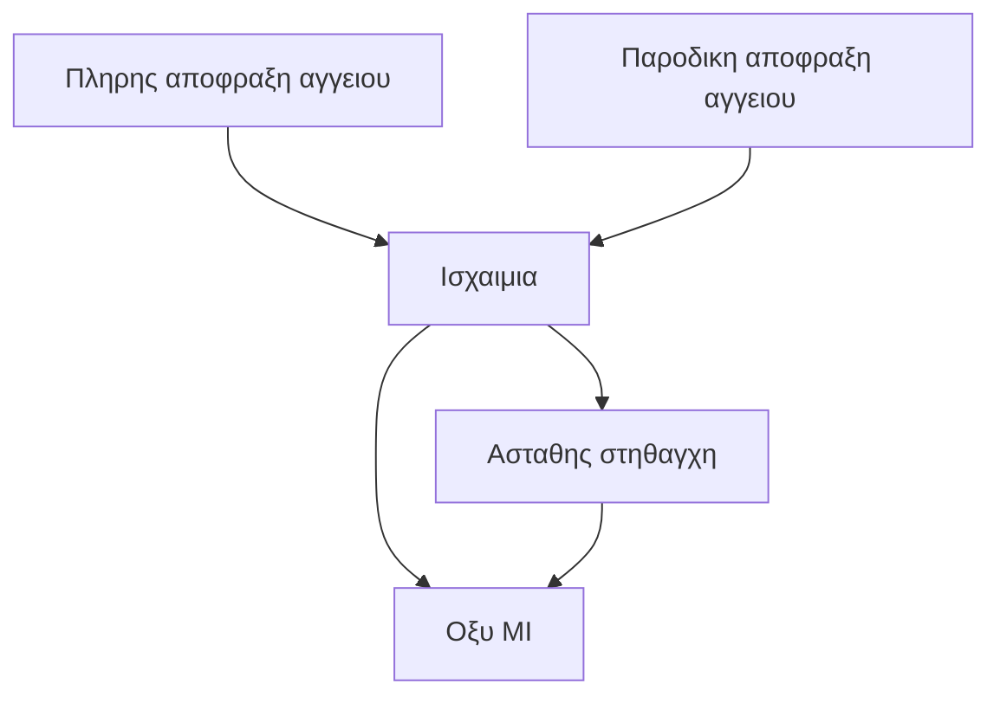
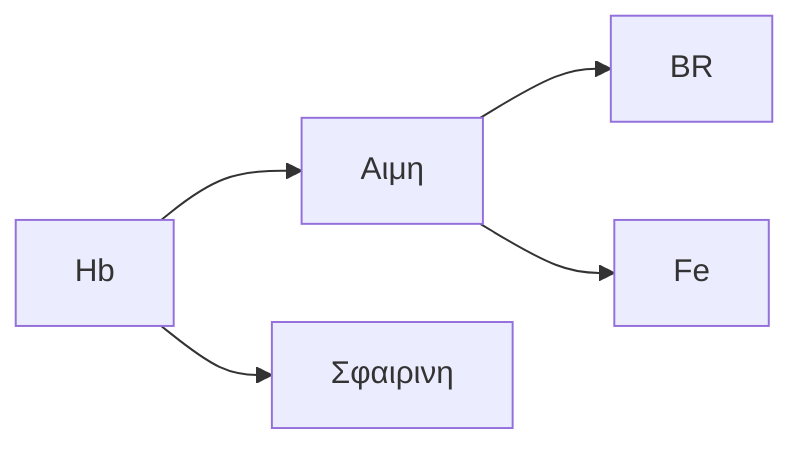

***
## SOS

👳‍♀️ = Ασθενης

Φρικια ~> Ριγος, αισθημα ψυχους

TG = Τριγλυκεριδια

BR = Χολερυθρινη

Νυξη ~> Τσιμπημα

ΕΝΥ = Εγκεφαλονωτιαιο Υγρο

Cre = Κρεατινινη     |     Cr = Κρεατινη

Υποαλβουμιναιμια ~> Ελλειψη αλβουμινης σε 🩸
≠
Υπολευκωματιναιμια ~> Ελλειψη πρωτεινων (γενικα) σε 🩸

Λευκωμα ουρων = Πρωτεϊνουρια

ΦΤ = Φυσιολογικες Τιμες

[[Ανοσολογία#^443f49]]

CA = Cancer Antigen

Καρδιακη προσβολη = Εμφραγμα Μυοκαρδιου = MI
	AMI = Οξυ εμφραγμα μυοκαρδιου

Στηθαγχη ~> Δυσφορια ή 😫 στο στηθος μετα απο ισχαιμια 🫀
	1.  **Ασταθης**
		❓ Αθηροσκληρωση
		⏱️  >3o min
		🩹  🏥
	2.  **Σταθερη**
		❓ 🏃🏻‍♂️, εντονο αγχος
		⏱️  <15 min
		🩹  Ξεκουραση

📋 = Διαγνωση     |     📕 = Διαφορικη διαγνωση  

Tn  =  Τροπονινη
	cTn = Καρδιακη Τροπονινη

Καρδιακη ανεπαρκεια ενιοτε ακολουθει την MI

Hb = Αιμοσφαιρινη          |          Mb = Μυοσφαιρινη

Οριο Ανιχνευσης (LOD) ~> Ελαχιστη $C_{\text{ουσιας}}$ που ουσια ανιχνευεται

Οριο Αναφορας (LOQ) ~> Ελαχιστη  $C_{\text{ουσιας}}$ που ουσια ανιχνευεται και μπορει να ποσοτικοποιηθει

AKI = ARF = ΟΝΒ = Οξεια Νεφρικη Βλαβη

CKD = ΧΝΝ = Χρονια Νεφρικη Νοσος

+ve = Θετικο Τεστ  |  -ve = Αρνητικο Τεστ

D-dimers test ~> Αιματολογικη εξεταση που ανιχνευει θρομβους
	Ινωδες  ⇀  D-dimers  {ΔΙΑΣΠΑΣΗ} ^be9b5c

PTP ~> % να εχει ο 👳‍♀️ μια παθηση πριν γινει διαγνωση για αυτην

Κατακεκλιμενη θεση ~> Ανασκελα ή Μπρουμυτα

LDL-C = LDL χοληστερολη  |  HDL-C = HDL χοληστερολη
non-HDL = LDL + VLDL + IDL + CM

Νοσημα
	-  **Πρωτοπαθες**
		}-  Ειναι η κυρια αιτια της παθολογιας
		❓ 🧬 ή Αγνωστο
	-  **Δευτεροπαθες**
		❓ Επιπλοκη αλλης (πρωτοπαθους) παθησης, περιβαλλον (εξωγενεις παραγοντες)

LME = Lipoprotein Modifying 💨

CM = Χυλομικρα

TC = Ολικη Χοληστερολη

⚠️ = Κινδυνος (Risk)

Γλυκερολη = Γλυκερινη

`🍵 DEX` = `🍵 Dexamethazone`

Ag = Αντιγονο

Ανακοπη ~> 🫀 σταματα ξαφνικα να χτυπαει

Ολικα λευκωματα = Αλβουμινη & Σφαιρινες (πρωτεϊνες 🩸)

ABGs = αερια αιματος

Μυελωμα -> 🦀 πλασματοκυτταρων (παραγοντες παραπρωτεϊνες)

Παραπρωτεϊνη ~> Ανωμαλη μονοκλωνικη πρωτεϊνη (Ig ή τμημα της)
	🚜  Παθολογικα πλασματοκυτταρα

Επισχεση = Κατακρατηση

παραπρωτεϊναιμια tbc

Spot ουρων ~> Αναλυση τωρινου δειγματος, χωρις να περιμενουμε (ουρα 24ωρου)

🩺  Οχι 😰 στις μασχαλες => Αφυδατωση

Αλβουμινουρια (Πρωτεϊνουρια) ~> Αλβουμινη στα ουρα (μη φυσιολογικο)
	-  **Μικρο**αλβουμινουρια: ACR = **30-300** mg/g
	-  **Μακρο**αλβουμινουρια: ACR **> 300** mg/g ^2c4ddd

Νεφρωσικο Συνδρομο ~> Αυξημενη διαπερατοτητα ΒΜ σπειραματος σε πρωτεϊνες 🩸

✍️ = Ιστορικο = Hx

t1/2 = Χρονος ημιζωης

PPP ~> Κυτταροθρομβοπενικο 🩸

HCT = αιματοκριτης

Επισταξη = Ρινορραγια

Θυρορμονη = T3 & T4

ALP = Αλκαλικη Φωσφαταση

ICF = Ενδοκυτταριο 💧  |  ECF = Εξωκυτταριο 💧

Αλδοστερονισμος -> Υπερπαραγωγη αλδοστερονης
	1.  **Πρωτοπαθης (PA, Συνδρομο Conn)** ~> Αυτονομη υπερεκκριση αλδοστερονης απο επινεφριδια, ανεξαρτητα απο RAS
		❓
			-  Αμφοτερη Υπερπλασια (ΣΥΕ) (65%)
			-  Ετεροπλευρο αδενωμα επινεφριδιων (30%)
			-  Οικογενης (τυπου 1,2,3)
		🧪  ↑ Αλδοστερονη (PAC)  |  ↓ Ρενινη (PRA)
		💉  Λαπαροσκοπικη αφαιρεση
	2.  **Δευτεροπαθης** ~> Υπερεκκριση αλδοστερονης
		🗝️  🟢  RAS 
		❓
			-  Στενωση Νεφρικης</FONTCOLOR>
			-  🦀  Ρενινωμα  
			-  CKD
			-  CHF  
		🧪  ↑ Αλδοστερονη  |  ↑  Ρενινη
		^170443

BP = Αρτηριακη Πιεση

Σακχαρο = Glc

Υπερουριχαιμια -> ↑↑ ουρικο οξυ

HbA1c = Γλυκοζυλιωμενη Hb

Δικτυοενδοθηλιακο Συστημα ~> Μονοκυτταρα & ΜΦ & DCs & Οστεοκλαστες
	✗  Ηπαρ</FONTCOLOR>, Σπληνας</fontcolor>, 🪀  ^acb62a

AAT = Α1-αντιθρυψινη

AMA = Αντι-mt Ig

Καμπυλη Σακχαρου = Δοκιμασια ανοχης Glc = OGTT

`💨 Κρεατινικη Κιναση (CK, CPK)`
	`💨 CK-MM` ~> 💪🏻, 🩸  |  `💨 CK-MB` ~> 🫀, 💪🏻
	`💨 CK-BB` ~> 🧠
	↑↑ ATP
		Cr + ATP  ⇀  PCr + ADP {ΦΩΣΦΟΡΥΛΙΩΣΗ}
	↓↓ ATP (πχ 🏃🏻‍♂️)
		PCr + ADP  ⇀  Cr + ATP  {ΑΠΟΦΩΣΦΟΡΥΛΙΩΣΗ} ^25e86c

U/S = Υπερηχος

RTA = Νεφρικη Σωληναριακη Οξεωση

Ογκωτικη = Κολλοειδοσμωτικη

**Ζωτικα Σημεια**
	🌡️  |  Σφυξεις  |  Αναπνευστικος Ρυθμος  |  BP  |  SpO2

DKA = Διαβητικη Κετοξεωση

***

## 1ο ΜΑΘΗΜΑ ~ { ΒΑΣΙΚΕΣ ΑΡΧΕΣ }

――
##### ΓΕΝΙΚΑ (ΒΑΣΙΚΕΣ ΑΡΧΕΣ)

![[Pasted image 20241201151134.png]]

![[Pasted image 20241201151329.png]]

Δοκιμασια Ελεγχου (Screening Tests) ~> Ελεγχος παρουσιας υποκλινικων ευρηματων σε υγιη, κατα τα αλλα, ατομα
	-  Οικονομικο
	-  Ευκολο
	-  Ανωδυνο
	☞  Πρεπει να εχει αποδεδειγμενο οφελος
	★  Χρησιμοποιειται για να βρουμε **πιθανα κρουσματα**
	✢  Μεγαλη **ευαισθησια**

Διαγνωστικες Δοκιμασιες (Diagnostic Tests) ~> Δοκιμασιες που βοηθουν στη διαγνωση
	✢  Μεγαλη **ειδικοτητα**

[[Βιοστατιστική#ΚΑΝΟΝΙΚΗ Ή ΓΚΑΟΥΣΙΑΝΗ ΚΑΤΑΝΟΜΗ]]

| Αριθμός Εξετάσεων | Πιθανότητα να ειναι όλες οι τιμές εντός ορίων |
| ----------------- | --------------------------------------------- |
| 1                 | 95%                                           |
| 2                 | 90%                                           |
| 6                 | 74%                                           |
| 10                | 60%                                           |
| 12                | 54%                                           |
| 15                | 46%                                           |
| 20                | 36%                                           |
| 24                | 23%                                           |

![[Pasted image 20241201153538.png]]

Ορια Αναφορας οριζονται με βαση τη **πιθανοτητα** εμφανισης νοσου

――
##### ΜΕΤΑΒΛΗΤΟΤΗΤΑ / ΕΙΔΙΚΟΤΗΤΑ - ΕΥΑΙΣΘΗΣΙΑ

Αναλυτικη Μεταβλητοτητα -> Μεταβλητοτητα στη τιμη που θα παρουμε μετρωντας το ιδιο δειγμα πολλες φορες
	✤  Τυπικες SD για επαναλομβενες μετρησεις σε δειγμα ελεγχου (control)
		Συγκεντρωσεις εντος του φυσιολογικου ευρους

Βιολογικη Μεταβλητοτητα -> Μεσοι οροι SD σε μετρησεις ανα εβδομαδα για 10 εβδομαδες σε υγιη ατομα
	▶︎  Εκτιμηση μεταβολων κατα την **παρακολουθηση**

![[Pasted image 20241201154034.png]]

ΤΑ = $\sqrt{\sum{A_{A^2}}+\sum{A_{B^2}}}$          ==〘1〙==
	TA ~> Τελικη SD
	$\sum{A_{A^2}}$ ~> SD αναλυτικης μεταβλητοτητας
	$\sum{A_{B^2}}$ ~> SD βιολογικης μεταβλητοτητας
	Οταν:
		**Διαφορα Δοκιμασιων > 2.8 * TA**  => κλινικα σημαντικο

Πχ: `🧪 Cre` (ΣΔ με HTN)

| Cre (mg/dl) | Cre  (6 μηνες μετα) | $\sum{A_{A^2}}$ | $\sum{A_{B^2}}$ | Δ δοκιμασιων | 2.8 * TA |
| -------------- | ---------------------- | --------------- | --------------- | ------------ | -------- |
| 1.2            | 1.35                   | 0.05            | 0.04            | 0.015        | 0.018    |

=>  Μεταβολη δεν ειναι κλινικα σημαντικη

[[Βιοστατιστική#ΕΙΔΙΚΟΤΗΤΑ / ΕΥΑΙΣΘΗΣΙΑ]]

Ειδικοτητα ↑ => Ευαιθησια ↓
	& αντιστροφα

――
##### ΑΠΟΤΕΛΕΣΜΑΤΙΚΟΤΗΤΑ / ΠΡΟΓΝΩΣΤΙΚΗ ΑΞΙΑ

Αποτελεσματικοτητα (Αποδοτικοτητα) ~> % Ορθων απαντησεων
	Αποτελεσματικοτητα = $\frac{\text{Αληθως Θετικος + Ψευδως Αρνητικος}}{\text{Ολοι οι εξεταζομενοι}}$ * 100 %          ==〘2〙==

[[Βιοστατιστική#ΕΙΔΙΚΟΤΗΤΑ / ΕΥΑΙΣΘΗΣΙΑ]]

Pre-test probability
	P(N+) = $\frac{\text{Ασθενεις με νοσο (Ν+)}}{\text{Ολοι οι εξεταζομενοι}}$
	-  P(N+) ↑ => +PV ↑

Χρησιμοποιουμε διαγνωστικα τεστ οταν:
	-  Αποτελεσμα θα μας βοηθησει για εκτιμηση ασθενους
	-  Υπαρχουν ενδειξεις για πιθανη τιμη εκτος οριων

[[Βιοστατιστική#^1aa669]]

―
###### Παραδειγμα (Προγνωστικη Αξια)

Screening σε νεογνά (1.000.000)

| ΚΑΤΗΓΟΡΙΑ        | Θετικα αποτελεσματα | Αρνητικα αποτελεσματα | Συνολο |
| ---------------- | ------------------- | --------------------- | ------ |
| Επιβεβαιωμενο ΜΙ | 950                 | 50                    | 1000   |
| Χωρις ΜΙ         | 100                 | 900                   | 1000   |
| Συνολο           | 1050                | 950                   | 2000   |

Ειδικοτητα = 90%     |     Ευαισθησια = 95%
PPV = 950 / 1050  = 90.5%     |     NPV = 900 / 950 = 94.7%

――
##### ΠΑΡΑΓΟΝΤΕΣ ΠΟΥ ΕΠΗΡΕΑΖΟΥΝ ΔΙΑΓΝΩΣΤΙΚΕΣ ΔΟΚΙΜΑΣΙΕΣ

Διαιτα
	-  Απορροφηση συστατικων τροφης (Glc, υδατανθρακες)
		}-  Glc
			 ↑ αμεσα (δοκιμασια ανοχης)
			 ↑ 1-3 h μετα (μετα απο 🍔)
		}-  TGs
			↑ 2 h μετα (μετα απο 🍔)
			↑ 10 h μετα (συνθεση στο Ηπαρ</FONTCOLOR></FONTCOLOR>)
	-  Ορμονικες & μεταβολικες αλλαγες κατα την πεψη
		↑
			Γαστρινη, pHουρων, ins
		↓ 
			K+ στο 🩸
	-  Επιδραση μακρας νηστειας
		↑
			BR (μετα απο 24ωρη νηστεια)
		↓
			Ορμονων υποφυσης, πρωτεϊνων 🩸

Stress
	-  Ορμονικες μεταβολες
		↑  Κατεχολαμινες - σεροτονινη
	-  Φλεγμονη
		↑  Κυτοκινες, ινωδογονο, ACTH
		↓  Αλβουμινη, τρανσφερινες
	-  Βαρια βλαβη 🕸️
		↓  Χοληστερολη (προσληψη απο ΜΦ)
	↑ Ογκος 🩸

Σταση κατα την αιμοληψια
	🧍‍♂️:  ↑ πρωτεινων 🩸 & HCT (5-8%)
	ξαπλωμενος:  ↓💧 &  ηλεκτρολυτες (10-15%)

🏃🏻‍♂️
	↑ CPK, AST, LDH, ουρικο οξυ (♂)
	↓ FSH, LH, οιστρογονα (♀)

🏙️ - 🌃
	➤  Μελατονινη επηρεαζει υποφυσιακες ορμονες
	Cre ~> Μεταβαλλεται 15-20% (↑↑ στο τελος της ημερας)

Εμμηνος Ρυση 
	Μεταβαλλονται: Οιστραδιολη, προγεστερονη, LH, FSH, χοληστερολη
	-  Χοληστερολη ~> 20% μειωμενη στην εμμηνο ρηση

🤰🏻
	↓ Glc (παροχη στο εμβρυο)
	↓ T3, T3     |     ↑ TSH (1ο τριμηνο)
	↑ LDL & χοληστερολης
	↑ V 🩸     |     ↓ HCT
	↑ GFR (εως 50%)     |     ↓ ουρια, κρεατινινη
	↑ ALP (* 2 στο 3ο τριμηνο)

☕️
	↑ κατεχολαμινες, κορτιζολη

🥃 (Αιθανολη)
	↑ HDL

🚬 (Νικοτινη)
	↑ GH, αντοχη Glc, HCT

***

## 2ο ΜΑΘΗΜΑ ~ { ΑΙΜΟΛΗΨΙΑ }

Φλεβοκεντηση (Venepuncture) ~> Η πιο συχνη επεμβατικη ιατρικη πραξη

]--]
**Ανεπιθυμητα Συμβαντα Αιμοληψιας**

| Στον ασθενη                               | Στον αιμοληπτη                            |
| ----------------------------------------- | ----------------------------------------- |
| Αιματωμα                                  | Τραυματισμος με βελονα αιμοληψιας         |
| Επιμολυνση                                | Μεταδοση 🥁 -  Ηπατιτιδα -  HIV κλπ |
| Βλαβη 🟡                                  |                                           |
| Λιποθυμικο επεισοδιο                      |                                           |
| Μεταδοση 🥁 -  Ηπατιτιδα -  HIV κλπ |                                           |

]--]

Εκτος απο 🩸, αλλα βιολογικα δειγματα:
	-  Ουρα
	-  Υπεζωκωτικο υγρο
	-  ΕΝΥ
	-  Βρογχοκυψελιδικο υγρο
	-  Ασκιτικο υγρο
	-  💩

Ειδη εξετασεων:
	✦  Οπτικη Εξεταση
	✦  Γενικη
		-  Κυτταρα
		-  Τυπος
	✦  Βιοχημικος Ελεγχος
		-  Glc
		-  Λευκωματα
		-  LDH
	✦  Ανοσολογικος Ελεγχος
		-  Αντισωματα
		-  Ανοσοφαινοτυπος
	✦  Κυτταρολογικη Εξεταση
	✦  Καλλιεργειες & Χρωση Gram

――
##### ΥΛΙΚΑ ΑΙΜΟΛΗΨΙΑΣ

―
###### Βελονες

Επιλεγεται με βαση:
	-  Εσωτερικη Δ (**G**)
		Οσο μεγαλυτερο το Δ τοσο μικροτερο το G	
	-  Μηκος

👨🏾  ~>  19 ή 21 G     |     🧒  ~> 23 G

❏  Βελονα **μικρου G** αυξανει κινδυνο αιματωματος

❐  Βελονα **μεγαλου G** αυξανει κινδυνο αιμολυσης δειγματος 

―
###### Σωληναρια Λειψης Δειγματος

| Σωληναριο                       | Χρωμα                                                                                    |     |
| ------------------------------- | ---------------------------------------------------------------------------------------- | --- |
| Χωρις προσθετη ουσια ή με Gel   | Κοκκινο</FONTCOLOR>                                                |     |
| Με κιτρικο νατριο (αντιπηκτικο) | Γαλαζιο</FONTCOLOR>,  Μαυρο</FONTCOLOR> |     |
| EDTA                            | Μωβ</FONTCOLOR>                                                   |     |

^84092d

――
##### ΔΙΑΔΙΚΑΣΙΑ ΑΙΜΟΛΗΨΙΑΣ

1.  **Εξασφαλιση καταλληλου χωρου**
	-  Καθαρη επιφανεια τοποθετησης υλικων
	-  Ηρεμο περιβαλλον
	-  Δυνατοτητα αντισηψιας (νεροχυτης, σαπουνια, αντισηπτικα)
	-  Πληροφορηση 👳‍♀️ 

2.  **Ενημερωση και προετοιμασια 👳‍♀️**
	-  Λαμβανουμε ιστορικο για **υποκειμενα νοσηματα**
		Πχ αλλεργιες, λιποθυμιες
	-  Προφορικη συναινεση

3.  **Επιλογη θεσης αιμοληψιας**
	![[Στιγμιότυπο οθόνης 2024-10-05, 17.03.16.pdf]]
	1)  Κεφαλικη</fontcolor>
	2)  Ωλενια
	3)  Επικουρικη Κεφαλικη</fontcolor>
	4)  Βασιλικη</fontcolor>
	5)  Κεφαλικη
	6)  Αντιβραχιονια</fontcolor>
	-  Τοποθετουμε περιδεση 4-5 δακτυλα πανω απο 🎯
	-  Ζητουμε απο 👳‍♀️ να σφιξει σε γροθια το χερι του

4.  **Αντισηψια**
	-  Πλυσιμο χεριων
	-  Τοποθετηση μη αποστειρωμενων γαντιων
	-  Καθαρισμος 🎯 με αντισηπτικο διαλυμα

5.  **Αιμοληψια**
	-  Εισαγουμε απαλα σε 🔵
		📐  30º
	-  💉
	-  Λυνουμε περιδεση
	-  Ζητουμε απο 👳‍♀️ να ανοιξει γροθια
	-  Παταμε 🎯 με στεγνο βαμβακι ή γαζα
	-  Αφαιρουμε βελονα

6.  **Τοποθετηση δειγματος σε σωληναρια**

7.  **Απορριψη υλικων αιμολυσης**

8.  **Σημανση στοιχειων στο δειγμα**
	-  Επιβεβαιωση στοιχειων 👳‍♀️
	-  Αναγραφη στοιχειων 👳‍♀️ και ζητουμενης εξετασης
		-  Αν χρειαστει και συνοδο ιστορικο
		-  Ειδικη σημανση για 🥁
	-  Επανελεγχος

9.  **Μεταφορα δειγματος**
	-  Μεταφορα σε παγο
	-  Τοποθετηση σε σακουλες
	-  Μεταφορα στο εργαστηριο
		✤  Αιματολογικο
		✤  Ιολογικο
		✤  Βιοχημικο
		✤  Ενδοκρινολογικο
		✤  Ανοσολογικο
		✤  Μικροβιολογικο

☒  Πιθανα Τεχνικα Λαθη που μπορουν να προκαλεσουν **αιμολυση**  ☒
	-  Παρατεταμενη περιδεση βραχιονα
	-  Βελονες με μεγαλο G
	-  Παρατεταμενη και βιαιη αναδευση 🩸 με το αντιπηκτικο
	-  Εισοδος πλεοναζοντος αερα σε σωληναριο
	-  Ασκηση πιεσης στο εμβολο της συριγγας κατα την τοποθετηση 🩸 στο σωληναριο

ΣΕ 😷
	-  Ληψη απο 🫴🏻 που δεν εχει ορο
	-  Αν δεν υπαρχουν διαθεσιμες 🔵, χρηση **ενδοαγγειακου καθετηρα**
		☛  Απορριψη πρωτων 10ml 🩸
	ΠΡΟΣΟΧΗ να μην αναμειχθει 🩸 με ουσιες εντος του καθετηρα (πχ ηπαρινη)

Δεν κανουμε φλεβοκεντηση σε:
	❖  🫴🏻 απο πλευρα μαστεκτομης
		-  Λογω λεμφοιδηματος
	❖  Ουλωδεις ή καμμενες περιοχες
		-  Λογω δυσκολιας
	❖  🫴🏻 που πραγματοποιειται IV

👨🏻‍⚕️ πρεπει να κανει 💉 για *HBV*

――
##### ΠΛΗΡΟΦΟΡΙΕΣ ΓΙΑ ΑΙΜΟΛΗΨΙΑ

▴  👳‍♀️ πρεπει να κανει 12ωρη νηστεια
	Αποφυγη:
		-  Λιπαιμιας
		-  Ψευδων αυξημενων τιμων Glc
	❖  Χοληστερολη
	❖  Λιπιδια
	❖  Glc
	❖  Τεστ ανοχης σε Glc
	❖  Κορτιζολη
	❖  Φυλλικο οξυ
	❖  Φερριτινη
	❖  Fe
	❖  Φωσφορος

▿  Αποφυγη 🥃 για 24 ωρες
	Προσδιορισμος:
		-  Λιπιδιων
		-  Ηπατικων 💨
		-  γ-GT

⏱️  7-9 το πρωι
	-  Πριν το πρωινο γευμα
		Αλλιως: ↑ Glc & χοληστερολη στο 🩸
	-  OXI ομως παρατεταμενη νηστεια
		Αλλιως: ↓ Glc, ↑ κετονων, ↓ Fe & Hb στο 🩸

Ασβεστιο Ολικο (Ca)
	⏱️  Πρωι
		-  Λογω ημερησιων διακυμανσεων
	▽  Χωρις περιδεση
	□  Νηστικος για > 8 ωρες

PRL, FSH, LH, Ανδρογονα
	⏱️ Πρωι
	🤰🏻  2η-5η ημερα κυκλου

Οιστραδιολη
	🤰🏻  14η ημερα κυκλου

Προγεστερονη
	🤰🏻 21η ημερα κυκλου

Λιπαιμικος Ορος ~> Ορος με παρουσια λιπιδιων στο 🩸

Πρεπει να αποφευγονται τα εξης 🍵:
	▶︎  **Ακετυλοσαλικυλικο Οξυ (Ασπιρινη)**
		-  Επηρεαζει χρονο πηξης 🩸
		-  Επηρεαζει λειτουργικες δοκιμασιες PLTs
	▶︎  **Φουροσεμιδη (Lasix)**
		-  Επηρεαζει επιπεδα T3,T4
		-  Υποεκτιμα επιπεδα τρανσαμινασων (SGOT, SGPT)
	▶︎  **Υψηλες δοσεις vit C**
		-  ↑ χοληστερολη
		-  ↑ Ηπατικα 💨
		-  ↓ Glc

Πρεπει να αποφευγεται και η εντονη 🏃🏻‍♂️
	↑  CPK, LDH, Ηπατικα 💨
	↓  Glc, TG

――
##### ΑΙΜΟΚΑΛΛΙΕΡΓΕΙΑ

tbc

――
##### ΛΗΨΗ ΑΡΤΗΡΙΑΚΟΥ 🩸

1.  Παρακεντηση
	📐  30º - 40º
	🎯  Σφυγμος Κερκιδικης</FONTCOLOR>

2.  Προωθηση βελονας αργα και σταθερα (μεχρι να εισελθει σε αγγειο)

3.  Συριγγα γεμιζει παθητικα με ζωηρο κοκκινο 🩸
	🍶  1-2 ml

☑︎  Συριγγα πρεπει να περιεχει **ηπαρινη**

◇  Βελονα: 23-25 G

――
##### ΛΗΨΗ 🩸 💈

Σε:
	-  Προωρα βρεφη
	-  Νεογνα
	-  Εξετασεις HCT
	-  Υπολογισμο Hb, BR
	-  Μετρηση σακχαρου

1)  Αντισηψια
2)  Νυξη
	✗  Ακροδακτυλα
	✗  Λοβοι 👂
	✗  Μεγαλο δακτυλο ποδιου ή φτερνα (👶🏻)
3)  Απορριψη πρωτης σταγονας 🩸
4)  Εμφανιση σταγονας 🩸
5)  Συλλογη σε σωληναριο με αντιπηκτικο

――
##### ΕΞΕΤΑΣΗ ΟΥΡΩΝ

⏰  Πρωι

☑︎  Επιμελης καθαρισμος γεννητικων οργανων με 💧 & 🧼
☒  Αντισηπτικα πρεπει να αποφευγονται
	-  Επηρεαζουν αποτελεσμα καλλιεργειας
☑︎  👳‍♀️ συλλεγει **50-100 ml** ουρων (σε αποστειρωμενο δοχειο)

⏲️  1-2 h / 🌡️  25ºC     |     ⏲️  4 h / 🧊

Πρωτεινες στα ουρα
	ΦΤ: 100-150 mg / 24h 
	30% λευκωματινη | 70% σφαιρινες | πρωτεινες αποπτωτικου ⭕️
	**ΑΝ λευκωμα+**
		1.  Προσδιορισμος λευκωματος ουρων/24h
		2.  Εξεταση λευκωματων ορου
		3.  Ηλεκτροφορηση λευκωματων ουρων/24h & ορου
		4.  Εξεταση ουρων για λευκωμα Bence-Jones
	✩  < **1** g/24h = Λευκωματουρια **μικρου** βαθμου
	✩  **1-2** g/24h = Λευκωματουρια **μετριου** βαθμου
	✩  > **3,5** g/24h = Νεφρωσικο Συνδρομο

‣  Βακτηριουρια (> 100000 🐲 /ml)
‣  Πυουρια (> 10 WBCs / ml)

Αν δεν ξερουμε, **καλλιεργεια ουρων**

κ.ο.π = Κατα οπτικο πεδιο (σε 🔬)
	•  Για WBCs (πυοσφαιρια)
	Παθολογικο:  **>5**

Γενικη ουρων σε 🥁 ανωτερου ουροποιητικου:
	![[Στιγμιότυπο οθόνης 2024-10-07, 10.26.22.pdf]]

tbc

***
## 3ο ΜΑΘΗΜΑ ~ { ΚΑΡΚΙΝΙΚΟΙ ΔΕΙΚΤΕΣ }

Υπερεκφραση (Overexpression)  ->  ↑↑ 🚜 πρωτεϊνης απο 🧬
Ενισχυση (Amplification)  ->  ↑↑ αντιγραφα 🧬 σε γονιδιωμα

| Ογκογονιδια              | 🧬         | 🗝️                                | ✂️                              | 🦀                                                                                                                 |
| ------------------------ | ---------- | ---------------------------------- | ------------------------------- | ------------------------------------------------------------------------------------------------------------------ |
|                          | `🧬 KRAS`  |                                    | Σημειακη                        | -  ΠΕ -  🫁 (Αδενοκαρκινωμα) -  Παγκρεας</fontcolor></FONTCOLOR> |
|                          | `🧬 BRAF`  |                                    | -  Αντικατασταση -  Σημειακη | -  Μελανωμα -  ΠΕ -  Λευχαιμια                                                                               |
| GROWTH  FACTORS       |            |                                    |                                 |                                                                                                                    |
|                          | `🧬 PDGFB` | PDGF                               | Υπερεκφραση                     | Αστροκυττωμα                                                                                                       |
| GROWTH  FACTOR 🚦     |            |                                    |                                 |                                                                                                                    |
|                          | `🧬 HER2`  | `🚦 EGF` `💨 Κιναση tyr`        | Ενισχυση                        | -  Μαστου -  Στομαχου</fontcolor></FONTCOLOR>                       |
|                          | `🧬 RET`   | `🚦 NGF`                           | Σημειακη                        | -  MEN2A -  MEN2B -  MTC                                                                                     |
|                          | `🧬 KIT`   | `🚦 SCF`                           | Σημειακη                        | -  GIST                                                                                                            |
|                          | `🧬 ALK`   | `💨 Κιναση tyr`                    | -  Αντικατασταση -  Σημειακη | -  🫁 (Αδενοκαρκινωμα) -  Λεμφωμα -  Νευροβλαστωμα                                                           |
| SIGNAL TRANSDUCERS       |            |                                    |                                 |                                                                                                                    |
|                          | `🧬 RAS`   | Πρωτεϊνη  συνδεουσα  σε GTP  | Σημειακη                        | -  CA -  Μελανωμα -  Λεμφωμα                                                                                 |
|                          | `🧬 ABL`   | 🟢 `💨 Κιναση tyr`                 | t(9;22) με BCR                  | -  CML -  ALL                                                                                                   |
|                          | `🧬 JAK2`  | 🟢 `💨 Κιναση tyr`                 |                                 | -  CML                                                                                                             |
| NUCLEAR REGULATORS       |            |                                    |                                 |                                                                                                                    |
|                          | `🧬 c-MYC` | Μεταγραφ. Παραγοντας               | t(8;14)  (IgH)                  | -  Λεμφωμα Burkitt                                                                                                 |
|                          | `🧬 N-MYC` | Μεταγραφ. Παραγοντας               | Ενισχυση                        | -  Νευροβλαστωμα                                                                                                   |
|                          | `🧬 L-MYC` | Μεταγραφ. Παραγοντας               |                                 | -  SCLC                                                                                                            |
| CELL CYCLE REGULATORS    |            |                                    |                                 |                                                                                                                    |
|                          | `🧬 CCND1` | Κυκλινη                            | t(11;14)  (IgH)                 | -  Λεμφωμα μανδυα                                                                                                  |
|                          | `🧬 CDK4`  | Κυκλινο-εξαρτωμενη  `💨 Κιναση` | Ενισχυση                        | -  Μελανωμα                                                                                                        |
| ANTI-APOPTOTIC MOLECULES |            |                                    |                                 |                                                                                                                    |
|                          | `🧬 BCL-2` |                                    | t(14;18)                        | -  Θυλακιωδες Λεμφωμα -  DLBCL                                                                                  |

🔠  
	1.  `🧬 ALK`:  “**A**denocarcinoma of **L**ung **K**inase”
	2.  `🧬 L-MYC`:  **L**ung cancer
	3. `🧬 N-MYC`:  **N**euroblastoma
	4.  `🧬 KIT`:  ✂️ affect Cyto**K**ine recep**T**or 🚜
	5.  `🧬 BCL-2`:  ✂️ are associated with diffuse large **B**-**c**ell **L**ymphoma.

| Ογκοκατασταλτικα | 🧬               | Πρωτεϊνη     | 🦀                                                                                                                                                                                                                 |
| ---------------- | ---------------- | ------------ | ------------------------------------------------------------------------------------------------------------------------------------------------------------------------------------------------------------------ |
|                  | `🧬 TP53`        | p53          | ❧  Οι περισσοτεροι (> 50%) -  Συνδρομο Li-Fraumeni                                                                                                                                                              |
|                  | `🧬 Rb`          | Rb           | -  Ρετινοβλαστωμα -  Οστεοσαρκωμα                                                                                                                                                                               |
|                  | `🧬 CDKN2A`      | p16          | -  Μελανωμα -  Παγκρεατος</fontcolor></FONTCOLOR> -  🫁                                                                                                          |
|                  | `🧬 APC`         |              | -  FAP                                                                                                                                                                                                             |
|                  | `🧬 PTEN`        |              | -  Μαστου -  🌰 -  Ενδομητριου -  Συνδρομο Cowden                                                                                                                                                         |
|                  | `🧬 BRCA1`       |              | -  Μαστου -  Ωοθηκων</FONTCOLOR></FONTCOLOR></FONTCOLOR> -  Παγκρεατος</fontcolor></FONTCOLOR> |
|                  | `🧬 BRCA2`       |              | -  Μαστου -  Ωοθηκων</FONTCOLOR></FONTCOLOR></FONTCOLOR> -  Παγκρεατος</fontcolor></FONTCOLOR> |
|                  | `🧬 {MMR}`       |              | Συνδρομο Lynch                                                                                                                                                                                                     |
|                  | `🧬 DCC`         |              | ΠΕ                                                                                                                                                                                                                 |
|                  | `🧬 SMAD4 (DPC)` |              | Παγκρεατος</fontcolor></FONTCOLOR>                                                                                                                                     |
|                  | `🧬 MEN1`        | Μενινη       | MEN1                                                                                                                                                                                                               |
|                  | `🧬 NF1`         | Νευροϊνωμινη | NF1                                                                                                                                                                                                                |
|                  | `🧬 NF2`         | Μερλινη      | NF2                                                                                                                                                                                                                |
|                  | `🧬 TSC1`        | Αμαρτινη     | Οζωδης Σκληρυνση (TSC)                                                                                                                                                                                             |
|                  | `🧬 TSC2`        | Τουμπερινη   | Οζωδης Σκληρυνση (TSC)                                                                                                                                                                                             |
|                  | `🧬 VHL`         |              | Νοσος VHL                                                                                                                                                                                                          |
|                  | `🧬 WT1`         |              | Νεφροβλαστωμα                                                                                                                                                                                                      |
|                  | `🧬 WT2`         |              | Νεφροβλαστωμα                                                                                                                                                                                                      |

| 🦀                                         | Δεικτης                                                                                                     |
| ------------------------------------------ | ----------------------------------------------------------------------------------------------------------- |
| Ηπαρ</FONTCOLOR>     | -  aFP -  HPV                                                                                            |
| Ορχεις                                     | -  aFP -  βhCG -  LDH                                                                                 |
| ΠΕ                                         | CEA                                                                                                         |
| Ωοθηκες</FONTCOLOR>  | -  CA 125 -  MUC1 -  HER-2 -  TPD52                                                                |
| Παγκρεας</fontcolor> | -  CA 19.9 -  HER-2                                                                                      |
| Χοληφορα</FONTCOLOR> | CA 19.9                                                                                                     |
| 🫁                                         | -  CEA -  NSE                                                                                            |
| Θυρεοειδης                                 | Θυρεοσφαιρινη (TG)                                                                                          |
| MTC                                        | Καλσιτονινη                                                                                                 |
| Μελανωμα                                   | -  S-100 -  NSE -  Τυροσιναση -  MAGE -  Gp100                                                  |
| Λευχαιμια/Λεμφωμα                          | -  B2M -  LDH                                                                                 |
| Προστατης                                  | -  PSA -  PSMA -  TPD52 -  PAP                                                                     |
| Μαστος                                     | -  ER -  PR -  HER-2 -  CA 15.3/ CA 27.29 -  CEA -  BRCA1 -  BRCA2 -  MUC1 -  TPD52 |
| Μεσοθηλιωμα   ✗ Υπεζωκοτας              | SV40                                                                                                        |

tbc

***
## 4ο ΜΑΘΗΜΑ ~ { ΝΕΡΟ & ΗΛΕΚΤΡΟΛΥΤΕΣ }

――――
#### ΟΜΟΙΟΣΤΑΣΗ Na+

Μετρηση CNa+ στον ορο => Δειχνει την **ενυδατωση** 👳‍♀️
	Εξαρταται απο:  $\frac{H{_2}O}{\text{πλασμα}}$  και οχι απο απολυτο μεγεθος 💧 στο 🩸 ^2baba4

Γινεται:
	-  **/ Vορου**
	-  **/ VH2O**
		・  Χρησιμοποειται σε υπερλιπιδαιμια & υπερπρωτεϊναιμια (ψευδουπονατριαιμια) 
			⁍  Τα λιπιδια & οι πρωτεϊνες
				1.   δεν περιεχουν Na+ 
				2.  δεν ειναι ωσμωτικα ενεργα ^a3c79a

🩸 = 💧 + λιπιδια + πρωτεϊνες + υδατανθρακες ^94fe1b

**ΥΠΟΝΑΤΡΙΑΙΜΙΑ** -> ↓ CNa+ 🩸
	![[Στιγμιότυπο οθόνης 2024-10-17, 12.10.12.pdf]]
	Υπεργλυκαιμια => ↑ Osm 🩸 => ↑ V🩸 => ↓ RAS => ↓ CNa+ 🩸
	Μαννιτολη => ↑ Osm 🩸 => Μετακινηση 💧 (ICF ]> ECF) => Υπονατριαιμια
	Λιπαιμια => ↓ $\frac{H{_2}O}{\text{πλασμα}}$ => Ψευδουπονατριαιμια (ειναι ψευδης γιατι Na+ το ιδιο, 💧 το ιδιο, C φυσιολογικη)
		[[#^94fe1b]]     |     [[#^2baba4]]
	Υπερπρωτεϊναιμια το ιδιο
		ΓΙ ΑΥΤΟ: [[#^a3c79a]]
	Σε ενδοφλεβια εγχυση ισοτονικης Glc => ↑ V🩸 (ο,τι γινεται και στην υπεργλυκαιμια)
	![[Στιγμιότυπο οθόνης 2024-10-17, 14.06.19.pdf]]
	Συνδρομο νοσουντος κυτταρου ~> Na+ δεν χανεται, απλα δεν ανιχνευεται
	Συμφορητικη Καρδιακη Ανεπαρκεια (CHF) ~> Υπονατριαιμια, αλλα nNa+ ↑
		1.  Υποαρδευση 🕸️ => ↓ V🩸 στους Νεφρους</FONTCOLOR></FONTCOLOR> => ↑ RAS => Κατακρατηση 💧 & Na+
		2.  ↓ P πληρωσης στη 🫀 => ↑ ADH => Κατακρατηση 💧
			[[Φυσιολογία Β#^3c1131]]
	Νεφρωσικο Συνδρομο ~> Αλβουμινουρια =>↓ Osm🩸=> Μετακινηση💧(ECF ]> ICF)↓V🩸=>↑ RAS, ADH

**ΥΠΕΡΝΑΤΡΙΑΙΜΙΑ** -> ↑ CNa+ 🩸
	❓  Αφυδατωση ή αποιος διαβητης

――
##### ΑΠΟΙΟΣ ΔΙΑΒΗΤΗΣ

[[Φυσιολογία Β#^2996e4]]

1)  Ισοσθενουρια -> Osmουρων = Osm🩸 (Osm🩸 ↑)
2)  ↑ Osm 🩸
3)  Υπερνατριαιμια
4)  ↓ ΕΞΥ

✰  Χρηση πιτρεσσινης (αναλογο ADH) για διαφορικη διαγνωση:
	-  Κεντρογενης
	-  Νεφρογενης

Το πρωτο πραγμα που συνανταμε ειναι **πολυουρια**
	1.  🧪  Glc, κρεατινινη, K+, Ca2+
		α)  Εαν ειναι `παθολογικα`:
			Περαιτερω διερευνηση
		β)  Εαν ειναι `φυσιολογικα` (υποψια αποιου δαβητη):
			1.  Δοκιμασια στερησης υγρων
			2.  Μετρηση Osmουρων
			![[Στιγμιότυπο οθόνης 2024-10-17, 14.38.41.pdf]]
				Πρωτογενης αποιος δαβητης ~> ↑↑ Ληψη H2O

――
##### ΣΥΝΔΡΟΜΟ ΑΠΡΟΣΦΟΡΗΣ ΕΚΚΡΙΣΗΣ ADH (SIADH)

1)  Υπονατριαιμια
2)  Osm🩸 ↓
3)  Υπερωσμωτικα ουρα
4)  Συνεχης νατριουρηση
	-  Διαφορα CHF απο SIADH
5)  Απουσια οιδηματος
6)  Φυσιολογικη νεφρικη λειτουργια
7)  Κλινικη & βιοχημικη ανταποκριση στον περιορισμο 💧

❓  Εκτοπη Εκκριση
	🦀  Βρογχικο Καρκινωμα
	🦀  Θυμος
	🦀  Προστατη

❓  Ακαταλληλη Εκκριση
	🫁
		-  Πνευμονια
		-  Φυματιωση
		-  Μηχανικη αναπνοη
	🧠
		-  Τραυματισμος
		-  🦀
		-  Ανευρυσμα
		-  Εγκεφαλιτιδα
	😫
	🍵
	Στρες

――
##### ΟΛΙΓΟΟΥΡΙΑ

❓  
	1.  Υποογκαιμια
	2.  AKI

![[Στιγμιότυπο οθόνης 2024-10-17, 14.54.23.pdf]]

――――
#### ΟΜΟΙΟΣΤΑΣΗ K+

Κυριο ενδοκυτταριο κατιον
≠
Μετρηση του γινεται εξωκυτταρια, στον **ορο**

Πολυ σημαντικο αλλιως
>  Προβλημα σε 🫀, 💪🏻

◎  Απωλεια Κ+: 10-20 mM/24h

[[Φυσιολογία Β#6ο ΜΑΘΗΜΑ ~ { ΡΥΘΜΙΣΗ ΙΣΟΖΥΓΙΟΥ ΚΑΛΙΟΥ }]]
	ins: 🟢 Κυτταρικη προσληψη K+ (ενεργητικα)

| ✗                                                 | K+                              |
| ------------------------------------------------- | ------------------------------------------ |
| Εγγυς</FONTCOLOR>           | Επαναρροφηση</color> |
| Απω Εσπειραμενο</FONTCOLOR> | Απεκκριση</color>    |
| Στομαχος</fontcolor>        | Απεκκριση</color>    |
| ΛΕ                                                | Επαναρροφηση</color> |
| Ορθο                                              | Απεκκριση</color>    |

Απεκκριση Κ+ εξαρταται απο
	✹  nNa+ που θα επαναρροφηθει
	✹  Διαθεσιμοτητα Κ+ & Η+
		✗  Απω Εσπειραμενο</FONTCOLOR>
		⍟
	✹  Cαλδοστερονης
	✹  GFR

>  ⍟  Σε οξεωση (↑↑ Η+) => απεκκριση Η+ ↑ => απεκκριση Κ+ ↓
> 	 ❗️ Υπερκαλιαιμια
> ⍟  Σε αλκαλωση (↓↓ Η+) => απεκκριση Κ+ ↑
> 	❗️ Υποκαλιαιμια

――
##### ΥΠΟΚΑΛΙΑΙΜΙΑ

1.  **↓ προσληψη K+**
	1)  🍔 (σπανια)
	2)  Παρεντερικo 🍔
2.  **Αλκαλωση**
3.  **Χορηγηση ins**
	‣  Παροδικη, οργανισμος αποκαθιστα την ισορροπια
4.  **Β αδρενεργικοι αγωνιστες**
	[[Φαρμακολογία Α#^66ff9a]]
5.  🦀 (Λευχαιμια)
	‣  Εντονη ζητηση K+
6.  **↑ απωλεια K+**
	-  Νεφρικη
		α)  Διουρητικα
			[[Φυσιολογία Β#Παραδειγματα αντιδρασης οργανισμου σε διαφορες καταστασεις]]
		β)  Διουρητικη φαση AKI
		γ)  Δευτεροπαθης Αλδοστερονισμος
			[[#^170443]]
		δ)  Συνδρομο Cushing (μεταβολικη αλκαλωση)
		☞  Συνοδευεται με ↑ απωλεια Mg+2
	-  Εξωνεφρικη
		α)  Διαρροιες
		β)  Καταχρηση καθαρτικου
		γ)  🦀 Θηλωδες Αδενωμα ΠΕ
		δ)  🤮
		ε)  Εντεροδερματικα συριγγια
		στ) ↑↑ 🥵
 
🩺  Υποκαλιαιμια
	⁍  Συνηθως, ασυμπτωματικοι
	1.  Μυικη αδυναμια
	2.  Δυσκοιλιοτητα
	3.  Παραλυτικος ειλεος
	4.  Αρρυθμιες (κατασπαση ST, προεξεχον τμημα U)
	5.  Πολυουρια, πολυδιψια 

――
##### ΥΠΕΡΚΑΛΙΑΙΜΙΑ

K+ > 5 mmol/L 

1)  **Ψευδης**
	-  Αιμολυση
	-  Καθυστερηση φυγοκεντρησης (διαχωρισμου ορου)
	-  🦠 σε σωληναριο 
	-  🦀 (λευχαιμια) σε σωληναριο
	-  Θρομβοκυτταρωση σε σωληναριο

2)  **↑ προσληψη K+**
	-  🍔 (σπανια)
	-  Παρεντερικo 🍔
	-  Μεταγγιση αποθηκευμενου 🩸 (μερικα RBCs εχουν σπασει)

3)  **Διακυτταρικη Μετακινηση**
	-  Καταστροφη 🕸️
		❓ τραυμα, TLS
	-  ↓ ins
	-  Εντονη 🏃🏻‍♂️ (παροδικο)
	-  Συστηματικη οξεωση

4)  **↓ απωλεια K+**
	α)  AKI
	β)  CKD
	γ)  Καλιοσυντηρητικα διουρητικα
	δ)  Ανεπαρκεια αλατοκορτικοειδων (αλδοστερονη)
		-  Νοσος Addison
		-  Επινεφριδεκτομη
		-  Υπορενιναιμικος Υποαλδοστερονισμος
	ε)  Αναστολεις `💨 ACE`
	στ)  Ανταγωνιστες 🚦 Αγγειοτενσινης ΙΙ

6,5 mmol/L <  =>  **Εισαγωγη σε 🏥** (αρρυθμιες 🫀)

![[Pasted image 20241125172156.png]]

――――
#### ΟΜΟΙΟΣΤΑΣΗ 💧

H2O: 
	♂  60% σωματικου βαρους
	♀  55% σωματικου βαρους
	👧🏼  75-80% σωματικου βαρους

Εξωκυτταρια
	Na+: 135 mEq/L
	K+: 4 mEq/L

Ενδοκυτταρια
	Na+: 10 mEq/L
	Κ+: 110 mEq/L

| Υποχρεωτικες απωλειες                                                             | Πηγες                                            |
| --------------------------------------------------------------------------------- | ------------------------------------------------ |
| Δερμα 500 ml                                                                      | H2O απο οξειδωτικο μεταβολισμο 400 ml |
| 🫁 400 ml                                                                         | 🍔 1100 ml (ελαχιστο)                            |
| ΓΕΣ 100 ml                                                                        |                                                  |
| Νεφροι</FONTCOLOR> 500</FONTCOLOR> ml |                                                  |
| ΣΥΝΟΛΟ 1500 ml                                                                    | ΣΥΝΟΛΟ 1500 ml                                   |
 
―
###### Παραγοντεσ Osm

Na+, K+, Glc, ουρια, πρωτεϊνες, Cl-, HCO3-

――
##### ΑΠΩΛΕΙΑ 💧

Ενδοκυτταρια
	-  ↓ Προσληψη 💧
	-  🥵
	❗️ Ελαττωση V🩸 (εξωκυτταριου)

Εξωκυτταρια
	-  Αιμορραγια (χανουμε και ηλεκτρολυτες)
	❗️ Οχι ελαττωση ενδοκυτταριου 💧

ΑΠΑΝΤΗΣΕΙΣ ΣΤΗΝ ΑΠΩΛΕΙΑ 💧
	![[Στιγμιότυπο οθόνης 2024-10-17, 20.14.00.pdf]]

ΑΠΑΝΤΗΣΕΙΣ ΣΤΗΝ ΥΠΟΟΓΚΑΙΜΙΑ
	![[Στιγμιότυπο οθόνης 2024-10-17, 20.17.36.pdf]]

ADH
	🟢
		1.  ↑ osm ΕΞΥ
		2.  ↓↓ V🩸
		3.  😫 (Στρες)
		4.  🏃🏻‍♂️
		5.  🤢
		6.  🍵 (ναρκωτικα, αναλγητικα, νικοτινη)
	🛑
		1.  ↓ osm ΕΞΥ
		2.  ↑  V🩸
			❓ Νεφρικη ανεπαρκεια
			❓ Καρδιακη ανεπαρκεια
		3.  🥃

――
##### ΠΕΡΙΣΣΕΙΑ 💧

1.  ↑ προσληψη 💧
	-  ↑ ποση
	-  ↑ παρεντερικη χορηγηση

2.  ↓ απεκκριση 💧
	α)  Νεφρικη ανεπαρκεια
	β)  ↓ Κορτιζολη
	γ)  ↑ ADH
	δ)  🍵 (`🍵 Χλωροπροπαμιδη`, `🍵 Οκυτοκινη`)

Ακολoυθειται:

―
###### Περισσεια Νατριου

1.  Περιφερικο Οιδημα
2.  Δυσπνοια
3.  Πνευμονικο οιδημα
4.  🔵 συμφορηση
5.  HTN
6.  ↑ βαρους

🧪 CNa+
	-  👳‍♀️ με αφυδατωση
	-  👳‍♀️ με παρεντερικη αποκατασταση υγρου
	-  👳‍♀️ με ανεξηγητη συγχυση
	-  👳‍♀️ με σημαδια διεγερσης ΚΝΣ

🧪 🔵 πιεση, HCT, πρωτεϊνες, CK+ ουρια, Glc

+Αναλυση ουρων
	Να δουμε αν η απωλεια συμβαινει απο τους Νεφρους</FONTCOLOR>

[[Φυσιολογία Β#^21294a]]  |  [[Φυσιολογία Β#^6f7df5]]
[[Φυσιολογία Β#^b81738]]

***
## 5ο ΜΑΘΗΜΑ ~ { ΕΜΦΡΑΓΜΑ ΜΥΟΚΑΡΔΙΟΥ }

――――
#### ΟΞΥ ΣΤΕΦΑΝΙΑΙΟ ΣΥΝΔΡΟΜΟ

Κλινικες διαταραχες που προκαλουνται απο οξεια ισχαιμια 🫀

Περιλαμβανει:
	-  **AMI**
	-  **Ασταθης Στηθαγχη**

Συνηθως, οφειλεται σε μειωμενη παροχη O2 (συγκεκρ.↓ ροη 🩸)
	❓
		▪︎  Ρηξη αθηρωματικης πλακας
		▪︎  Στενωση Στεφανιαιας</FONTCOLOR> λογω αθηρωματικης πλακας
		▪︎  Σπασμος Στεφανιαιας</FONTCOLOR>
			❓ Στρες, 🚬, ναρκωτικα
		▪︎  Διαχωρισμος Στεφανιαιας</FONTCOLOR>
		▪︎  Αναιμια
		▪︎  Δηλητηριαση CO
		▪︎  Υποταση
		▪︎  Αρρυθμιες
		▪︎  Πνευμονοπαθειες

![[Pasted image 20241021192152.png]]

![[Pasted image 20241021193518.png]]

――――
#### ΟΞΥ MI

ΤΥΠΟΙ MI
	1.  **Τυπου 1** ~> Απο θρομβωση σε Στεφανιαια</FONTCOLOR>
		💯  85% (συχνοτερη)
	2.  **Τυπου 2** ~> Χωρις θρομβωση
	3.  **Τυπου 3** ~> Που καταληγει σε ⚰️ χωρις ληψη καρδιακων δεικτων
	4.  **Τυπου 4** ~> Που σχετιζονται με αγγειοπλαστικη-stent
	5.  **Τυπου 5** ~> Που σχετιζεται με εγχειρηση bypass

`📋 ΜΙ` (Α & Β)
	Α.  Ανιχνευση ↑ ή ↓ καρδιακου βιοδεικτη (Tn)
	Β.
		1)  Κλινικα συμπτωματα ισχαιμιας
			[[#ΚΛΙΝΙΚΑ ΣΥΜΠΤΩΜΑΤΑ ΙΣΧΑΙΜΙΑΣ]]
		2)  Σημαντικη αλλαγη κυματος (ST-T) **ή** νεος αποκλεισμος αριστερου κλαδου (LBBB) **ή** αναπτυξη παθολογικων κυματων Q {ΗΚΓ}
			[[#ΑΛΛΑΓΕΣ ΣΤΟ ΗΚΓ]]
		3)  Ενδειξη απεικονισης νεας απωλειας βιωσιμου 🫀 **ή** νεα ανωμαλια κινησης περιφερειακου τοιχωματος
		4)  Ανιχνευση θρομβου σε Στεφανιαια</FONTCOLOR> με</FONTCOLOR> στεφανιαια αγγειογραφια ή νεκροψια

`📕 Οξυ Θωρακικο Αλγος`
	▴  Εξωκαρδιακες αιτιες (50%)
	▴  NSTEMI (17,5%)
	▴  Αλλες καρδιακες παθησεις (15%)
	▴  Ασταθη στηθαγχη (10%)
	▴  STEMI (7,5%)
	▴  Διαχωριστικο ανευρυσμα Αορτης</FONTCOLOR> </FONTCOLOR>
	▴  Πνευμονικη εμβολη
	▴  Πνευμοθωρακας
	▴  Περικαρδιτιδα, Μυοκαρδιτιδα, Καρδιακες αρρυθμιες
	▴  Πνευμονια, Ασθμα
	▴  Γαστρεντερικης προελευσης
	▴  Μυοσκελετικης προελευσης
	▴  Αγχος/ανησυχια

――
##### ΤΙΜΕΣ ΒΙΟΔΕΙΚΤΩΝ 🫀 (ΑΛΛΑΓΕΣ)

Σε κυτταρικο επιπεδο:
	![[Pasted image 20241021144633.png]]

Ιδανικος καρδιακος βιοδεικτης:
	↑ Ειδικοτητα | ↑ Ευαισθησια | Εγκαιρη ανιχνευση  |  Ευκολη ανιχνευση

✅  cTnI
	⏱️ 12-96h μετα το ΜΙ

✅  cTnT
	⏱️ 12-96h μετα το ΜΙ

✅  `💨 Κρεατινικη κιναση-ΜΒ (CK-MB)`
	◎  Διμερες με 2 πολυπεπτιδικες αλυσιδες (Μ & Β)
	`💨 CK-MM` ~> 💪🏻, 🩸  |  `💨 CK-MB` ~> 🫀
	`💨 CK-BB` ~> 🧠
	Φυσιολογικα: `💨 CK-MM`  σε 🩸
	Παθολογικα: ↑ `💨 CK-MM`  ή `💨 CK-MB` σε 🩸 
	ΜΙ: ↑ `💨 CK`  & ↑ `💨 CK-MB`  |  Βλαβη 💪🏻: ↑ `💨 CK`
	⏱️ 6-12h μετα το ΜΙ
	}-  Χρησιμοποιειται για **νεο MI μετα απο οξυ MI**

✅  Mb
	⏱️ 12-24h μετα το ΜΙ

Χρησιμοποιουνται κυριως οι **cTnI & cTnT**
	🔎  Χημειοφωταυγεια (high sensitive cTn assays, **hs cTn**)
		・ **LOD = 2.51 ng/L**   |   **LOQ = 14 ng/L**
		 ‣  Αποκλειουμε ΜΙ εαν: 
			 -  **cTn < 4ng/L** &
			 -  Συμπτωματα **> 6h** πριν
	✦  Μια αυξημενη τιμη **δεν** ειναι ενδεικτικη για ΜΙ (ισως ειναι:)
		Μυοκαρδιτιδα | Στηθαγχη | CHF | HTN | Καρδιακος τραυματισμος | Καρδιοχειρουργικη επεμβαση | Νεφρικη ανεπαρκεια | Πνευμονικη εμβολη | Υποθυρεοειδισμος
		▹  Κρινεται αναλογα τον ρυθμο αυξησης
		![[Pasted image 20241021155010.png]]

🧮  Μετρησεις
	1)  Στην **προσελευση**
	2)  Στις **2 ωρες** μετα την εναρξη συμπτωματων ΜΙ
	Αν (-)
	3)  Στις **5-6 ωρες** )))
	4)  Στις **12 ωρες** 

✼  Οι τιμες cTn μπορουν να χρησιμοποιηθουν και αλλου  ✼
	📋  Υπαρξη νεκρωσης
	🤔  Εκτιμηση μεγεθους νεκρωσης
	☞  Προγνωση (↑ cTn  =>  ↑ 🪦)
	⚠️  Εκτιμηση κινδυνου σε 👳‍♀️ με στηθαγχη, αρρυθμιες
	🕵🏻‍♀️  Παρακολουθηση πορειας 👳‍♀️ σε ΑΜΙ
	📺  Απεικονιση αποτελεσματος θρομβολυτικης θεραπειας
	💉  Διαγνωση περιεγχειριτικης βλαβης (↑ cTn  =>  ↑ βλαβη)

Αν δεν γινεται, χρησιμοποιειται `💨 CK-MB` & Mb

Πρεπει να λαμβανεται υπ'οψιν ο χρονος απο την εναρξη του MI

![[Pasted image 20241021153034.png]]

Νεοι Βιοδεικτες
	1.  Δεικτες **καρδιακης δυσλειτουργιας** (πχ BNP)
	2.  Δεικτες **μυοκαρδιακης βλαβης** (πχ H-FABP)
	3.  Δεικτες **ισχαιμιας** (πχ IMA)
	4.  Δεικτες **φλεγμονης** (πχ hsCRP, MPO)
	5.  Αλλοι δεικτες (πχ MMPs, CD40, copeptin)

――
##### ΚΛΙΝΙΚΑ ΣΥΜΠΤΩΜΑΤΑ ΙΣΧΑΙΜΙΑΣ

❖  Αποτομος, ισχυρος, οπισθοστερνικος πονος 
	⏱️  >30 min
	🖐️, επιγαστριο, λαιμος, σιαγωνα, ωμος, ραχη

❖  🥵, 🤢, 🤮

❖  Αρρυθμιες 🫀

❖  Λιποθυμια, αιφνιδιος ⚰️

――
##### ΑΛΛΑΓΕΣ ΣΤΟ ΗΚΓ

Φυσιολογικα:
	![[Pasted image 20241021141308.png]]
	![[Εικόνα1.jpg]]

Σε ΜΙ:
	![[ΑΣΔΦΣΔΦ.jpg]]
	Ή παθολογικο επαρμα Q
		![[Pasted image 20241021141804.png]]
	![[Pasted image 20241021142205.png]]

✬  Γενικα, MI διακρινονται σε:
	-  **STEMI**
		・ Νεκρωση σε ολο το παχος της LV
	-  **NSTEMI**
		・ Νεκρωση στο εσωτερικο τοιχωμα της LV

✣  Επισης, στο 20-30% των MI, το ΗΚΓ ειναι φυσιολογικο

![[Pasted image 20241021143459.png]]

***
## 6ο ΜΑΘΗΜΑ ~ { ΥΠΕΡΛΙΠΙΔΑΙΜΙΕΣ }

――――
#### ΓΕΝΙΚΑ (ΜΕΤΑΒΟΛΙΣΜΟΣ ΛΙΠΩΝ)

Λιπιδια -> Μεγαλομοριακες οργανικες ενωσεις (C, H, O)
	-  Εστερες FFA με αλκοολη (γλυκερινη) ή αλλες ενωσεις (αζωτουχες ή φωσφορικες)
	・ Αδιαλυτα σε 💧, διαλυτα σε οργανικους διαλυτες

✦  FFA προσλαμβανονται απο ολα τα κυτταρα, εκτος απο νευρικα

[[Βιοχημεία Β#ΤΡΙΑΚΥΛΟΓΛΥΚΕΡΟΛΕΣ (TGs)]]

[[Βιοχημεία Β#^27b731]]   |   [[Βιοχημεία Β#^5c40c6]]

[[Βιοχημεία Β#HDL]] 

[[Βιοχημεία Β#Οικογενης Υπερχοληστερολαιμια (FH)]]

Lp(a) ↑↑ σε:
	✶  CKD
	✶  Ανεπαρκεια οιστρογονων
	✶  FH 
	✶  Βαρυς υποθυρεοειδισμος
	✶  Μη ελεγχομενος ΣΔ
	✶  Νεφρωσικο συνδρομο

LpX ~> Λιποπρωτεινη σε 👳‍♀️ με:
	-  Αποφρακτικη νοσο χοληφορων</FONTCOLOR> 
	-  Οικογενης ελλειψη `💨 LCAT`

β-VLDL ~> Λιποπρωτεινη σε 👳‍♀️ με:
	-  Υπερλιποπρωτεϊναιμια τυπου 3

![[Pasted image 20241101133430.png]]

| Υπερλιπιδαιμια          | Δυσλιπιδαιμια           |
| ----------------------- | ----------------------- |
| ↑ LDL ↑ TGs ↑ HDL | ↑ LDL ↑ TGs ↓ HDL |

――――
#### ΔΕΙΚΤΕΣ (ΛΙΠΗ)

| Δεικτης Ρουτινας                                    | Τιμες (mg/dl) | Δειγμα |
| --------------------------------------------------- | ------------- | ------ |
| TGs                                                 | 40-150        | 🩸     |
| Ολικη-C (TC)                                        | <200          | 🩸     |
| HDL-C                                               | 30-70         | 🩸     |
| LDL-C                                               | <130          | 🩸     |
| Απολιποπρωτεϊνες  (`🛜  Apo(a)`, `🛜  ApoB-100`) |               |        |
| Lp(a)                                               |               |        |

◆  Κανουμε φυγοκεντρηση και μετα μπορουμε 🧊
	Μετα την 🧊, υπεραναδευουμε & 37°C 🌡️

Χρησιμοποιουμε EDTA</FONTCOLOR></FONTCOLOR>

TC και HDL μπορει να μετρηθει και χωρις νηστεια

TC = LDL + VLDL + HDL          ==〘3〙==

LDL = TC - (HDL + $\frac{TG}{5}$)           ==〘4〙==
	Δεν υπολογιζεται σε:
		-  Υπαρξη CM (🍔)
		-  TGs > 400 mg/dl
		-  Υπερλιποπρωτεϊναιμια τυπου 3

Αυξηση LDL-C δεν υποδηλωνει παντα αυξηση απολυτου αριθμου LDL
	-  Η `🛜  ApoB-100` το κανει αυτο

**Δεν υπολογιζουμε** λιποπρωτεϊνες σε:
	-  Οξεια καταστροφη 🕸️ (↓↓)
	-  Σηψαιμια (↓↓)
	-  ΜΙ (↓↓)
	-  👧🏼 (μονο σε ιστορικο FH)
	-  🍵 => ↑ LDL
		-  `🍵 {Κορτικοστεροειδη}`
		-  `🍵 {B-blockers}`
		-  `🍵 Κυκλοσπορινη`
			Πχ `🍵 {Αντισυλληπτικα}` (↓ LDL, ↑ TGs)
	- 🤰🏻 (↑)

| Δεικτες Μη Ρουτινας      |
| ------------------------ |
| Κλασματα λιποπρωτεϊνων   |
| LDL-C                    |
| FFA                      |
| Φωσφολιπιδια             |
| 💨 μεταβολισμου λιπιδιων |
| Κυτταρικοι 🚦            |

| Τι λαμβανουμε υπ'οψιν |                           |
| --------------------- | ------------------------- |
| Θεση Σωματος          | οχι κατακεκλιμενη         |
| Περιδεση              | οχι σφιχτη                |
| Προσφατο ΜΙ           | 2-3 μηνες μετα            |
| 🧠 Επεισοδιο          | 2-3 μηνες μετα            |
| Τραυμα                | 8 εβδομαδες μετα          |
| Οξεια 🥁              | 8 εβδομαδες μετα          |
| 🤰🏻                  | 3-4 μηνες μετα τον τοκετο |

TGπλασματος = TGορου * 1.03          ==〘5〙==

Σε νηστεια:
	κφ LDL  |  ↓  VLDL  |  ↓ TGs

Δεικτες ⚠️ ΚΑΝ
	‣  `🛜  ApoA`
	‣  `🛜  ApoB`
	‣  $\frac{ApoB}{ApoA}$
	Νεφελομετρια -> Μετρηση θολεροτητας 🩸 μετα απο προσθηκη συγκεκριμενων αντιδραστηριων 
		(θολεροτητα ~> ανοσοσυμπλεγμα `🛜 Apo`) ^72df11

――
##### ΑΘΗΡΩΜΑΤΙΚΟΣ ΔΕΙΚΤΗΣ

Αθηρωματικος Δεικτης (Α.Δ.) = $\frac{\text{Ολικη Χοληστερολη}}{HDL}$          ==〘6〙==

|     | 🟩   | 🟧      | 🟥   |
| --- | ---- | ------- | ---- |
| ♂   | <3,8 | 3,9-5,9 | >5,9 |
| ♀   | <3,1 | 3,1-4,6 | >4,6 |
 
⚠️   Αθηρωματωσης:
	❖  >45 (♂)  >55 (♀)
	❖  Οικογενειακο ιστορικο
	❖  🚬 (δημιουργια ROS)
	❖  HTN
	❖  ΣΔ
	❖  HDL < 35 mg/dl
	❖  TC > 240 mg/dl
	❖  LDL > 160 mg/dl
	❖  Ομοκυστεϊνη > 13.9 μΜ/L
	❖  HDL > 60 mg/dl
		Δρα αρνητικα
	❖  Διατροφη-🥃
	❖  ❌  🏃🏻‍♂️
	❖  Φυλη

――――
#### ΥΠΕΡΛΙΠΙΔΑΙΜΙΑ

![[Pasted image 20241102104412.png]]
	☐  Δεν διακρινει πρωτοπαθεις απο δευτεροπαθεις υπερλιπιδαιμιες

![[Pasted image 20241102115443.png]]

――
##### ΠΡΩΤΟΠΑΘΗΣ ΥΠΕΡΛΙΠΙΔΑΙΜΙΑ

Ι ~> 🧬 `🛜  ApoB-100`
II ~> 🧬 HDL
III ~> 🧬 `💨 LME`

| Νοσος                                      | Φαινοτυπος      | CHD ⚠️ | Παγκρεατιτιδα |
| ------------------------------------------ | --------------- | ------ | ------------- |
| Κοινη (πολυγονικη) υπερχοληστερολαιμια  | lla             | +      |               |
| FH (Συνδυασμενη)                           | lla    llb   IV | ++     |               |
| FH                                         | lla    llb      | ++++   |               |
| Yπερλιπιδαιμια τυπου ΙΙI (υπολειπομενη) | III             | +++    | ?             |
| Οικογενης υπερτριγλυκεριδαιμια             | IV    V         | ?      | ++            |
| Χυλομικροναιμια                            | I    V          |        | ++            |
| HDL υπερλιπιδαιμια                         |                 |        |               |
| Β-σιτοστερολαιμια                          | lla             | ++     |               |

―
###### Οικογενης Δυσβηταλιποπρωτεϊναιμια (FDBL)

📇  "**Νοσος Πλατιας β-ζωνης**" ή "**Υπερλιδαιμια Τυπου ΙΙΙ**"

✦  Υπερμετρη IDL και υπολλειματα CM

↑↑  VLDL  |  ↑↑ TGs  |  ↓ HDL  |  ↓ LDL

❓   🧬 `🛜  ApoE`
	🪪  ApoE2/E2

[[Μοριακή Ιατρική#^7616e7]]

🗝️  Δεν γινεται επαναπροσληψη CM & VLDL

❗️  **Παλαμιαιο Ξανθωμα**, Ξανθελασματα, Αθηρωματωση, ΣΝ, Εγκεφαλικο

―
###### Οικογενης Υπερβηταλιποπρωτεϊναιμια (FHTG)

Κοινη  |  🪬  Αυτοσωμικη Υπολειπομενη

↑↑  LDL  |  ↑ TGs 

Χοληστερολη: 250-400 mg/dl

❓  🧬 `🚦 LDLR`

Προβληματικη ρυθμιση δραστικοτητας `💨 Αναγωγασης HMG-CoA 

❗️  Ξανθελασματα, γεροντικο τοξο

💯  1-2%

―
###### Οικογενης Συνδυασμενη Υπερλιπιδαιμια (FCHL)

🪬  Αυτοσωμικη Επικρατης

↑ LDL  |  ↑ VLDL  |  ↑ TGs

💯  1/300

――
##### ΔΕΥΤΕΡΟΠΑΘΗΣ ΥΠΕΡΛΙΠΙΔΑΙΜΙΑ

Υπερλιπιδαιμια
	❓
		・ Στατικος τροπος ζωης
		・ 🍔
		・ ΣΔ
		・ Υποθυρεοειδισμος (5%)
		・ Χολοσταση
		・ Νεφρωσικο συνδρομο
		・ 🚬
		・ `🍵 B-blockers`
		・ `🍵 Θειαζιδη`
			[[Φυσιολογία Β#^63ae98]]
		・ `🍵 Αντιικα`
		・ Ρετινοειδη, Κορτικοστεροειδη
			Πχ `🍵 Αντισυλληπτικα`
		・ `🍵 Φαινυτοινη`

|                  | Χοληστερολη | TGs    | HDL |
| ---------------- | ----------- | ------ | --- |
| 🎅               | ΚΦ ή ↑      | ↑      | ↓   |
| 🥃               | ΚΦ          | ↑      | ↑   |
| ΣΔ               | ΚΦ ή ↑      | ↑ ↑    | ↓   |
| Υποθυρεοειδισμος | ↑           | ΚΦ ή ↑ | ΚΦ  |
| CKD              | ΚΦ ή ↑      | ↑      | ↓   |
| Χολοσταση        | ↑           | ΚΦ     | ΚΦ  |
| 🍵               |             |        |     |

***
## 7ο ΜΑΘΗΜΑ ~ { ΧΥΜΙΚΗ ΑΝΟΣΙΑ }

![[Pasted image 20241124112019.png]]

[[Ανοσολογία#ΕΠΙΚΤΗΤΗ ΑΝΟΣΙΑ]]

[[Ανοσολογία#ΛΕΜΦΟΠΟΙΗΣΗ]]

**Β-κυτταρα**
	[[Ανοσολογία#Β-ΛΕΜΦΟΠΟΙΗΣΗ]]
	[[Ανοσολογία#Β-ΕΝΕΡΓΟΠΟΙΗΣΗ (ΧΥΜΙΚΗ ΑΠΟΚΡΙΣΗ)]]
	[[Ανοσολογία#ΧΥΜΙΚΗ ΑΝΟΣΟΛΟΓΙΚΗ ΑΠΑΝΤΗΣΗ]]

**Τ-κυτταρα**
	[[Ανοσολογία#ΓΕΝΙΚΑ (Τ-ΚΥΤΤΑΡΑ)]]
	[[Ανοσολογία#Τ-ΛΕΜΦΟΠΟΙΗΣΗ (ΘΥΜΟΣ ΑΔΕΝΑΣ)]]
	[[Ανοσολογία#Τ-ΕΝΕΡΓΟΠΟΙΗΣΗ]]

――――
#### ΑΝΟΣΟΛΟΓΙΚΑ ΝΟΣΗΜΑΤΑ 

Τα διαφορα νοσηματα ειναι:
	❖  Ανοσοανεπαρκειες
	❖  Γαμμαπαθειες
	❖  Λευχαιμιες / Λεμφωματα
	❖  Αλλεργιες / Νοσηματα υπερευαισθησιας
	❖  Αυτοανοσα νοσηματα
	❖  Οξεια φλεγμονη

――
##### ΑΝΟΣΟΑΝΕΠΑΡΚΕΙΑ

Ελαττωμενη ή κατεσταλμενη ικανοτητα καταλληλης ανοσολογικης απαντησης σε αντιγονικα ερεθισματα

❓
	🧬
		💯  1/2000 γεννησεις
		5 ♂ : 1♀
		Προβλημα σε:
			-  Ig (50%)
			-  Λεμφοκυτταρα & Ig (20%)
			-  Φαγοκυτταρα (18%)
			-  Κυτταρα (10%)
			-  Συμπληρωμα (2%)
	Καταχρηση ουσιων
	Υποσιτισμος
	Ανοσοκαταστολη
	Αυτοανοσα
	Νεοπλασιες

Υποπτα σημεια
	-  > 8 ωτιτιδες / ετος
	-  > 2 παραρρινοκολπιτιδες / ετος
	-  > 2 μηνες αποτελεσματικης θεραπειας με 💊
	-  >  2 πνευμονιες / ετος
	-  Καθυστερηση αναπτυξης
	-  Υποτροπιαζοντα αποστηματα δερματος ή εν τω βαθει οργανων
	-  Επιμονη (> 1 ετος) μυκητιασης 👄 ή δερματος
	-  Αναγκη χορηγησης IV 💊  σε λοιμωξεις
	-  > 2 εν τω βαθει λοιμωξεις
	-  Οικογενες ιστορικο ΠΑΑ
	-  LAD
	-  Χρονιο διαρροϊκο συνδρομο
	-  HSM

![[Pasted image 20241124150656.png]]
―
###### Συγγενεισ Ανοσοανεπαρκειες

Βλαβες στα Β-κυτταρα
	-  Φυλοσυνδετη Αγγαμασφαιριναιμια (Bruton, XLA) ~>
		}-  ✂️  `🧬 BTK`  |  ❌  ProB ]> B | IgG ↓
		👶🏻  (6 μηνων)  |  ❓ ↓ 🤰🏻 IgG 
	-  Κοινη ποικιλουσα ανοσοανεπαρκεια (CVID)
		}-  ↓ πλασματοκυτταρα, Ig
	-  Επιλεκτικη IgA ανεπαρκεια
	-  Ελλειψη υποταξεων IgG
	-  Υπερ IgM συνδρομο
		}-  Ελλειψη CD40L  |  ↑ IgM  |  - IgE, IgG, IgA
	-  Υπερ IgE συνδρομο

Βλαβες στα Τ-κυτταρα
	-  Συνδρομο DiGeorge (Nezelof)
		}-  Απλασια θυμου | ↓ Τ | = Β | - Ig
	-  Συνδρομο Wiskott-Aldrich
		}-  Φυλοσυνδετη επιδεινωση με ηλικια | ↓ IgM
	-  Βαρεια συνδυασμενη ανοσοανεπαρκεια
		}-  Μετα τον 9ο-10ο μηνα  |  ⚰️ στα πρωτα χρονια

Βλαβη στο MHC I ή II
	-  Συνδρομο γυμνου λεμφοκυτταρου
		}-  = Β | = Τ | ↓ Ig

――
##### ΓΑΜΜΑΠΑΘΕΙΑ

Αυξημενη παραγωγη Ig

•  Χρονιες λοιμωξεις
•  Κακοηθειες
•  Νοσοι του Ηπατος</FONTCOLOR>
•  Αυτοανοσα
•  Πολλαπλο μυελωμα
•  Μακροσφαιριναιμια του Waldenström
•  Αμυλοειδωση
•  Μακροσφαιριναιμια αγνωστης αιτιολογιας
•  Λευχαιμιες/Λεμφωματα
•  Πλασματοκυττωμα
•  Λευχαιμια πλασματοκυτταρων

――
##### ΛΕΥΧΑΙΜΙΕΣ / ΛΕΜΦΩΜΑΤΑ

|            | Λευχαιμια                                                   | Λεμφωμα                                                          |
| ---------- | ----------------------------------------------------------- | ---------------------------------------------------------------- |
| 🦀         | 🩸 & 🟢                                                     | 🪀                                                               |
| Κυτταρα    | -  Μυελικης σειρας -  Λεμφικης σειρας                    | -  Λεμφοκυτταρα                                                  |
| Κατηγοριες | -  Οξεια (ανωριμα κυτταρα)  -  Χρονια (ωριμα κυτταρα) | -  Hodgkin (Β-κυτταρα) -  non-Hodgkin (Β-κυτταρα ή Τ-κυτταρα) |
 
――
##### ΑΥΤΟΑΝΟΣΑ ΝΟΣΗΜΑΤΑ

Νοσοι συνδετικου Ιστου
	-  SLE 
	-  Συνδρομο Sjögren
	-  Μεικτη νοσος συνδετικου ιστου (ΜΝΣΙ)
	-  Ρευματοειδης Αρθριτιδα (ΡΑ)
	-  Πολυμυοσιτιδα, Δερματομυοσιτιδα
	-  Σκληροδερμα
	-  Αγειιτιδες
	-  Φαρμακευτικος λυκος

――――
#### ΕΡΓΑΣΤΗΡΙΑΚΗ ΑΝΟΣΟΛΟΓΙΑ

――
##### ΕΚΤΙΜΗΣΗ ΑΝΟΣΟΛΟΓΙΚΟΥ ΣΥΣΤΗΜΑΤΟΣ

Πραγματα που παρατηρουμε:

1.  Καθυστερηση στην αναπτυξη
2.  Καχεξια
3.  Περιορισμος κινησεων
4.  Οιδηματα κατω ακρων
5.  Αρθραλγιες / αρθριτιδα
6.  Επανειλημενες λοιμωξεις
7.  Ικτερος
8.  🤒
9.  Απισχνανση
10.  Σπασμοι
11.  Αδυναμια 💪🏻
12.  Κνησμος
13.  Εξανθηματα
14.  Σκληρυνση ή ατροφια δερματος
15.  Γαστρεντερικες διαταραχες
16.  Αλλεργιες, ασθμα
17.  Επανειλημενες αποβολες

🔎
	**Απλες**
	1.  Γενικη 🩸
	2.  Επιχρισμα 🩸
	3.  Ηλεκτροφορηση πρωτεϊνων ορου
	**Εξειδικευμενες**
	5.  Ηλεκτροφορηση πρωτεϊνων ουρων
	6.  Ανοσοκαθηλωση
	7.  Νεφελομετρια (Μετρηση συγκεντρωσης Ig)
		[[#^72df11]]
	7.  Κυτταρομετρια ροης (Ανοσοφαινοτυπος)
	8.  Οστεομυελικη βιοψια (μυελογραμμα, ανοσοφαινοτυπος)
	9.  Ελεγχος αυτοαντισωματων (ανοσοφθορισμος, ELISA)

Μελεταμε:
	Α.  Αριθμο-φαινοτυπο λεμφοκυτταρων
		-  Λεμφοκυτταρωση
		-  Λεμφοπενια
	Β.  Ig
		-  Υπογαμμασφαιριναιμια
		-  Υπεργαμμασφαιριναιμια

―
###### Λεμφοκυτταρωση

 Λεμφοκυτταρωση 
	 💯  >4500 κυτταρα / μl
	1.  Αντιδραστικη
	2.  Λευχαιμιας/Λεμφωματος
	3.  Αυτοανοσιας

Παιρνουμε **επιχρισμα 🩸**

![[Pasted image 20241124181908.png]]
	▶︎  Μικρα, ωριμα λεμφοκυτταρα
	Σε:
		-  Αντιδραστικη
			 ・Παρωτιτιδα, ανεμοβλογια, ερυθρα, απλος ερπητας, γριπη, φυματιωση, κοκκυτης
		-  Χρονια λευχαιμια

![[Pasted image 20241124182112.png]]
	▶︎  Ατυπα λεμφοκυτταρα
	Σε: 
		-  Αντιδραστικη
			・ Λοιμωδης μονοπυρηνωση, CMV, τοξοπλασμωση, λοιμωδης ηπατιτιδα, ορομετατροπη HIV, 🍵

![[Pasted image 20241124182232.png]]
	▶︎  Βλαστες
	Σε:
		-  Οξεια λευχαιμια

![[Pasted image 20241124182411.png]]
	▶︎  Με κοκκια
	Σε:
		-  Αυτοανοσα

―
###### Λεμφοπενια

Λεμφοπενια
	💯 < 1500 / μl

1.  Ανοσοανεπαρκειες
2.  🥁
	・ 🗼(πχ **HIV**), 🐲, 🍄‍🟫
3.  Αυτοανοσα
	・ SLE, ρευματοειδης αρθριτιδα
4.  Κορτικοστεροειδη
5.  Χημειοθεραπεια
6.  Ακτινοβολια
7.  Εντονο στρες, 🏃🏻‍♂️

―
###### Υπεργαμμασφαιριναιμια

**Πολυκλωνικη**
	□  Πολλοι διαφορετικοι τυποι Ig
	❓
		-  Χρονιες 🥁
			・ HIV, φυματιωση, οστεομυελιτιδα, χρονια βρογχιτιδα, ελονοσια, λεισμανια
		-  Αιματολογικες παθησεις
			・ Λεμφωματα/λευχαιμιες, μυελοδυσπλαστικο συνδρομο
		-  🦀
			・ Ηπατος</FONTCOLOR></FONTCOLOR>, 🫁, Ωοθηκων</FONTCOLOR></FONTCOLOR>, Παγκρεατος</fontcolor></FONTCOLOR>, Νεφρου</FONTCOLOR></FONTCOLOR>
		-  Νοσοι Ηπατος</FONTCOLOR></FONTCOLOR>
		-  Αυτοανοσα
			・ SLE
	![[Pasted image 20241125233103.png]]

Μονοκλωνικη
	□  Ενας τυπος Ig
	❓
		-  Πολλαπλο μυελωμα (18%)
			Χαρακτηριζεται απο CRAB
				C ~> ↑ Ca+2
				R ~> Renal failure
				A ~> Anemia
				B ~> Bone lesions
		-  Μακροσφαιριναιμια Waldenström
		-  Αμυλοειδωση (9%)
		-  Μακροσφαιριναιμια αγνωστης αιτιολογιας (MGUS) (61%)
		-  Λεμφωμα
		-  Πλασματοκυττωμα
		-  Λευχαιμια πλασματοκυτταρων
	![[Pasted image 20241125233038.png]]
	Στην ηλεκτροφορηση, το μονοκλωνικο Ig (παραπρωτεϊνη) κανει μια εντονη ζωνη ⬆️
	Στην ανοσοκαθηλωση, δεσμη σε **εναν ισοτυπο και μια αλυσιδα**
		![[Pasted image 20241126011450.png]]

Bence Jones ~> Ελαφριες αλυσιδες Ig 
	Μπορουν να ανιχνευθουν στα ουρα (ηλεκτροφορηση & ανοσοκαθηλωση)
	![[Pasted image 20241126011800.png]] ^aabff3

Μακροσφαιριναιμιες ~> ↑ IgM

――
##### ΚΥΤΤΑΡΟΜΕΤΡΙΑ ΡΟΗΣ (FACS ANALYSIS)

| Κυτταρο    | Δεικτης                                                    |
| ---------- | ---------------------------------------------------------- |
| WBC        | -  CD45 -  CD34                                         |
| Τ-κυτταρα  | -  CD3 -  CD4 -  CD8 -  TCR (αβ ή γδ) -  CD40L |
| Β-κυτταρα  | -  CD19 -  CD20 -  CD38, CD138 (πλασματοκυτταρα)     |
| ΝΚ-κυτταρα | -  CD16 -  CD56                                         |

 
Φυσιολογικα:
	-  CD3+ + CD19+ + CD16+ ≈ 100%
	-  CD4+ + CD8+ + TCRγδ+ ≈ CD3+

$\frac{CD4}{CD8}$ = 1-2        ==〘7〙==
	$\frac{CD4}{CD8}$ ↓ σε 🗼🥁     |     $\frac{CD4}{CD8}$ ↑ σε αυτοανοσα
	CD4+ < 500 / μl σε ευκαιριακες 🥁

$\frac{\text{Τ-κυτταρα}}{\text{Β-κυτταρα}}$ = 7/3 εως 4      ==〘8〙==

$\frac{\text{Β-κυτταρα (κ)}}{\text{Β-κυτταρα (λ)}}$ = 2 - 3           ==〘9〙==

![[Pasted image 20241124184548.png]]

![[Pasted image 20241124184652.png]]
	Κυτταρα που φθοριζουν vs κυτταρα που δεν φθοριζουν

![[Pasted image 20241126010959.png]]

――
##### ΗΛΕΚΤΡΟΦΟΡΗΣΗ ΠΡΩΤΕΪΝΩΝ ΟΡΟΥ

![[Pasted image 20241124185013.png]]

![[Pasted image 20241125174927.png]]

――
##### ΕΛΕΓΧΟΣ ΑΥΤΟΑΝΤΙΣΩΜΑΤΩΝ

-  Αντιπυρηνικα αντισωματα (ΑΝΑ)

-  Αντισωματα εναντι του DNA (anti-ds DNA)

-  Αντισωματα εναντι εκχυλισμενων πυρηνικων αντιγονων (ENA Screen)

1.  ASMA: Εναντι λειων μυων
	・ Αυτοανοση Ηπατιτιδα
	・ PBC
	・ *HCV* 

2.  ALKM: Ηπατονεφρικα μικροσωματικα
	・ Αυτοανοση Ηπατιτιδα

3.  AMA: Αντιμιτοχονδριακα
	・ Αυτοανοση Ηπατιτιδα
	・ **PBC**
	・ SLE

4.  pANCA: Αντιουδετεροφιλικα
	・ **PSC**
	・ PBC
	・ Χρονια ενεργος ηπατιτιδα
	・ Αγγειιτιδες

5.  ANA: Αντιπυρηνικα
	・ Αυτοανοση Ηπατιτιδα
	・ SLE
	・ NIA
	・ Σκληροδερμα
	・ Συνδρομο Sjögren
	・ Πολυμυοσιτιδα
	・ Δερματομυοσιτιδα

―
###### ANA

Ομαδικος ελεγχος για παθησεις συνδετικου ιστου

🧪  Εμμεσος Ανοσοφθορισμος

Διαγνωστικη ευαισθησια, οχι εξειδικευση

Δεν σφραγιζει παρουσια ασθενειας

Συμβαλλει στη διαγνωση

1.  Νοσοι συνδετικου ιστου

| Νοσος                                | ΑΝΑ+ (%) |
| ------------------------------------ | -------- |
| SLE                                  | 95-100   |
| Συνδρομο Sjögren                     | 40-70    |
| Ρευματοειδης Αρθριτιδα (ΡΑ)          | 52       |
| Μεικτη νοσος συνδετικου ιστου (ΜΝΣΙ) | 100      |
| Πολυμυοσιτιδα, Δερματομυοσιτιδα      | 60       |
| Σκληροδερμα                          | 60-80    |
| Αγγειιτιδες                          | 30-50    |

2.  Λοιμωδη νοσηματα 

| Νοσος                       | ΑΝΑ+ (%) |
| --------------------------- | -------- |
| Ηπατιτιδες                  | 90       |
| Αυτοανοσες ηπατιτιδες       | 100      |
| Αυτοανοσες θυρεοειδιτιδες   | 46       |
| Φαρμακευτικος λυκος         | 100      |
| Νοσος Grave’s               | 50       |
| Λεμφωμα                     | Low      |
| Ογκοι, Μελανωμα, Νεοπλασιες | Low      |

3.  Υγιης πληθυσμος

| Νοσος                    | ΑΝΑ+ (%) |
| ------------------------ | -------- |
| Εγκυες                   | 18-20    |
| Ηλικιωμενοι              | 30       |
| Λοιπος φυσιολ. πληθυσμος | 5        |

――
##### ΔΙΑΓΝΩΣΤΙΚΟΣ ΑΛΓΟΡΙΘΜΟΣ (ΑΝΟΣΟΛΟΓΙΚΑ)

![[Pasted image 20241125225601.png]]

Χρονιες λοιμωξεις ~> χωρις πυρετο

***
## 8ο ΜΑΘΗΜΑ ~ { ΓΕΝΙΚΗ ΑΙΜΑΤΟΣ - ΔΙΕΡΕΥΝΗΣΗ ΑΝΑΙΜΙΑΣ }

TBC

CKD  =>  ↓ Ερυθροποιητινης  =>  Αναιμια

**Παροξυσμικη Νυκτερινη Αιμοσφαιρινουρια (PNH)**
	✂️ `🧬 PIGA`
	🗝️  Φυσιολογικα:
		1)  Συνθεση GPI
		2)  Προσδεση GPI σε μεμβρανη αιμοποιητικων κυτταρων
		3)  CD55 🤝 GPI     |     CD59 🤝 GPI
		4)  🛑 Συμπληρωματος
		Τωρα: 🟢 Συμπληρωματος
	❖  Αιμολυση
		-  Καταστροφη RBCs
	❖  Πανκυτταροπενια
	❖  Θρομβωση
	❖  Νυκετινη αιμοσφαιρινουρια
	🧪  Κυτταρομετρια Ροης (CD55, CD59)
	[[Ανοσολογία#ΠΡΩΤΕΙΝΗ MIRL]] ^c3774a

***
## 9ο ΜΑΘΗΜΑ ~ { ΗΠΑΤΙΚΗ ΛΕΙΤΟΥΡΓΙΑ }

[[Ιστολογία Β#ΗΠΑΡ]]

🔎  **Εργαστηριακες εξετασεις λειτουργιας Ηπατος (LFTs)**
	-  Λειτουργικοτητα Ηπατος</FONTCOLOR></FONTCOLOR>
		1.  Albumin  protein synthetic function
		2.  INR: clotting factor synthesis
	-  Τραυματισμος ηπατοκυτταρων

Χρησιμοποιουνται για:
	❈  Ανιχνευση ηπατιτιδας
	❈  Να γνωριζουμε την εκταση των γνωστων ηπατικων παθησεων
	❈  Διακριση μεταξυ διαφορετικων τυπων ηπατικων παθησεων
	❈  Παρακολουθσηση της ανταποκρισης στη θεραπεια

🔎
	○  BR (ολικη, αμεση, εμμεση), ουροχολινογονο
	○  💨
		・ `💨 Τρανσαμιναση Ασπαραγινικου οξεως (AST, SGOT)`
		・ `💨 Τρανσαμιναση Αλανινης (ALT, SGPT)`
		・ `💨 γGT`
		・ `💨 Αλκαλικη Φωσφαταση (ALP)`
		・ `💨 5'-Νουκλεοτιδαση (5'-ΝΤ)
		・ `💨 LDH`
	○  Βιοσυνθετικη ικανοτητα
		・ Αλβουμινη
		・ PT
		・ Σεροϋλοπλασμινη
		・ ΑΑΤ
		・ α-φετοπρωτεϊνη
	○  Ειδικες εξετασεις για τον προσδιορισμο του αιτιου
		・ Ιολογικος ελεγχος (HBV, HCV, CMV, EBV)
		・ Αυτοαντισωματα (AMA, ANA, pANCA)
		・ Σφαιρινες
	○  Λειτουργια αποτοξινωσης
		・ NH3

――
##### ΧΟΛΕΡΥΘΡΙΝΗ (BR)

![[Pasted image 20241203175320.png]]

Προερχεται απο:
	-  Hb (80%)
	-  Mb (20%)

1.  **Μη συζευγμενη (Ελευθερη, UCB)** = BR 🤝 Αλβουμινη
	✗ 🩸
	-  Αδιαλυτη στο 💧
	☒  Οχι στα ουρα

`💨 UGT`
	UCB  ⇀  CB
	✗  Ηπαρ</FONTCOLOR></FONTCOLOR>

`🚦 MRP2`
	🗝️  Απελευθερωση CB απο Ηπαρ</FONTCOLOR></FONTCOLOR>

2.  **Συζευγμενη (Αμεση, DBil, CB)**
	✗ Χολη</FONTCOLOR></FONTCOLOR>, ΛΕ
	🐲  ΕΜΧ		
		CB  ⇀  Ουροχολινογονο & Κοπροχολινογονο
	✥  Ουροχολινογονο:
		1)  Επαναρροφαται (ΓΕΣ ]> 🩸) 
		2)  Διηθειται (🩸 ]> Νεφροι</FONTCOLOR></FONTCOLOR>)
			-  Δινει το φυσιολογικο 🟨 χρωμα στα ουρα
	✥  Κοπροχολινογονο
		-  Δινει το φυσιολογικο 🟫 χρωμα στα 💩
	☑︎  Παθολογικα στα ουρα (σκουροχρωμα)

3.  **Δελτα-BR** -> Αμεση BR 🤝 Αλβουμινη
	✗ 🩸
	❧  Πολυ μικρο κλασμα
	Τ1/2: 17-20 d
	❗️ Παρατεταμενος Ικτερος (μετα την αποκατασταση της βλαβης)

◘  Παραγονται 250-350 mg/dl την ημερα

▹  Ηπαρ μπορει να μεταβολισει την 10πλασια ποσοτητα

■  Εξεταση: Πολυ **ειδικη** (οταν βρεθει υψηλη)

Φ.Τ: 0,1-1,3 mg/dl

Η υπερχολερυθριναιμια μπορει να ειναι:
	-  Εμμεση
	-  Αμεση (DBil)

}-  Σε ηπατιτιδες, θα εχουμε αμεση & εμμεση υπερχολερυθριναιμια

―
###### Εμμεση Υπερχολερυθριναιμια

❓

1.  **Παθολογικη αιμολυση => Προωρη καταστροφη RBCs => ↑ BR**
	・  Μεμβρανικες βλαβες RBCs
	・  Ποσοτικες & ποιοτικες διαταραχες Hb (αναιμιες)
	・ Ενζυμοπαθειες γλυκολυτικου συστηματος
	❗️ Ικτερος

2.  **Διαταραχη μεταφορας BR στο ηπατοκυτταρο**
	・ Συνδρομο Gilbert
		✂️  `🧬 UDPG`
		-  ↓ δραστικοτητα `💨 UDPG`
		-  ↓ συνθεση DBil
		-  ↑ εμμεση BR
		**2-3 mg/dl**  |  Νηστεια, στρες: <5 mg/dl
	・ Συνδρομο Criggler-Naijar

3.  **Φυσιολογικος (Νεογνικος) Ικτερος**
	↓ δραστικοτητα `💨 UDPG` λογω ανωριμοτητας μεταβολισμου νεογνου

―
###### Αμεση Υπερχολερυθριναιμια

❓

1)  Πρωτοπαθης χολικη κιρρωση

2)  🍵, τοξινες

3)  Χολολιθιαση

4)  Χολοαγγειιτιδα

5)  🦀 Κεφαλης</color></FONTCOLOR> 

6)  Συνδρομο Dubin-Johnson

7)  Παρεντερικη 🍔

8)  Ανδρογονα

――
##### ΧΟΛΟΣΤΑΣΗ

-  Χολολιθιαση
-  Χολοαγγειιτιδα
-  🦀 Κεφαλης</color>
	}-  Χωρις οξεια συμπτωματολογια

―
###### Χολολιθιαση

Συχνοτερο ❓ αμεσης υπερχολερυθριναιμιας

🪨 σε χοληδοχο</FONTCOLOR> ή ηπατικο</FONTCOLOR>

🪨:  Χοληστερολη & BR & Ca2+

🩺  
	-  Αλγος ΔΕ υποχονδριου
	-  🤢
	-  🤮
	-  Ικτερος

―
###### Χολοαγγειιτιδα

❓  🐲

**DBil > 5 mg/dl**     |     **ALP > 300 UI**

🩺  
	-  Αλγος ΔΕ υποχονδριου
	-  🤒
	-  🤢
	-  🤮
	-  Ικτερος

――
##### ΤΡΑΝΣΑΜΙΝΑΣΕΣ

`💨 ALT`
	**ala** + α-Κετογλουταρικο  ⇀ Πυροσταφυλικο + Γλουταμινικο
	✗  Ηπαρ</FONTCOLOR></FONTCOLOR>, Νεφρα</FONTCOLOR>
	✦  Συμπαραγοντας: vit Β6
	Τ1/2: 47h
	`💨 ALT`ενδοκυτταρια > `💨 ALT`🩸
	Φ.Τ:
		♂  8-40 U/L
		♀  <33 U/L

`💨 AST`
	**asp** + α-Κετογλουταρικο Οξυ  ⇀  ΟΑΑ + Γλουταμινικο Οξυ
	✗  Ηπαρ</FONTCOLOR></FONTCOLOR>, 💪🏻, 🫀, RBCs
	✦  Συμπαραγοντας: vit Β6
	Τ1/2: 17h
	`💨 ALT`ενδοκυτταρια > `💨 ALT`🩸
	Φ.Τ:
		♂  8-40 U/L
		♀  <33 U/L

Οξεια Ηπατοκυτταρικη βλαβη ~> **>500 U/L**
	❓  🗼, 🍵

Τοξικα Αιτια ~> **>4000 U/L**
	❓ 🍵, τοξινες

Οξεια Ηπατοκυτταρικη Νεκρωση ~> **1000-9000 U/L**  | ↓ 50% σε 7d
	❓  CHF, αρρυθμια, σηψη, αιμορραγια ΓΕΣ

Χολοσταση ~> **<200 U/L**

Αλκοολικη Κιρρωση ~> **<100 U/L**

Αλκοολικη Ηπατιτιδα ~> **<150 U/L**

Κιρρωση ~> **<200 U/L** (65%)
	Φ.Τ  `💨 AST` (25%)  |  Φ.Τ  `💨 ALT` (50%)

🦀 (Ηπαρ</FONTCOLOR></FONTCOLOR>, Λεμφωμα, Λευχαιμια) ~> **<200 U/L**  (50%)

Λιπωδης Εκφυλιση Ηπατος ~> Φ.Τ

**Ηπατοκυτταρικη Διαταραχη**
	$\frac{AST}{ALT}$ < 1          ==〘10〙==

**Κεραυνοβολος v. Wilson**
	$\frac{AST}{ALT}$ > 4          ==〘11〙==

**Αλκοολικη Νοσος Ηπατος**
	$\frac{AST}{ALT}$ > 2          ==〘12〙==

★  Επιπεδα καθοριζουν εκταση νεκρωσης, αλλα δεν καθοριζουν εκβαση της νοσου

APRI = $\frac{AST}{\text{UNL} * \text{PLT}}$ * 100%          ==〘13〙==
	UNL ~> Ανωτερα Φυσιολογικα Ορια  `💨 AST`
	PLT ~> Αιμοπεταλια, χωρις τα 3 τελευταια μηδενικα
	< 0.5: ΦΤ   |   o.5-1.5: Προοδευτικη Ινωση   |   >1.5: Κιρρωση

――
##### ALP

Φ.Τ: 30-130 U/L

✗  Ηπαρ</FONTCOLOR></FONTCOLOR>, 🦴, πλακουντας, ΓΕΣ

Φυσιολογικα Αυξημενη:
	-  Εφηβεια
	-  🤰🏻 (3o τριμηνο)

Τ1/2: 3d

Ηπαρ</FONTCOLOR></FONTCOLOR>: Κοντα στους χοληφορους σωληνισκους

Αποφραξη χοληφορων</FONTCOLOR></FONTCOLOR> => 🟢  `💨 ALP` => ↑  `💨 ALP` στο 🩸

▪︎  Δεικτης αποφραξης χοληφορων</FONTCOLOR></FONTCOLOR>
▪︎  Δεν προσφερει στη 📕 (ενδο ή εξω ηπατικο)
▪︎  **↑ > * 4** υπερ αποφραξης
▪︎  ↑ πριν εμφανιστει ικτερος
▪︎  Με την αρση της αποφραξης πεφτει πιο αργα απο τη BR

・ ↑↑↑ `💨 ALP` | ↑ `💨 AST` ή `💨 ALT`:  Αποφραξη χοληφορων</FONTCOLOR></FONTCOLOR>

・ ↑ `💨 ALP` | ↑↑↑ `💨 AST` ή `💨 ALT`:  Ηπατοκυτταρικη βλαβη
	Δηλαδη ALP < * 3

`💨 ALP` **↑ > * 4**
	-  Αποφρακτικος ικτερος (🦀)
	-  🪨 Χοληδοχος Πορος</FONTCOLOR>
	-  Σκληρυντικη Χολαγγειϊτιδα
	-  Στενωση Χοληδοχου Πορου</FONTCOLOR>
	-  Χολικη Κιρρωση
	-  Απορριψη ηπατικου μοσχευματος
	-  Σαρκοειδωση, Φυματιωση, Μεταστασεις
	-  🍵 σχετικα με αποφραξη
	-  AIDS

`💨 ALP` **↑ < * 3**
	-  🗼 Ηπατιτιδα
	-  Χρονια Ηπατιτιδα
	-  Κιρρωση
	-  Διηθητικα νοσηματα Ηπατος</FONTCOLOR></FONTCOLOR>
	-  CHF
	-  Λεμφωμα Hodgkin
	-  Ενδοκοιλιακες λοιμωξεις
	-  Οστεομυελιτιδα

――
##### γGT

Φ.Τ: 0-30 IU/L

`💨 γGT`
	Γλουταθειονη  ⇀  αα (μεμβρανη κυτταρων)

✗  Ηπαρ</FONTCOLOR></FONTCOLOR>, Νεφρα</FONTCOLOR>, 🌰, ΓΕΣ

Τ1/2: 7-10 d
	Σε αλκοολικη ηπατοπαθεια: >28 d

↑↑
	-  👶🏻
	-  👴🏼
	-  🚬
	-  🍵

↑↑ `💨 γGT` & `💨 ALP`:  Αποφραξη χοληφορων</FONTCOLOR></FONTCOLOR>

Συχετιση με καταχρηση 🥃 (Αλκοολικη Ηπατοπαθεια)
	`💨 γGT`/`💨 ALP` > 5 

`💨 γ-GT` Φ.Τ   |   ↑↑ `💨 ALP`   |   `💨 AST` & `💨 ALT` Φ.Τ
	-  Εφηβους (🦴 ALP)
	-  🤰🏻 (ALP πλακουντα)

Εξωηπατικα Αιτια
	・ Οξεια Παγκρεατιτιδα - Συνδρομο Guillain Barre
	・ ΜΙ - Μυοτονικη δυστροφια
	・ 🎅 - ΣΔ
	・ Νευρικη ανορεξια - Υπερθυρεοειδισμος

――
##### 5'-ΝΤ

`💨 5'-ΝΤ`
	5-φωσφορικη αδενοσινη  ⇀  {ΥΔΡΟΛΥΣΗ}

✗  Ηπαρ</FONTCOLOR></FONTCOLOR>, ΓΕΣ, 🧠, 🫀, αγγεια, Παγκρεας</fontcolor></FONTCOLOR>

Αποφραξη χοληφορων</FONTCOLOR></FONTCOLOR> => Παλινδρομηση χολικων αλατων => 
=> Διαλυτοποιηση κυτταρικων μεμβρανων ηπατοκυτταρων => ↑ `💨 5'-ΝΤ`

――
##### LDH

✗ Κυτταροπλασμα

↑↑
	-  Βλαβες 🫀
	-  Βλαβες 🦴
	-  Αιμολυση
	-  Θρομβωση
	-  Νεφρικο εμφρακτο

↑↑ `💨 ALT` & ↑↑ `💨 LDH` => Ηπατοτοξικοτητα (🍵) ή Ισχαιμικη Ηπατιτιδα

――
##### ΑΛΒΟΥΜΙΝΗ

Φ.Τ: 3,5-4,5 g/dl

◆  300-500 g στο ΕΞΥ

Ηπαρ</FONTCOLOR></FONTCOLOR>: 15g/24h

Συνθεση εξαρταται απο:
	-  Κατασταση θρεψης
	-  Ογκωτικη πιεση πλασματος
	-  Ορμονες
	-  Φλεγμονωδεις καταστασεις

Τ1/2: 17-20 d

☒  Δεν μειωνεται σε **οξειες ηπατιτιδες**

Υπολευκωματιναιμια: **<3,5g/dl**
	❓
		-  ↓ 🍔
		-  Χρονια φλεγμονωδης παθηση
		-  Νεφρωσικο Συνδρομο
		-  Εντεροπαθεια (δυσαπορροφηση ή απωλεια πρωτεϊνης)
		-  🍵
		-  Αντιρροπουμενη Κιρρωση => Μη αντιρροπουμενη Κιρρωση
		-  Ασκιτης (ψευδες - ↑$V_{d}$)
			[[Φαρμακολογία Α#ΟΓΚΟΣ ΚΑΤΑΝΟΜΗΣ]]

――
##### ΠΑΡΑΓΟΝΤΕΣ ΠΗΞΗΣ

[[#Χρονος Προθρομβινης (PT)]]

Ολοι οι παραγοντες πηξης 🚜 στο Ηπαρ</FONTCOLOR></FONTCOLOR>
	Εξαιρεση ο vWF

Χολοσταση ~> Δυσαπορροφηση vit K ~> ↓ παραγοντες πηξης ~> ↑ PT

――
##### aFP

🚜  Εμβρυικα ηπατοκυτταρα, αμνιακος σακος

🗝️  Προστασια εμβρυου απο ανοσοποιητικο συστημα μητερας

↑↑↑ aFP ~> 🦀 Ηπατοκυτταρικο Καρκινωμα (ΗΚΚ), Κιρρωση απο 🗼 
	aFP > 500μg/L => 🦀

↑↑aFP ~> 🦀 Ορχεων, Ωοθηκων</FONTCOLOR></FONTCOLOR>, Στομαχου</fontcolor></FONTCOLOR>

↑ aFP ~> Οξεια ή Χρονια Ηπατιτιδα, κιρρωση απο HCV

――
##### ΣΕΡΟΥΛΟΠΛΑΣΜΙΝΗ

Πρωτεινη οξειας φασης
	[[Ανοσολογία#Πρωτεινες Οξειας Φασης]]

α2 σφαιρινη ~> Περιεχει περιπου το 95% του ολικου Co στο 🩸

Φ.Τ: 15,5-59,2 mg/dl

![[Pasted image 20241204185640.png]]

――
##### ΑΑΤ

Γλυκοπρωτεινη   |   Πρωτεϊνη οξειας φασης

🛑  `💨 Σερινοπρωτεασες`

↑ σε φλεγμονωδεις παθησεις, 🤰🏻, αντισυλληπτικα δισκια

↓ κληρονομικη ανεπαρκεια ΑΑΤ

🧬 Αλληλομορφα: Μ, F, S, Z

Φαινοτυπος PiZZ ~> Ανεπαρκεια ΑΑΤ ~> Νεογνικη ηπατιτιδα & Εμφυσημα

――
##### NH3

Τοξικο προϊον απο μεταβολισμο N ομαδων, πρωτεινων και νουκλεικων οξεων

Μεταβολιζεται στο Ηπαρ</FONTCOLOR></FONTCOLOR>
	⃝⃝       Κυκλος ουριας

↑↑ NH3 ~> Παθογενεση ηπατικης εγκεφαλοπαθειας

――
##### ΔΕΙΚΤΕΣ 🗼 ΗΠΑΤΙΤΙΔΑΣ

↑↑ `💨 ALT`, `💨 AST`, `💨 ALP` , `💨 γGT`, DBil

| *HAV*        | *HBV*        | *HCV*         |
| ------------ | ------------ | ------------- |
| Anti-HAV IgM | HBsAg        | Anti-HCV IgG  |
|              | HBcAg        | 🧬 PCR (👶🏻) |
|              | HBeAg        |               |
|              | Anti-HBs     |               |
|              | Anti-HBc     |               |
|              | Anti-Hbc IgM |               |
|              | Anti-Hbe     |               |
|              | HBV-DNA      |               |
↑ IgA 🩸 ~> Αλκοολικη Ηπατοπαθεια
↑ IgG 🩸 ~> Αυτοανοση Ηπατιτιδα
↑ IgM 🩸 ~> Χολικη κιρρωση

――
##### ΒΙΟΧΗΜΙΚΟ ΠΡΟΦΙΛ (ΗΠΑΤΙΚΕΣ ΝΟΣΟΙ)

|                 | Αιμολυση & Gilbert | Οξεια ηπατοκυτταρικη νοσος | Χρονια ηπατοκυτταρικη νοσος | Κιρρωση          | Αποφρακτικος Ικτερος  | Νεοπλασματικη Νοσος        |
| --------------- | ------------------ | -------------------------- | --------------------------- | ---------------- | --------------------- | -------------------------- |
| BR              | Φ.Τ ή εμμεση ↑     | Εμμεση & αμεση ↑           | Εμμεση & αμεση ↑            | Εμμεση & αμεση ↑ | Εμμεση & αμεση ↑      | Ν                          |
| `💨 ALT 💨 AST` | Ν                  | ↑  (`💨 ALT >💨 AST`)   | ↑                           | Ν ή↑             | Ν ή ↑ (ηπια)          | ↑                          |
| `💨 ALP`        | N                  | N ή ↑                      | N ή ↑                       | N ή ↑(>3*)       | ↑ (>4*)               | ↑  `💨 ALP`/`💨 γGT` >4 |
| Αλβουμινη       | N                  | N                          | ↓                           | ↓                | Ν ή ↓  (σε χρονια) | Ν                          |
| PT              | Ν                  | Συνηθως N                  | ↑                           | ↑                | Ν ή ↑                 | Ν                          |

![[Pasted image 20241205103833.png]]

![[Pasted image 20241205104043.png]]

[[#ΕΛΕΓΧΟΣ ΑΥΤΟΑΝΤΙΣΩΜΑΤΩΝ]]

―
###### Ηπατιτιδα & Οξεια βλαβη

❓
	-  Οξειες Ηπατιτιδες (🗼, 🍵)
	-  Ισχαιμια
	-  Τραυμα

↑↑ AST & ALT

Συνηθως: ↑ DBil, ALP, `💨 γGT` , `💨 5'-ΝΤ`

Βλαβη στο ηπατοκυτταρο => Διαταραχη στη συζευξη BR => **Εμμεση BR ↑**

Καταστροφη Ηπατος (< 80%)

Διατηρειται η συνθετικη ικανοτητα του
	-  Αλβουμινη κ.φ.
	-  PT κ.φ.
	-  NH3 κ.φ.

―
###### Κιρρωση

❓ 
	-  Χρονια καταχρηση 🥃
	-  Αυτοανοση ηπατιτιδα
	-  Χολικη κιρρωση
	-  *HBV*, *HCV*
	-  Νοσος Wilson
	-  Ανεπαρκεια ΑΑΤ
	-  Αιμοχρωματωση ~> Απορροφηση υπερβολικων ποσοτητων Fe
		❗️ Εναποθεση στο Ηπαρ</FONTCOLOR></FONTCOLOR> => Ινωση (Ουλωδης 🕸️) => Κιρρωση

↑ NH3  |  ↑ Εμμεση & Αμεση BR 

Χολικη Κιρρωση
	❓
	-  **Πρωτοπαθης Χολικη Χολαγγειιτιδα (PBC)**
		Αυτοανοσο (AMA) | Φλεγμονη ενδοηπατικων χοληφορων</FONTCOLOR></FONTCOLOR> | ♀ (90%)
	-  **Πρωτοπαθης Σκληρυντικη Χολαγγειιτιδα (PSC)**
		Αυτοανοσο (ANCA) |  Φλεγμονη ενδο/εξωηπατικων χοληφορων</FONTCOLOR></FONTCOLOR> | ♂ (70%) ^34e07d

―
###### Χωροκατακτητικη Αλλοιωση Ηπατος

❓  Μετασταση 🦀

↑↑ `💨 ALP`   |   ↑ `💨 γGT`   (`💨 ALP`  > * 4 `💨 γGT`)

`💨 AST`, `💨 ALT`, BR: κ.φ

―
###### Παθητικη Συμφορηση Ηπατος

Συμφορηση 🩸 στο Ηπαρ</FONTCOLOR></FONTCOLOR>

❓
	-  CHF
	-  ΔΕ καρδιακη ανεπαρκεια
	-  Περικαρδιτιδα

`💨 AST`, `💨 ALT`: ηπια ↑   |   `💨 ALP`, BR ↑

***
## 10ο ΜΑΘΗΜΑ ~ { ΑΞΟΝΑΣ ΥΠΟΘΑΛΑΜΟΥ - ΥΠΟΦΥΣΗΣ - ΕΠΙΝΕΦΡΙΔΙΩΝ - ΓΟΝΑΔΩΝ (HPA) }

[[Φυσιολογία Γ#ΟΡΜΟΝΕΣ ΥΠΟΘΑΛΑΜΟΥ]]

[[Φυσιολογία Γ#ΟΡΜΟΝΕΣ ΠΡΟΣΘΙΑΣ ΥΠΟΦΥΣΗΣ]]

Σταθερο συστημα ~> Οχι μεγαλες διακυμανσεις μεσα στην ημερα
	Πχ TSH, T4, Na+ ορου

Δυναμικο συστημα ~> Μεγαλες διακυμανσεις μεσα στην ημερα
	Πχ HPA αξονας (ACTH, κορτιζολη)

――――
#### ΥΠΕΡΚΟΡΤΙΖΟΛΑΙΜΙΑ

`🍵 DEX` 2ο φορες πιο ισχυρη απο κορτιζολη

――
##### Α' ΕΠΙΠΕΔΟ: ΔΙΑΛΟΓΗ (SCREENING)

1.  24ωρο ελευθερης κορτιζολης σε ουρα

2.  Ημερησια περιοδικοτητα κορτιζολης

3.  Τεστ καταστολης DST (1 mg `🍵 DEX`)
	-  Καταστολη κορτιζολης => Φυσιολογικη αποκριση
	-  Μη καταστολη κορτιζολης => 👳‍♀️ & ψευδως θετικα δειγματα

Ειδικοτητα ↓

Απωλεια καταστολης σε 👳‍♀️ με:
	-  🍵 που αυξανουν μεταβολισμο `🍵 DEX` (`🍵 Dilantin`, 
		`🍵 Ethanol`)
	-  Νεφρικη ανεπαρκεια (μικρη απορροφηση `🍵 DEX`)
	-  Καταστασεις stress
	-  🏥
	-  Καταθλιψη

――
##### Β' ΕΠΙΠΕΔΟ: ΕΠΙΒΕΒΑΙΩΣΗ (CONFIRMATION)

**"Low DST Test"** (2 mg `🍵 DEX` * 2 d)

↑ Ειδικοτητα

Καταστολη κορτιζολης => Φυσιολογικη αποκριση

Μη καταστολη κορτιζολης => 👳‍♀️

Σε ασθενεις που νοσηλευονται

――
##### Γ' ΕΠΙΠΕΔΟ: ΔΙΑΦΟΡΙΚΗ ΔΙΑΓΝΩΣΗ 

**"High DST Test"** (8 mg `🍵 DEX` * 2 d)

📕

Καταστολη κορτιζολης ~>
	-  Εκτοπικο Αδενωμα
	-  Δευτεροπαθες συνδρομο Cushing (Νοσος Cushing)
	✗  Υποφυση (70-80%)
	✗  Επινεφριδια (20-30%)

Μη καταστολη κορτιζολης ~>
	**Εκτος** υποφυσης
	1.  🦀 που προκαλουν εκτοπη παραγωγη ACTH
		🧪  Μετρηση ACTH
		✗  🫁
	2.  Πρωτοπαθες συνδρομο Cushing
		✗  Επινεφριδια
	🩻  Χρησιμοποιουμε απεικονιστικες μεθοδους

――
##### Δ' ΕΠΙΠΕΔΟ: ΕΝΤΟΠΙΣΗ (LOCALIZATION)

✗  Υποφυση

"**CRH Stimulation Test**"

💉  100 μg CRH (IV)
	-  🙎‍♂️, 🐑

↑ ACTH (* (2-4))

7 μg/dL < $[\text{κορτιζολη}]$ < 18-20 μg/dL

Δεν ειναι εμπορικα διαθεσιμο

| Τεστ            | Δευτεροπαθες Cushing | Πρωτοπαθες Cushing   | Εκτοπικο Cushing     |
| --------------- | -------------------- | -------------------- | -------------------- |
| Κορτιζολη 🩸    | ↑                    | ↑                    | ↑                    |
| Κορτιζολη ουρων | ↑                    | ↑                    | ↑                    |
| Low DST         | Κορτιζολη δεν πεφτει | Κορτιζολη δεν πεφτει | Κορτιζολη δεν πεφτει |
| High DST        | Κορτιζολη πεφτει     | Κορτιζολη δεν πεφτει | Κορτιζολη δεν πεφτει |
| ACTH 🩸         | κ.φ. ή ↑             | ↓                    | ↑↑                   |

――
##### ΣΥΝΔΡΟΜΑ CUSHING

Υπερβολικη 🟢 Κορτιζολης

Φυσιολογικα:
	ACTH (🚜 Υποφυση) ]> 🟢 Κορτιζολη (🚜 Φλοιος επινεφριδιων)
	Κορτιζολη ]> 🛑 ACTH

1.  **Νοσος Cushing** (Δευτεροπαθες Cushing)
	ACTH ↑ ]> ↑ 🟢 Κορτιζολη (❓ Ογκος Υποφυσης) 
	Κορτιζολη ]> ↑ 🛑 ACTH (αλλα δεν επηρεαζεται λογω ογκου)

2.  **Επινεφριδικοι Ογκοι** (Πρωτοπαθες Cushing)
	↑ Κορτιζολη ]> ↑ 🛑 ACTH ]> ACTH ↓ 

3.  **Εκτοποι Ογκοι**
	ACTH ↑ (❓ σαν υποφυσιακοι ογκοι, πχ 🫁) ]> ↑ 🟢 Κορτιζολη
	Κορτιζολη ]> ↑ 🛑 ACTH (μονο 🚜 Υποφυση)

4.  **Χρηση `🍵 {Κορτικοστεροειδων}`**
	Κορτιζολη ↑ ]> ↑ 🛑 ACTH ]> **Ατροφια Επινεφριδιων**

――――
#### ΥΠΟΚΟΡΤΙΖΟΛΑΙΜΙΑ

![[Στιγμιότυπο οθόνης 2024-11-21, 17.32.46.png]]

Μπορει να αποβει μοιραια

――
##### Α' ΕΠΙΠΕΔΟ: ΔΙΑΛΟΓΗ (SCREENING)

1.  Μετρηση τυχαιας πρωινης κορτιζολης
	-  ↑ Κορτιζολη => Φυσιολογικη αποκριση
	-  ↓ Κορτιζολη => 👳‍♀️ & Ψευδως θετικα δειγματα

――
##### Β' ΕΠΙΠΕΔΟ: ΕΠΙΒΕΒΑΙΩΣΗ (CONFIRMATION)

"**Τεστ Υπογλυκαιμιας (ITT)**"

💉  0,05- 0,1 U/kg ins (IV)

1.  Glc ↓ < 40 mg/dL
2.  🟢  ACTH
3.  7 μg/dL < $[\text{κορτιζολη}]$ < 18-20 μg/dL

-  ↑ Κορτιζολη => Φυσιολογικη αποκριση
-  ↓ Κορτιζολη => 👳‍♀️ (παθολογια καπου σε αξονα HPA)

[[Φυσιολογία Γ#ΔΡΑΣΕΙΣ ΚΟΡΤΙΖΟΛΗΣ]]

☞  Η πιο ευαισθητη μεθοδος για να χαρακτηρισουμε την επαρκη παραγωγη ACTH απο υποφυση

――
##### Γ' ΕΠΙΠΕΔΟ: ΔΙΑΦΟΡΙΚΗ ΔΙΑΓΝΩΣΗ 

"**ACTH stimulation Test (Short Cortrosyn stimulation Test)**"
Cortrosyn ~> Συνθετικο βιοενεργο κομματι ACTH

1.  Μετρηση κορτιζολης
2.  💉 Cortrosyn (Synthetic ACTH)
3.  Επαναμετρηση κορτιζολης
	⏲️  30-60 mιn μετα

-  ↑ Κορτιζολη => Υποφυση 
-  ↓ Κορτιζολη => Ατροφια επινεφριδιων, ογκος σε επινεφριδια, υποφυση (εκτοπο)

"**ACTH stimulation Test (Long Cortrosyn stimulation Test)**"

-  ↑ Κορτιζολη => Υποφυση (20%)
-  ↓ Κορτιζολη => Επινεφριδια (80%)

――――
#### ΠΑΘΟΛΟΓΙΚΕΣ ΑΝΩΜΑΛΙΕΣ

🧬  
	1.  Ελλειψη `💨 P450 c21`
		🧪  Μετρηση κορτιζολης (↓) & 17-OH-προγεστερονης (↑)
		[[Φυσιολογία Γ#ΣΥΝΘΕΣΗ ΓΛΥΚΟΚΟΡΤΙΚΟΕΙΔΩΝ]]
	2.  Ελλειψη `💨 P450 c11` 
		🧪  Μετρηση κορτιζολης (↓), 11-OH-κορτικοστερονης (↑), ανδρογονα (↑)
		[[Φυσιολογία Γ#ΣΥΝΘΕΣΗ ΓΛΥΚΟΚΟΡΤΙΚΟΕΙΔΩΝ]]
		[[Φυσιολογία Γ#ΣΥΝΘΕΣΗ ΑΛΑΤΟΚΟΡΤΙΚΟΕΙΔΩΝ]]

🍵  Που αναστελλουν 💨-κλειδια

☢️  UV Ακτινοβολια

――――
#### ΔΡΑΣΕΙΣ LH-FSH

――
##### ♂

LH: 🟢 Τεστοστερονη (🚜 Leydig)
	[[Φυσιολογία Γ#^4fed8e]]
	**"L L"**

FSH: 🟢 παραγωγη σζ/ωαριων (🚜 Sertoli)
	[[Ιστολογία Α#Σπερματικο Επιθηλιο]]
	}-  Για να γινει: FSH + τεστοστερονη
	Ανασταλτινη: 🛑 FSH

Τεστοστερονη & Ανασταλτινη: 🛑 GnRH
	- ♺ 

![[Pasted image 20241121191707.png]]

![[Pasted image 20241121191716.png]]

――
##### ♀

LH: 
	1.  Ωορρηξια
	2.  Δημιουργια ωχρου σωματιου
	3.  🟢 Οιστρογονων & Προγεστερονης (🚜 Ωοθηκες</FONTCOLOR>)

FSH:
	1.  Αναπτυξη ωοθυλακιων
	2.  🟢 Οιστρογονων (🚜 Ωοθηκες</FONTCOLOR>)

| Disorder                        | FSH and LH | Estrogen | Examples                                                           |
| ------------------------------- | ---------- | -------- | ------------------------------------------------------------------ |
| Hypothalamic/pituitary disorder | ↓          | ↓        | ●  1.Hypopituitarism  2.Anorexia nervosa, prolactinoma |
| Ovarian disorder                | ↑          | ↓        | Turner syndrome                                                    |
| End-organ defect                | Normal     | Normal   | Imperforate hymen, Asherman syndrome                               |
| Constitutional delay            | Normal     | Normal   | Family history of delayed onset of menses                          |
![[Pasted image 20241121192827.png]]

++

CRH δεν συνανταται στην κυκλοφορια

Κορτιζολη ~> Χρονος ημιζωης 20 λεπτα

****
## 11ο ΜΑΘΗΜΑ ~ { ΜΕΤΑΒΟΛΙΣΜΟΣ ΓΛΥΚΟΖΗΣ }

――
##### ΣΑΚΧΑΡΩΔΗΣ ΔΙΑΒΗΤΗΣ

Οφειλεται σε:
	-  Ελλειψη ins
	-  ↑↑ προσληψη Glc => Αντισταση σε ins

🔎
	1.  Δοκιμασια Glc 🩸
		🧪  **Τεστ Glc νηστειας (FPG)**
			⏱️  8-12 hrs νηστεια ~> Μετρηση Glc
		🧪  **Δοκιμασια ανοχης στη Glc (OGTT)**
			🍽️  Καταναλωση διαλυματος με 75g Glc
			⏱️  2 hrs μετα ~> Μετρηση Glc
	2.  Δοκιμασια Glc ουρων
	3.  Μετρηση HbA1c

[[Φυσιολογία Γ#ΔΡΑΣΕΙΣ ΙΝΣΟΥΛΙΝΗΣ]]

―
###### HbA1c

☒  Οχι αποδεκτο σε Ευρωπη, WHO (για 📋)

☒  Δεν εφαρμοζεται σε **αιμοσφαιρινοπαθειες**

Εξαιρετικη για **παρακολουθηση ΣΔ**

↑↑ Glc  =>  ↑↑ HbA1c

Φ.Τ:  HbA1c < 6%

Σε μειωμενη διαρκεια ζωης RBCs ~> ↓ HbA1c 
	・ Χρονιο αιμολυτικο συνδρομο

Σε αυξημενη διαρκεια ζωης RBCs ~> ↑ HbA1c 
	・ Σιδηροπενικη αναιμια

Δεν εφαρμοζεται σε:
	✦  Μεταγγισεις 🩸
	✦ 🤰🏻
	✦  Χορηγηση ερυθροποιητινης
	✦  👧🏼
 
| Τεστ                                | Προδιαβητης                         | ΣΔ               |
| ----------------------------------- | ----------------------------------- | ---------------- |
| FPG  (Glc νηστειας)              | 100-125 (mg/dL)    📇  **"IFG"** | ≥ 126 (mg/dL)    |
| OGTT  (Δοκιμασια ανοχης στη Glc) | 140-199 (mg/dL)    📇  **"IGT"** | ≥ 200 (mg/dL) |
| HbA1c                    | 5.7-6.4 %                           | ≥ 6.5 %          |
| Τυχαιο δειγμα                       | -                                   | ≥ 200            |

―
###### ΣΔ Ι

Κυριως σε νεους

Αυτοανοσο

🗝️  Καταστροφη νησιδιων langerhans
	✗  Παγκρεας</fontcolor></FONTCOLOR>

| Σταδια             | 1ο           | 2ο                          | 3ο            |
| ------------------ | ------------ | --------------------------- | ------------- |
| **Χαρακτηριστικα** | Αυτοανοσια   | Αυτοανοσια                  | Υπεργλυκαιμια |
|                    |              | Δυσγλυκαιμια                | 🩺            |
| **📋**             | αυτο-Ig      | αυτο-Ig                     | **ΣΔ**        |
|                    | ❌  IGT & IFG | ✅ IGT ή IFG                 |               |
|                    |              | HbA1c: 5.7-6.4 % |               |

**Ενδειξεις** για τεστ:
	▴  Οικογενειακο ιστορικο
	▴  ↑↑ BMI
	▴  CVD
	▴  HTN
	▴  Αφροαμερικανοι, ινδιανοι, λατινοαμερικανοι, αμερικανο-ασιατες
	▴  ↓ HDL, ↑ TGs
	▴  Πολυκυστικες Ωοθηκες
	▴  Ακινησια
	▴  🎅
	▴  Ακανθωτικη μελαγχρωση

🩺
	-  Νεφροπαθεια
	-  Νευροπαθεια
	-  Αρτηριοπαθεια
	-  Αμφιβληστροειδοπαθεια
	-  Γλυκοζουρια
	-  Πολυουρια-Πολυδιψια
	-  Χρονια υποκαλιαιμια

↑↑ Glc στο 🩸 ~> DKA

tbc

―
###### ΣΔ ΙΙ

🗝️  Δεν παραγεται αρκετη ins ή δεν χρησιμοποιειται αποτελεσματικα

――
##### ΜΕΤΑΒΟΛΙΚΟ ΣΥΝΔΡΟΜΟ

Πρεπει να υπαρχουν **3** απο τα παρακατω:

❖  Κεντρικου τυπου κατανομη λιπους
	▫︎  Περιμετρος μεσης
		♂  > 102 cm
		♀  > 88 cm 

❖  TGs  > 150 mg/dl

❖  HDL
	♂  < 40 mg/dl
	♀ < 50 mg/dl

❖  BP  >  130/85 mmHg

❖  Σακχαρο  >  110 mg/dl

❖  Μικροαλβουμινουρια
	-  Ρυθμος απεκκρισης λευκωματινης > 20 μg/min
	-  ACR > 20 mg/g
		[[#^2c4ddd]]

❓ 🎅  =>  **αντισταση σε ins** 
❗️  ΣΔ, HTN, υπερλιπιδαιμια, πολυκυστικες ωοθηκες, αθηροσκληρωση, υπερουριχαιμια

***
## 12ο ΜΑΘΗΜΑ ~ { ΔΙΑΤΑΡΑΧΕΣ ΝΕΦΡΙΚΗΣ ΛΕΙΤΟΥΡΓΙΑΣ }

Νεφρικη Ανεπαρκεια ~> Αυξηση C κρεατινινης ή/και ουριας στο 🩸
	Τοτε, **νεφρικη λειτουργια ↓ 50-60%**

Για να την εντοπισουμε, χρησιμοποιουμε:
	-  **GFR**
	-  **Καθαρση κρεατινινης**

[[Φυσιολογία Β#^7c40f1]]
[[Φυσιολογία Β#Κρεατινινη]]
[[Φυσιολογία Β#ΝΕΦΡΙΚΗ ΚΑΘΑΡΣΗ]]

Δεικτες:
	-  Κρεατινινη (Cre)
	-  Πρωτεϊνουρια

Δεν μετραμε GFR αν η κρεατινινη δεν ειναι σταθερη
	☆  AKI 
		Πχ ολιγουρια & ταχεως αυξανομενη Cre

Η κρεατινινη επηρεαζεται απο:
	-  Μυικη μαζα
	-  Απεκρριση απο σωληναρια</FONTCOLOR> (10-20%)
	Πχ
		・ 30 ετων | 70 κιλα | Cre = 1 mg/dl
			$C_{Cre}$ = 107 ml/min
		・ 80 ετων | 70 κιλα | Cre = 1 mg/dl
			$C_{Cre}$ = 49,6 ml/min
		・ 20 ετων | 100 κιλα | Cre = 1,4 mg/dl
			$C_{Cre}$ = 119 ml/min
	και μετριεται με:
		✤  Ενζυματικη μεθοδο
		✤  Μεθοδο Jaffe

δεν αρκει η Cre σε υπερηλικες, μετραμε και GFR  

Μας ενδιαφερει η μεταβολη της GFR, οχι η αμεση τιμη (αφου δεν ειναι ακριβης η μετρηση)

――
##### ΠΡΩΤΕΪΝΟΥΡΙΑ (ΑΛΒΟΥΜΙΝΟΥΡΙΑ)

◘  Μετραμε αλβουμινη στα ουρα

💯  ACR ⩾ 30 mg αλβουμινης / g κρεατινινης (στα ουρα)
	ACR ~> albumin : creatinine ratio ^ef40b1

}-  Οταν συμβαινει παρατεταμενα

Μικροαλβουμινουρια ~> 30-299 mg/g
	🧪  Ποσοτικη τεχνικη, πιο εξεζητημενη
	✴️  Ενδειξη ΣΔ

――
##### ΚΡΕΑΤΙΝΙΝΗ 

Πως μετραμε την καθαρση κρεατινινης:

1.  **Εξεταση 🩸**
	‣  Cystatin C
	‣  Neutrophil gelatinase-associated lipocalin (NGAL)
	‣  Liver-type fatty acid-binding protein (L-FABP)

2.  **Εξεταση ουρων**
	‣  IL-18 (ATN)
	‣  KIM-1

3.  **Μετρηση:**
	-  Ινουλινης
	-  Ραδιενεργου Tc
	💉  Επεμβατικες, με IV
	○  Για ερευνα κυριως

4.  **Συλλογη ουρων 24ωρου**
	-	$C_{Cre}$ = $\frac{U_{Cre}*\dot{V}}{P_{Cre}}$           ==〘14〙== 
			-  Χρησιμοποιουνται ουρα 24ωρου
				2η πρωινη - 1η πρωινη (επομενης ημερας)

5.  **Μαθηματικοι τυποι**

―
###### Cystatin C

![[Pasted image 20241125114654.png]]

―
###### Ινουλινη

Αυτη χρησιμοποειται κυριως

☛  Για να μετρησουμε GFR
	Την υπερεκτιμα ελαφρως

★  Μπορει να χρησιμοποιηθει και sinistrin (αναλογο)

[[Φυσιολογία Β#^911b1c]]

○  Για ερευνα κυριως

―
###### Μαθηματικοι Τυποι

◆  **Cockroft-Gault**
	![[Pasted image 20241125115752.png]]
	-  Υπερεκτιμαει σε διαβητικους

◆  **Modification of Diet in Renal Disease (MDRD)**
	![[Pasted image 20241125115938.png]]
	👴🏼  Υπερηλικες

◆  **CKD-EPI**
	![[Pasted image 20241125115952.png]]
	👴🏼  Υπερηλικες

◆  **Mayo**
	![[Pasted image 20241125120016.png]]

Αν η Cre δεν ειναι σταθερη (οξεια βλαβη), δεν χρησιμοποιουμε εξισωσεις

――――
#### ΝΕΦΡΙΚΗ ΝΟΣΟΣ (ΑΝΕΠΑΡΚΕΙΑ)

-  AKI
-  CKD

🔠  **"MAD HUNGER"**   |   ❗️ Νεφρικης ανεπαρκειας
	**M**etabolic **A**cidosis
	**D**yslipidemia (↑ TGs)
	**H**yperkalemia
	**U**remia
		🩺
			-  🤢, 🤮
			-  Περικαρδιτιδα
			-  Αστηριξια
			-  Εγκεφαλοπαθεια
			-  Διαταραχες PLTs
	**N**a+ / H2O retention
		🩺
			-  CHF
			-  Πνευμονικο Οιδημα
			-  HTN
	**G**rowth retardation (developmental delay)
	**E**PO failure
		🩺
			-  Αναιμια
	**R**enal Osteodystrophy

――
##### CKD

Ενα ή και τα δυο απο τα παρακατω (⏱️ 3 μηνες)

Α.  GFR < 60 ml/min ανα 1,73 m2

Β.  Δεικτες νεφρικης βλαβης (1 ή περισσοτερους)
	✸  Αλβουμινουρια
		[[#^ef40b1]]
	✸  Παθολογικο ιζημα ουρων
	✸  Ηλεκτρολυτικη ή αλλη ανωμαλια λογω σωληναριακης διαταραχης
	✸  Ιστολογικες διαταραχες στον νεφρο
	✸  Δομικες βλαβες Νεφρων</FONTCOLOR></FONTCOLOR> σε 🩻
	✸  Ιστορικο μεταμοσχευσης Νεφρου</FONTCOLOR></FONTCOLOR>

ΣΤΑΔΙΑ
	-  Φυσιολογικη νεφρικη λειτουργια ~> GFR >90 χωρις πρωτεινουρια
	-  **CKD1** ~> GFR > 90 με δεικτη νεφρικης βλαβης
	-  **CKD2 (Ηπια)** ~> GFR = 60-89
	-  **CKD3 (Μετρια)** ~> GFR = 30-59
	-  **CKD4 (Σοβαρη)** ~> GFR = 15-29
	-  **CKD5 (Τελικου σταδιου)** ~> GFR < 15

Μην ξεχναμε: GFR μετριεται σε ml/min ανα 1,73 m2

🌎  1/10 ατομα στον δυτικο κοσμο

▻  Κακη ποιοτητα ζωης

Αναιμια, οστεοπορωση, αυξημενο ⚠️ ΚΑΝ, 🦀

――
##### AKI

Οξεια μειωση απεκκριτικης ικανοτητας Νεφρων</FONTCOLOR>

}-  Αθροιση προϊοντων μεταβολισμου N
	・ Ουρια (BUN)
	・ Κρεατινινη (Cr)

Αλλα συνοδα ευρηματα:
	-  Αθροιση μεταβολικων **οξεων**
	-  ↑ K & P σε 🩸

🩺
	-  **Αζωθαιμια** ~> ↑ ουριας & κρεατινινης 🩸
	-  **Ολιγουρια** (σπανια ανουρια)

🇬🇷  55000 / ετος
	>3000 απο αυτους θα χρειαστουν **καθαρση**

ΜΕΘ
	💯  36% 👳‍♀️ την 1η μερα εισαγωγης
	💯  60% 👳‍♀️ θα εμφανισουν καποια στιγμη
	💯  27% 👧🏼

Την χωριζουμε σε σταδια με κλιμακα RIFLE
	![[Pasted image 20241125170732.png]]

⚰️  λογω καρδιακης ανακοπης απο σοβαρη υπερκαλιαιμια 
	(> 6,5 mmol/L)

―
###### Αιτια AKI

**Προνεφρικα**
	🗝️  ↓ RBF  =>  ↓ GFR
	🧪  
		-  **BUN/Cr  >  15**
		-  **FENa < 1%**
			FENa = $\frac{\text{Cr 🩸} * \text{Na ουρων}}{\text{Na 🩸} * \text {Cre ουρων}}$          ==〘15〙== 
			☛  κ.φ. σωληναριακη λειτουργια
		-  **Osmουρων > 500**
	❓
		-  Ελλειψη αγγειακου V
		-  Υποταση Νεφρικης</FONTCOLOR>
			Πχ σε αιμορραγια, καρδιακη ανεπαρκεια κλπ
		🩻  Υπερηχος ΚΚΦ 
			}-  βοηθα στη 📕

**Νεφρικα**
	🧪
		-  **BUN/Cr  <  15**
		-  **FENa > 2%**
		-  **Osmουρων < 500**
	❓
		-  Οξεια Σωληναριακη Νεκρωση (ATN)
		-  Σπειραματικη νοσος (Σπειραματονεφριτιδα)
		-  Οξεια Διαμεση Νεφριτιδα (ΑΙΝ)
		-  Νεφρικο εμφρακτο

**Μετανεφρικα**
	🗝️  Αποφραξη ουροποιητικης οδου κατωθεν
	🧪
		Αρχικα:
			-  **BUN/Cr  >  15**
			-  **FENa < 1%**
			-  **Osmουρων > 500**
		Σε αργοτερο σταδιο:
		🗝️  Σωληναριακη βλαβη
			-  **BUN/Cr  <  15**
				❓ ↓ επαναρροφησης ουριας
			-  **FENa > 2%**
				❓ ↓ επαναρροφησης Na+ 
			-  **Osmουρων < 500**
	❓
		-  Καλοηθης Υπερπλασια Προστατη (ΚΥΠ)
		-  Νεφρολιθιαση
		-  Αποφραξη σωληναριων</FONTCOLOR> (σπανιο)
			❓  Μυοσφαιρινουρια

Νεφρος</FONTCOLOR> πολυ ευαισθητος σε υποξια
	Σε βλαβη => Τοπικη υπερτροφια νεφρου</FONTCOLOR> => πιο ευαισθητος σε υποξια (περισσοτερος 🕸️)

Σε ελλειψη ογκου μεσω RAS ~> μειωμενη απεκκριση Na

――――
#### ΑΛΓΟΡΙΘΜΟΣ ΝΕΦΡΙΚΗΣ ΔΥΣΛΕΙΤΟΥΡΓΙΑΣ

![[Pasted image 20241217121812.png]]

Κοιταμε για παλαιοτερες εξετασεις για να απορριψουμε χρονιοτητα

Εφοσον απορριψουμε:

α)  **Μετανεφρικη βλαβη**
	1.  🩻 U/S Νεφρων</FONTCOLOR></FONTCOLOR> & Ουρητηρων
		-  Διαταση 
		-  Υπολειμμα ουρων στην Κυστη</FONTCOLOR></FONTCOLOR> μετα την ουρηση
		✅
	2.  🩺
		-  Ψηλαφηση Κυστης</FONTCOLOR></FONTCOLOR> Υπερηβικα  
		-  Διογκωμενος 🌰
		&
		💉 Τοποθετηση καθετηρα Folley (>300 ml)
			◘  max 500 ml/30 min, αλλιως αιμορραγια
		✅ (Επισχεση ουρων)

Μετραμε καθαρση ουσιων (Na+ ή Ur) για να διακρινουμε προνεφρικη απο νεφρικη

FENa+ = $\frac{C_{Na^+}}{C_{Cre^+}}$          ==〘16〙==
	< 1 ~> **Προνεφρικη** Βλαβη
	1-2 ~> Γκριζα ζωνη
	>2 ~> **Νεφρικη** Βλαβη

Αν ο ασθενης παιρνει διουρητικα ή ορο (0,9% NaCl), Na+ αναξιοπιστο, αρα μετραμε Ur

FEUr = $\frac{C_{Ur}}{C_{Cre^+}}$ * 100%           ==〘17〙==
	< 35% ~> **Προνεφρικη** Βλαβη
	35-50% ~> Γκριζα ζωνη
	> 50% ~> **Νεφρικη** Βλαβη

β)  **Προνεφρικη Βλαβη**
	❓  CHF
	❓  Υπογκαιμια
	❓  Αμφοτεροπλευρη στενωση Νεφρικων</FONTCOLOR></FONTCOLOR>
		↑↑  HTN & ​δυσκολη στη ρυθμιση
	Εκτιμηση VΕνδοαγγειακου 
		🩺
			-  Ζωτικα Σημεια
			-  Δοκιμασια Ορθοστασης
			-  Σφαγητιδες</fontcolor></FONTCOLOR>
			-  Οιδηματα κατω ακρων
				‼️  Οφειλονται ειτε σε CHF ή σε ↓ VΕνδοαγγειακο
		🩻  U/S
			-  ΚΚΦ</fontcolor></FONTCOLOR>
			-  🫀
			-  🫁
		✅  => Ενυδατωση   |  ❌  =>  Διουρηση 
		Σε αμφιβολια **ενυδατωνουμε**

γ)  **Νεφρικη Βλαβη**
	🔬  Ιζημα ουρων
		-  Δυσμορφα RBCs / Κυλινδροι RBCs => Σπειραματονεφριτιδα (GN)
		-  Κυλινδροι WBCs => Διαμεση Νεφριτιδα
		-  🟫 Λασπωδεις κυλινδροι => ATN
		-  Αδιαφορο => ATN ή ?

***
## 13ο ΜΑΘΗΜΑ ~ { ΔΙΑΤΑΡΑΧΕΣ ΑΙΜΟΣΤΑΣΗΣ }

――
##### ΣΤΑΔΙΑ ΑΙΜΟΣΤΑΣΗΣ

ΑΙΜΟΣΤΑΣΗ
	1.  Αγγειοσυστολη
	2.  Πρωτογενης Αιμοσταση
	3.  Δευτερογενης Αιμοσταση (Πηξη)
	4.  Ινωδολυση

―
###### Αγγειοσυστολη

1.  Ενδοθηλιο συρρικνωνεται τοπικα (εκθεση αυλου σε κολλαγονο)

2.  Υποκειμενο κολλαγονο συσπαται (αγγειοσυστολη)
	-  ↓ αιμορραγια

―
###### Πρωτογενης Αιμοσταση

⏱️  15-20 sec μετα

1.  PLTs προσκολλουνται σε κολλαγονο
	Κολλαγονο  🤝  vWF  🤝  PLTs

2.  Αλλαγη σχηματος PLTs

3.  PLTs εκκρινουν ADP, TxA2, σεροτονινη

ADP ~> Διεγειρει τη συσσωρευση των PLTs

Σεροτονινη, TxA2 ~> Προωθουν την αγγειοσυσπαση

⏱️  1 min μετα

4.  Σχηματιζεται: **βυσμα PLT**
	📇  "Λευκος θρομβος"
	‣  Παροδικη επισχεση αιμορραγιας

―
###### Δευτερογενης Αιμοσταση

Συνδυασμος:
	-  **Εξωγενης οδου**
		❓  Ιστικος τραυματισμος
	-  **Ενδογενης οδου**
		❓  Ενδοαγγειακος τραυματισμος
			▫︎  Επαφη αυλου με (-) επιφανεια πχ κολλαγονο
			🎬  XII

Μαζι (**κοινη οδος**), σχηματιζουν την: 
	`💨 Προθρομβιναση` = Va 🤝 Xa 🤝 IV
		Προθρομβινη (II)  ⇀  `💨 Θρομβινη` (IIa)

[[Μικροβιολογία Α#^419df7]]

Ινωδες ~> Πλεγμα που προσδενει: RBCs, PLTs, πλασμα
	-  Προσδενεται στο σημειο τραυματος

![[Pasted image 20241128124105.png]]
	TF
		✗  Επιφανεια κυτταρων (σαν 🚦 για VII) 
		🚜  Ενδοθηλιο, περικυτταρα, λειος μυς, ΜΦ, ⭕️
		❓  Καταστροφη κοντινου 🕸️

![[Pasted image 20241128153736.png]]
	Συστημα επαφης ~> XIIa, HMWK, Καλλικρεϊνη

| Παραγοντες Πηξης        |                         |
| ----------------------- | ----------------------- |
| Ι (Ινωδογονο)           |                         |
| ΙΙ (Προθρομβινη)        | Τ1/2: 100h   |
| ΙΙΙ (Tissue Factor, TF) |                         |
| IV (Ca+2)    |                         |
| V (προακσελερινη)       |                         |
| VII                     | Τ1/2: 5h     |
| VIII                    |                         |
| IX                      | Τ1/2: 20-30h |
| X                       | Τ1/2: 20-30h |
| XI                      |                         |
| XII                     |                         |
| XIII                    |                         |

―
###### Ινοδωλυση

⏱️  30-60 min μετα

1.  Προεκτασεις PLTs τραβανε το πλεγμα του ινωδους

2.  Σαν μπαλα απο διχτυ, ινωδες συμπιεζεται 

3.  Θρομβος μικραινει σε μεγεθος, ακρες αγγειου τωρα πλησιαζουν

4.  PLTs εκκρινουν:
	⁃  PDGF ~> 🟢 κυτταρικη διαιρεση (λειος μυς, ινοβλαστες)
	⁃  VEGF ~> 🟢 κυτταρικη διαιρεση (ενδοθηλιο)

5.  Ενδοθηλιο εκκρινει:
	⁃  `💨 tPA` & `💨 uPA`
		Πλασμινογονο  ⇀  `💨 Πλασμινη`
		[[Μικροβιολογία Α#^c17163]]

Ινωδολυση (δραση `💨 Πλασμινης`) παρατηρειται 2 μερες μετα την συρρικνωση του θρομβου

―
###### Ελεγχος Αιμοστασης

Πως ο θρομβος ελεγχεται αυστηρα; 

1)  **Με κυκλοφορια 🩸 (αραιωνει παραγοντες πηξης)**

2)  **Με καθαρση ενεργοποιημενων παραγοντων πηξης**
	✗  Ηπαρ</FONTCOLOR>

3)  **Με ενεργοποιηση ινωδολυσης**

4)  **Με παρουσια φυσικων αναστολεων στο 🩸**
	⁃  TFPI
		🛑  Συμπλοκο TF 🤝 VIIa
	⁃  Αντιθρομβινη (AT)
		Heparin-like Molecule (HLM) 🟢
		🚜  Ενδοθηλιο
		🛑  `💨 Θρομβινη` & Xa
	⁃  Ενεργοποιημενη Πρωτεινη C (APC)
		`💨 Θρομβινη` (ΙΙa) 🤝 Θρομβομοδουλινη (TM)
			Πρωτεινη C (PRC)   ⇀  **APC**
		🛑  Va & VIIIa ^148a62

――
##### ΔΙΑΤΑΡΑΧΕΣ ΑΙΜΟΣΤΑΣΗΣ

Διακρινονται σε:
	-  Αιμορραγικες διαταραχες
		1.  Διαταραχες πρωτογενους αιμοστασης
		2.  Διαταραχες πηξης
		3.  Διαταραχη ινωδολυσης (Αυξημενη ινωδολυση)
	-  Θρομβωτικες διαταραχες

―
###### Διαταραχες Πρωτογενους Αιμοστασης

❖  Αγγειακες Διαταραχες

❖  Θρομβοπενιες

❖  Θρομβοπαθειες

❖  Νοσος Von Willebrand
	↓↓  vWF

❖  Ουραιμια

[[Ειδική Παθαν Α#ΠΡΩΤΟΠΑΘΗΣ ΑΙΜΟΣΤΑΣΗ]]

―
###### Διαταραχες Πηξης

❖  Αιμορροφιλια Α
	↓↓  VIII

❖  Αιμορροφιλια Β
	↓↓  IX

❖  Αιμορροφιλια C
	↓↓  XI

❖  Επικτητη αιμορροφιλια (αυτοανοσο)

❖  Διαχυτη ενδοαγγειακη πηξη (ΔΕΠ, DIC)
	[[Γενική Παθαν#^704589]]

❖  Ανεπαρκεια vit K

❖  Ηπατοπαθεια

❖  Θρομβωτικη Θρομβοπενικη Πορφυρα (TTP)
	↓ διασπαση vWF

―
###### Διαταραχη Ινωδολυσης

↑↑ Ινωδολυση

――――
#### ΔΙΑΓΝΩΣΤΙΚΗ ΠΡΟΣΕΓΓΙΣΗ (ΔΙΑΤΑΡΑΧΕΣ ΑΙΜΟΣΤΑΣΗΣ)

――
##### ΑΙΜΟΡΡΑΓΙΚΕΣ ΔΙΑΤΑΡΑΧΕΣ

✍️
	-  Εντοπιση
	-  Αυτοματη ή προκλητη εκδηλωση
	-  Οδοντιατρικες επεμβασεις
	-  Χειρουργικες επεμβασεις
	-  Εμμηνος ρυση / τοκετος
	-  🧬 (γενεαλογικο δενδρο)
	-  Υποκειμενα νοσηματα
		-  🦀
		-  Ηπατοπαθειες
		-  Νεφρικη ανεπαρκεια
		-  🥁 (σηψη/ DIC)
		-  Βαλβιδοπαθειες
	-  🍵
	-  👧🏼 ~> 🧬
	-  👱‍♂️ ~> Κυριως επικτητες

![[Pasted image 20241128140040.png]]
	Φυσιολογικο:
		♂ 0-3     |     ♀ 0-5
		👧🏼  <2

🩺
	[[Γενική Παθαν#ΑΙΜΟΡΡΑΓΙΑ]]
	ΓΕΣ:  **Εντερορραγια**, **μελαινα 💩**, **αιματεμεση**
	🐣:  **Αιματουρια**
	🦿: **Αιμαρθρο**
	Μεσομυια διαστηματα: **Αιματωματα**
	Μηνιγγες: **Υπαραχνοειδης αιμορραγια**
	🧠: **Εγκεφαλικη αιμορραγια**

![[Pasted image 20241128142050.png]]

✗  Βλεννογονοι, Δερμα ~> Διαταραχες PLTs (θρομβοκυτταροπαθειες)

✗  Μαλακα μορια, 🦿 ~> Διαταραχες παραγοντων πηξης

🔎
	**Προληπτικος - Προεγχειρητικος Ελεγχος**
	1.  Γενικη 🩸
	2.  Επιχρισμα 🩸
	**Διερευνηση αιμορραγικης διαθεσης**
	3.  Χρονος προθρομβινης (PT) 
	4.  Χρονος μερικης θρομβοπλαστινης (aPTT)

❂  Θρομβοπενια (Κ/μl) 
	✓  150.000 - 50.000 ~> Χωρις συπτωματα
	✓  50.00 - 20.000 ~> Πρωτα συμπτωματα
	✓  20.000 - 10.000 ~> Δυνητικα απειλητικο για ζωη
	✓  <10.000 ~> Κινδυνος **αυτοματης** ενδοκρανιας αιμορραγιας

❁  Θρομβοκυτταρωση (> 150.000 K/μl)

―
###### Χρονος Προθρομβινης (PT)

Δειγμα με κιτρικο νατριο
	🌡️  37° C
	[[#^84092d]]

🧪  Χρονος που 🩸 χρειαζεται για να πηξει με **εξωγενη οδο**

1.  Φυγοκεντρηση
2.  Αφαιρεση ιζηματος (RBC), χρηση μονο πλασματος
3.  Προσθηκη θρομβοπλαστινης & Ca+2
	⁃  **Θρομβοπλαστινη** ~> TF & ΦΛ (PF3)
		Απο 🧠 🐇, 🫁, πλακουντα
4.  Εναρξη ⏲️
	-  Ενεργοποιηση εξωγενους-κοινης οδου

✤  Ποση ωρα παιρνει να σχηματιστει θρομβος;
	-  σε sec
	Φ.Τ  **9-14**

International Normalized Ratio (INR)
	$INR$ = $R^{ISI}$           ==〘18〙==
		$R$ = $\frac{\text{PT ασθενους}}{\text{PT μαρτυρα}}$           ==〘19〙==
		$ISI$ ~> Ευαισθησια θρομβοπλαστινης εργαστηριου σε σχεση με θρομβοπλαστινη αναφορας ($ISI$ = 1)
	▴  Εξομοιωνει αποτελεσματα μεταξυ εργαστηριων
	Φ.Τ:  **0.8-1.2**
	◇  INR > 4,5  => Πιθανοτητα αιμορραγιας
	◇  INR > 6 => Αμεσος ⚠️ αιμορραγιας
	◇  Αντιδοτο ~> vit K

Δειχνει: **❌ VIII**

↑
	-  Χορηγηση `🍵 Κουμαρινικων Αντιπηκτικων` 
		✸  Ανταγωνιστες vit K
	-  Ανεπαρκεια vit K
	-  Χειρουργικοι ασθενεις
	-  Εγκαυμα, σηψαιμια
	-  Προχωρημενη κιρρωση
	-  Κεραυνοβολος ηπατιτιδα

Σε παρατεταμενη ↑, αποκλειουμε vit K

―
###### Χρονος Μερικης Θρομβοπλαστινης (aPTT)

Δειγμα με κιτρικο νατριο
	🌡️  37° C
	[[#^84092d]]

🧪  Χρονος που 🩸 χρειαζεται για να πηξει με **ενδογενη οδο**

1.  Φυγοκεντρηση
2. Αφαιρεση ιζηματος (RBC), χρηση μονο πλασματος
3.  Προσθηκη κεφαλινης & καολινης
	⁃  Κεφαλινη ~> μερος Θρομβοπλαστινης (↓ TF, ↑ ΦΛ)
		📇 "Μερικη Θρομβοπλαστινη"
	⁃  Καολινη ~> 🎬 & σταθεροποιει αντιδραση 
4.  Επωαση για 3 min
5.  Προσθηκη Ca+2
6.  Εναρξη ⏲️
	-  Ενεργοποιηση ενδογενους-κοινης οδου

Φ.Τ  **28-40**
	Ή 60-70
		-  Αν δεν προσθεσουμε καολινη

Δειχνει:
	🧬
		❖  Αιμορροφιλια Α
		❖  Αιμορροφιλια Β
		❖  Αιμορροφιλια C
		❖  Ελλειψη παραγοντων συστηματος επαφης (XII, HMWK, Καλλικρεϊνη)
			-  Ασυμπτωματικος 👳‍♀️
		❖  vWD
	🏕️
		⁃  Ηπαρινη
		⁃  Αναστολεας (VIII, IX, XI, XII)
			Πχ επικτητη αιμορροφιλια
			🩺  Αιματωματα
		⁃  Παρουσια αντιπηκτικου SLE (LA)
			-  Ασυμπτωματικος 👳‍♀️
			🩺  Θρομβωσεις

Τι προκαλει παραταση τοσο PT οσο & aPTT?
	🧬
		-  Ανεπαρκεια I, ΙΙ, V, X 
	🏕️
		-  Ανεπαρκεια vit Κ
		-  Ηπατικη ανεπαρκεια
		-  DIC
		-  Υπερμετρη ληψη αντιπηκτικων 🍵
			・`🍵 Βαρφαρινη`
				🗝️  🛑 🚜 `💨 VKOR`
			・`🍵 Ηπαρινη`
			・`🍵 Αναστολεας Xa`

![[IMG_0040.jpg]]

―
###### Μετρηση Ινωδογονου

Φ.Τ: **200-400** mg/dl

↓ Ινωδογονο (Υπινωδογοναιμια)
	🧬
		❖  Ανινωδογοναιμια
		❖  Δυσινωδογοναιμια
	🏕️
		⁃  Ηπατικη ανεπαρκεια
		⁃  Ληψη 🍵
		⁃  DIC
		⁃  Οξεια ινωδολυση

↑ Ινωδογονο
	🏕️
		-  🤰🏻
		-  Οξεια ή χρονια φλεγμονη
		-  🤕
		-  Χειρουργειο
	🗝️  Ηπαρ </FONTCOLOR> παραγει περισσοτερο

🔎
	1.  **Χρονος Θρομβινης (TT)**
		☞  Εκτιμηση ποσοτικης και λειτουργικης επαρκειας Ι
		ΦΤ:  10-19 sec
	2.  **Χρονος Ρεπτιλασης (RT)**
		☞  Σαν το ΤΤ, αλλα δεν επηρεαζεται απο ηπαρινη

―
###### Δοκιμασια Αναμιξης

Σε παραταση PT ή aPTΤ σε αιμορραγικο 👳‍♀️, πρεπει να ακολουθειται απο διαδικασια αναμιξης (mixing study)

![[Pasted image 20241128163349.png]]
	NPP ~> Πλασμα φυσιολογικου ατομου
	Αν διορθωθει το PT ή aPTT, τοτε:
		-  ❌ Παραγοντα πηξης
			‣  Αιμορροφιλιες
	Αν **δεν διορθωθει**:
		-  Αναστολεας Ενδογενης / Εξωγενης Οδου
		-  `🍵 Ηπαρινη` (↑↑ δοσεις)
		-  Υπαρξη αντιπηκτικου SLE (LA)
	Αν **δεν** διορθωθει **ουτε PT ουτε aPTT**:
		-  Αναστολεας κοινης οδου (X, V, II)
		-  DIC

―
###### Προσδιορισμος vWF

Εαν 👳‍♀️ εχει φυσιολογικη:
	-  Γενικη 🩸
	-  PT
	-  aPTT

❖  Νοσος von Willebrand (vWD)
	✽  Η πιο συχνη αιμορραγικη νοσος (1 %)
	🧬 ή 🏕️

vWF
	🚗  VIII
	🗝️  ↑ Τ1/2 VIII (* 5)

![[Pasted image 20241128173105.png]]
	vWD 2A ~> vWF **δεν** σχηματιζει πολυμερη
	vWD 2B ~> vWF εχει μεγαλυτερη **συγγενεια με PLTs**
		=> Αυξημενη **απομακρυνση** του απο κυκλοφορια
	vWD 2M ~> **μειωμενη λειτουργικοτητα** vWF
	vWD 2N ~> vWF δεν δεσμευει επαρκως VII
		✯  Παρομοια με αιμορροφιλια Α

🔎  vWF:Ag
	🧪  ELISA
	🧪  Ποσοτικη ανοσοηλεκτροφορηση (μεθοδος Laurell)
	🧪  Ανοσοθολοσιμετρια 
	☆  Προσδιοριζουν συνολικη ποσοτητα vWF, οχι λειτουργικοτητα
		Φ.Τ: 50-200 IU/dL

🔎  **vWF:Rco**
	Rco ~> `💊 Ριστοσετινη`
	✣  Προσδιοριζει λειτουργικοτητα

Αν $\frac{vWF:Rco}{vWF:Ag}$ > 0,6  ~>  **vWD 2**

![[Pasted image 20241128195742.png]]

―
###### Ελεγχος Λειτουργικοτητας PLTs

Οταν εχουμε φυσιολογικα:
	-  Γενικη 🩸
	-  PT
	-  aPTT
	-  vWF

🧬
	❖  Θρομβασθενεια Glanzmann's
	❖  Συνδρομο Bernard Soulier 
	❖  Νοσος κενων αποθηκων (Storage pool disease)
	❖  Συνδρομο φαιου PLT (ανεπαρκεια α-κοκκιων)

🏕️
	⁃  🍵
		・ `🍵 Ασπιρινιη`, `🍵 Κλοπιδογρελη`, `🍵 Διπυραμιδολη`, 
		`🍵 Ηπαρινη`, 💊
	⁃  Μυελοϋπερπλαστικα νοσηματα
	⁃  Μυελοδυσπλαστικα νοσηματα
	⁃  Παραπρωτεϊναιμιες
		・ Μυελωμα
		・ Μακροσφαιρινιμαια
	⁃  Καρδιοχειρουργικες επεμβασεις
	⁃  🤒
	⁃  Ουραιμια
	⁃  Παθησεις Ηπατος</FONTCOLOR>

🔎  Αυτοματος αναλυτης PF-100
	🗝️  Συσσωρευση PLTs δημιουργει θρομβο, που διακοπτει τη ροη του 🩸
	☐  Χρονος: **Εναρξη εξετασης - Χρονος Εγκλεισεως**
	Μετρα συνδεση
		1.  Tου vWF 🤝 GPIb/IX/V και  vWF 🤝 GPIIb/IIIa
		2.  Του κολλαγόνου 🤝 υποδοχείς GPIa/IIa και 🤝  GPIIb/IIIa
	☑︎  Ευαισθησια: 95%     |     Ειδικοτητα: 89%
	☑︎  Ευκολη, γρηγορη μεθοδος
	☒  **Μη** αξιοπιστο σε PLTs **< 80000**/μL
	☒  Μη αξιοπιστο σε HCT < 30% ή HCT > 50%

|         | Φυσιολογικό | Ασπιρινη       | vWD            | Θρομβασθένεια Glanzman |
| ------- | ----------- | -------------- | -------------- | ---------------------- |
| Col/EPI | Φυσιολογικό | Μη φυσιολογικό | Μη φυσιολογικό | Μη φυσιολογικό         |
| Col/ADP | Φυσιολογικό | Φυσιολογικό    | Μη φυσιολογικό | Μη φυσιολογικό         |

🔎  Μελετη PLTs με Aggregometer
	🗝️  Εκτιμηση ex vivo ικανοτητας συσσωρευσης PLTs στο 🩸
		}-  Μετα απο ενεργοποιηση τους
	🩺
		1.  Διερευνηση αιμορραγικων διαθεσεων
		2.  Παρακολουθηση αντι-PLT αγωγης
		3.  Διακριση 🏕️ vs 🧬 διαταραχων
		4.  Αναγνωριση υπερλειτουργικων PLTs

―
###### Προσδιορισμος XIII & α2-αντιπλασμινης

❖  Συνδρομο Ehlers-Danlos

❖  Συνδρομο Rendu-Osler 

🔎  Θρομβοελαστογραφια
	🗝️  Ελεγχει σχηματισμο, σταθεροτητα & λυση θρομβου
	👳‍♀️
		🤕  Πολυτραυματιες
		🏥  Μεγαλα χειρουργια (μεταμοσχευση Ηπατος</FONTCOLOR></FONTCOLOR>, Καρδιοαγγειοχειρουργικες επεμβασεις)

![[Pasted image 20241128210713.png]]

![[Pasted image 20241128210732.png]]

![[Pasted image 20241128210802.png]]

―
###### D-dimers

[[#^be9b5c]]

Γινονται σε υποψια:
	◎  Εν τω Βαθει φλεβικης θρομβωσης (DVT)
	◎  Πνευμονικης εμβολης (PE)
	◎  DIC

Και σε 📋 Διχασμου Αορτης (Aortic Dissection, AD)

Ευαισθησια: 93-95%     |     Ειδικοτητα: 50%

☆  Αρνητικο τεστ **αποκλειει** την θρομβοεμβολη

Ψευδως θετικες τιμες μπορει να οφειλονται σε:
	-  Ηπατοπαθεια
	-  Υψηλος ρευματοειδης παραγοντας
	-  Φλεγμονη
	-  🦀
	-  🤕
	-  🤰🏻
	-  Προσφατο χειρουργειο
	-  👴🏼

***

## 14ο ΜΑΘΗΜΑ ~ { ΘΥΡΕΟΕΙΔΗΣ } 

[[Φυσιολογία Γ#3ο ΜΑΘΗΜΑ ~ { ΟΡΜΟΝΕΣ ΘΥΡΕΟΕΙΔΟΥΣ ΑΔΕΝΑ }]]

Ελεγχουμε:
	-  👶🏻
	-  🤰🏻
	-  Ατομα με ιστορικο ακτινοβολιας θυρεοειδη
	-  Ατομα με αυτονοσα
	-  Ατομα με διαταραχες κυκλου/ανικανοτητα
	-  Ατομα με διαταραχες λιπιδιων (υπερλιπιδαιμια)

Σε 🤰🏻 => TBG  ↑
	Αρα σε υποθυρεοειδικες 🤰🏻 => Χορηγηση +50% θυρεοειδικων ορμονων

| Υπερθυρεοειδισμος                                                  | Υποθυρεοειδισμος                                                |
| ------------------------------------------------------------------ | --------------------------------------------------------------- |
| Νοσος Graves                                                       | Θυρεοειδιτιδα Hashimoto                                         |
| Τοξικο Αδενωμα                                                     | Ιατρογενης (μετεγχειρητικος, μετα απο θεραπεια με ραδιενεργο Ι) |
| Τοξικη πολυοζωδης  βρογχοκηλη                                   | Ελλειψη Ι                                                       |
| Υποξεια Θυρεοειδιτιδα  (οξεια φαση)                             | Υποξεια θυρεοειδιτιδα (υποξεια φαση)                            |
| Εξωγενης ληψη  θυρεοειδικων ορμονων                             | Αλλες θυρεοειδιτιδες                                            |
| TSH εξαρτωμενη (Ογκος υποφυσης,  παρανεοπλασματικο συνδρομο) | Κεντρικης αιτιολογιας (ανεπαρκεια υποφυσης)                     |
| Αλλες θυρεοειδιτιδες                                               | Φαρμακευτικης αιτιολογιας (Λιθιο, αμοδαρονη)                    |
|                                                                    | Συγγενης                                                        |

TSH
	Φ.Τ:  0,5-5 mU/L
	↑↑ Ευαισθησια

Απο εξωγενη ληψη Τ3,Τ4 => ↓ TG

Thyroid stimulating immunoglobulin (TSI) ~> Ειδικη εξεταση για **νοσο Graves**
	💰  Ακριβη
	👎  Οχι διαθεσιμη στα περισσοτερα 🏥

Αντιθυρεοειδικα Ig (Anti-TPO, Anti-TG) ~> Ειδικη για **νοσο Hashimoto**
	❊  Αν βρεθουν σε Graves, θα εξελιχθει σε Hashimoto

![[Στιγμιότυπο οθόνης 2024-12-09, 11.12.27.pdf]]

Υποκλινικος Θυρεοειδισμος ~> ↑ ή ↓ TSH  |  κ.φ. Τ4
	-  👳‍♀️ μπορει να προχωρησει στο μελλον σε κλινικη νοσο
	Αν **TSH < 0,1 mIU/L**, θεραπευουμε:
		-  👴🏼
		-  Οστεοπορωτικους
		-  Καρδιακους
	Αν **TSH > 10 mU/L**, θεραπευουμε:
		-  👳‍♀️ με παρουσια Αντιθυρεοιδικων Ig
		-  👳‍♀️ με βεβαρημενο οικογενειακο ιστορικο νοσηματων θυρεοειδη
		-  👳‍♀️ με ιστορικο ακτινοβολησης θυρεοειδη
		-  👳‍♀️ με υπερλιπιδαιμια

Παρακολουθουμε καθε 6-8 εβδομαδες

Sick euthyroid Syndrome (NTIS) ~> Τιμες Τ3, Τ4 επηρεαζονται απο εξωθυρεοειδικους παραγοντες
	Πχ `🍵 {Κορτικοστεροειδη}`, `🍵 {Κατεχολαμινες}`, `🍵 {Οπιοειδη}` κλπ

Αντιθυρεοειδικα 🍵, Χειρουργειο, ☢️ I
	🩹  Υπερθυρεοειδισμος
	❁  ↓ TSH 🩸 (⏱️ για μηνες)
	🧪  T4, TSH (αρχικα)  |  TSH (οταν ειναι κ.φ. στο 🩸)

***

## 15ο ΜΑΘΗΜΑ ~ { ΠΡΟΓΕΝΝΗΤΙΚΟΣ - ΠΕΡΙΓΕΝΝΗΤΙΚΟΣ ΕΛΕΓΧΟΣ }

――――――
### ΠΡΟΓΕΝΝΗΤΙΚΟΣ ΕΛΕΓΧΟΣ

Προγεννητικος Ελεγχος -> Ελεγχος που γινεται κατα την εγκυμοσυνη και πριν τη γεννηση του μωρου

Ανιχνευει:
	✼  Νοσους μητερας
	✼  Κατασταση πλακουντα
	✼  Χρωμοσωμικες ανωμαλιες
	✼  Μεταβολικες ανωμαλιες
	✼  Αιματολογικες ανωμαλιες
	✼  Ανατομικες ανωμαλιες

🔎
	-  Διαγνωστικες εξετασεις
	-  Επεμβατικες εξετασεις
	-  Γενετικα συμβουλια

――――
#### ΔΙΑΓΝΩΣΤΙΚΕΣ ΕΞΕΤΑΣΕΙΣ

Περιλαμβανουν:
	◦  **Βιοχημικο προγεννητικο ελεγχο**
	◦  **Μετρηση αυχενικης διαφανειας**
	◦  **Υπερηχογραφημα β-επιπεδου**
		⏱️  22η εβδομαδα
	◦  **Εγχρωμο Dopppler & βιοφυσικο προφιλ**
		⏱️  32η εβδομαδα

――
##### ΒΙΟΧΗΜΙΚΟΣ ΠΡΟΓΕΝΝΗΤΙΚΟΣ ΕΛΕΓΧΟΣ

🩸 Μητερας

🦠
	-  *T. pallidum*
	-  *L. monocytogenes* 
	-  *HIV* (I & II)
	-  *HBV*
		・  HbsAg
	-  *HCV*
	-  *RuV*
	-  *CMV*
	-  *T. gondii*
	⏱️  Αρχη κυησης

🤰🏻  Διαγνωση Κυησης
	**hCG > 10 IU/L**

15.  Ομαδα 🩸 - Rhesus - 
16.  Ηλεκτροφορηση πρωτεϊνων
17.  Ελεγχος για CF
	⏱️  4η-8η εβδομαδα 

Γενικη 🩸
	Hb > 11,2 g/dl
	Συνηθως: **HCT & Hb ↓**, WBCs ↑

Γενικη ουρων
	-  Πρωτεινουρια, Πυουρια, Γλυκοζουρια, Αιματουρια, Παρουσια 🦠

Αλλες εξετασεις 🩸:
	‣  Γλυκοζη
	‣  Ουρια
	‣  Cre & Fe
	‣  Ηπατικα 💨
		⏱️  Καθε 3μηνο, κυριως το τριτο

Προεκλαμψια -> Πολυσυστημικη **ιδιοπαθης** ανωμαλια εμφανιζομενη αποκλειστικα σε 🤰🏻
	⏱️  Μετα την 20η εβδομαδα
	HTN (140/90)  |  Πρωτεινουρια  |  Οιδημα
	Cre ↑  |  RAS ↓
	❓  Ισχαιμια/Υποξια Πλακουντα => Φλεγμονη => 🟢 Αγγειοδραστικων & Προφλεγμονωδων ουσιων
	❓  Διαταραξη Ενδοθηλιου => ↑ Διαπερατοτητα Σπειραματικης ΒΜ => **Πρωτεϊνουρια**
	❓  Συπαση Νεφρικης</FONTCOLOR></FONTCOLOR> => ↓ GFR => ↑ Cre 
	▫︎  HELLP Συνδρομο
		💯  20%
		 Αιμολυση  |  AST ↑, LDH ↑  |  PLT ↓
		 🔬 👀  "**Σχιστοκυτταρα**"  
		 ⚠️
			 -  DIC
			 -  Ηπατικο **αιματωμα**
		 ^31a089

![[Pasted image 20241208153120.png]]
	Κυηση προκαλει αυξημενη αντισταση την ins ~> Φαινεται πιο ευκολα ο ΣΔ
		Γι αυτο οι τιμες προδιαβητη πεφτουν απο 100 (φυσιολογικα) σε 92 (κυηση)

――
##### ΕΞΕΙΔΙΚΕΥΜΕΝΕΣ ΒΙΟΧΗΜΙΚΕΣ ΕΞΕΤΑΣΕΙΣ

🩸 Μητερας

🧬  Ανευπλοειδιες
	-  Τρισωμια 21
	-  Τρισωμια 18
	-  Τρισωμια 13
	-  Μονοσωμια Χ (Turner)
	💯  1/300

}-  Καθορισμος ημερομηνιας εγκυμοσυνης

}-  Εκτιμηση Μητρας</FONTCOLOR></FONTCOLOR>, Πλακουντα, πολυδυναμης κυησης πρωιμων

| Ηλικια μητερας κατα τον τοκετο (yr) | Κινδυνος για συνδρομο Down | Κινδυνος για αλλες χρωμοσωμικες ανωμαλιες |
| ----------------------------------- | -------------------------- | ----------------------------------------- |
| 20                                  | 1/1650                     | 1/530                                     |
| 25                                  | 1/1250                     | 1/480                                     |
| 30                                  | 1/950                      | 1/390                                     |
| 35                                  | 1/385                      | 1/180                                     |
| 40                                  | 1/100                      | 1/65                                      |
| 45                                  | 1/30                       | 1/19                                      |

🔎
	1.  First Trimester Screening (FTS)
	2.  Quadruple maternal serum screening (Quad)
	3.  Maternal serum screening (Triple)
	4.  Serum Integrated Prenatal Screening (SIPS)
	5.  Integrated Prenatal Screening (IPS)

―
###### FTS

⏱️  11η-13η εβδομαδα

🩻  Υπερηχος
	Αυχενικη Διαφανεια (NT) > 3,5 mm

PAPP-A ↓↓ => Τ21, Τ18, Τ13

βhCG  ↑↑ => T21

―
###### Triple

Σαν το Quad αλλα χωρις Ινχιμπινη-Α

―
###### Quad

⏱️  15η-17η εβδομαδα

aFP 
	↑↑ 
		-  Ανωμαλιες ΚΝΣ
		-  Ομφαλοκηλη
		-  Νεφρωσικο Συνδρομο
		-  Οισοφαγικη Ατρησια
		-  Υδροκεφαλια
		-  Συνδρομο Turner
		-  Μικροκεφαλια
		-  Εμβρυικη Δυστροφια
	↓↓
		-  T21

hCG  |  Ινχιμπινη-Α 

Οιστριολη (uE3) ↓↓ => Τ21 ή Τ18

―
###### SIPS

Οταν ΝΤ δεν ειναι εφικτη

Σε 2 σταδια:
	-  Τ1 
	-  Τ2

Τ1
	}-  PAPP-A
	⏱️  11η εβδομαδα

Τ2
	}-  aFP, uE3, Iνχιμπινη-Α
	⏱️  15η-17η εβδομαδα

―
###### IPS

Τ1
	}-  ΝΤ, PAPP-A

T2
	}-  aFP, uE3, hCG

――――
#### ΕΠΕΜΒΑΤΙΚΕΣ ΕΞΕΤΑΣΕΙΣ

Ενδειξεις:
	-  Επικρατουσες κληρονομικες γενετικες νοσοι
	-  Οικογενειακο Ιστορικο
	-  Εθνικοτητα
	-  Προηγουμενο εμβρυο με τη νοσο ή τοκετος νεκρου εμβρυου
	-  Μη φυσιολογικα τεστ 1ου ή 2ου τριμηνου & NT
	-  Συνδυασμος παραγοντων που αφορουν μητερα
	-  Γονεις προθυμοι να διακοψουν εγκυμοσυνη

💉
	1.  **Ληψη τροφοβλαστης - Χοριακες Λαχνες (CVS)**
		⏱️  10η-13η εβδομαδα
	2.  **Αμνιοπαρακεντηση**
		⏱️  16η-18η εβδομαδα
	3.  **Ληψη εμβρυικου 🩸**
		⏱️  >20η εβδομαδα

Χρησιμοποιουνται για:
	✤  Προσδιορισμο φυλου
	✥  Ταυτοποιηση καρυοτυπου εμβρυου
	✦  Ελλειψεις ειδικων ενζυμων σε κυτταρα καλλιεργειας
	✧  Εκτιμηση ισοανοσου αιμολυτικης νοσου εμβρυου

🧬
	FISH ~> Ταυτοποιηση αριθμου χρμ
		⏱️ Γρηγορα αποτελεσματα (24 ωρες)
	QF-PCR ~> Ταυτοποιηση αριθμου χρμ και ΔF508
		⏱️  Γρηγορα αποτελεσματα (24-36 ωρες)
		[[Μοριακή Ιατρική#CFTR]]
	Superscreen-120 συνδρομα ~> Μοριακος Καρυοτυπος
		⏱️  15-18 ημερες

――――
#### ΕΛΕΓΧΟΣ ΓΙΑ ΚΥΣΤΙΚΗ ΙΝΩΣΗ

[[Μοριακή Ιατρική#5ο ΜΑΘΗΜΑ ~ { ΚΥΣΤΙΚΗ ΙΝΩΣΗ - ΜΟΡΙΑΚΗ ΒΑΣΗ }]]

🔎
	🧪  **Εξεταση 🩸** ~> Θρυψινογονο ↑ => CF
	🧬  PCR
	🧬  reverse LiPA on strirp

――――――
### ΠΕΡΙΓΕΝΝΗΤΙΚΟΣ (ΝΕΟΓΝΙΚΟΣ) ΕΛΕΓΧΟΣ

Ελεγχος αμεσως μετα την γεννηση του 👶🏻

Αντικειμενο: Εγκαιρη διαγνωση μεταβολικων και συγγενων νοσων καθως και βιοχημικων ανωμαλιων 👶🏻

Συχνοτερες εξεταζομενες καταστασεις αυτες με:
	-  Υψηλη επιπτωση
	-  Οδηγουν σε 💀 ή σημαντικη νοσηροτητα αν μεινουν χωρις 🩹
	-  Ευκολη προσβαση σε αποτελεσματικη 🩹
	-  Διατιθεται φθηνη και εγκυρη δοκιμασια διαλογης

![[Pasted image 20241208144051.png]]

Αιμοληψια
	⏱️  1-7 d μετα την γεννηση
	Προωρος τοκετος (<37 εβδομαδων) ~> ⏱️ 5-7 d μετα την γεννηση

・ Ανεπαρκεια `💨 G6PD`
	🧪  Μεθοδος Guthrie
	🪬  Φυλοσυνδετο Υπολειπομενο
	❗️ Αιμολυση
	💯  3000 παιδια/χρονο
	![[Pasted image 20241208145328.png]]
	[[Βιοχημεία Α#ΟΔΟΣ P-ΠΕΝΤΟΖΩΝ (PPP)]] ^c9f477

・ Φαινυλκετονουρια (PKU)
	🛑  `💨 Υδροξυλαση phe `
	❗️  Διανοητικη καθυστερηση
	🧪  Μεθοδος Guthrie
		-  Μετρηση PKU
	🩹  ↓ 🍔 **phe** & ↑ 🍔 **tyr**
	💯  6 παιδια/χρονο

・  Συγγενης υποθυρεοειδισμος
	❗️  Διανοητικη καθυστερηση, καθυστερηση αναπτυξης
	🧪  Μεθοδος Guthrie
		-  Μετρηση Τ4 
	Αν T4 ↓
	💉  Ληψη 🩸 & μετρηση TSH
	🩹  Δια βιου χορηγηση TSH
	💯  30 παιδια/χρονο

・  Συγγενης υπερπλασια επινεφριδιων
	❌  💨 που συνθετουν Αλδοστερονη, Κορτιζολη
		↑  ACTH  |  ↓ Αλδοστερονη, Κορτιζολη
	🧪  Μεθοδος Guthrie
	💉  Ληψη 🩸 & μετρηση 17-ΟH-προγεστερονης
		[[Φυσιολογία Γ#ΣΥΝΘΕΣΗ ΚΟΡΤΙΚΟΣΤΕΡΟΕΙΔΩΝ]]
	🩹  Χορηγηση κορτιζολης & αλατοκορτικοειδων

・  Δρεπανοκυτταρικη αναιμια
	🍗

・  Νοσος Tay-Sachs
	Ανεπαρκεια `💨 Εξοζαμινιδαση Α`
	🗝️  Συσσωρευση λιπιδων σε ΚΝΣ
	🕎  Ashkenazi

▴  Διαφορα μεταβολικα νοσηματα, αναλογα με το εθνος

Γαλακτοζαιμια
	❓  ❌  Γαλακτοζη  ⇀  {ΔΙΑΣΠΑΣΗ}
	❗️ Διαταραχες διατροφης, αιμορραγιες, μολυνσεις, ηπατικη ανεπαρκεια, καταρρακτης
	🩹  Διαιτα με ↓ Λακτοζη 

***
## 16ο ΜΑΘΗΜΑ ~ { ΑΕΡΙΑ ΑΙΜΑΤΟΣ (ABG) }

――――
#### ΓΕΝΙΚΑ (ABGs)

[[Φυσιολογία Β#^57d68d]]

36 nEq/L < H+ < 44 nEq/L

🚜  100.000.000 nEq H+/ day
	Μειωνονται εκθετικα λογω δρασης `💨 CA`

Οξεωση -> pH ↓  |  Αλκαλωση -> pH ↑
Οξυαιμια -> pH < 7,36  |  Αλκαλιαιμια -> pH > 7,45

🫁 ~> Αποβαλει ή κατακρατει **CO2**

Νεφροι</FONTCOLOR></FONTCOLOR> ~> Αποβαλλουν ή κατακρατουν **HCO3-**

| Οξεοβασικη Διαταραχη  | ❓                                                                                                   |
| --------------------- | --------------------------------------------------------------------------------------------------- |
| Αναπνευστικη Οξεωση   | Κατακρατηση CO2                                                                          |
| Αναπνευστικη Αλκαλωση | ↑↑ Απεκκριση CO2                                                                         |
| Μεταβολικη Οξεωση     | 1.  ↑↑ Αποβολη HCO3- 2.  Αδυναμια κατακρατησης HCO3- |
| Μεταβολικη Αλκαλωση   | 1.  ↑↑ Κατακρατηση HCO3- 2.  Αδυναμια αποβολης HCO3- |

Το αντιθετο συστημα εχει την ικανοτητα να αντιρροπησει
	☐  Αυτο εχει τα ορια του (Νεφροι</FONTCOLOR></FONTCOLOR> εχουν τα ορια τους)

Συνηθως παιρνουμε δειγμα απο:
	-  Κερκιδικη</FONTCOLOR></FONTCOLOR>

| Αερια 🩸 (ABGs)                          | Ευρος Αναφορας |
| ---------------------------------------- | -------------- |
| HCO3-              | 22-29 (mmol/L) |
| pO2 (Οξυγονωση) | 85-105 (mm Hg) |
| pCO2 (Αερισμος) | 35-46 (mm Hg)  |
| pH                                       | 7,36-7,44      |
| AG                                       | < 12 mmol/L    |

| Αναπνευστικη Οξεωση                                                                                  | Αναπνευστικη Αλκαλωση                                             |
| ---------------------------------------------------------------------------------------------------- | ----------------------------------------------------------------- |
| Περιοριστικα Συνδρομα    -  ΧΑΠ    -  Ασθμα    -  🎅    -  Νοσηματα θωρακικου  κλωβου | Πνευμονικη Εμβολη                                                 |
| 🥁 🫁                                                                                                | Συνδρομο συστηματικης φλεγμονωδους αντιδρασης (SIRS) & Σηψη |
| Πνευμοθωρακας                                                                                        | Συνδρομο Αναπνευστικης Δυσχερειας (ARDS)                       |
| Αποφραξη αεραγωγων  (ξενο σωμα)                                                                   | Πνευμονια-Υποξυγοναιμια                                           |
| -  Ναρκωτικα -  🥃 -  Αναισθητικα                                                              | Καρδιογενες σοκ - Πνευμονικο Οιδημα                               |
| Υπερβολικη οξυγονοθεραπεια σε ΧΑΠ                                                                 | Ισχαιμικο ή αιμορραγικο ΑΕΕ                                       |
| Βλαβες 🧠 (εμφρακτα, αιμορραγιες, τραυματα, 🥁)                                                   | `🍵 {Σαλικυλικα}`                                                 |
| Ανεπαρκης μηχανικος αερισμος                                                                         | Κριση Πανικου                                                     |
|                                                                                                      | 🤰🏻                                                              |
|                                                                                                      | Ηπια κριση βρογχικου ασθματος                                     |

| Μεταβολικη Οξεωση (AG) "MUDPILES" | Μεταβολικη οξεωση "HARDASS"                            |
| ------------------------------------ | --------------------------------------------------------- |
| Methanol                             | **H**: hyperalimentation (artificial supply of nutrition) |
| Uremia                               | **A**: Addison disease                                    |
| DKA                                  | **R**: renal tubular acidosis                             |
| Paracetamol                          | **D**: diarrhea                                           |
| Isoniazide/Iron                      | **A**: acetazolamide                                      |
| Lactic Acidosis                      | **S**: spironolactone                                     |
| Ethanol/Ethylen Glycol               | **S**: saline infusion                                    |
| Salicylates                          |                                                           |

^268561

| Μεταβολικη Αλκαλωση (Χλωροεξαρτωμενη)   | Μεταβολικη Αλκαλωση (Μη χλωροεξαρτωμενη)                 |
| ------------------------------------------ | ----------------------------------------------------------- |
| 🤮                                         | Εξωγενης χορηγηση HCO3-               |
| Υποκαλιαιμια/Υπονατριαιμια                 | Υπεραλδοστερονισμος                                         |
| Volume Depletion Alkalosis (Διουρητικα) | Συνδρομο Bartter                                            |
|                                            | Συνδρομο Liddle                                             |
|                                            | Ανεπαρκεια `💨 11-β υδροξυλασης` ή `💨 17-α υδροξυλασης` |

――――
#### ΑΛΓΟΡΙΘΜΟΣ ABGs

1.  **pH**
	↓  =>  Οξεωση
	↑  =>  Αλκαλωση

2.  **pCO2**
	🇻🇦  **ROME** (**R**espiratory **O**pposite / **M**etabolic **E**qual)

Σε **αναπνευστικη** οξεοβασικη διαταραχη:
3.  **Ελεγχος Αντιρροπησης**
	Δεικτης Χρονιοτητας = $\frac{ΔpH}{ΔpCO_{2}}$          ==〘20〙==
	$ΔpH$ ~> | pH - 7.4 |
	$ΔpCO2$ ~> | pCO2 - 40 |
	✦  Κοντα σε **0,003** => **Χρονια**
	✦  Κοντα σε **0,008** => **Οξεια**

| Διαταραχη                        | Τυπος                                                        |
| -------------------------------- | ------------------------------------------------------------ |
| Οξεια Αναπνευστικη οξεωση        | ExpHCO3- = 24 + 0.1 * $ΔpCO2$ ± 2      |
| Οξεια Αναπνευστικη αλκαλωση      | ExpHCO3- = 24 - 0.2 * $ΔpCO2$ ± 2   |
| Χρονια Αναπνευστικη οξεωση    | ExpHCO3- = 24 + 0.35 * $ΔpCO2$ ± 2  |
| Χρονια Αναπνευστικη αλκαλωση  | ExpHCO3- = 24 - 0.5 * $ΔpCO2$ ± 2   |
**ExpHCO3- ≈ 🧪 HCO3-** => Αμιγης αναπνευστικη διαταραχη
**ExpHCO3- < 🧪 HCO3-** => Συνυπαρχει μεταβολικη αλκαλωση
**ExpHCO3- > 🧪 HCO3-** => Συνυπαρχει μεταβολικη οξεωση

Σε Μεταβολικη Οξεωση:
4.  **Χασμα Ανιοντων (AG)**
	AG = Na+ - (Cl-+ HCO3-)          ==〘21〙==
	cAG = AG + (4,5 - Αλβουμινη(g/dl) * 2,5)          ==〘22〙==
		❃  Σε υποπρωτεϊναιμια
	Φ.Τ: **<12 mmol/L**

Σε Μεταβολικη Οξεωση με ↑ AG:
	ΔΔAG = $\frac{AG-12}{24-HCO{_3}{^-}}$          ==〘23〙==
	< 1  =>  + Μεταβολικη Οξεωση χωρις ↑ AG
	1-2  =>  Αμιγως Μεταβολικη Οξεωση με ↑ AG
	>2  =>  +Μεταβολικη Οξεωση χωρις ↑ AG

Σε ↑ AG, & που να μην εξηγειται απο γαλακτικη οξεωση ή νεφρικη ανεπαρκεια:
Χασμα Οσμωτικοτητας Ουρων
	OSM gap = 🧪 OSM - (2Na+ + $\frac{Glc}{18}$ + $\frac{Ur}{6}$)          ==〘24〙==
	Φ.Τ: **<10-15 mmol/L**
	↑ OSM gap:
		❓ Ληψη τοξικης ουσιας (πχ αλκοολη ή γλυκολη)  
		❓ Παρουσια μη φυσιολογικων πρωτεινων, λιπιδιων ή σακχαρων
		❓ DKA

Σε Μεταβολικη Οξεωση χωρις ↑ AG
AG ουρων = Na+ + K+ - Cl-           ==〘25〙==
	AG ουρων < 0  =>  USED CA(R)P & RTA 2
	AG ουρων > 0 => RTA 1 ή 4

Σε Μεταβολικη Αλκαλωση:
5.  Μετρηση Cl- στα ουρα
	10 mmol/L <  =>  Χλωροεξαρτωμενη μεταβολικη αλκαλωση
	 20 mmol/L >  =>  Μη χλωροεξαρτωμενη μεταβολικη αλκαλωση

