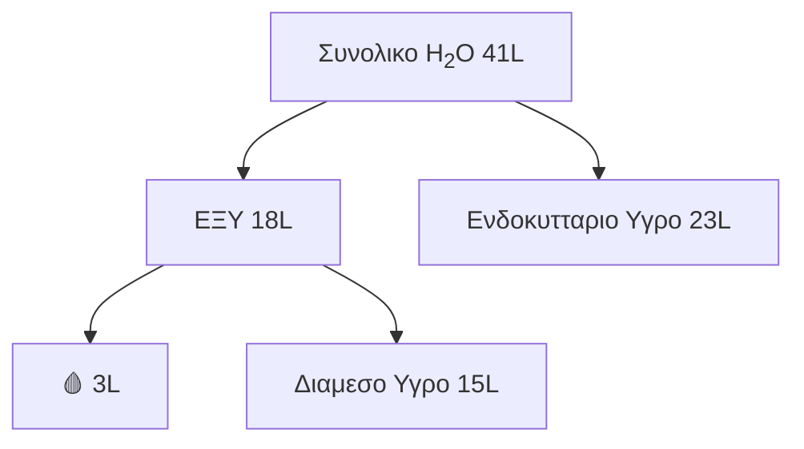
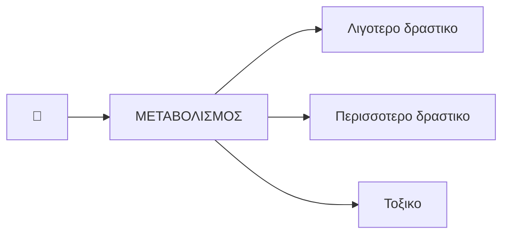
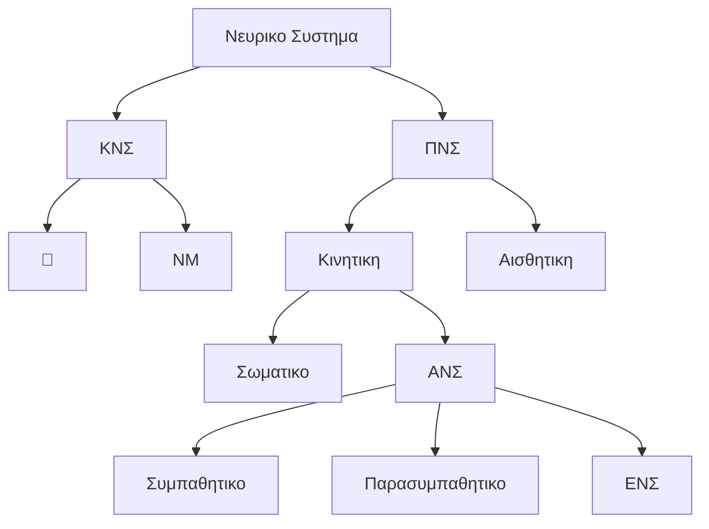

***

## SOS

🍵 = Φαρμακο     |     ☠️ = Δηλητηριο

🚦 = ΜΥ = Μοριο Υποδοχεας
	❁  Παντα **πρωτεϊνη**

🛜 = ΝΔ = Νευροδιαβιβαστης

[[Βιολογία Α#^aa0bf3]]

ACh = Ακετυλχολινη

ΛΔ = Λιπιδικη Διπλοστιβαδα

[[Φυσιολογία Α#^8cb632]]

Υδατοπορινες = Ακουαπορινες

Μη ιονισμενο = Μη πολικο

Περισσοτερα 🍵 ειναι **ασθενη οξεα ή βασεις**
	Ιονισμενη  ⇌  Μη ιονισμενη
	$\frac{\text{Ιονισμενη}}{\text{Μη Ιονισμενη}}$ εξαρταται απο:
		1)  pH
		2)  pKa

δυ = δεσμοι υδρογονου

CSF = Παραγοντες διεγερσης αποικιων 

Μη πολικο = Υδροφοβο = Λιποφιλο  |  Πολικο = Υδροφιλο 

[[Βιολογία Β#^835ddd]]

🏕️ = Περιβαλλοντικοι παραγοντες

ΝΕ = Νορεπινεφρινη  |  AD = Επινεφρινη

⌚️ = Διαρκεια δρασης 🍵

🫢 = Ανεπιθυμητες ενεργειες

ΗΤΝ = Υπερταση

5-HT = Σεροτονινη

Angina = Στηθαγχη

NGF = Νευρικος Αυξητικος Παραγοντας

Μεθαιμοσφαιρινη -> Hb με Fe+3 αντι για Fe+2
	}-  Μη λειτουργικη

Αιμωδια -> Μουδιασμα  |  Θαμβος ~> Βλεπω θαμπα  |  Εμβοες -> Βουητο

Σταγδην = Συνεχεια     |     Εφ'απαξ (Bolus) = Μια φορα 

Ανακατανομη (Redistribution) -> Μετακινηση 🍵 απο 🕸️ - στοχο σε αλλους, λιγωτερο αιμτωμενους 🕸️
	☆  Ετσι, μειωνεται η δραση του
	Αυτο εξηγει γιατι η διαρκεια δρασης μερικων 🍵 ειναι πολυ μικροτερη απο το t1/2 τους
	➤  Λιποφιλα 🍵
		‣  `🍵 {Αναισθητικα}`
		‣  `🍵 {Υπνωτικα}`

Ενισχυση (Potentiation) -> Δραση 🍵 ενισχυεται απο δραση αλλου 🍵, που δεν εχει ιδια επιδραση
	▫︎  L-DOPA + `🍵 Καρβιντοπα`
	▫︎  🥃 + `🍵 {BDZs}`
≠
Συνεργεια (Synergism) -> Δυο 🍵 με παρομοια δραση συνδυαζονται για μεγαλυτερο αποτελεσμα
	✫  Δραση ειναι μεγαλυτερη απο το αθροισμα της δρασης τους ξεχωριστα

iGPCR = Gi

t1/2 = Χρονος ημιζωης

Ανοχη (Tolerance) -> Μειωση αποτελεσματικοτητας 🍵 μετα απο επαναλαμβανομενη ληψη

OD = Υπερδοσολογια

Insomnia = Αϋπνια  |  Diaphoresis = Εφιδρωση

🩹 = Tx = Θεραπεια

Καταβολη = Κοπωση

Επιπεδο Συναισθημα ~> Μειωμενη συναισθηματικη εκφραση

ANC = Απολυτος αριθμος Ουδετεροφιλων

🩻 = Απεικονιστικη μεθοδος

ΜΣΑΦ = NSAIDs

Προστανοειδη = Προσταγλαδινες (PGs) + Θρομβοξανες (TXs) + Προστακυκλινες (PGIs)

Θεραπευτικος Δεικτης (TI)
	TI = $\frac{TD50}{ED50}$          ==〘1〙==
		$TD50$ ~> Δοση 🍵 που προκαλει τοξικοτητα στο 50% του πληθυσμου
		$ED50$ ~> Δοση 🍵 που ειναι θεραπευτικη για το 50% του πληθυσμου

ECF = Ηωσινοφιλος Χημειοτακτικος Παραγοντας

PLC = Φωσφολιπαση C

Μυασθενεια Gravis
	🗝️  Ig εναντιον `🚦 Ν`
		✗  Κινητικη πλακα
	🩺
		-  Μυικη αδυναμια
		-  Πτωση ~> Πτωση βλεφαρου
		-  Διπλωπια
		-  Δυσκαταποσια 

Υπερθερμια = Ατροπινικος 🤒

Στερηση = Withdrawal   |   Ανοχη = Tolerance

**Γλαυκωμα (↑ Ενδοφθαλμια P)**
	○  Ανοικτης Γωνιας ~> Χρονιο νοσημα 
		🩹  🍵
	○  Κλειστης (Στενης) Γωνιας ~> Πολυ οξυ νοσημα
		💉  Χειρουργειο
		💯  Σπανιο

***
## 1ο ΜΑΘΗΜΑ ~ { ΑΡΧΕΣ ΦΑΡΜΑΚΟΛΟΓΙΑΣ }

――
##### ΟΡΙΣΜΟΙ ΦΑΡΜΑΚΟΛΟΓΙΑΣ

Φαρμακολογια -> Η επιστημη που μελετα ουσιες που προκαλουν λειτουργικες μεταβολες στα κυτταρα και οργανισμους
	-  🍵
	-  ☠️
	-  Πειραματικες ουσιες

Φαρμακοδυναμικη -> Δραση 🍵 σε οργανισμο, ανεξαρτητα απο θεραπευτικες ιδιοτητες ^b6e203

Φαρμακοθεραπευτικη -> Εξεταση ουσιων χρησιμες για αντιμετωπιση νοσων

Τοξικολογια -> Επιστημη ☠️ και μεσων που τα εξουδετερωνουν

Φαρμακογνωσια -> Χαρακτηριστικα ουσιων και 🪴 απο τα οποια προερχονται

🍵 -> Καθε ουσια που εμφανιζεται να εχει θεραπευτικες ή προφυλακτικες ιδιοτητες για ασθενειες 🙎‍♂️ ή βοηθουν στο να γινει ιατρικη διαγνωση

Δραστικη Ουσια -> Καθε ουσια ή μειγμα ουσιων που προοριζεται να χρησιμοποιηθει στην παραγωγη ενος 🍵 και που, οταν χρησιμοποιειται, **γινεται ενεργο συστατικο** του εν λογω προϊοντος που προοριζεται να ασκησει φαρμακολογικη, ανοσολογικη ή μεταβολικη δραση 

☠️ -> Ουσια (φυσικη ή τεχνητη) που με εισαγωγη σε οργανισμο βλαπτει ή σκοτωνει

✤  Το αν μια ουσια θα ειναι δηλητηριωδης εχει σχεση και με τη δοσολογια

🍵  Φτανουν στα οργανα μεσω του 🩸 (συνηθως 🔵)

――
##### ΤΑΞΙΝΟΜΗΣΗ 🍵

4 Μεθοδοι

1)  **Χημικη** 
	‣  Σε ποια χημικη ομαδα ανηκουν
	Πχ αλκαλοειδη

2)  **Φαρμακολογικη**
	‣  Ποια ειναι η φαρμακολογικη τους δραση
	Πχ αναλγητικα, σπασμολυτικα, αντιμικροβιακα, αναισθητικα 

3)  **Θεραπευτικη**
	‣  Ποια ειναι η θεραπευτικη τους δραση
	Πχ αντικαταθλιπτικα, ανθελονοσιακα

4)  **Συνθετη**
	‣  Απο τη παθηση του λειτουργικου συστηματος ή οργανου
	Πχ αντισηπτικα, αντιχολινεργικα, καθαρτικα, αποχρεμπτικα, βλεννολυτικα

-  **Δευτερευοντως**
	‣  Απο το μορφη διαθεσης τους 
	Πχ δισκια, σκονη, ταμπλετες, σταγονες, υποθετα, ενεσιμα, οροι, εμβολια

――
##### ΜΟΡΦΕΣ ΙΔΙΟΣΚΕΥΑΣΜΑΤΩΝ

Ιδιοσκευασμα -> Παρασκευασμενο 🍵 που τιθεται στην κυκλοφορια υπο ειδικη ονομασια (εμπορικη) και σε ειδικη συσκευασια

1.  **Δισκια**

2.  **Καταποτια**

3.  **Υπογλωσσια δισκια**

4.  **Σακχαροπηκτα**

5.  **Τροχισκοι**

6.  **Καψουλες**

7.  **Διαλυματα**

8.  **Εναιωρηματα**

9.  **Σιροπια**

10.  **Αεροζολ**

11.  **Ενεσιμα διαλυματα**
	☛  Ενδοδερμικα (ID)
		✕  Δερμιδα
	☛  Υποδορια (SV)
		✕  Υποδοριος ιστος
	☛  Ενδομυικα (IM)
	☛  Ενδοφλεβια (IV)
	☛  Αυτοκολλητα
		Πχ αντιστηθαγχικα, ανδρογονα, οιστρογονα

12.  **Υποθετα**
	✕  Ορθο
	✕  Κολεος</FONTCOLOR>
	✕  Ουρηθρα

Αποτελουνται απο:
	-  Δραστικη Ουσια ~> Ουσια με φαρμακολογικη δραση
	-  Εκδοχο ~> Προσθετες ουσιες χωρις φαρμακολογικη δραση

――
##### ΤΡΟΠΟΙ ΧΟΡΗΓΗΣΗΣ 🍵

1.  Δερμα
	-  Επιδερμικα
	-  Υποδερμικα
	Πχ αλοιφες, κρεμες, εμπλαστρα, επιπαστικα διαλυματα, σκονες, λοσιον, εμβολια

2.  Βλεννογονοι (ΓΕΣ)
	✕  👄 (per os, PO)
		Πχ δισκια, καταποτια, τροχισκοι, σακχαροπηκτα, καψουλες, σκονες, διαλυματα, εναιωρηματα, γαλακτωματα, υπογλωσσια δισκια
		✪  Η πιο ευκολη οδος (❌ τραυματισμος ιστου)
		😐  Περνουν απο Ηπαρ (μερος τους μεταβολιζεται)
			-  Αποφευγεται μονο σε υπογλωσσια ή απο βλεννογονο 👄 { ΑΚΦ</fontcolor> ~> 🫀 }
				Πχ `🍵 Νιτρογλυκερινη` 
	✕  Ορθο (per rectum, PR)
		Πχ υποθετα, διαλυματα
	✕  👃- 🫁
		Πχ σιαλυματα, σκονες, αλοιφες
	✕  👁️
		Πχ αλοιφες, διαλυματα, εναιωρηματα, μειγματα, κολλυρια

3.  Ιστοι
	✦  IM
	✦  SC
	✦  ID
	✦  IV
	✦  Ενδαρτηριακα
	✦  Ενδορραχιαια
	✦  Ενδοαρθρικα
	✦  Περινευρικα
	✦  Ενδογαγγλιακα

――
##### ΓΕΝΙΚΕΣ ΠΛΗΡΟΦΟΡΙΕΣ

🏎️
	IV > ..... > SC
	Υπογλωσσια > per os

Πηλικο απορροφητικοτητας = $\frac{\text{Ποσο απορροφουμενου 🍵}}{\text{Ποσο βλεννογονου ΓΕΣ}}$           ==〘2〙==  

Διεισδυτικοτητα 🍵 γινεται απο **αιματο-ιστικο φραγμο**
	Αιματο-ιστικος φραγμος = Ενδοθηλιο + ΒΜ

Ιδιαιτεροι αιματο-ιστικοι φραγμοι
	}-  Πλακουντιακος φραγμος
	}-  Χοριοεγκεφαλικος φραγμος 
	κλπ

Διεισδυτικοτητα 🕸️ διαφερει αναλογα με τις ιδιοτητες των 💈 τους

⁍  Τα 🍵 δρουν σαν αγωνιστες ή ανταγωνιστες
	[[Φυσιολογία Α#^3c37f8]]
	[[Φυσιολογία Α#^7335a1]]

⁍  Μπορουν επισης να επηρεαζουν τα μεταφορικα συστηματα των μεμβρανων

⁍  Ή μπορει να επηρεαζουν **ενδοκυτταριες** μεταβολικες διεργασιες

❊  Για να απορροφηθουν, τα 🍵 πρεπει
	-  Ή να διερχονται απο κυτταρικη μεμβρανη (λιποφιλα)
	-  Ή να υποκεινται σε ειδικο μηχανισμο μεταφορας

Παχος κυτταρικης μεμβρανης: ≅ 75 Α°

Περιφερικες πρωτεϊνες ~> Πρωτεϊνες που μπορουν να απομακρυνθουν απο κυτταρικη μεμβρανη (με ηπιες βιοχημικες διαδικασιες)

Συνυφασμενες πρωτεϊνες ~> Πρωτεϊνες που ειναι δυσκολο να απομακρυνθουν απο πλασματικη μεμβρανη

✰  Σε κυτταρικη μεμβρανη, (1 πρωτεινη : 50 ΦΛ), αλλα τελικα στις μαζες: 50% - 50%
	-  Επειδη οι πρωτεϊνες ειναι μεγαλομοριακες ενωσεις

Τα γειτονικα κυτταρα εχουν 3 ειδη επικοινωνιας:
	[[Ιστολογία Α#Διακυτταρικες Συνδεσεις]]
	✧  Στις χασματοσυνδεσεις, υπαρχει κενο 2 nm
	✧  Στα δεσμοσωματα, υπαρχει κενο 15-35 nm
	﹆  Οσο μεγαλυτερη η αποσταση, τοσο πιο ευκολη η διαβατοτητα ιοντων
	❏  Οι τυποι αυτοι επικοινωνιας λειπουν σε συσσωρευση 🦀 κυτταρων

Ο ΜΥ ειναι:
	-  **Διαμεμβρανικος**
	-  **Ενδοκυτταριος**
		✕  Κυτταροπλασμα, πυρηνας
		▹  Τον συνανταμε σε υδροφοβες ουσιες (πχ στεροειδεις, θυρεοειδικες)
		🗝️
			1.  Συμπλεγμα ΜΥ & ουσιας φτανει σε πυρηνα
			2.  Διεγειρει 🧬
			3.  Παραγει RNA
			4.  De Novo συνθεση πρωτεϊνων

Θεσεις Διαμεμβρανικου ΜΥ
	1)  Αναγνωριστικη
		-  Αναγνωριζει την ερχομενη ουσια
	2)  Καταλυτικη
		-  Υφισταται αλλαγη δομης και ενεργοποιει:
			1.  Διαυλο ιοντων **(1ης ταξης ΜΥ)**
				Πχ νικοτινικος υποδοχεας ACh
			2.  G-πρωτεϊνη **(2ης ταξης ΜΥ)**
	[[Βιολογία Α#^f43c28]]

Διαμεμβρανικοι ΜΥ
	1.
		![[Στιγμιότυπο οθόνης 2024-10-01, 13.29.15.pdf]]
	2.
		![[Στιγμιότυπο οθόνης 2024-10-01, 13.30.04.pdf]]
	3.
		![[Στιγμιότυπο οθόνης 2024-10-01, 13.30.58.pdf]]

―
###### Αιματεγκεφαλικος Φραγμος

Ειδικος τυπος αιματο-ιστικου φραγμου

▪︎  Ενδοθηλιο **δεν εχει** πορους

◉  🍵 για να διελθουν πρεπει να **διαχυθουν** ενδοκυτταρια

🍵 εχουν ιδιαιτερες φυσικοχημικες ιδιοτητες ή χρειαζονται παρουσια και δραση ειδικου συστηματος μεταφορας

***
## 2ο ΜΑΘΗΜΑ ~ { ΑΠΟΡΡΟΦΗΣΗ, ΚΑΤΑΝΟΜΗ & ΑΠΟΜΑΚΡΥΝΣΗ 🍵}

――――
#### ΑΠΟΡΡΟΦΗΣΗ 🍵

❋  Συνηθως, 🍵 δεν εχουν αμεση εφαρμογη

✯  Χορηγουνται εντος ενος διαμερισματος και μεταφερονται σε δραση

Ρυθμιζονται:
	-  Ταχυτητα εναρξης
	-  Ενταση θεραπευτικου αποτελεσματος
	-  Διαρκεια δρασης

Μαζικη μεταφορα ~> 🩸, λεμφος, ΕΝΥ

Διαχυση ~> Κοντινες αποστασεις
	Λιποδιαλυτοτητα ~> Διαπεραση υδροφοβων φραγμων διαχυσης
	Υδατικη διαχυση ~> Μεταφορα προς-απο μη υδροφιλους φραγμους

Οξινοποιηση (Οξινιση) Ουρων -> Διαδικασια μεσω της οποιας:
	-  **Επιταχυνεται** απεκκριση ασθενων **βασεων**
		`🍵 {Οπιοειδη}`  |  `🍵 {Αμφεταμινες}`  |  `🍵 {BDZs}`
	-  Επιβραδυνεται απεκκριση ασθενων οξεων
	💉  NH4Cl ^1e3866

Αλκαλοποιηση Ουρων ~> Διαδικασια μεσω της οποιας
	-  **Επιταχυνεται** απεκκριση ασθενων **οξεων**
		`🍵 {Βαρβιτουρικα}`   |  `🍵 Φαινυτοϊνη`  |  `🍵 {NSAIDs}`
	-  Επιβραδυνεται απεκκριση ασθενων βασεων
	💉  NaHCO3- ^964db8

――
##### ΚΙΝΗΣΗ 🍵 ΜΕΣΩ ΚΥΤΤΑΡΙΚΩΝ ΦΡΑΓΜΩΝ

✶  Το αγγειακο ενδοθηλιο διαθετει ενα **πλεγμα πρωτεινων**
	**Χαλαρο** | ↑ MW κατακρατουνται | ↓ MW περνουν
	**Συμπαγες** | Βλαβερα δεν διαχεονται απο 🩸 προς οργανα

Τροποι διαπερασης:
	1.  Διαχυση υδατοπορινων
	2.  Πινοκυτταρωση
	3.  Αμεση διαχυση
	4.  Συνδεση σε μεταφορεα

―
###### Διαχυση Υδατοπορινων

**Υδατοπορινες**  |  Γλυκοπρωτεινες  |  Στη μεμβρανη  |  🛑  HgX

Σημαντικη για μεταφορα **αεριων**

↓ Δ

Σε 👳‍♀️ με 🧬 ασθενειες που επηρεαζουν υδατοπορινες, οχι ιδιαιτερα διαταραγμενη κατανομη 🍵

―
###### Πινοκυτταρωση

Εγκολπωση κυτταρικης μεμβρανης

✣  Παγιδευση κυστιδιου μεσα στο κυτταρο 

✯  Απελευθερωση στο κυτταρο ή εξωκυτταρωση

・ ins - Αιματοεγκεφαλικος φραγμος

―
###### Αμεση (Παθητικη) Διαχυση

[[Φυσιολογία Α#^55ea8c]] 

◘  Κινητηρια F η ΔC

⦿  Μεσω ΛΔ

**Μη πολικες ενωσεις**

Σταθερα διαχυσης (D) διαφερει ελαχιστα στα 🍵
	[[Φυσιολογία Β#Ανταλλαγη O2-CO2]]

―
###### Συνδεση σε Μεταφορεα

Μεταφορεις
	-  Διαλυτων Ουσιων (**SLC**)
		1.  Οργανικων κατιοντων (**OCT**)
		2.  Οργανικων ανιοντων (**OAT**)
		⁍  Παθητικα
	-  Δεσμευμενων με ATP (**ABC**)
		・ P-γλυκοπρωτεϊνες (**P-gp**)
		⁍  Ενεργητικα

✗  Σωληναριο</FONTCOLOR> </FONTCOLOR>, BBB, ⭕️ ΓΕΣ

☆  Πολυφαρμακευτικη αντοχη 🦀

Πχ
	L-DOPA
		﹆  Αντιπαρκινσονικο
	`🍵 Φθοριοουρακιλη`
		﹆  Νευροτοξικο

――
##### ΜΕΜΒΡΑΝΙΚΗ ΔΙΑΠΕΡΑΤΟΤΗΤΑ

**Μη ιονισμενη** μορφη 🍵 διαχεεται μεσω ΛΔ

Οταν ουσια ειναι κατα 50% ιονισμενη: pH = pKa 

pH = pKa + log$\frac{A^-}{HA}$           ==〘3〙== 

pH < pKa  =>  **Πρωτονιωμενες** μορφες (HA & BH+)

pH > pKa  =>  **Μη πρωτονιωμενες** μορφες (A- & B)

――
##### ΒΙΟΔΙΑΘΕΣΙΜΟΤΗΤΑ (F)

Το κλασμα του χορηγουμενου 🍵 που φτανει αναλλοιωτο στη συστηματικη κυκλοφορια

Οταν 🍵 χορηγειται **IV** ~> F = 100% 

![[Στιγμιότυπο οθόνης 2024-10-14, 17.51.00.pdf]]

F = $\frac{AUC_{oral}}{AUC_{IV}}$ * 100           ==〘4〙== 
	$AUC_{oral}$ ~> Εμβαδον κατω απο καμπυλη σε 🍵 PO
	$AUC_{IV}$ ~> Εμβαδον κατω απο καμπυλη σε  🍵 IV

Αναφερεται σε ρυθμο, ενταση και % που δραστικο συστατικο χρειαζεται να μπει στη συστηματικη κυκλοφορια ή να φτασει στο σημειο δρασης

Βιοϊσοδυναμια -> Συγκριση δυο ιδιοσκευασματων που εχουν ιδια δραστικη ουσια
	≅  F
	≅  Δt για μεγιστη C στο 🩸

Θεραπευτικη Ισοδυναμια -> Παρομοια 🍵 εμφανιζουν συγκρισιμη αποτελεσματικοτητα & ασφαλεια

―
###### Παραγοντεσ που επηρεαζουν F

1)  **Ηπατικος μεταβολισμος**
	‣   `🍵 Προπρανολολη`: Βιομετατροπη στο Ηπαρ</FONTCOLOR>

2)  **Διαλυτοτητα**
	‣  Λιποφιλικοτητα 🟢 διελευση απο ΛΔ
	‣  Υδροφιλικοτητα 🟢 διαλυση σε 💧

3)  **Χημικη σταθεροτητα**
	‣  `🍵 Πενικιλλινη G`: Ασταθης σε pHΣτομαχου
		-  IM χορηγηση

4)  **Φαρμακοτεχνικη μορφη (σκευασμα)**
	-  Μεγεθος σωματιδιων
	-  Μορφη αλατος
	-  Κρυσταλλικος πολυμορφισμος
	-  Εκδοχα

――――
#### ΚΑΤΑΝΟΜΗ 🍵

Σημαντικο ρολο:
	◇  Προσδεση σε πρωτεϊνες 🩸
		✦  Λευκωματινη
			-  Οξινα 🍵 (`🍵 Βαρφαρινη`)
			-  Βασικα 🍵 (`🍵 Χλωροπρομαζινη`)
			✯  *Συναγωνισμος* (χορηγηση 🍵, μπορει να ↑ C σε 🩸αλλου 🍵)
		✦  β-σφαιρινη
		✦  Οξινη γλυκοπρωτεϊνη
		[[Ιστολογία Α#ΣΥΝΘΕΣΗ ΠΛΑΣΜΑΤΟΣ]]
	◇  Καταμερισμος στο σωματικο λιπος (κ.α)
		 Μεγαλο  |  Μη πολικο
		 Λιγα 🍵 (υψηλη λιποδιαλυτοτητα)
			 `🍵 Μορφινη`
			 `🍵 Θειοπενταλη`
		▷  Χαμηλη BF (🍵 φτανουν αργα)

Κατανομη εξαρταται απο:
	❖  **BF**
		↑↑  Ηπαρ</FONTCOLOR>, Νεφροι</FONTCOLOR>, 🧠  |  ↑  💪🏻  |  ↓  Λιπωδης 🕸️
	❖  **Διαπερατοτητα 💈**
		[[Ιστολογία Α#Κατηγοριες 💈]]
	❖  **Δεσμευση 🍵 με πρωτεϊνες 🩸**
		▫︎  Κατηγορια Ι tbc
	❖  **Δεσμευση 🍵 σε 🕸️**
	❖  **Δομη 🍵 (υδροφοβικοτητα, διαλυτοτητα)**

| Οδος Χορηγησης | Δt εως εναρξη δρασης |
| -------------- | -------------------- |
| IV             | 30-60 sec            |
| Εισπνεομενα    | 2-3 min              |
| Υπογλωσσια     | 3-5 min              |
| IM             | 10-20 min            |
| SC             | 15-30 min            |
| PR             | 5-30 min             |
| PO             | 30-90 min            |
| ID             | hrs                  |

――
##### ΟΓΚΟΣ ΚΑΤΑΝΟΜΗΣ 

 V 💧 που απαιτειται για να βρισκεται σε αυτο η συνολικη ποσοτητα 🍵 στο σωμα στην ιδια C με αυτην που βρισκεται στο 🩸

$V_{d}$ = $\frac{Q}{C_{p}}$           ==〘5〙==  
	$V_{d}$ ~> V 💧
	$Q$ ~> Ποσοτητα 🍵
	$C_{p}$ ~> Συγκεντρωση 🍵 στο 🩸

Υπολογιζει σε ποιες περιοχες του σωματος (🩸, 🕸️) το 🍵 "ταξιδευει" αφου το παρουμε

Αν:  $V_{d}$ ↓ (πχ 5 L)  =>  Τοτε 🍵 παραμενει κυριως στο 🩸
	‣  `🍵 Ηπαρινη`
		🗝️  Αντιθρομβωτικο

Αν:  $V_{d}$ ↑ (πχ 500 L)  =>  Τοτε 🍵 αποθηκευεται σε 🕸️ (λιπωδη, 💪🏻)

――――
##### ΑΠΕΚΚΡΙΣΗ 🍵

Κυριως:
	➣  Νεφροι</FONTCOLOR>
	➣  Ηπαρ</FONTCOLOR> (μεσω χολης</FONTCOLOR>)

Δευτερευοντως:
	➣  🫁
	➣  💩
	➣  🍼
	➣  😭
	➣  Σιελος
	➣  🥵
	➣  Εκκρισεις 👃

――
##### ΝΕΦΡΙΚΗ ΑΠΕΚΚΡΙΣΗ

Εξαρταται απο:

1.  **Σπειραματικη Διηθηση**
	✢  Διηθειται μονο το αδεσμευτο 🍵
	✷  Ρυθμος απεκκρισης ειναι γραμμικη συναρτηση C 🍵 στο 🩸
	❀  Διοδος δεν επηρεαζεται απο λιποδιαλυτοτητα & pH

2.  **Σωληναριακη Απεκκριση**
	Εγγυς σωληναριο</FONTCOLOR>:
		1)  OAT
		2)  OCT
	✷  Ρυθμος απεκκρισης **δεν** ειναι γραμμικη συναρτηση C 🍵 στο 🩸
		-  **Κορεσμος** μεταφορεων
	❀  Δεν υπαρχει στα 👶🏻
	‣  `🍵 Πενικιλλινη` δεν διηθειται εντονα, αλλα απεκκρινεται πληρως
	🏎️  ↑↑

3.  **Σωληναριακη Επαναρροφηση**
	✢  Επαναρροφαται μονο το μη πολικο 🍵

―
###### Παγιδευση Ιοντος

Σκοπος Μεταβολισμου: Δημιουργια ιονισμενων 🍵 που απεκκρινονται
	"ΠΑΓΙΔΕΥΣΗ ΙΟΝΤΟΣ"

Για να ελαχιστοποιησουμε επαναρροφηση, ↑ ιονισμενη μορφη 🍵

[[#^964db8]]
	□  Γινεται με HCO3-
	Αποβολη **οξινων** 🍵

[[#^1e3866]]
	□  Γινεται με NH4Cl
	Αποβολη **βασικων** 🍵

―
###### Τροποποιημενη Νεφρικη Λειτουργια

Ελαττωμενη σε:
	-  👶🏻
	-  👴🏼
	-  `👳‍♀️ Νεφρικη Ανεπαρκεια`

Εδω πρεπει να γνωριζουμε μεγεθος νεφρικης λειτουργιας
	Πως; Με καθαρση κρεατινινης

[[Φυσιολογία Β#^463e56]]  |  [[Φυσιολογία Β#^62324c]]
[[Φυσιολογία Β#^4e62ac]]

[[Φυσιολογία Β#ΝΕΦΡΙΚΗ ΚΑΘΑΡΣΗ]]

――――
#### ΧΟΡΗΓΗΣΗ 🍵

――
##### ΑΠΟ ΣΤΟΜΑ (PO)

Συνηθεστερη

Ελαχιστη απορροφηση μεχρι ΛΕ

Απορροφαται **μη ιονισμενη** μορφη (ιονισμος-λιποδιαλυτοτητα)

Επηρεαζει την απορροφηση
	☐  Σπλαχνικη ροη 🩸 (🍔 ↑, 🫀 ανεπαρκεια (shock) ↓)
	☐  Κινητικοτητα ΓΕΣ (Σταση ↓)
	☐  Συνολικη απορροφητικη επιφανεια
	☐  Χρονος επαφης με επιφανεια απορροφησης (διαρροια ↓)
	☐  C 🍵 στον τοπο απορροφησης
	☐  Μεγεθος σωματιδιων

――
##### ΑΠΟ ΟΡΘΟ (ΥΠΟΘΕΤΟ)

Δρουν τοπικα ή συστηματικα

Ελαχιστοποειται ή βιομετατροπη (50% 🔵 παρακαμπτει Πυλαια</fontcolor>)
	[[Τοπογραφική Β#ΠΡΩΚΤΟΣ]]

Ενδυκνειται οταν
	-  👳‍♀️ δεν ειναι συνεργασιμος (αναισθητος κλπ)
	-  👳‍♀️ κανει 🤮
	-  🍵 εχει ασχημη οσμη & γευση
	-  γαστρικα ή εντερικα υγρα αλλιοιωνουν φαρμακευτικη ουσια

👍
	-  Ευκολη χορηγηση
	-  Ανωδυνη χορηγηση
	-  Αποφυγη μεταβολισμου πρωτης διοδου κατα 50%

👎
	-  Μη σταθερη απορροφηση
	-  Τοπικοι ερεθισμοι

――
##### ΠΑΡΕΝΤΕΡΙΚΗ ΧΟΡΗΓΗΣΗ

💉
	-  Υποδορια (SC)
	-  Ενδομυϊκη (IM)
	-  Ενδοφλεβια (IV)
	-  Ενδοωοθηκικη (intrathecal)
	-  Ενδοϋαλωδης (intravitreal)

Ενδυκνειται οταν
	-  Καταστρεφονται φαρμακα απο ΓΕΣ (πχ `🍵 ins`)
	-  Γινεται μεταβολισμος πρωτης διοδου
	-  👳‍♀️ εχει απωλεια συνειδησης (κωμα)
	-  Επιθυμειται ταχεια εναρξη αποτελεσματος
	-  👳‍♀️ κανει 🤮

👎
	-  Πιθανη 🥁 απο 🐲
	-  Αιμολυση
	-  Ανεπιθυμητες ενεργειες απο υπερβολικα ταχεια μεταφορα
	-  Απορροφηση δεν μπορει να διακοπει με χορηγηση ενεργου ανθρακα ή προκληση 🤮 (ανεπαρκης χρονος αντιδρασης)
	-  Μονο σε υδατοδιαλυτα 🍵

―
###### Ενδομυϊκη Χορηγηση

Λιποφιλικοτητα 🍵  |  Απλη διαχυση  |  Γρηγορη απορροφηση 

Αντενδεικνυται:
	-  Σε πτωση PLTs
	-  Σε νοσους με αυξημενη ταση για αιμορραγιες
	☒  Ευμεγεθη αιματωματα

👎
	-  😫
	-  Περιορισμενος ογκος ενεσης
	-  Τοπικος ερεθισμος, μολυνση

―
###### Υποδορια Χορηγηση

1.  Ειδικες καψουλες που εμφυτευονται (πχ οιστρογονα)
2.  Εμφυτευομενες μηχανικες αντλιες (πχ ins)

👍
	-  Ευκολη χορηγηση
	-  Παρατεταμενη δραση

👎
	-  Βραδυτερη απορροφηση απο αλλες 💉
	-  Χορηγηση 🍵 που δεν ερεθιζουν τοπικα

――
##### ΧΟΡΗΓΗΣΗ ΜΕ ΕΙΣΠΝΟΗ

Ταχεια απορροφηση (κυψελιδες)

🍵 που ειναι:
	-  αερια
	-  διεσπαρμενα σε αερολυμα

👳‍♀️: αναπνευστικα προβληματα

👎
	-  Μικρη ικανοτητα ρυθμισης δοσης
	-  Ορισμενα αερια & πηκτικα 🍵 προκαλουν **ερεθισμο αναπνευστικου ⭕️**

――
##### ΕΝΔΟΡΙΝΙΚΗ ΧΟΡΗΓΗΣΗ

Ευκολη χορηγηση 

👳‍♀️: δυσκολια καταποσης

Απορροφηση μεσω ρινικου βλεννογονου / 🫁

Μικρες δοσεις

――
##### ΕΝΔΟΡΑΧΙΑΙΑ/ΕΝΔΟΚΟΙΛΙΑΚΗ ΧΟΡΗΓΗΣΗ

Σπανια  |  Εξειδικευση  |  Στοχευμενη χορηγηση

Σε **οξεια λεμφοκυτταρικη λευχαιμια** ~> `🍵 Μεθοτρεξατη` σε ΕΝΥ

――
##### ΕΝΔΟ-ΟΣΤΙΚΗ ΧΟΡΗΓΗΣΗ

Σε επειγουσες καταστασεις  |  👦 < 6 ετων  |  Μη διαθεσιμη 🔵 οδος

Τοποθετειται καθετηρας εντος μυελικης κοιλοτητας
	🦴 Κνημης

Χρησιμοποειται **προσωρινα**

――
##### ΤΟΠΙΚΗ ΧΟΡΗΓΗΣΗ

1.  Κρεμες ή αλοιφες (πχ `🍵 Αντιμυκητισιακα`)
2.  Κολλυρια (πχ `🍵 Ατροπινη` ~> Διαστολη 👁️)

――
##### ΔΙΑΔΕΡΜΙΚΗ ΧΟΡΗΓΗΣΗ

Εμπλαστρα διαδερμικης απορροφησης

***
## 3ο ΜΑΘΗΜΑ ~ { ΦΑΡΜΑΚΟΔΥΝΑΜΙΚΗ }

[[#^b6e203]]
	Επιδραση, δηλαδη 🍵 σε οργανισμο (μοριο, κυτταρο, 🕸️)

Κυριες Ενεργειες ~> Ειναι επιθυμητες απο το 🍵

Δευτερευουσες Ενεργειες -> Ειναι επιθυμητες ή ανεπιθυμητες (παρενεργειες)

Σημειο Δρασης -> Μερος οργανισμου που αρχιζει η δραση ενος 🍵

Τελικη Φαρμακολογικη Ενεργεια -> $\sum{\text{Σημειων Δρασης}}$ 

✭  Τα 🍵 τροποποιουν ηδη υπαρχουσες ενδογενεις φυσιολογικες λειτουργιες
	☒  Δεν προσδιδουν νεα χαρακτηριστικα σε αυτες

――
##### ΜΥ

ΜΥ
	-  Επιφανεια κυτταρου
	-  Ενδοκυτταρια

Κατηγοριες ΜΥ ειναι:
	❖  **Πρωτεϊνες**
		-  Ορμονες
		-  Αυξητικοι Παραγοντες
		-  Νευροδιαβιβαστες
		-  Περιοριστικα 💨 μεταβολικων & ρυθμιστικων μονοπατιων
			Πχ `💨 Αναγωγαση διυδροφολικου οξεος`
		-  Πρωτεϊνες που εμπλεκονται σε διαδικασιες μεταφορας
			Πχ `💨 ATPαση`
		-  Δομικες πρωτεϊνες
			Πχ τουμπουλινη
	❖  **Νουκλεϊκα Οξεα**
		✣  Χρησιμοποιουνται για αντιμετωπιση:
			・ 🦠
			・ 🦀 κυτταρων
	❖  **Ενδογενη ρυθμιστικα μορια**
		-  Ορμονες
		-  Νευροδιαβιβαστες

▸  Βιολογικη απαντηση αναλογη με **# συμπλεγματων 🍵-ΜΥ**

[[Φυσιολογία Α#^3c37f8]]

Η ισχυς της δρασης του 🍵 εξαρταται απο:
	-  C 🍵 στην περιοχη του ΜΥ
	-  Δοση 🍵
	-  🏎️  Απορροφησης
	-  Κατανομη
	-  Μεταβολισμος

――
##### ΚΑΜΠΥΛΗ ΔΟΣΗΣ-ΑΠΟΤΕΛΕΣΜΑΤΟΣ

☑︎  Μεγιστο αποτελεσμα (Εmax): Καταληψη ολων των ΜΥ

Ισχυς -> Μετρο ποσοτητας 🍵 που χρειαζεται για να προκληθει μια συγκεκριμενη απαντηση

ED50 ή EC50 -> Δοση ή C που προκαλει το 50% του μεγιστου αποτελεσματος

↓ ED50  =>  ↑ Ισχυς 🍵

LD50 ή LC50 -> Δοση ή C που προκαλει ☠️ του 50% του πληθυσμου

TD50 ή TC50 -> Δοση ή C που προκαλει ανεπιθυμητες δρασεις στο 50% του πληθυσμου

Αποτελεσματικοτητα -> Μεγεθος αποκρισης που προκαλει 🍵 μετα την προσδεση
	Εξαρταται απο: 
		α)  # 🍵-ΜΥ
		β)  Ενδογενη δραστικοτητα φαρμακου
			Ικανοτητα ενεργοποιησης ΜΥ & προκλησης κυτταρικης αποκρισης

![[Στιγμιότυπο οθόνης 2024-10-16, 11.46.22.pdf]]

――
##### 🍵 - ΜΥ

Με οργανισμο ή πλυθυσμο σχετιζεται:
	・ Ισχυς
	・ Αποτελεσματικοτητα
	・ Θεραπευτικος δεικτης (TI)

Με ΜΥ σχετιζεται:
	・ Συγγενεια

Συγγενεια -> Δυναμη συνδεσης 🍵 στον ΜΥ

ΜΥ υπαρχουν σε μορφη:
	✧  **Ανενεργη (Υα)**
	✧  **Ενεργη (Υε)**
	❒  Ανεξαρτητα απο παρουσια 🍵

ΑΓΩΝΙΣΤΕΣ
	❖  **Πληρης Αγωνιστης** ~> Ισχυρη βιολογικη απαντηση
		↑ Συγγενεια (Υε)  |  ↑ Αποτελεσματικοτητα
	❖  **Μερικος Αγωνιστης** ~> Ασθενεστερη βιολογικη απαντηση
		↓ Συγγενεια (Υε)  |  ↓ Αποτελεσματικοτητα
		﹅  Σε παρουσια πληρους αγωνιστη, δρα σαν ανταγωνιστης
	❖  **Αντιστροφος Αγωνιστης** ~> Ελαττωνει φυσιολογικη δραστηριοτητα ΜΥ
		↑ Συγγενεια (Υα)  |  - Αποτελεσματικοτητα
		🗝️  Σταθεροποιει ΜΥ σε **μη λειτουργικη** κατασταση

ΑΝΤΑΓΩΝΙΣΤΕΣ
	❖  **Συναγωνιστικος Ανταγωνιστης**
		🎯  Ιδια θεση ΜΥ με τον αγωνιστη
		✔︎  Μετατοπιση καμπυλης δοσης-αποτελεσματος προς ΔΕ
		☒  Μεγιστο αποτελεσμα: Σταθερο
		✰  Μεγαλες δοσεις αγωνιστη μπορουν να εξουδετ. αποτελεσμα ανταγωνιστη
		♲  Αντιστρεπτη δραση
	❖  **Μη συναγωνιστικος Ανταγωνιστης**
		🎯  Διαφορετικη θεση ΜΥ σε σχεση με αγωνιστη
		☒  Μεγιστο αποτελεσμα: ↓
		✰  Μεγαλες δοσεις αγωνιστη δεν μπορουν να ξεπερασουν δραση τους
		♲  Μη Αντιστρεπτη δραση

―
###### Αλληλεπιδρασεις 🍵-ΜΥ

1.  **Ιοντικες**

2.  **Ομοιοπολικες**
	⏲️  Συνηθως εχει παρατεταμενη δραση

3.  **δυ**
	⁃  Υδροφιλες

4.  **Van der Wals** 
	⁃  Υδροφοβες

[[Βιολογία Α#^5ff59c]]
	Στην φαρμακολογια, καταλυτικη = θεση προσδεσης αγωνιστη
	ΑΡΑ
	Αλλοστερικος ΜΥ -> ΜΥ με επιπλεον θεσεις προσδεσης, εκτος του αγωνιστη και του συναγωνιστικου ανταγωνιστη
	Το μοριο που προσδενεται στην επιπλεον θεση του Αλλοστερικου ΜΥ ονομαζεται:
		Αλλοστερικος Ενισχυτης ~> Ενισχυει δραση αγωνιστη
		Αλλοστερικος Ανταγωνιστης ~> Αναστελλει δραση αγωνιστη

――
##### ΤΥΠΟΙ ΑΝΤΑΓΩΝΙΣΜΟΥ

Συνεργεια -> Παρομοια δραση 2 🍵
	Τελικο Αποτελεσμα ↑
≠
Ανταγωνισμος

1)  **Συναγωνιστικος (Φαρμακολογικος) Ανταγωνισμος**
	☑︎  Δραση μη συναγωνιστικου ανταγωνιστη

2)  **Χημικος Ανταγωνισμος**
	☑︎  Αντιδραση 🍵 με αλλο 🍵 στο σημειο εφαρμογης ή απορροφησης
	⏱️  Σπανιο

3)  **Φαρμακοκινητικος Ανταγωνισμος**
	☑︎  Ανταγωνιστης:
		-  Αυξανει ρυθμο μεταβολικης αποδομησης 🍵
		-  Μειωνει ρυθμο απορροφησης 🍵 απο ΓΕΣ
		-  Αυξανει ρυθμο νεφρικης απεκκρισης 🍵
	⏱️  Συχνο

4)  **Φυσιολογικος Ανταγωνισμος**
	☑︎  Δυο 🍵 με αντιθετες δρασεις εξουδετερωνουν το ενα το αλλο

5)  **Αποκλεισμος συνδεσης υποδοχεα/ενδογενους μεσολαβητη**

――
##### ΑΠΕΥΑΙΣΘΗΤΟΠΟΙΗΣΗ ΚΑΙ ΤΑΧΥΦΥΛΑΞΙΑ

Φαινομενο που επιδραση 🍵 **ελαττωνεται** οταν αυτο χορηγειται συνεχως

✦  Μεταβολη σε ΜΥ

✦  Εξαντληση ενδογενων διαμεσολαβητων

✦  Αυξημενη μεταβολικη αποδομηση 🍵

✦  Φυσιολογικη προσαρμογη

✦  Ενεργητικη αποβολη 🍵 απο τα κυτταρα

✦  Μετατοπιση ΜΥ (εσωτερικευση)

――
##### ΠΡΟΣΔΙΟΡΙΣΜΟΣ ΣΥΓΓΕΝΕΙΑΣ 🍵

―
###### Μελετες Δεσμευσης

➤  Χρηση ραδιοσημασμενων συνδετων (ligands) 
	Ειναι αγωνιστές ή ανταγωνιστές των ΜΥ

➤  Μελέτη της συγγένειας 🍵–MY

➤  Μελετη πυκνοτητας θεσεων δεσμευσης (Bmax) σε συγκεκριμενο ιστο ή δειγμα

[[Βιοχημεία Α#^85eebf]]

1.  Δεσμευση ραδιενεργου συνδετη στον ΜΥ
2.  Διαχωρισμος ΜΥ απο ελευθερο ραδιενεργο συνδετη
3.  Μετρηση ποσοτητας ραδιενεργου συνδετη που δεσμευτηκε στους ΜΥ
4.  Αναλυση αποτελεσματων

――
##### ΤΥΠΟΙ ΜΥ

1)  Τυπου 1 ~> Καναλια ιοντων ελεγχομενα απο προσδεμα
	📇 "**Ιονοτροπικοι**"

2)  Τυπου 2 ~> Υποδοχεις συζευγμενοι με G-πρωτεϊνες
	📇 **"GPCR"** ή **"Μεταβολοτροποι"**

3)  Τυπου 3 ~> Υποδοχεις συνδεδεμενοι με κινασες και αλλοι συγγενικοι υποδοχεις

4)  Τυπου 4 ~> Πυρηνικοι υποδοχεις

―
###### Τυπου 1

`🚦 N`, `🚦 GABA`, `🚦 NMDA`, `🚦 AMPA`, `🚦 KA`

✗  🟡, 🧠

⦿  Πενταμερες (2α, β, γ, δ)

☛  Καθε μονομερες: 4 διαμεμβρανικες α-ελικες
	[[Βιολογία Α#^d99b3d]]  |  [[Βιολογία Α#^1c4545]]

Προσδετες: `🛜 ACh`, `🛜 GABA`, `🛜 glu`, `🛜 IP3`

`🛜 ACh`
	・ 2 θεσεις δεσμευσης
	★  Μονο αν συνδεθουν και οι δυο, 🚦 ενεργοποιειται

✹  20 διαμεμβρανικες α-ελικες περιβαλλουν κεντρικο πορο

🗝️  Μετασυναπτικη μεμβρανη
	1.  Αυξανει διαπερατοτητα σε ιοντα (Na+, K+)
	2.  Παραγει ηλεκτρικο ρευμα
	3.  **Εκπολωνει** κυτταρο
	⏱️  **μs**

―
###### Τυπου 2

`🚦 M`, `🚦 α`, `🚦 β`  `🚦 D` , `🚦 5-ΗΤ`, `🚦 Η`, `🚦 Οπιοειδων`, 

`🚦 Πουρινων`, `🚦 Χημειοϋποδοχεων`, `🚦 "Ορφανοι"`

| Gs                                                                                                                           | Gi                                                                                                                                    | Gq                                                               |
| --------------------------------------------------------------------------------------------------------------------------------------- | ------------------------------------------------------------------------------------------------------------------------------------------------ | --------------------------------------------------------------------------- |
| 1.  🟢  `💨 AC` 2.  ↑ cAMP 3.  ↑ `💨 PKA`                                                                                         | 1.  🛑  `💨 AC` 2.  ↓  cAMP 3.  ↓  `💨 PKA`                                                                                                | 1.  PLC 2.  DAG 3.  PKC / IP3 4. **↑ Ca+2 ενδοκυτταρ |
| ・ `🛜 AD`, `🛜 NE`, `🛜 DA`,  `🛜 ACh`, `🛜 5-HT`,  Ισταμινη, ADH, FSH, LH, PTH, TSH, CRH,  \|MSH, GHRH, hCG,  Γλυκαγονη | ・ `🛜 AD`, `🛜 NE`, `🛜 DA`,  `🛜 ACh`, `🛜 5 ・Ισταμινη` `🛜 AD`, `🛜 NE`, `🛜 DA`, `🛜 5-HT`,  Ωκυτοκινη, Γαστρινη, GnRH, TRH, ADH H,  η, |                                                                             |

⦿  Πολυαριθμοι υποτυποι

☛  7 διαμεμβρανικες α-ελικες (1100 αα)
	Εξωκυτταρια ~> -NH2
	Ενδοκυτταρια ~> -COOH

🛜:  Νευροδιαβιβαστες, πεπτιδια

◘  3 οικογενειες
	-  Ροδοψινης
	-  Σεκρετινης/Γλυγακονης
	-  Γλουταμινικου/Αισθητηρα Ca2+

1 🚦 🟢 πολλες G πρωτεϊνες

`🚦 "Ορφανοι"`
	1. `🚦 PXR`
		⚙︎  Ρυθμιζουν εκφραση 🧬 `💨 CYP3`
		✗  Ηπαρ</FONTCOLOR>,</FONTCOLOR> ΓΕΣ
		🗝️  🟢  `💨 CYP3` οταν ανιχνευουν ξενοβιοτικες ουσιες
		🛜: Προγεστερονη, κορτικοστεροειδη, 💊
	2. `🚦 CAR`  
		⚙︎  Ρυθμιζουν εκφραση 🧬 `💨 CYP2B`, `💨 CYP2C`, `💨 CYP3A`
		✗  Ηπαρ</FONTCOLOR>,</FONTCOLOR> ΓΕΣ
	☣️  Προστατευουν απο τοξικοτητα 🍵

―
###### Τυπου 3

1)  `🚦 {RTKs}`
	・  `🚦 RTK`, `🚦 EGF`, `🚦 NGF`, `🚦 TLR`, `🚦 GLUT`
	Δραση: `💨 {Κινασων tyr}` 
	Προσδετες: **ins**, **EGF**, **IGF**, **FGF**, **TGF**
		🔠  "I'm **TYR**ed of your **INSUL**ts, **GROW** up!"
			**TYR**osine Kinase
			**INSUL**in
			**GROW**th factors
	Επαγωγεις: PLC, Ras

2)  `🚦 {Non RTKs}`
	・ `🚦 Κυτοκινων`, `🚦 IFΝ`, `🚦 CSF`
	Προσδετες: **GH**, **PRL**, **EPO**, **TPO**, Κυτοκινες (**G-CSF**, **IFN**, **IL-2**, **IL-6**)
		🔠  "**PIGG**L**ET**"
			**P**rolactin
			**I**nterleukins / IFN
			**G**rowth Hormone
			**G**-CSF
			**E**PO
			**T**PO
	♤  Μονοπατι JAK-STAT

3)  `🚦 TGF-β`
	Δραση: `💨 {Κινασων ser/thr} 

Συνδεδεμενοι με `💨 Κινασες` & συγγενεις 🚦

🗝️
	1.  Ρυθμιση διαιρεσης, αυξησης & διαφοροποιησης κυτταρων
	2.  Ρυθμιση φλεγμονης, ιστικης επιδιορθωσης, αποπτωσης
	3.  Ρυθμιση ανοσολογικων αποκκρισεων
	🟢 Ras/Raf/`💨 Πρωτεϊνικες Κινασες`  |  μεταγραφη 🧬

Κυτοκινη  ⇀  {ΑΥΤΟΦΩΣΦΟΡΥΛΙΩΣΗ}

―
###### Τυπου 4

✗  Κυτταροπλασμα
	Σε ενεργοποιηση, πανε στον **πυρηνα**

🗝️
	1.  Ενδοκρινης σηματοδοτηση
	2. Μεταβολικη πορεια λιπιδιων
	✦  Σχετιζονται με φλεγμονη, 🦀, ΚΑΝ, 🎅, αναπαραγωγικες διαταραχες

-H2N || AF-1 || Zn-fingers || AF-2 || COOH-

Zn-fingers ~> Ευθυνονται για **αναγνωριση & δεσμευση σε 🧬**

![[Στιγμιότυπο οθόνης 2024-10-18, 13.02.19.pdf]]

***
## 4ο ΜΑΘΗΜΑ ~ { ΦΑΡΜΑΚΟΚΙΝΗΤΙΚΗ }

Φαρμακοκινητικη -> Δραση οργανισμου σε 🍵

Εισαγωγη, Απελευθερωση, Απορροφηση, Κατανομη, Μεταβολισμος, Εκκριση

Υδροφιλα 🍵: Σε ολο το ΕΞΥ, αν δεν ειναι πολυ μεγαλα

Λιποφιλα 🍵: ΕΞΥ & Ενδοκυτταριο υγρο

| Κινητικη | 1ης ταξης   | 0ης Ταξης                                             |
| -------- | ----------- | ----------------------------------------------------- |
| Μειωση C | Εκθετικα    | Γραμμικα                                              |
| C - t    | ⎩           | ↘︎                                                    |
| 🍵       | Περισσοτερα | -  `🍵 Φαινυτοϊνη` -  `🍵 ASA` -  `🍵 Αιθανολη` |

[[#ΟΓΚΟΣ ΚΑΤΑΝΟΜΗΣ]]  

[[Φυσιολογία Β#ΝΕΦΡΙΚΗ ΚΑΘΑΡΣΗ]]

Καθαρση ($CL$) -> Ρυθμος απομακρυνσης 🍵 απο 🙎‍♂️ σε μοναδα Δt

$CL$ = $k$ * $V_{d}$           ==〘6〙==  
	 $k$ ~> Σταθερα ταχυτητας αποβολης 🍵
		 -  **% αποβολης 🍵**
	  $V_{d}$ ~> Ογκος Κατανομης

$CL$ = $CL_{ren}$ + $CL_{hep}$ + $CL_{other}$          ==〘7〙==  

Σταθερη Κατασταση ~> Οταν ο ρυθμος χορηγησης 🍵 ισουται με τον ρυθμο καθαρσης του (C σταθερο)
	✬  Σε κινητικη 1ης ταξης, 🍵 που χορηγειται με σταθερο ρυθμο παιρνει **4-5 t1/2** για να φτασει σταθερη κατασταση

***
## 5ο ΜΑΘΗΜΑ ~ { ΜΕΤΑΒΟΛΙΣΜΟΣ ΦΑΡΜΑΚΩΝ }

――――
#### ΜΕΤΑΒΟΛΙΣΜΟΣ 🍵

――
##### ΓΕΝΙΚΑ (ΜΕΤΑΒΟΛΙΣΜΟΣ 🍵)

🙎‍♂️  αντιλαμβανεται ξενοβιοτικες ουσιες
	Τεινει να τις αποβαλλει, **θεραπευτικες** & **επιβλαβεις**

🍵 μεταβολιζονται πριν αποβληθουν
	💯  Τα περισσοτερα

Μεταβολισμος -> Διεργασια μετατροπης 🍵 σε ουσια πιο **πολικη & υδατοδιαλυτη**

Προφαρμακο -> Αδρανες ή λιγο δραστικο 🍵

`💨 Κυτοχρωματα P450 (CYPs)`
	Υποστρωμα  ⇀  {ΥΔΡΟΞΥΛΙΩΣΗ}
		⁃  Σαν `💨 Μονοοξυγενασες`
	✗  Ηπαρ</FONTCOLOR>,</FONTCOLOR> ΓΕΣ ⍟ 
	▫︎  Περιεχουν αιμη (αιμοπρωτεϊνες)
	🗝️  Παιζουν ρολο στον **μεταβολισμο 🍵**
	7️⃣4️⃣
	**CYP1Α2** (11%), **CYP2C8/9** (16%), **CYP2D6** (19%) 
	**CYP3Α4/5** (36%)
	🧬  Εντονος πολυμορφισμος
	⭐︎  Διαφερουν ως προς:
		1.  Αλληλουχια αα
		2.  🟢 & 🛑
		3.  Υποστρωμα
		4.  Αντιδραση
	▲  Παραγοντες που επηρεαζουν δραση και επιπεδα:
		1.  🍔
		2.  🚬
		3.  🥃
		4.  🏕️
		5.  🧬 Πολυμορφισμοι
	`🍵 Φαινοβαρβιταλη`, `🍵 Ριφαμπινη`, `🍵 CBZ` 🟢 
	`🍵 Σιμετιδινη`, `💊 Ερυθρομυκινη`, `💊 Χλωραμφαινικολη`, `🍵 {TCAs}`, `🍵 Κομπισιστατη` 🛑
	^fcd4fb

⍟  Γι αυτο συχνα PO 🍵 εχουν χαμηλη βιοδιαθεσιμοτητα
	📇  "**Μεταβολισμος πρωτης διοδου**"
	Μεταβολισμος σε Στομαχο</fontcolor></FONTCOLOR> & Ηπαρ</FONTCOLOR></FONTCOLOR>
	‣  PO
	‣  PR
	‣  👃

| `💨 CYP` | 🕸️                                                                                                    |
| -------- | ------------------------------------------------------------------------------------------------------ |
| 1A1      | 🫁, Νεφρος</FONTCOLOR>,</FONTCOLOR> ΓΕΣ, δερμα, πλακουντας |
| 1Β1      | Δερμα, Νεφρος</FONTCOLOR>,</FONTCOLOR> Προστατης           |
| 2Α6      | 🫁, 👃                                                                                                 |
| 2B6      | ΓΕΣ, 🫁                                                                                                |
| 2C       | ΓΕΣ, 🫁, λαρυγγας                                                                                      |
| 2D6      | ΓΕΣ                                                                                                    |

| `💨 CYP`       | 🍵 (Υποστρωμα)                                                                                                                                            |
| -------------- | --------------------------------------------------------------------------------------------------------------------------------------------------------- |
| `💨 CYP 1A2`   | -  ☕️ (`🍵 Καφεϊνη`) -  `🍵 Παρακεταμολη` -  `🍵 Θεοφυλλινη`                                                                                        |
| `💨 CYP 2B6`   | -  `🍵 Κυκλοφωσφαμιδη` -  `🍵 Μεθαδονη`                                                                                                                |
| `💨 CYP 2C8`   | -  `🍵 Πακλιταξελη` -  `🍵 Ρεπαγλιδινη`                                                                                                                |
| `💨 CYP 2C9`   | -  `🍵 Φαινυτοϊνη` -  `🍵 Ιβουπροφαινη` -  `🍵 Τολβουταμιδη` -  `🍵 Βαρφαρινη`                                                                   |
| `💨 CYP 2C19`  | -  `🍵 Ομεπραζολη` -  `🍵 Φαινυτοϊνη`                                                                                                                  |
| `💨 CYP 2D6`   | -  `🍵 Δεσιπραμινη` -  `🍵 Ιμιπραμινη` -  `🍵 Αλοπεριδολη` -  `🍵 Προπρανολολη` -  `🍵 Κωδεϊνη` -  `🍵 Μετοπρολολη` -  `🍵 Δεβρισοκινη` |
| `💨 CYP 2E1`   | -  🥃 `🍵 Αλκοολη` -  `🍵 Παρακεταμολη`                                                                                                                |
| `💨 CYP 3A4/5` | -  `🍵 CBZ` -  `🍵 Κυκλοσπορινη` -  `🍵 Νιφεδιπινη` -  `🍵 Σιμβαστατινη` -  `🍵 Ινδιναβιρη (IDV)` -  `💊 Ερυθρομυκινη`                     |

Μεταβολισμος διακρινεται στις φασεις:
	-  **Φαση 1**
	-  **Φαση 2**

――
##### ΦΑΣΗ 1

✗  Ηπαρ</FONTCOLOR>

Μη πολικο</FONTCOLOR> 🍵  =>  Πολικο 🍵

🗝️  Εισαγουν ή αποκαλυπτουν πολικη ομαδα (-OH, -NH2)

`💨 CYPs` & `💨 Αναγωγαση NADPH-P450 (Φλαβοπρωτεϊνη)`
	DH + O2 + NADPH + H+  ⇀  D-OH + H2O + NADP+

{ΟΞΕΙΔΩΣΗ}, {ΑΝΑΓΩΓΗ}, {ΥΔΡΟΛΥΣΗ}, {ΑΠΑΜΙΝΩΣΗ}, {ΑΠΟΑΛΚΥΛΙΩΣΗ}, {ΥΔΡΟΞΥΛΙΩΣΗ}

――
##### ΦΑΣΗ 2

✗  Ηπαρ</FONTCOLOR>

Πολικο</FONTCOLOR> 🍵  =>  Πιο πολικο 🍵 (με ομαδα -OH, -NH2, -COOH)

`💨 UDP-γλυκουρονυλικη τρανσφεραση`

{ΣΥΖΕΥΞΗ}

――
##### ΜΗ-💨 CYP ΟΞΕΙΔΩΣΗ 🍵

`💨 Μονοαμινο Οξειδαση (MAO)`  |  `💨 Διαμινο Οξειδαση`
	`💨 MAO-A`
		`🛜 AD`  ⇀  Μετανεφρινη  ⇀  VMA
		`🛜 NE`  ⇀  Νορμετανεφρινη  ⇀  VMA
	`💨 MAO-A` & `💨 ALDH`	
		`🛜 5-HT`  ⇀  5-HIAA 
	`💨 MAO-B`
		`🛜 DA`  ⇀  παραγωγα + H2O2 {ΑΠΑΜΙΝΩΣΗ}
	^9bb4e6

`💨 Αλδεϋδικη Αφυδρογοναση (ALDH)`
	Αιθανολη  ⇀  {ΑΦΥΔΡΟΓΟΝΩΣΗ}
		Αλδευδη (🥃) + NAD+ + H2O  ⇀  Ακεταλδεϋδη + **NADH** 
	❌  🥃
	↑  NADH  =>  🛑 Γλυκονεογενεσης
	✗  Ηπαρ</FONTCOLOR>
	🛑  `🍵 Φομεπιζολη`

`💨 Οξειδαση Ξανθινης`
	Υποξανθινη  ⇀  Ξανθινη  ⇀  Ουρικο Οξυ
	`🍵 Αλλοπουρινολη` 🛑
		🩹  Ουρικης Αρθριτιδας

――――
#### ΦΑΡΜΑΚΟΓΕΝΩΜΙΚΗ - ΦΑΡΜΑΚΟΓΕΝΕΤΙΚΗ

Φαρμακογενετικη -> Μελετα πως η κληρονομικοτητα επηρεαζει την αποκριση στα 🍵

Φαρμακογενωμικη -> Συσχετιζεται με ταυτοποιηση ολων των ανθρωπινων γονιδιων και των παραλλαγων τους που επηρεαζουν την αποκριση στα 🍵

Διεισδυση (Penetrance) -> % ατομων με ✂️ που εμφανιζουν 🩺

***
## 6ο ΜΑΘΗΜΑ ~ { ΕΙΣΑΓΩΓΗ ΣΤΟ ΑΝΣ }

✗  ΝΜ, Στελεχος, υποθαλαμος, Λιμβικος φλοιος  =>  Οργανο

[[Νευροανατομία#^486ca9]]

![[Στιγμιότυπο οθόνης 2024-11-02, 15.38.43.png]]

![[Στιγμιότυπο οθόνης 2024-11-02, 15.43.41.png]]

![[Στιγμιότυπο οθόνης 2024-11-05, 12.56.56.png]]

1 προγαγγλιακος νευρωνας αλληλεπιδρα με πολλους μεταγαγγλιακους νευρωνες

| ΣΝΣ (Θωρακοοσφυϊκο) | ΠΝΣ (Κρανιοιερο)                  |
| ------------------- | --------------------------------- |
| Καταβολικο          | Αναβολικο (Διατηρει Ε οργανισμου) |
| ↑ 🫀𝗳              | ↓ 🫀𝗳                            |
| Διευρυνει βρογχους  | 🟢 λειτουργια ΓΕΣ                 |
| ↓ εκκρισεις         | ↑ εκκρισεις (πχ 😰)               |
| `🛜 NE`, `🛜 AD`    | `🛜 ACh`                          |
| `🚦 {Αδρενεργικοι}` | `🚦 {Χολινεργικοι}`            |

Δραει ΜΟΝΟ ΣΝΣ σε:
	-  Μυελο Επινεφριδιων
	-  Ιδρωτοποιους αδενες
	^16a7c2

🛜
	1.  Συνθεση
	2.  Αποθηκευση
	3.  Απελευθερωση
	4.  Ενεργοποιηση🚦
	5.  Διακοπη δρασης

`🚦 {Χολινεργικοι}`
	-  `🚦 {Νικοτινικοι}`
	-  `🚦 {Μουσκαρινικοι}`

――
##### ΕΝΣ

Διαχειριζεται οποιαδηποτε πλευρα της πεψης

✗  Τοιχωμα ΓΕΣ

[[Φυσιολογία Β#ΝΕΥΡΩΣΗ ΓΕΣ]]

――
##### ΧΟΛΙΝΕΡΓΙΚΗ ΣΥΝΑΨΗ

1)  Μεταφορα εντος προσυναπτικης νευρικης αποληξης
	🛑  `🍵 Ημιχολινια`

2)  Εισοδος σε ενδοκυτταριο κυστιδιο
	🛑  `🍵 Βεσαμικολη`
 
3)  Εξωκυτταρωση
	🛑  ➣ Αλλαντοτοξινη   |   🟢  ➣ Λατροτοξινη
	[[Μικροβιολογία Α#ΤΟΞΙΝΕΣ *C. botulinum* (ΑΛΛΑΝΤΟΤΟΞΙΝΕΣ)]] ^cddae3

| Χολινεργικος 🚦      | ✗                                                                                                                                   | Δραση                                                                            |
| -------------------- | ----------------------------------------------------------------------------------------------------------------------------------- | -------------------------------------------------------------------------------- |
| Μ1 (διεγερτικοι)  | ・  🧠 ・ ΕΝΣ ・ Μεταγαγγλιακοι ΣΝΣ                                                                                              | 1.  Gq 2.  Κλεισιμο διαυλων  K+                         |
| Μ2 (ανασταλτικοι) | ・ 🫀                                                                                                                                | 1.  Gi 2.  Ανοιγμα διαυλων K+                           |
| Μ3                   | ・ Εξωκρινεις αδενες ・ 👁️ ・ Κυστη</FONTCOLOR></FONTCOLOR> ・ Λειος μυς (αγγεια) | -  Gq                                                                 |
| NN        | -  Μεταγαγγλιακοι ΠΝΣ    ・ Φλοιος επινεφριδιου -  Προσυναπτικες θεσεις     ・ ΚΝΣ                                           | **Ιονοτροπικος** -  Ανοιγμα διαυλων K+, Na+ => εκπολωση |
| NM        | -  Τελικες πλακες 💪🏻                                                                                                              | **Ιονοτροπικος** -  Ανοιγμα διαυλων K+, Na+ => εκπολωση |
| NG        | -  Γαγγλια ΑΝΣ                                                                                                                      | **Ιονοτροπικος** -  Γαγγλιονικη επικοινωνια                                   |

^621161

――
##### ΑΔΡΕΝΕΡΓΙΚΗ ΣΥΝΑΨΗ

1)  **Συνθεση ΝΕ ενδοκυτταρια**
	1.  Μεταφορα **tyr** ενδοκυτταρια (συμμεταφορεας **tyr**/Na+)
	2.  **tyr**  ⇀  L-DOPA {ΥΔΡΟΞΥΛΙΩΣΗ}
		`💨 Υδροξυλαση tyr`
			🛑  `🍵 Μεθυλτυροσινη`
	3.  L-DOPA  ⇀   `🛜 DA`
		💨  `DDC`
		✗  Προσυναπτικος νευρωνας
			🛑  `🍵 Καρβιντοπα`

2)  **Αποθηκευση ΝΕ ενδοκυτταρια**
	1.   `🛜 DA` εισερχεται σε κυστιδιο
	2.   `🛜 DA`  ⇀   `🛜 NE` {ΥΔΡΟΞΥΛΙΩΣΗ}
		💨  `β-υδροξυλαση DA`
	🛑  `🍵 Ρεσερπινη`

3)  **Απελευθερωση ΝΕ**
	1.  ΔΕ
	2.  Εισροη Ca+2
	3.  Εξωκυττωση κυστιδιου
	🛑  `🍵 Γουανεθιδινη`
	🟢  `🍵 Αμφεταμινες`, `🍵 Τυραμινη`
		🛑  `💨 MAO`
			[[#^9bb4e6]]

4)  **Επαναπροσληψη ΝΕ στο κυτταρο**
	`🚦 NET`
	🛑  `🍵 Κοκαϊνη`, `🍵 {TCAs}`

| Αδρενεργικος 🚦 | ✗                                                                                                                                                                                                                          | Δραση             |
| --------------- | -------------------------------------------------------------------------------------------------------------------------------------------------------------------------------------------------------------------------- | ----------------- |
| α1              | -  Μετασυναπτικα εκτελεστικα κυτταρα ・ Λειος μυς, Λιπωδης 🕸️                                                                                                                                                           | Gq  |
| α2              | -  Προσυναπτικες θεσεις (ΣΝΣ & ΠΝΣ) ・ 🧠, αγγεια, ΓΕΣ, Παγκρεας</fontcolor> </FONTCOLOR>  ・ Λιπωδης 🕸️ ・ Λειος μυς ・ PLTs -  Μετασυναπτικα εκτελεστικα κυτταρα | Gi     |
| β1 (AD=NE)   | -  Μετασυναπτικα εκτελεστικα κυτταρα ・ 🫀, λιπωδης  🕸️, 🧠                                                                                                                                                             | Gs     |
| β2 (AD>NE)   | -  Μετασυναπτικα εκτελεστικα κυτταρα ・ Λειος μυς (αγγεια 💪🏻), 🫀                                                                                                                                                      | Gs     |
| β3              | -  Μετασυναπτικα εκτελεστικα κυτταρα ・ Λιπωδης 🕸️                                                                                                                                                                      | Gs     |

^9599bf

[[Φυσιολογία Γ#ΣΥΝΘΕΣΗ ΚΑΤΕΧΟΛΑΜΙΝΩΝ]]

――
##### ΡΥΘΜΙΣΗ ΚΑΡΔΙΟΑΓΓΕΙΑΚΗΣ ΛΕΙΤΟΥΡΓΙΑΣ (ΑΝΣ)

[[Φυσιολογία Γ#11ο ΜΑΘΗΜΑ ~ { ΚΑΡΔΙΑ - ΡΥΘΜΙΣΗ }]]

![[Στιγμιότυπο οθόνης 2024-11-05, 13.14.11.png]]

***
## 7ο ΜΑΘΗΜΑ ~ { ΧΟΛΙΝΕΡΓΙΚΟΙ ΑΓΩΝΙΣΤΕΣ }

Αγωνιστες `🛜 ACh` σε `🚦 Μ` & `🚦 Ν`

ΠΝΣ</fontcolor>
	👁️
		-  Σφιγκτηρας Κορης</FONTCOLOR></FONTCOLOR> (ΣΥΣΤΟΛΗ</FONTCOLOR>) => Μυση
		-  Ακτινωτος </FONTCOLOR> (ΣΥΣΤΟΛΗ</FONTCOLOR>) => 
			1)  Χαλαρωση Φακου (πιο σφαιρικος) => Κοντινη οραση
			2)  Διανοιξη δοκιδωδους δικτυος => ↑ εκροη => ↓ PΕνδοφθαλμια
	🫀
		-  **Αγγειοδιαστολη** => ↓ BP
			1)  Εκκριση `🛜 NO`
			2)  Ανοιγμα διαυλων K+
			3)  Υπερπολωση λειου μυ
		-  **Βραδυκαρδια**
	🫁
		-  **Βρογχοσυστολη**
		-  Βρογχικες εκκρισεις
	ΓΕΣ
		-  **↑ Κινητικοτητας**
		-  🚜 HCl
	Ουροποιητικο
		-  Συσπαση Κυστης</FONTCOLOR></FONTCOLOR>

ΣΝΣ</fontcolor>
	**Εξωκρινεις Αδενες**
		-  Σιελορροια
		-  Δακρυρροια
		-  😰

ΚΝΣ</fontcolor> (🧠)
	-  Ενισχυση γνωστικης λειτουργιας & μνημης

Γλαυκωμα ~> Ασθενεια που χαρακτηριζεται απο ↑ PΕνδοφθαλμιας
	Μπορει να οδηγησει σε τυφλωση

Χολινομιμητικα 🍵
	-  **Αμεσης Δρασης** -> 🟢 Χολινεργικο 🚦
		・ `🛜 ACh`, `🍵 Μεθαχολινη`, **`🍵 Καρβαχολη`**, 
		**`🍵 Βητανεχολη`**, `🍵 Μουσκαρινη`, **`🍵 Πιλοκαρπινη`**
	-  **Εμμεσης Δρασης** -> 🛑 `💨 AChE` => ↑ `🛜 ACh`
		Αναστρεψιμη (`💨 AChE` δρα αργα)
			・  **`🍵 Φυσοστιγμινη`**, **`🍵 Νεοστιγμινη`**, 
			`🍵 Εδροφωνιο`
		Μη Αναστρεψιμη (`💨 AChE` δρα **πολυ** αργα)
			・ **`🍵 Εχοθειοφατη`** ^8487c4

**`🍵 Βητανεχολη`**
	`🚦 Μ`
	🩹  Μετεγχειρητικος παραλυτικος ειλεος, Μεγακολο
	🩹  Ατονια Κυστης</FONTCOLOR>

**`🍵 Πιλοκαρπινη`**
	🩹  Γλαυκωμα
	🩹  Ξηροστομια
	🩹  Συνδρομο Sjögren

**`🍵 Μεθαχολινη`**
	📋  Ασθμα
	Χορηγησε με προσοχη:
		⚠️ Ασθμα, COPD

**`🍵 Καρβαχολη`**
	`🚦 Μ` & `🚦 Ν`
	🩹  Γλαυκωμα
		-  Τοπικα (προκληση μυσης)

🫢 Χολινομιμητικων 🍵
	🔠  "**DUMBBELSS**"
		**D**iarrhea
		**U**rination
		**M**iosis
		**B**ronchospasm
		**B**radycardia
		**L**acrimation
		**S**alivation & **S**weating
	-  ↓ BP

`🍵 Φυσοστιγμινη`
	🩹  Γλαυκωμα
	🩹  OD `🍵 Ατροπινης`
	▫︎  Μπαινει και σε 🧠 (δεν χρησ. σε Gravis γιατι απορροφαται απο ΓΕΣ)
	🫢  DUMBBELSS (τοξικοτητα)
	t1/2:  1h

**`🍵 Νεοστιγμινη`**
	🩹  Μυασθενεια Gravis
	🩹  Ατονια Κυστης</FONTCOLOR>
	t1/2:  1h

**`🍵 Πυριδοστιγμινη`**
	🩹  Μυασθενεια Gravis
	t1/2:  3-6h

**`🍵 Εδροφωνιο`**
	📋  Μυασθενεια Gravis
	t1/2:  5-15 min

**`🍵 Εχοθειοφατη`**
	Οργανοφωσφορικο ☠️
	🫢  DUMBBELSS (τοξικοτητα)
	⚠️  👨🏻‍🌾 (Ζιζανιοκτονα)

`🍵 Πραλιδοξινη`
	🩹  ☠️ απο `🍵 Εχοθειοφατη`

***
## 8ο ΜΑΘΗΜΑ ~ { ΧΟΛΙΝΕΡΓΙΚΟΙ ΑΝΤΑΓΩΝΙΣΤΕΣ }

――――
#### ΜΟΥΣΚΑΡΙΝΙΚΟΙ ΑΝΑΣΤΟΛΕΙΣ

Ανταγωνιστες `🛜 ACh` σε `🚦 Μ`

`🍵 Ατροπινη`
	↑  `🚦 Μ`     |     ↓  `🚦 N`
	👁️ 
		-  Σφιγκτηρας Κορης</FONTCOLOR> (ΧΑΛΑΣΗ</fontcolor>) => Μυδριαση
		-  Ακτινωτος </FONTCOLOR> (ΧΑΛΑΣΗ</fontcolor>) => Κυκλοπληγια (απωλεια ικανοτητας προσαρμογης, θαμπη οραση)
		-  ↓ δακρυικης εκκρισης
	🫀
		1.  Βραδυκαρδια (↓ δοση)
			🗝️   🛑  **Ανασταλτικων** Προσυναπτικων (Μ1) 🟡
				-  Αυξηση απελευθερωσης `🛜 ACh`
		2.  **Ταχυκαρδια (↑ δοση)**
			🗝️  🛑  Μετασυναπτικων (Μ2) 🟡
				✗  SA, AV Node
				✗  Atria
	🫁
		-  Βρογχοδιαστολη
		-  🛑 εκκρισεων
	👄
		-  🛑 εκκρισεων σιελου
		-  Ξηροστομια
	🐣
		-  Κατακρατηση ουρων
	😰
		-  🛑 θερμορρυθμιστικης εφιδρωσης
			🤒  **"Ατροπινικος Πυρετος"**
	⌚️  7-10 d

**`🍵 Τροπικαμιδη`**   |   **`🍵 Κυκλοπεντολατη`**
	-  Μυδριαση
	-  Κυκλοπληγια

**`🍵 Σκοπολαμινη`**
	🧠
		-  Υπνηλια
		-  Αμνησια
	🛑  🤢
	🛑  Διαρροια ταξιδιωτων
	⌚️  3-7 d

**`🍵 Ιπρατροπιο`**   |   **`🍵 Τιοτροπιο`**
	🩹  Χρονια Αποφρακτικη Πνευμονοπαθεια (ΧΑΠ, COPD)
	🩹  Ασθμα

`🍵 Τολτεροδινη`
	🩹  Ακρατεια ουρων

**`🍵 Οξυβουτινη`**
	🩹  Ακρατεια ουρων

`🍵 Βενζοτροπινη`   |   `🍵 Τριεξυφαινυδολη`
	🩹  Παρκινσονισμος

Αντενδειξεις σε:
	-  ΚΥΠ 
	-   Γλαυκωμα

――――
#### ΝΙΚΟΤΙΝΙΚΟΙ (ΓΑΓΓΛΙΑΚΟΙ) ΑΝΑΣΤΟΛΕΙΣ

――
##### ΜΥΟΠΛΗΓΙΚΑ-ΜΥΟΧΑΛΑΡΩΤΙΚΑ

Προκαλουν ΧΑΛΑΣΗ</fontcolor> 💪🏻

✤  Χρησιμοποιουνται σε γενικη αναισθησια

Μυοχαλαρωτικα 🍵
	-  **Μη εκπολωτικου τυπου**
		Ανταγωνιστες `🛜 ACh` σε `🚦 N` 
		・  `🍵 d-Τουβοκουραρινη`, **`🍵 Ατρακουριο`**, 
		`🍵 Ροκουρονιο`
		✯  Αναστρεψιμοι
	-  **Εκπολωτικου τυπου αγωνιστης**
		Αγωνιστες `🛜 ACh` σε `🚦 N` 
		・  `🍵 Σουκκινυλχολινη`
		✯  Μη αναστρεψιμοι
		🗝️
			Φαση Ι ~> Παροδικη εκπολωση 💪🏻 (δεσμιδωσεις) 
			{ΣΥΣΤΟΛΗ</FONTCOLOR>}
			Φαση ΙΙ ~> Απευαισθητοποιηση (κλεισιμο διαυλων), παραλυση {ΧΑΛΑΣΗ</fontcolor>}
			★  Αυτο γιατι δεν καταστρεφονται απο `💨 AChE`
			![[Στιγμιότυπο οθόνης 2024-11-15, 13.46.47.pdf]]
			**Διαφορά**
				α)  Χολινεργικων αγωνιστων αμεσης δρασης
				β)  Εκπολωτικου τυπου μυοπληγικων 

**`🍵 Σουκκινυλχολινη (Ηλεκτρυλοχολινη)`**
	⌚️  5-8 min (TAXYTATH)
	▵  Σε εναρξη της αναισθησιας (ενδοτραχειακη διασωληνωση) & ηλεκτροσπασμοθεραπεια

――
##### BOTOX

[[Μικροβιολογία Α#ΤΟΞΙΝΕΣ *C. botulinum* (ΑΛΛΑΝΤΟΤΟΞΙΝΕΣ)]]

Αφαιρεση ρυτιδων (λογω υπερβολικης ΣΥΣΤΟΛΗΣ</FONTCOLOR> {Μιμικων}</FONTCOLOR>)

Προσωρινο αποτελεσμα

ΙΜ εγχυση

***
## 9ο ΜΑΘΗΜΑ ~ { ΑΔΡΕΝΕΡΓΙΚΟΙ ΑΓΩΝΙΣΤΕΣ }

[[Φυσιολογία Γ#Αδρενεργικοι 🚦]]

Αδρενομιμητικα 🍵 = Συμπαθητικομιμητικα 🍵

`💨 COMT`
	Κατεχολαμινη  ⇀  3-Κατεχολαμινη  ^90eb16

`🚦 α`
	Συγγενεια: AD > NE > `🍵 Ισοπροτερενολη`

`🚦 β`
	Συγγενεια: `🍵 Ισοπροτερενολη` > AD > NE

Αδρενομιμητικα (Συμπαθητικομιμητικα) 🍵
	-  **Αμεσης Δρασης** ~> 🟢 Αδρενεργικο 🚦
		❖  α-αγωνιστες
			1)  Μη εκλεκτικοι
				`🛜 AD`, `🛜 NE`, **`🍵 Οξυμεταζολινη`**
			2)  `🚦 α1`-εκλεκτικοι
				`🍵 Φαινυλεφρινη`, `🍵 Μεθοξαμινη`
			3)  `🚦 α2`-εκλεκτικοι
				**`🍵 Κλονιδινη`**, `🍵 Μεθυλ-DOPA`
		❖  β-αγωνιστες
			1)  Μη εκλεκτικοι
				`🍵 Ισοπροτερενολη`, `🛜 AD`
			2)  `🚦 β1`-εκλεκτικοι
				`🍵 Δοβουταμινη`,`🛜 NE`
			3)  `🚦 β2`-εκλεκτικοι
				`🍵 Τερβουταλινη`, `🍵 Μεταπροτερενολη`, 
				**`🍵 Αλβουτερολη`**, **`🍵 Ριτοδρινη`**, **`🍵 Σαλμετερολη`**
		❖  D-αγωνιστες
				 `🛜 DA`,  **`🍵 Φαινολδοπαμη`**
	-  **Εμμεσης Δρασης**
		❖  Απελευθερωτες
			**`🍵 Αμφεταμινη`**, **`🍵 Τυραμινη`**
		❖  Αναστολεις επαναπροσληψης
			**`🍵 Αμφεταμινη`**, **`🍵 Κοκαϊνη`**
		❖  Αναστολεις μεταβολικων 💨 ()
			**`🍵 Αμφεταμινη`**
	-  **Μεικτης Δρασης** (κανουν και τα 2)
		`🍵 Εφεδρινη` ^66ff9a

Ενεργεια 🍵 εξαρταται απο:
	-  Συγγενεια με🚦
	-  Ενδογενη δραστικοτητα (Potency)
	-  Αντισταθμιστικα αντανακλαστικα λογω δρασης του

ΑΠ = ΚΠ * ΠΑΑ          ==〘8〙==
	ΑΠ ~> Αρτηριακη Πιεση
	ΚΠ ~> Καρδιακη Παροχη
	ΠΑΑ ~> Περιφερικη Αγγειακη Αντισταση
		Θεσεις Ελεγχου: Αρτηριδια, Φλεβιδια, 🫀

[[Φυσιολογία Γ#ΓΕΝΙΚΑ (ΚΑΡΔΙΑ-ΡΥΘΜΙΣΗ)]]

[[Φυσιολογία Γ#ΕΛΕΓΧΟΣ 🫀𝗳]]  |  [[Φυσιολογία Γ#ΕΛΕΓΧΟΣ SV]]

Ελεγχονται και οι νεφροι (RAS), που επηρεαζουν τον Vενδοαγγειακο

`🛜 AD`
	🩹  **Αναφυλακτικο Σοκ** (IM ή IV)
		}-  Βρογχοσπασμος
			-  Δυσπνοια
		}-  Αγγειοοιδημα (χειλη, ματια)
		}-  Υποταση
		[[Γενική Παθαν#^9c94b3]]
	🩹  **Ανακοπη 🫀** (IV)
	-  Τοπικη αναισθησια (δερμα)
		}-  Αγγειοσυσπαση, ↓ απορροφητικοτητα αναισθητικου
		✥  Αναλογια  *1 g `🛜 AD` : 100.000 ml* διαλυτη (αναισθητ.)
	🩹  Γλαυκωμα
	🫢  **Εγκεφαλικη αιμορραγια**
		□  HTN (αγγειοσυστολη) => Ρηξη αγγειου
	🫢  **Καρδιακες αρρυθμιες**
	🫢  Δρασεις σε ΚΝΣ
	▲  **Υπερθυρεοειδισμος**
		[[Φυσιολογία Γ#ΔΡΑΣΗ ΘΥΡΕΟΕΙΔΙΚΩΝ ΟΡΜΟΝΩΝ]]
	▲  **Κοκαϊνη**
	▲  **Διαβητικοι**
		}-  Μεσω δρασης σε `🚦 α2`
	*Adrenalin®* ~> IV   |   *Epipen®* ~> IM

`🛜 NE`
	🩹  Υποταση
	*Levophed®*

**`🍵 Αλβουτερολη (Σαλβουταμολη)`**
	🩹  Ασθμα ^d60c9a

**`🍵 Ριτοδρινη`** 
	🩹  Προωρος τοκετος

**`🍵 Δοβουταμινη`**
	🩹  **Καρδιογενες Σοκ**
		🩹  **CHF**
		🩹  **ΜΙ**
	[[Γενική Παθαν#^9c94b3]]

**`🍵 Φαινυλεφρινη`**
	🩹  **Ρινικη Συμφορηση**
		-  Τοπικη δραση => Αγγειοσυστολη => ↓ Vβλεννογονου
	🩹  **Ορθοστατικη Υποταση**

**`🍵 Κλονιδινη`**  |  `🍵 Γουανφασινη`
	🩹  
		-  **Στερηση `🍵 {Οπιοειδων}`**
		-  **ADHD**
		-  **Συνδρομο Tourette**
		-  HTN σε Ναρκομανεις
			❓  Διεγερση ΣΝΣ (`🛜 NE`) μετα απο διακοπη χρησης

`🍵 Μεθυλ-DOPA`
	🫢
		-  AIHA
		-  Υπερπλοκατιναιμια
		-  DILE

`🛜 DA`
	🗝️  🟢  `🚦 D1` = `🚦 D2` > `🚦 β` > `🚦 α`
	Μετριες δοσεις:  Ινοτροπη & Χρονοτροπη δραση
	Υψηλες δοσεις: Αγγειοσπασμος
	🩹  **Καρδιογενες Σοκ** ~> IV
	🩹  **AKI**

**`🍵 Φαινολδοπαμη`**
	🗝️  🟢  `🚦 D1`
	🩹  
		-  **Υπερτασικη Κριση**
		-  ΗΤΝ (Post op)
	🫢  
		-  Νατριουρηση
		-  Αντανακλαστικη ↑ 🫀f
		-  Υποτασια

`🍵 Αμφεταμινη` & `🍵 Μεθαμφεταμινη` (🏜️ speed)  |  `🍵 Μεθυλφαινιδατη`
	🗝️  
		1.  🛑  `🚦 NET` &  `🚦 DAT` 
			✧  Απελευθερωση ενδοκυτταριων κατεχολαμινων
		2.  🛑  `💨 MAO`
	🩹  ADHD
	*Adderal®*

`🍵 Εφεδρινη`
	🩹  **Ρινικη Συμφορηση**
	🩹  Υποταση
		❓ Αναισθησια (tbc)

**`🍵 Ισοπροτερενολη`**
	🩹  Ασθμα
	-  Διεγερση 🫀

***
## 10ο ΜΑΘΗΜΑ ~ { ΑΔΡΕΝΕΡΓΙΚΟΙ ΑΝΤΑΓΩΝΙΣΤΕΣ }

――――
#### 🚦 α-ΑΔΡΕΝΕΡΓΙΚΟΙ ΑΝΤΑΓΩΝΙΣΤΕΣ

**`🍵 Φαινοξυβενζαμινη (PBZ)`**
	`🚦 α1` > `🚦 α2`
	☆  Μη αντιστρεπτη δεσμευση
	🛑  🚦: Ισταμινης (`🚦 H`), ACh (`🚦 M & N`), 5-HT (`🚦 5-HT`)
	**🩹  Φαιοχρωμοκυττωμα** -> Ογκος στα **χρωμιοφιλα** του μυελου
		↑ Κατεχολαμινες => ↑ ΗΤΝ, ↑ 🫀𝗳, ↑ τρομος
			[[Φυσιολογία Γ#ΓΕΝΙΚΑ (ΜΥΕΛΟΣ ΕΠΙΝΕΦΡΙΔΙΩΝ)]]

**`🍵 Φαιντολαμινη`**
	`🚦 α1` = `🚦 α2`
	🟢  `🚦 H`,`🚦 M`
	🛑  `🚦 5-HT`
	🩹  Φαινομενο Raynaud ~> Αγγειοσυσπαση δακτυλων
	🩹  Φαιοχρωμοκυττωμα (βραχυπροθεσμα)
	🩹  Αντιδραση Τυριου ~> 🧀 ή 🍷 (↑ **tyr**) &  **`🍵 {MAOIs}`**
		Υπερταση  |  Ερυθροτητα  |  Κεφαλαλγια  |  Ταχυκαρδια
	🫢
		-  Ορθοστατικη Υποταση
		-  Αντανακλαστικη ταχυκαρδια
		-  Ρινικη συμφορηση
		-  🤢 & διαρροια ^3f91ca

`🍵 Φαιντολαμινη`   |   **`🍵 Τεραζοσινη`**  |  **`🍵 Πραζοσινη`**   |   `🍵 Ταμσουλοσινη`
	`🚦 α1`
	❗️ Αγγειοδιαστολη, χωρις ↑ 🫀𝗳 (δραση των `🚦 α2`)
	🩹  
		-  Καλοηθης Υπερτροφια Προστατη (ΚΥΠ, BPH)
		-  PTSD (`🍵 Πραζοσινη`)
		-  HTN (❌  `🍵 Ταμσουλοσινη`)
	🫢  Ορθοστατικη Υποταση, ζαλαδα, κοπωση, κεφαλαλγια

`🍵 Γιοχιμβινη`
	`🚦 α2`
	❗️ Υπερεκκριση ΝΕ => ↑ 🫀𝗳 
	🩹  Στυτικη δυσλειτουργια (ερευνα)

**`🍵 Μιρταζαπινη`**
	[[#^87ef37]]

――――
#### 🚦 β-ΑΔΡΕΝΕΡΓΙΚΟΙ ΑΝΤΑΓΩΝΙΣΤΕΣ

📇  **"β-αποκλειστες"**

`🍵 Προπρανολολη`
	`🚦 β1` , `🚦 β2`
	❗️ ↓ ΚΠ, ↓ RAS
	🩹  HTN
	🩹  Αρρυθμιες
	🩹  Σταθερη στηθαγχη
	🩹  MI
	🩹  SAD
	🩹  Ακαθησια (❓ `🍵 {Αντιψυχωτικου}`)

`🍵 Ναδολολη`   |   `🍵 Τιμολολη`
	`🚦 β1` , `🚦 β2`
	❗️ ↓ ΚΠ, ↓ RAS
	🩹  HTN
	🩹  Γλαυκωμα

`🍵 Ατενολολη`   |   `🍵 Μετοπρολολη`   |    `🍵 Εσμολολη`   |   `🍵 Ακεβουτολολη`
	`🚦 β1`
	🩹  HTN
	🩹  ΜΙ
	🩹  Σταθερη στηθαγχη
	🩹  SAD
	Μπορει να χορηγηθουν και σε:
		-  Ασθμα
		-  ΧΑΠ
		-  ΣΔ

`🍵 Λαβεταλολη`
	`🚦 β1` , `🚦 β2`, `🚦 α1`
	🩹  HTN σε 🤰🏻

OD `🍵 {β-Αποκλειστων}` :
	-  Βραδυκαρδια
	-  Υποταση
	-  Συριγμος
	-  Υπογλυκαιμια
	-  ↑ διαστηματα PR (🫀)
	🩹 `🍵 Γλυκαγονη`

***
## 11ο ΜΑΘΗΜΑ ~ { ΑΝΑΣΤΟΛΕΙΣ PDE }

`💨 Φωσφοδιεστεραση (PDE)`

🗝️  🛑 `💨 PDE`  =>  ↑ cAMP & cGMP

| Τυπος      | 🍵                                                                                         | 🗝️                                                                                                                                                | 🩹                                                                             | 🫢                                                                                                                                                           |
| ---------- | ------------------------------------------------------------------------------------------ | -------------------------------------------------------------------------------------------------------------------------------------------------- | ------------------------------------------------------------------------------ | ------------------------------------------------------------------------------------------------------------------------------------------------------------ |
| Μη ειδικος | `🍵 Θεοφυλλινη`                                                                            | 1.  ↓ Υδρολυση cAMP 2.  ↑ cAMP 3.  ΧΑΛΑΣΗ</fontcolor></FONTCOLOR> λειου μυ 4.  Βρογχοδιαστολη | -  COPD -  Ασθμα                                                            | -  Καρδιοτοξικοτητα -  Νευροτοξικοτητα -  Κοιλιακος 😫                                                                                                 |
| `💨 PDE-5` | -  **`🍵 Σιλντεναφιλη`** -  `🍵 Βαρδεναφιλη` -  `🍵 Ταδαλαφιλη` -  `🍵 Αβαναφιλη` | 1.  ↓ Υδρολυση cGMP 2.  ↑ cGMP 3.  Πνευμονικη Αγγειοδιαστολη 4.  ↑ ροη (Σηραγγωδες Σωμα)                                                  | -  Στυτικη Δυσλειτουργια -  Πνευμονικη HTN -  ΚΥΠ    ・`🍵 Ταδαλαφιλη` | -  Εξαψη -  Κεφαλαλγια -  Υποταση -  Δυσπεψια -  Κυανοψια     🗝️  🛑  `💨 PDE-6` 	`🍵 Σιλντεναφιλη`  🔠  **h**ot and **s**weaty  |
| `💨 PDE-4` | -  `🍵 Ροφλουμιλαστη`                                                                      | 1.  ↑ cAMP (Ουδετεροφιλα, Κοκκιοκυτταρα, Βρογχικο ⭕️)                                                                                              | -  Εντονη COPD                                                                 | -  Κοιλιακος 😫 -  Απισχνανση -  Καταθλιψη -  Αγχος -  Αϋπνια                                                                                    |
| `💨 PDE-3` | -  `🍵 Μιλρινονη`                                                                          | Καρδιομυοκυτταρα:    -  ↑ cAMP => εισροη Ca+                                                                                         | -  Καρδιογενες σοκ & HF                                                        | -  ↑ f 🫀 -  Κοιλιακες Αρρυθμιες -  Υποταση                                                                                                            |

***
## 12ο ΜΑΘΗΜΑ ~ { ΕΙΣΑΓΩΓΗ ΣΤΟ ΚΝΣ & ΣΥΣΤΗΜΑΤΑ ΝΕΥΡΟΔΙΑΒΙΒΑΣΗΣ }

| Νευροδιαβιβαστες                  | Νευροτροποποιητες   | Νευροτροφινες                           |
| --------------------------------- | ------------------- | --------------------------------------- |
| 🚜  Νευρωνας                   | Διαχυτη, αργη δραση | Αναπτυξη, μορφολογια & πλαστικοτητα ΚΝΣ |
| Εκκρινεται απο  νευρωνα        |                     |                                         |
| Καταληγει σε  μετασυναπτικο 🎯 |                     |                                         |
 

| 🛜                  | 🚦                                                                                         |
| ------------------- | ------------------------------------------------------------------------------------------ |
| DA                  | -  D1 -  D2 -  D3 -  D4 -  D5                                                  |
| NE/AD               | -  α1 -  α2 -  β1 -  β2 -  β3                                                  |
| 5-HT                | -  5-HT1Α -  5-HT1Β -  5-HT1D -  **5-HT2A** -  5-HT2B -  5-HT2C -  5-HT3 |
| ACh                 | -  M1 -  M2 -  M3 -  M4 -  N                                                   |
| **Glu**   🟢 ΚΝΣ | -  NMDA -  AMPA -  Kainate -  Metabotropic                                        |
| GABA   🛑 ΚΝΣ    | -  A -  B                                                                               |

^0eff0f

 
| Τυπος                      | 🛜                                     |
| -------------------------- | -------------------------------------- |
| αα                         | -  **glu** -  **GABA**              |
| Βιογενεις αμινες        | -  ACh -  NA -  DA -  5-HT    |
| Νευροπεπτιδια              | -  CCK -  ουσια P -  Εγκεφαλινες |
| Διαχεομενα αερια           | -  ΝΟ                                  |
| Διαμεσολαβητης λιπιδιων | -  Ενδοκανναβινοειδη                   |
| Νευροτροφινες              | -  NGF                                 |
| Στεροειδη                  |                                        |
 

[[Φυσιολογία Α#ΧΗΜΙΚΗ ΣΥΝΑΨΗ]]

TBC σελ 11

****
## 13ο ΜΑΘΗΜΑ ~ { ΑΝΑΙΣΘΗΤΙΚΑ - ΑΝΑΛΓΗΤΙΚΑ }

――――
#### ΑΝΑΙΣΘΗΤΙΚΑ

[[Νευροανατομία#ΕΙΔΗ ΝΕΥΡΙΤΩΝ]]

`💨 Ψευδοχολινεστεραση`
	✗  🩸, Ηπαρ</FONTCOLOR></FONTCOLOR>
	🗝️  Δρα οπως η `💨 Ακετυλοχολινεστεραση` σε `🍵 Εστερες`
	[[Νευροανατομία#^6f3230]]

`🍵 {Εστερες}` χρησιμοποιουνται λιγοτερο απο `🍵 {Αμιδια}`

`🍵 {Αμιδια}`
	Εξαρτωμενα απο ηπατικη αιματικη ροη για απεκκριση τους

`🍵 EMLA`
	`🍵 Λιδοκαινη` + `🍵 Πριλοκαινη`
	-  Χορηγειται τοπικα (δερματικα)
	Πχ σε Φλεβοκαθετηρα, 💉
	🫢  Μεθαιμοσφαιριναιμια σε 👶🏻 (μεγαλες δοσεις)
		❓  Οξειδωση Fe

Αναισθητικο 🍵 γινεται **τοξικο** οταν:
	-  Χορηγειται σε μεγαλες δοσεις
	-  Εισερχεται στο 🩸
	❗️  Περιστοματικη/γλωσσικη αιμωδια, εμβοες, θαμβος ορασης, διεγερση, πτωση επιπεδου συνειδησης, διαταραχες ρυθμου αναπνοης, διαταραχες ΗΚΓ, επιληψια, κωμα

Αναισθητικο 🍵 συγχωρηγειται με `🍵 AD`
	🗝️  Αγγειοσυστολη
	❗️  ↑ Παραμονης αναισθητικου 🍵 τοπικα (δεν επαναρροφαται)

―
###### Τυποι Αναισθησιας

Τοπικη Αναισθησια (Περιφερικος Αποκλεισμος)
	-  Υποδορια
	-  Περιοχικα (πχ μασχαλιαιο μπλοκ, μηριαιο μπλοκ)

Περιοχικη (Κεντρικος Αποκλεισμος)
	-  Ραχιαια
	-  Επισκληριδια

Γενικη
	-  IV
	-  Με εισπνοη
		`🍵 {Πτητικα Αναισθητικα}`

↑ Δεσμευσης σε Πρωτεϊνη  =>  ↑  Λιποδιαλυτοτητα

――
##### ΤΟΠΙΚΑ ΑΝΑΙΣΘΗΤΙΚΑ

| Αμιδια 🍵             | Δεσμευση σε  Πρωτεϊνη (%) | Εναρξη  Δρασης | Τ1/2  (min) | Μεγ. δοση (mg/kg) | Μεγ. δοση (Αγγειοσυστολη) (mg/kg) |
| --------------------- | ---------------------------- | ----------------- | ------------------------- | -------------------- | --------------------------------------- |
| Πριλοκαϊνη            | 55                           | Γρηγορη           | 100                       | 6                    | 8                                       |
| Λιδοκαϊνη (Ξυλοκαϊνη) | 70                           | Γρηγορη           | 100                       | **3**                | **7**                                   |
| Μεπιβακαϊνη           | 77                           | Γρηγορη           | 115                       | 5                    | 7                                       |
| Μπουπιβακαϊνη         | 95                           | Μεσαια            | 210                       | **2**                | **2**                                   |
| Ροπιβακαϊνη           | 94                           | Μεσαια            | 120                       | **3**                | **3**                                   |
| Λεβομπουπιβακαϊνη     | 95                           | Μεσαια            | 210                       | 2                    | 2                                       |

Πριν εγχυσουμε, κανουμε αναρροφηση (τραβαμε προς τα πισω 💉) για να δουμε οτι δεν εχουμε εισελθει σε αγγειο

`🍵 Βενζοκαϊνη`
	🫢
		-  **Μεθαιμοσφαιριναιμια**

――
##### ΓΕΝΙΚΑ ΑΝΑΙΣΘΗΤΙΚΑ

`🍵 {Βαρβιτουρικα}`, `🍵 {Βενζοδιαζεπινες}`, 
`🍵 Κεταμινη`, `🍵 Ετομιδατη`, `🍵 Προποφολη`, `🍵 {Πτητικα}`

![[Στιγμιότυπο οθόνης 2024-12-22, 18.59.15.pdf]]
	[[#^2b80ac]] ~> Εκει που δραν τα νευροστεροειδη

―
###### Βαρβιτουρικα

`🍵 {Βαρβιτουρικα}` = `🍵 {Barbs}`

🗝️  Αυξανουν διαρκεια ενεργοποιημενου `🚦 GABA-A`
	🛑  Δικτυωτο Σχηματισμο
		✗  Στελεχος
	`🚦 GABA-A` ~> Διαυλοι Cl-
	✢  Εισροη Cl- => Υπερπολωση => ❌ ΔΕ

↓ Θεραπευτικος δεικτης (Επικινδυνα σε υψηλες δοσεις)

Δικτυωτος Σχηματισμος ~> Σχετιζεται με εγρηγορση

**`🍵 Θειοπενταλη`**, `🍵 Σεκοβαρβιταλη`, **`🍵 Αμοβαρβιταλη`**, 
**`🍵 Φαινοβαρβιταλη`**, `🍵 Βαρβιταλη`

―
###### Βενζοδιαζεπινες

`🍵 {Βενζοδιαζεπινες}` = `🍵 {BDZ}`

🗝️  Αυξηση συχνοτητας ανοιγματος  `🚦 GABA-A`
	✢  Εισροη Cl- => Υπερπολωση => ❌ ΔΕ

Πλεονεκτηματα:
	-  ↑↑ Θεραπευτικος δεικτης
		-  Λιγοτερο σοβαρες 🫢 σε OD
	-  Λιγες 🫢
	-  ↓ Κινδυνος εξαρτησης & ανοχης
	-  Μικρη επιδραση σε αναπνευστικο
	-  Πιο ασφαλης συνδυασμος με αλλα 🍵
	-  Ευρυτερη θεραπευτικη χρηση

↑ t1/2 ~> Πλεονεκτικο στο οτι το χορηγουμε πιο σπανια (για ασυνεπεις 👳‍♀️)
 
↓ t1/2 ~> Πιο ευκολη η αποσυρση απο το 🍵

| Γενοσημο             | ®          | t1/2 |
| -------------------- | ---------- | --------------- |
| `🍵 Κλοραζεπατη`     | *Tranxene* | 100             |
| **`🍵 Διαζεπαμη`**   | *Valium*   | 20-80           |
| **`🍵 Κλοναζεπαμη`** | *Rivotril* | 34              |
| `🍵 Λοραζεπαμη`      | *Ativan*   | 15              |
| **`🍵 Αλπραζολαμη`** | *Xanax*    | 12              |
| **`🍵 Μιδαζολαμη`**  | *Versed*   | 2               |
| **`🍵 Τριαζολαμη`**  | *Halcion*  | 2               |
 
🩹
	-  **Αϋπνια** / Παραϋπνιες
		🗝️  ↓ N3 & REM σταδιο
	-  **Ανησυχια (GAD)**
	-  **Καταστασεις αποσυρσης απο 🥃**
	-  **Μυικ Σπασμο**
		❓ Τετανος, εγκεφαλικη σπαστικοτητα
		**`🍵 Τετραζεπαμη`**  |  **`🍵 Διαζεπαμη`**
	-  **Επιληψια** 
		`🍵 Κλοναζεπαμη`  |  `🍵 Λοραζεπαμη`
		**`🍵 Διαζεπαμη`**
	-  **Αναισθησια & καταστολη**
		**`🍵 Διαζεπαμη`**  | **`🍵 Μιδαζολαμη`**
		**`🍵 Τριαζολαμη`**
	-  Ενδοσκοπησεις
	-  **Ψυχωσικο & Μανιακο επεισοδιο**
		**`🍵 Αλπραζολαμη`**  |  **`🍵 Λοραζεπαμη`**

🫢
	Συχνες
		-  Κοπωση
		-  Υπνηλια
		-  Αταξια
	Πιο σπανιες
		-  Δυσκοιλιοτητα
		-  Ακρατεια
		-  Κατακρατηση ουρων
		-  Δυσαρθρια
		-  Θολη οραση
		-  Διπλωπια
		-  Υποταση
		-  🤢
		-  Ξηροστομια
		-  Δερματικο εξανθημα
		-  Τρομος
		-  Αμνησια
		-  ↓ Λιμπιντο
		-  Παραισθησεις
		-  Κεφαλαλγια

Μειωμενη δοση σε:
	-  Ηπατικη ασθενεια
	-  👴🏼

Δεν χρησιμοποιειται σε:
	-  🤰🏻 ή 🍼

Μακροχρονιοι χρηστες χρειζονται αποσυρση 6-12 εβδομαδων

`💊 {Φλουοροκινολονες}` ~> Ανταγωνιστες `🚦 GABA-A`
	❗️  ↓ δραση `🍵 {BDZs}

**`🍵 Φλουμαζενιλη`** ~> Μερικοι Αγωνιστες `🚦 GABAR`
	*Anexate®*
	🩹  OD `🍵 {BDZs}

✰  Δεν παρατηρειται τοσο μεγαλη ανοχη οσο στα `🍵 {Βαρβιτουρικα}`

Αποσυρση για 3 εβδομαδες

|                              | Παραδειγματα                                                                                                                                                                                                                                                                                                                                                                                | Δραση                         |
| ---------------------------- | ------------------------------------------------------------------------------------------------------------------------------------------------------------------------------------------------------------------------------------------------------------------------------------------------------------------------------------------------------------------------------------------- | ----------------------------- |
| Κατασταλτικα  CNS         | -  🥃 -  `🍵 Αντιϊσταμινικα`                                                                                                                                                                                                                                                                                                                                                             | ↑ δραση `🍵 {BDZs}`           |
| Αναστολεις  `💨 CYT P450` | -  `🍵 Σιμετιδινη` -  `💊 Ερυθρομυκινη` -  `💊 Χλωραμφαινικολη` -  `🍵 Φλουοξετινη` -  `🍵 Φλουβοξαμινη` -  `🍵 Παροξετινη` -  `🍵 Βενλαφαξινη` -  `🍵 {Αναστολεις Πρωτεασων}` -  `🍵 Βαλπροϊκο` -  `💊 INH` -  `💊 {Σουλφοναμιδες}` -  `🍵 Σιπροφλοξασινη` -  `🍵 Ομεπραζολη` -  `💊 Μετρονιδαζολη` -  `💊 Κετοκοναζολη` -  `💊 Φλουκοναζολη` | ↑ t1/2 `🍵 {BDZs}` |
| Επαγωγεις `💨 CYT P450`   | -  `🍵 Φαινυτοϊνη` -  `💊 Ριφαμπυκινη` -  `💊 Γκριζεοφουλβινη`                                                                                                                                                                                                                                                                                                                        | ↓ t1/2 `🍵 {BDZs}` |

^b9a140

―
###### Κεταμινη

🗝️  Ανταγωνιστες `🛜 glu` (εμμεσα) tbc
	`🚦 NMDA`

}-  Παραισθησιογονο

![[Στιγμιότυπο οθόνης 2024-12-22, 19.09.07.pdf]]

―
###### Ετομιδατη

🗝️  🟢 `🚦 GABA-A`

Επωδυνη (Χορηγειται σε διαλυμα προπυλικης γλυκολης)

🫢  🛑 💨 Συνθεσης Κορτικοειδων
	✗  Φλοιο Επινεφριδιων
	-  Γι αυτο χορηγηση εφ'απαξ

―
###### Προποφολη

🗝️  🟢 `🚦 GABA-A`

Χορηγειται σε γαλακτωμα ελαιου σογιας-γλυκερολης-λεκιθινη αυγου

t1/2 = 2-8 λεπτα

Γι αυτο χρονο χορηγουνται σταγδην

―
###### Πτητικα

`🍵 Σεβοφλουρανιο`  |  `🍵 Δεσφλουρανιο`  |  **`🍵 Ισοφλουρανιο`**

Ελαχιστη Κυψελιδικη Συγκεντρωση (MAC) ~> 
	➤  Δεικτης Ισχος 🍵
	⦿  ED50 για τα `🍵 {Πτητικα}`

υποδοχεις που δρουν τα πτητικα tbc

――――
#### ΑΝΑΛΓΗΤΙΚΑ

――
##### ΟΠΙΟΕΙΔΗ

| 🚦  | ✗                                                                                                                                                                                  |
| --- | ---------------------------------------------------------------------------------------------------------------------------------------------------------------------------------- |
| MOP | -  **Περιφερεια (ΓΕΣ)** -  Πηκτωματωδης Ουσια (ΝΜ) -  Περι Τον Υδραγωγο Φαια Ουσια (Γεφυρα) -  Μεταιχμιακο Συστημα -  Κερκοφορος Πυρηνας -  Θαλαμος -  Φλοιος 🧠 |
| KOP | -  Πηκτωματωδης Ουσια (ΝΜ) -  Μεσεγκεφαλος -  Ραβδωτο Σωμα -  Υποθαλαμος -  Φλοιος 🧠                                                                                  |
| DOP | -  Οσφρητικα Κεντρα -  Πηκτωματωδης Ουσια (ΝΜ) -  Μεσεγκεφαλος -  Κερκοφορος Πυρηνας -  Φλοιος 🧠                                                                      |
| NOP | -  Περιφερεια -  Πηκτωματωδης Ουσια (ΝΜ) -  Μεσεγκεφαλος -  Ραβδωτο Σωμα                                                                                                  |

`🚦 OP`
	□  Gi
		🗝️
			**1. Προσυναπτικα** ~> 🛑 `💨 AC`/cAMP => 🛑 διαυλος Ca2+
			**2.  Μετασυναπτικα** ~> 🟢 διαυλους K+, Cl-

![[Στιγμιότυπο οθόνης 2024-12-22, 20.33.02.png]]

**`🍵 Μορφινη`**  | `🍵 Κωδεινη`  |  `🍵 Οξυκωδονη`  |  `🍵 Τραμαδολη`  | 
`🍵 Φεντανυλη`  |  `🍵 Πενταζοκινη`  |  `🍵 Δεξτρομεθορφανη`

🫢  OD `🍵 {Οπιοειδων}`
	🧠:  **Διανοητικες Διαταραχες**, σπασμοι
	👁️:  **Μυση** (αμφιπλευρα)
	🫁:  Αναπνευστικη Ανεπαρκεια (Βραδυπνοια, Υποξαιμια)
	🫀:  Βραδυκαρδια, Υποταση
	🌡️:  Υποθερμια

tbc first aid

―
###### Μορφινη

↑ Μεταβολισμος πρωτης διοδου

Γι αυτο:
	-  IV
		**0,05-0,1 mg/kg**
	-  IM
	-  Ενδοραχιαια

Μεταβολισμος:
	`🍵 Μορφινη`  ⇀  Μορφινη-3-Γλυκουρονιδιο (M3G)
		⁍  Ανενεργο
	`🍵 Μορφινη`  ⇀  Μορφινη-6-Γλυκουρονιδιο (M6G)
		⁍  Ενεργο

❓
	🩹  Αναλγησια
		Κλινικη, χειρουργειο, ΤΕΠ, **χρονιος καρκινικος πονος**, ανακουφιστικα
	🩹  Δυσπνοια/Πνευμονικο Οιδημα
		🗝️  ↓ Αναπνευστικη f    |    ↑  Χρονο εκπνοης
	🩹  MI

―
###### Κωδεινη

⁃  PO

Συνηθως σε συνδυασμο με `🍵 Παρακεταμολη`

}-  Προφαρμακο

Κωδεινη  ⇀  Μορφινη
	✗  Ηπαρ

🗝️  Δρασεις Μορφινης + **Αντιβηχικο**

―
###### Οξυκωδονη

⁃  OP
⁃  IV ~> Παρομοια με `🍵 Μορφινη`

🧬  Πολυμορφισμος στο `💨 CYP2D6`
	[[#^fcd4fb]]

✶  Ιδιαιτερη Ευφορια

―
###### Τραμαδολη

`🚦 MOP` > `🚦 DOP` = `🚦 KOP`

🗝️  
	1.  Οπιοειδης δραση (`🚦 MOP` > `🚦 DOP` = `🚦 KOP`)
	2.  SNRI-like δραση
		🛑 `🚦 SERT` &`🚦 NET`
	![[Στιγμιότυπο οθόνης 2024-12-22, 20.33.02.png]]

Μεταβολιζεται ταχεως σε:
	-  👧🏼
	-  Ενηλικες με 🧬 πολυμορφισμο

―
###### Φεντανυλη

⁃  IV
⁃  IM
⁃  Υπογλωσσια
⁃  Ρινικη
⁃  Ενδοραχιαια
⁃  Διαδερμικη
⁃  Απο βλεννογονο στοματος

Ισχυρο αναλγητικο

**Πολυ λιποφιλα**  =>  Αργη ανακατανομη

↓ $V_{d}$

[[#ΟΓΚΟΣ ΚΑΤΑΝΟΜΗΣ]]

🩹  
	-  Διεγχειριτικη Αναλγησια
	-  Χρονιος Καρκινικος Πονος

Μεταβολιζεται σε ανενεργο μεταβολιτη αμεσως

―
###### Δεξτρομεθορφανη

`🍵 Δεξτρομεθορφανη (DXM)`
	🗝️  🟢  `🚦 OP`  |  🛑  `🚦 NMDA`

🩹
	-  Βηχας

🫢
	-  Συνδρομο Σεροτονινης (σε συγχορηγηση)

――
##### ΑΠΕΞΑΡΤΗΣΗ (ΟΠΙΟΕΙΔΗ)

| 🍵            | Λειτουργια        | Ισχυς   | Χρονος Δρασης |
| ------------- | ----------------- | ------- | ------------- |
| Μορφινη       | Αγωνιστης         | 1 *     | 3-5 h         |
| Μεθαδονη      | Αγωνιστης         | 0,1-1 * | 4-8 h         |
| Βουπρενορφινη | Μερικος Αγωνιστης | 100 *   | 6-72 h        |
| Ναλοξoνη      | Ανταγωνιστης      | -       | 0,5-1,5 h     |
| Ναλτρεξονη    | Ανταγωνιστης      | -       | 1-5 d         |

Χρησιμοποιουμε:

`🍵 Μεθαδονη`, `🍵 Βουπρενορφινη`, `🍵 Ναλτρεξονη`

**`🍵 Ναλοξoνη`**
	}-  Εφ' απαξ εως βελτιωσης αναπνευστικων παραμετρων
	↓  t1/2 

|     | OD            | Στερηση            |
| --- | ------------- | ------------------ |
| 🩹  | `🍵 Ναλοξoνη` | `🍵 Μεθαδονη`      |
|     |               | `🍵 Βουπρενορφινη` |

***
## 14ο ΜΑΘΗΜΑ ~ { ΑΓΧΟΛΥΤΙΚΑ - ΥΠΝΩΤΙΚΑ }

  
――――
#### ΑΓΧΟΛΥΤΙΚΑ

――
##### ΑΓΧΟΣ

Συμπτωματα και διαταραχες

Ενδειξη επικειμενου κινδυνου 

| Αγχος                        | Φοβος                   |
| ---------------------------- | ----------------------- |
| **Επικειμενη** πηγη κινδυνου | **Σαφης** πηγη κινδυνου |

Μετρια επιπεδα βελτιωνουν τη μαθηση και την αποδοση

❗️ Ενεργοποιηση ΣΝΣ, συνειδητοποιηση του φοβου, αλλαγη συμπεριφορας

Διαταραχη Πανικου -> Κατασταση με συχνες κρισεις πανικου & ενδιαμεσες αγχωτικες καταστασεις για επικειμενα επεισοδια

| Κατηγοριες                                             |
| ------------------------------------------------------ |
| Διαταραχη πανικου (με ή χωρις αγοραφοβια)              |
| Αγοραφοβια (χωρις διαταραχη πανικου)                   |
| Ειδικες φοβιες                                         |
| Κοινωνικη φοβια (SAD)                                  |
| (Ιδεο)Ψυχαναγκαστικη διαταραχη (OCD)                   |
| Διαταραχη μετατραυματικου στρες (PTSD)                 |
| Οξεια διαταραχη αγχους (ASR)                           |
| Γενικευμενη διαταραχη αγχους (GAD) ~> Πρωιμη καταθλιψη |
| Διαταραχη αγχους λογω γενικης ιατρικης παθησης         |
| Διαταραχη αγχους που προκαλειται απο την ουσια         |
| Διαταραχη αγχους που δεν καθοριζεται διαφορετικα       |

――
##### ΟΜΑΔΕΣ ΑΓΧΟΛΥΤΙΚΩΝ

1.  `🍵 {Βενζοδιαζεπινες (BDZ)}`
2.  `🍵 {5-ΗΤ1Α Μερικοι Αγωνιστες (Αζαπιρονες)}`
3.  `🍵 {Αναστολεις επαναπροσληψης 5-ΗΤ (SSRIs)}`
4.  `🍵 {Αντικαταθλιπτικα}`
5.  `🍵 {β-αποκλειστες}`
6.  `🍵 {MAOIs}`
7.  `💊 Βενζοξασινες`
 
[[#Βενζοδιαζεπινες]]

`🍵 Αζαπιρονες`
	🗝️  🛑 `🚦 5-HT1A`  (Μερικος αγωνιστης)
		✗  Ραχιαια Στηλη (Επιθαλαμος)
		Κανονικα ο υποδοχεας αναστελει την απελευθερωση
		Αρχικα η βουσπιρονη τον διεγειρει αρα μειωενεται η σεροτονινη στη συναπτικη σχισμη, μετα ομω λογω down regulation απενεργοποιυονται οι υποδοχεις αρα αυξανεται  tbc
	-  `🍵 Βουσπιρονη`
		*Bespar®*
	🩹  GAD (Ηπια καταθλιψη)
		Μονο αγχολυτικο ^533872

**`🍵 SSRIs`**
	‣  PO
	🗝️  🛑 `🚦 SERT`
		✗  Προσυναπτικα
	-  `🍵 Φλουοξετινη`
	🩹
		-  **Διαταραχη Πανικου**
		-  **OCD** 
		-  **GAD**
		-  SAD
	🫢
		-  Αυξηση βαρους
		-  Σεξουαλικη δυσλειτουργια
		-  Ξηροστομια

`🍵 {Αντικαταθλιπτικα}`
	🗝️  🛑 `🛜 5-HT` & `🛜 NE`
	-  `🍵 Δοξεπινη`
	-  `🍵 Ιμιπραμινη`
	🩹  Αγχος που σχετιζεται με καταθλιψη
	🫢
		-  Ξηροστομια
		-  Ορθοστατικη υποταση
		-  Σεξουλαικη δυσλειτουργια
		-  Αυξηση βαρους

[[#🚦 β-ΑΔΡΕΝΕΡΓΙΚΟΙ ΑΝΤΑΓΩΝΙΣΤΕΣ]]

`🍵 Ετιφοξινη`
	🗝️  🛑 `🚦 GABA-A`
	*Stresam®*
	🩹 Διαταραχη αγχους ^2b80ac

`🍵 {Αντιισταμινικα}`
	-  `🍵 Διφαινυδραμινη`
		*Benadryl®*
	-  `🍵 Υδροξυζινη`
		*Atarax®*
	🩹  Αυπνια

 `🍵 {MAOIs}`
	 🗝️  🛑  `💨 MAO` 
	  `🍵 Φαινελζινη`
	🩹  Διαταραχη Πανικου 
	🫢
		-  Ξηροστομια
		-  Δυσκοιλιοτητα
		-  Διαρροια
		-  Ζαλαδα
		-  Κοπωση

――
#### ΥΠΝΩΤΙΚΑ

――
##### ΥΠΝΟΣ

Βασιζεται σε 3 παραμετρους:

✧  Ηλεκτροεγκεφαλογραφημα
✧  Ηλεκτρομυογραφημα
✧  Ηλεκτρονυσταγογραφημα

| Τυποι Υπνου                   | %     |
| ----------------------------- | ----- |
| Non-rapid eye movement (NREM) | 70-75 |
| Slow Wave Sleep (SWS)         |       |
| Rapd Eye Movement (REM)       |       |

――
##### ΟΜΑΔΕΣ ΥΠΝΩΤΙΚΩΝ

1.  `🍵 {BDZs}`
2.  `🍵 {Βαρβιτουρικα}`
3.  `🍵 {Z-drugs}`
	-  `🍵 Ζολπιδεμη`
	-  `🍵 Ζαλεπλονη`
	-  `🍵 Ζοπικλονη`
4. `🍵 {Αγωνιστες Μελατονινης}`
	-  `🍵 Ραμελτεονη`
5.  `🍵 {Ανταγωνιστες Ορεξινης}`
	-  `🍵 Σουβορεξαντη`

Επισης:
	**`🍵 Υδροχλωραλη`**
		*Noctec®*
		🆘  Εκλογης σε 👧🏼 & 👴🏼 (και σαν υπνωτικο και σαν αγχολυτικο)
	`🍵 Βουσπιρονη`
		*BuSpar®*

**`🍵 Ζολπιδεμη`**
	*Ambien®* ή *Stilnox®*
	🗝️  Εκλεκτικος αγωνιστης `🛜 GABA` (υπομοναδα α1 `🚦 GABA-A`)
	▻  Δεν ειναι εθιστικη (πλεονεκτημα απο `🍵 {BDZs}`)
	t1/2: 1-2 h
	🩹  Αϋπνια (👳‍♀️ που δεν μπορουν να πεσουν για 🛌)
		❌  👳‍♀️ που δεν μπορουν να κρατησουν τον 🛌
	🫢 (👴🏼)
		-  Ντελιριο
		-  Διανοητικη βλαβη

**`🍵 Ραμελτεονη`**
	🗝️  🟢  `🚦 MT1` & `🚦 MT2`  => ↓ Μελατονινη =>  ↓ Καθυστερησης εναρξης 🛌
	✗  Υπερχιασματικος Πυρηνας (Υποθαλαμος)
	🩹  Αϋπνια
	🫢
		-  Κεφαλαλγια
		-  Κοπωση
		-  😵‍💫
		-  🤢

**`🍵 Σουβορεξαντη`**
	🗝️  🛑 `🚦 Ορεξινης`  => ↓ Ορεξινη  => ↓ Αγρυπνιας
	🩹  Αϋπνια
	🫢
		-  Διαταραχες Υπνου (Εφιαλτες κλπ.)
		-  Καταστολη
		-  Κεφαλαλγια
	Αντενδειξεις:
		-  Ηπατικη Νοσος
		-  Ναρκοληψια

***
## 15ο ΜΑΘΗΜΑ ~ { ΑΝΤΙΕΠΙΛΗΠΤΙΚΑ }

――
##### ΕΠΙΛΗΨΙΑ

Χρονια, αιφνιδια, επεισοδια νευρολογικης δυσλειτουργιας
	Προκαλουνται απο: Μη φυσιολογικη δραστηριοτητα 🧠

❓
	-  🧬
	-  🤕
	-  Υποξια
	-  🥁 (Μηνιγγιτιδα, αποστημα εγκεφαλου, ιιικη εγκεφαλιτιδα)
	-  Εγκεφαλικοι ογκοι, αγγειακη αποφραξη
	-  Αποσυρση 🍵 (`🍵 {Κατασταλτικα}`)
	-  🤒 σε 👧🏼
		📇  **"Πυρετικος Σπασμος (Εμπυρετη Κριση)"**
	-  Υπογλυκαιμια
		❓ 
			-  Εξασθενιση ανασταλτικων μηχανισμων
			-  🛑 🚜 GABA
	-  Φωτοευαισθητη Επιληψια

Τυποι Επιληψιας:
	1.  **Τονικοκλονικη Κριση (Grand Mal)**
		1)  Τονικη Φαση
			-  Συσπαση 💪🏻
			-  Κραυγη
		2)  Κλονικη Φαση
			-  Σπασμοι
			⏱️  30 sec - 2 min
		3)  Μετακριτικη Φαση
			-  Συγχυση, κοπωση, νυστα
			-  Απωλεια μνημης
	2.  **Αφαιρετικη Κριση (Petit Mal)**
		-  Ξαφνικη παυση δραστηριοτητας
		-  Ανοιγοκλεισμα ματιων

**Παροξυσμικη Εκπολωτικη Μεταβολη (PDS)**
	Αποτομη και εντονη ηλεκτρικη δραστηριοτητα στους νευρωνες
		❗️ Επιληπτικη κριση

――
##### ΔΙΑΧΩΡΙΣΜΟΣ ΕΠΙΛΗΨΙΑΣ ΒΑΣΕΙ ΕΚΤΑΣΗΣ ΣΤΟΝ 🧠

Α)  **Εστιακη (Μερικη)**
	1.  **Απλη Μερικη (Jacksonian)**
		Περιοριζεται στον κινητικο φλοιο
	2.  **Συνθετη Μερικη (Ψυχοκινητικη)**
		Περιοριζεται σε ορισμενα μερη κροταφικου λοβου (σχετιζονται με διαθεση, μυες)

Β)  **Πρωτογενης Γενικευμενη**
	1.  **Τονικοκλονικη**
		-  Τονικη φαση
		-  Κλονικη Φαση
	2.  **Τονικη**
		-  Τονικη φαση 
		ή
		-  Κλονικη Φαση
	3.  **Ατονικη (Ακινητη)**
		👧🏼
		Ποδια παραλυουν, πεφτει κατω
	4.  **Μυοκλονικη**
		Ξαφνικο, συντομο σοκ
		💪🏻 (Σωμα, προσωπο, κορμος ή ακρα)
	5.  **Απουσιας (Absence Petit Mal)**
		Απωλεια συνειδησης, χωρις εμπλοκη κινητικου φλοιου
		👧🏼 (4-12 ετων)
	6.  **Επαναλαμβανομενη (Status Epilepticus)**
		Συνεχεις κρισεις (σταματει-ξεκιναει...), χωρις επιστροφη συνειδησης

――
##### ΜΗΧΑΝΙΣΜΟΣ ΔΡΑΣΗΣ

1)  **Δραση επι ΔΕ**
	-  Σταθεροποιηση μεμβρανης:
		`🍵 Φαινυτοινη`, `🍵 CBZ`, `🍵 Φαινοβαρβιταλη`
		`🍵 Λαμοτριγινη`, `🍵 Τοπιραματη`
	-  Παρατεταμενη περιοδος ανθεκτικοτητας:
		`🍵 Αιθοσουξιμιδη`, `🍵 Βαλπροικο`

2)  **Ενδυναμωση `🛜 GABA`**
	-  Αναστολη καταβολισμου `🛜 GABA`
		`🍵 Βαλπροϊκο`
	-  Αναλογα `🛜 GABA` (δεν ειναι ομως αγωνιστης)
		`🍵 Γκαμπαπεντινη`
	-  Αυξηση δραστηριοτητας `🛜 GABA`
		`🍵 Τοπιραματη`

3)  Ανταγωνιστες `🛜 Glu`
	`🍵 Λαμοτριγινη`

――
##### ΤΥΠΟΙ ΑΝΤΙΕΠΙΛΗΠΤΙΚΩΝ 🍵

| Επιληπτικος Τυπος                | 🍵                                                                                                                                                                             |
| -------------------------------- | ------------------------------------------------------------------------------------------------------------------------------------------------------------------------------ |
| Τονικο-Κλονικη  (Grand mal)   | -  `🍵 CBZ` -  `🍵 Βαλπροικο` -  `🍵 Φαινυτοινη` -  `🍵 Φαινοβαρβιταλη`  Εναλλακτικα: -  `🍵 Τοπιραματη` -  `🍵 Λαμοτριγινη` -  `🍵 Γκαμπαπεντινη`     |
| Μερικη  (Simple or Complex)   | -  `🍵 CBZ` -  `🍵 Τοπιραματη` -  `🍵 Φαινυτοινη` -  `🍵 Βαλπροικο`  Εναλλακτικα:  -  `🍵 Φαινοβαρβιταλη` -  `🍵 Λαμοτριγινη` -  `🍵 Γκαμπαπεντινη` |
| Απουσιας  (Absence petit mal) | -  `🍵 Βαλπροικο` -  `🍵 Αιθοσουξιμιδη`  Εναλλακτικα:  -  `🍵 Κλοναζεπαμη` -  `🍵 Λαμοτριγινη`                                                               |
| -  Μυοκλονικη -  Ατονικη      | -  **`🍵 Βαλπροικο`** -  **`🍵 Κλοναζεπαμη`**                                                                                                                               |
| Status Epilepticus               | -  `🍵 Διαζεπαμη` -  `🍵 Φαινυτοινη` -  `🍵 Βαλπροικο`  Εναλλακτικα:  -  `🍵 Φαινοβαρβιταλη`                                                                 |
| Εμπυρετη Κριση                   | -  `🍵 Διαζεπαμη` (‣ PR) -  `🍵 Βαλπροικο`                                                                                                                                  |
tbc first aid

✷  Καταστελλουν, δεν θεραπευουν

Ενδεικνυνται σε:
	2 ή περισσοτερες κρισεις / 6 μηνες

Μονοθεραπεια -> Χρηση ενος μονο 🍵
	}-  Αυτη εφαρμοζεται (λιγοτερα 🫢)

❏  Αποφυγη αποτομης απομακρυνσης 🍵 (αποσυρσης)
	✦  Πρεπει να περασουν 2-3 ετη χωρις κριση

`🍵 Φαινυτοϊνη`
	‣  PO
	‣  IM
	*Dilantin®*, *Epanutin®*
	🗝️  
		1.  🛑  Εισροης Na+ & Ca+2 σε νευρωνες (μετασυναπτικα)
			❗️  Σταθεροποιηση Vm
		2.  🛑  Εισροης Ca+2 (προσυναπτικα)
			❗️  🛑 απελευθερωσης `🛜 Glu`
	t1/2: 20h  |  ↓ TI 
	🩹
		-  Μερικη
		-  Τονικοκλονικη
		-  **Κοιλιακη Μαρμαρυγη (Vfib)**
	🫢
		-  Διαταραχες ΓΕΣ
		-  Κεφαλαλγια
		-  Ιλιγγος 
		-  Αταξια
		-  Διπλωπια
		-  Νυσταγμος
		-  Ναρκωση
		-  **SJS**
	[[#^b9a140]]

 `🍵 Καρβαμαζεπινη (CBZ)`
	 ‣  PO
	 *Tegretol®*
	 🗝️  1.  🛑  Εισροης Na+ & Ca+2 σε νευρωνες (μετασυναπτικα)
			❗️  Σταθεροποιηση Vm
		2.  🛑  Εισροης Ca+2 (προσυναπτικα)
			❗️  🛑 απελευθερωσης `🛜 Glu`
		t1/2: 30h  |   ↓ TI 
	 🩹
		 -  Μερικη
		 -  Τονικοκλονικη
		 -  Μανια
		 -  **Νευραλγια V</fontcolor> (Νευροπαθητικος 😫)**
	🫢
		-  Διαταραχες ΓΕΣ
		-  Υπνηλια
		-  **Αταξια**
		-  Κεφαλαλγια
		-  **Διπλωπια**
		-  Ηπατοτοξικοτητα
		-  Συγγενης δυσπλασια
		-  **Υπονατριαιμια (SIADH)**
		-  **Καθυστερημενη αντιδραση υπερευαισθησιας**
		-  **Δυσκρασια 🩸**
		❌ 🤰🏻
	[[#^b9a140]]

`🍵 Φαινοβαρβιταλη`
	🗝️  [[#Βαρβιτουρικα]]

`🍵 Μιδαζολαμη`
	‣  👃

`🍵 Βαλπροϊκο`
	🗝️  1.  🛑 `💨 GABA-T`
			`🛜 GABA`  ⇀  `🛜 Glu`
			✗  🧠 
		2.  🛑 Εισροης Na+ & Ca+2 σε νευρωνες (Σε διαφορετικο σημειο απο  `🍵 CBZ` &  `🍵 Φαινυτοϊνη`)
		t1/2: 15h
	‣  IV
	‣  Σιροπι
	‣  Καψουλα
	*Depakin®*
	↑ Βιοδιαθεσιμοτητα
	🩹
		-  Τονικοκλονικη
		-  Απουσιας
		-  Μυοκλονικη
		-  Μανια
	🫢
		-  🤢
		-  **↑ ορεξη**
		-  **Αυξηση βαρους**
		-  **Παγκρεατιτιδα**
		-  Απωλεια μαλλιων
		-  **Ηπατοτοξικοτητα (❓ Υπεραμμωνιαιμια)**
		-  Θρομβοπενια
		-  **Τερατωματα (πχ Δισχιδης Ραχη)**
			❌ 🤰🏻

`🍵 Λαμοτριγινη`
	🗝️  🛑 Εισροης Na+ σε νευρωνες
		t1/2: 24h
	*Lamictal®*
	🫢
		-  **Δερματικο Εξανθημα (SJS)**
		-  Υπνηλια
		-  **Θολη οραση**
		-  **Διπλωπια**
		-  Αταξια
		-  Κεφαλαλγια
		-  Επιθετικοτητα
		-  **Συνδρομο τυπου γριπης**
		✅ 🤰🏻
	☐  Μεταβολισμος 🛑 απο `🍵 Βαλπροικο`

`🍵 Γκαμπαπεντινη`
	*Neurontin®*
	🗝️  🛑 διαυλους Ca+2 σε νευρωνες (δεν απελευθερωνεται `🛜 glu`, `🛜 ΝΕ`, `🛜 Ουσια P)
	✩  Χρησιμοποιειται παραλληλα με αλλα `🍵 {Αντιεπιληπτικα}`
	2-3 φορες/ημερα 
	🩹  Νευροπαθητικος 😫
	🫢
		-  Υπνηλια
		-  Ζαλη
		-  Αταξια
		-  Κοπωση
		-  Νυσταγμος

`🍵 Τοπιραματη`
	‣  PO
	*Topamac®*
	🗝️  
		1.  🛑 Εισροη Na+  σε νευρωνες
		2.  Επαγει δραση `🛜 GABA` (🟢 `🚦 GABA-A`)
	🩹
		-  Μερικη
		-  Γενικευυμενη
		-  Απουσιας
	🫢
		-  Κοπωση, συγχυση
		-  Νοητικη δυσλειτουργια
		-  **Απισχνανση**
		-  **Ουρολιθιαση**
		-  Μυωπια  |  Γλαυκωμα

`🍵 Λεβετιρασεταμη`
	*Keppra®*
	🗝️  🛑  Σχηματισμου συναπτικου κυστιδιου 
	🫢
		-  Ληθαργος, Κοπωση, Υπνηλια
		-  Νευροψυχιατρικα συμπτωματα

`🍵 Τιαγκαμπινη`
	*Gabitril®*
	🗝️  🛑 `🚦 GAT-1` ~> Επαναρροφουν `🛜 GABA`  
		❗️  ↑ `🛜 GABA` στη συναπτικη σχισμη

`🍵 Οξκαρβαμαζεπινη`
	*Trileptal®*
	▫︎  Αναλογο `🍵 CBZ`
	🗝️  Οπως και `🍵 CBZ`

――
##### ΣΚΕΨΕΙΣ ΚΑΤΑ ΤΗΝ ΕΠΙΛΟΓΗ ΑΝΤΙΕΠΙΛΗΠΤΙΚΟΥ

・ Προφιλ Παρενεργειας

・ Αποτελεσματικοτητα & σωστη διαγνωση σπασμων/συνδρομων

・ Ευκολια (δοσεις/ημερα κλπ)

・ 💰

・ Μη επιληπτικες ενδειξεις

・ Αλλα ταυτοχρονα ιατρικα προβληματα

***
## 16ο ΜΑΘΗΜΑ ~ { ΑΝΤΙΚΑΤΑΘΛΙΠΤΙΚΑ }

――――
#### ΓΕΝΙΚΑ (ΚΑΤΑΘΛΙΨΗ)

Ψυχικη Καταθλιψη ~> ↓ `🛜 ΝΕ` & `🛜 5-HT`

Αυξημενη διαθεση ~> ↑ `🛜 ΝΕ` & `🛜 5-HT`

Σχιζοφρενεια ~> ↑ `🛜 DA`

| Τυπος Καταθλιψης                          | ❓                                  | 🩹                                          |
| ----------------------------------------- | ---------------------------------- | ------------------------------------------- |
| Αντιδραστικη                              | -  Γεγονος -  Ασθενεια -  🍵 | Αμεση                                       |
| Κυρια (MDD)                               | 🧬                                 | 🍵                                          |
| Διπολικη Διαταραχη (Μανιοκαταθλιψη) | 🧬                                 | -  `🍵 Λιθιο` -  `🍵 {Αντικαταθλιπτικα}` |

Συμπτωματα
	-  Απωλεια ενεργειας & ενδιαφεροντος
	-  Μειωμενη ευχαριστηση
	-  Μειωμενος (ή αυξημενος) υπνος ή ορεξη
	-  Δυσκολια στη συγκεντρωση
	-  Αναποφασιστικοτητα
	-  Υπερβολικη θλιψη, απελπισια, ή αγχος
	-  Συναισθημα μη χρησιμου
	-  Επαναλαμβανομενες σκεψεις για θανατο και αυτοκτονια

| 5-ΗΤ          |       | ΝΕ          |
| ------------- | ----- | ----------- |
| Σεξ           | Λυπη  | Συγκεντρωση |
| Ορεξη         | Αγχος | Προσοχη     |
| Επιθετικοτητα | 😫    | Κινητρο     |

―
###### Μανια

❗️ 
	-  Υψηλο επιπεδο ενεργειας
	-  Μειωμενη αναγκη για υπνο
	-  Υπερβολικη πιστη σε ικανοτητες
	-  Ευερεθιστοτητα
	-  Συναισθηματικη αλλαγη
	-  Παθολογικη απερισκεπτη δραστηριοτητα (↑ ⚠️ ζημιογωνων συνεπειων)

`🍵 Λιθιο`, `🍵 Βαλπροϊκο`, `🍵 Λαμοτριγινη`, `🍵 CBZ`, `🍵 Γκαμπαπεντινη`

――――
#### ΑΝΤΙΚΑΤΑΘΛΙΠΤΙΚΑ 🍵

1.  `🍵 {SSRIs}` 

2.  `🍵 {SNRIs}` 

3.  `🍵 {Τρικυκλικα (TCAs)}`

4.  `🍵 {Αναστολεις ΜΑΟ (MAOIs)}`

5.  **`🍵 Βουπροπιονη`**

6.  **`🍵 Μιρταζαπινη`**

7.  `🍵 Νεφαζοδονη`

8.  `🍵 Τραζοδονη`

9.  `🍵 Βιλαζοδονη`

10.  `🍵 Βορτιοξετινη`

(Σειρα εκλογης)

――
##### TCAs

`🍵 Ιμιπραμινη`, `🍵 Αμιτριπτυλινη`, `🍵 Νοτριπτυλινη`,  

`🍵 Λοφεπραμινη`, `🍵 Κλομιπραμινη`, `🍵 Δοξεπινη`, `🍵 Δεσιπραμινη`

‣  PO

🗝️  🛑 
	1.  `🚦 SERT` (επαναπροσληψη `🛜 5-ΗΤ`)
	2.  `🚦 NET` (επαναπροσληψη `🛜 ΝΕ`)
	3.  Αλλους 🚦 (εκει οφειλονται τα πολλα 🫢)

❗️ Συσσωρευση `🛜 ΝΕ` & `🛜 5-ΗΤ` σε συναπτικη σχισμη
	△  Αργη διαδικασια: **2-4 εβδομαδες** μεχρι να δουμε αποτελεσματα

Τριτοταγη `🍵 {TCAs}` ~> ↑ κυριως `🛜 5-ΗΤ`
	‣  `🍵 Ιμιπραμινη`, **`🍵 Αμιτριπτυλινη`**, `🍵 Κλομιπραμινη`
	✤  Μεταβολιζονται σε δευτεροταγη `🍵 {TCAs}` 
	🛑   `🚦 SERT` & `🚦 NET` 
	🫢 Αντιχολινεργικες⍟ & Κατασταλτικες ιδιοτητες

Δευτεροταγη `🍵 {TCAs}` ~> ↑ κυριως `🛜 NE`
	‣  **`🍵 Νοτριπτυλινη`**, `🍵 Δεσιπραμινη`
	🛑  `🚦 NET` 

✶  Διασχιζουν ΒΒΒ

🩹
	-  Καταθλιψη
	-  OCD (`🍵 Κλομιπραμινη`)  🆘
	-  Διαταραχη Πανικου
	-  **Χρονιος 😫 (πχ περιφερικη νευροπαθεια)**
	-  Νυκτερινη Ενουρηση (`🍵 Ιμιπραμινη`)  🆘
	-  Πεπτικο Ελκος ( `🍵 Δοξεπινη`)
	-  Συνδρομο Ελλειμματικης Προσοχης (ADS)

🫢
	-  Αντιχολινεργικες Ιδιοτητες
	-  Ζαλη
	-  Σεξουαλικη Δυσλειτουργια
	-  Ορθοστατικη Υποταση (αντιαδρενεργικες ιδιοτητες: 🛑 `🚦 α1)
	-  Αυξηση βαρους
	-  **Καρδιοτοξικοτητα**
		↑  QT

⍟  Αντιχολινεργικες Ιδιοτητες ~> Ξηροστομια, Ταχυκαρδια, Δυσκοιλιοτητα, Επισχεση Ουρων, θαμπη οραση, ναρκη ^8e6b2a

📇  **"3 C's"**
	Πιο συχνοι ⚰️ λογω χορηγησης `🍵 {TCAs}`
	Convulsion (Σπασμοι)  |  Coma  |  Cardiotoxicity

――
##### SSRIs

| 🍵                | ®            |
| ----------------- | ------------ |
| `🍵 Φλουοξετινη`  | *Prozac* 🗣️ |
| `🍵 Φλουβοξαμινη` | *Luvox*      |
| `🍵 Παροξετινη`   | *Paxil*      |
| `🍵 Σιταλοπραμη`  | *Celexa*     |
| `🍵 Εσιταλοπραμη` | *Lexapro*    |
| `🍵 Σερτραλινη`   | *Zoloft*     |

 🩹
	 -  Καταθλιψη (Ηπια-Μετρια)
	 -  GAD
	 -  **OCD (`🍵 Φλουβοξαμινη`)**
	 -  Βουλιμια

🫢
	-  Ανορεξια, 🤢, 🤮
	-  Υπονατριαιμια
	-  Κεφαλαλγια
	-  Σεξουαλικη Δυσλειτουργια
	-  Ακαθησια
	-  Αγχος
	-  Αϋπνια
	-  Μανια
	-  Επιθετικοτητα
	-  Βια
	-  Αυτοκτονια
	-  Συνδρομο Σεροτονινης Μελατονινης ~> Ανησυχια, τρομος, ριγος, μυοκλονια, σπασμοι & κωμα
		❓  Χορηγηση `🍵 {SSRIs}` & `🍵 {MAOIs}` ή Μελατονινης

―
###### Συνδρομο Σεροτονινης

🆘  Αλληλεπιδραση `🍵 {SSRIs}` & `🍵 {MAOIs}` ή `🍵 {SSRIs}` & `🍵 {TCAs}`

❗️
	-  Ερυθροτητα
	-  **Υπερθερμια**
	-  Μυικη ακαμψια
	-  **Μυοκλονια (Clonus)**
	-  Ταχειες αλλαγες σε ψυχικη κατασταση και ζωτικα σημεια
	-  Μπορει να ☠️

🔠  **HAHA**!!
	**H**yperthermia
	**A**utonomic Dysfunction
	**H**yperreflexia
	**A**ltered Mental State

🔠  **SE**rotonin **S**hakes **E**xtremities (μυοκλονια)

🩹  **`🍵 Κυπροεπταδινη`** 🇨🇾
	🛑 `🚦 5-HT2`  

――
##### SNRIs

Serotonin Noradrenaline Reuptake Inhibitors

🗝️  🛑 
	1.  `🚦 SERT` (επαναπροσληψη `🛜 5-ΗΤ`)
	2.  `🚦 NET` (επαναπροσληψη `🛜 ΝΕ`)

| 🍵                | ®          |
| ----------------- | ---------- |
| `🍵 Βενλαφαξινη`  | *Effexor*  |
| `🍵 Ντουλοξετινη` | *Cymbalta* |

🩹
	-  Καταθλιψη 
	-  GAD
	-  Διαβητικη Νευροπαθεια
	-  OCD, PTSD (`🍵 Βενλαφαξινη`)

Λιγοτερα 🫢 απο `🍵 {TCAs}` 

🫢
	-  Γαστρεντερικες διαταραχες
	-  Σεξουαλικη δυσλειτουργια
	-  HTN
	-  Ηπατοτοξικοτητα

――
##### MAOIs

🗝️  🛑 `💨 MAO`

**`🍵 Φαινελζινη`**, **`🍵 Ισοκαρβοξαζιδη`**, **`🍵 Τρανυλκυπρομινη`**
	🗝️  🛑 `💨 MAO-A` & `💨 MAO-B`
	🩹  Ατυπικη Καταθλιψη

**`🍵 Μοκλοβεμιδη`**, `🍵 Κλοργιλινη`
	🗝️  🛑 `💨 MAO-A`
	🩹  Ατυπικη Καταθλιψη

**`🍵 Σελεγιλινη`**
	🗝️  🛑 `💨 MAO-B`
	🩹  Παρκινσονισμος

Πρεπει να περασουν **2 βδομαδες** μεχρι να χορηγησουμε αλλο ειδους `🍵 {Αντικαταθλιπτικου}`
	-  Για να μην συμβει συνδρομο σεροτονινης

[[Φαρμακολογία Α#^9bb4e6]]

Αντενδειξη:
	-  `🍵 {SSRIs}`
	-  `🍵 {TCAs}`
	-  `🍵 Μεπεριδινη`
	-  `🍵 Δεξτρομεθορφανη`

🫢
	-  Αυπνια
	-  Υπεριδρωσια
	-  Παραισθησεις
	-  Επιληψια
	-  Ορθοστατικη Υποταση
	-  Ηπατοτοξικοτητα
	-  Αυξηση βαρους
	-  Αντιχολινεργικες ιδιοτητες

――
##### ΑΤΥΠΙΚΑ ΑΝΤΙΚΑΤΑΘΛΙΠΤΙΚΑ

**`🍵 Βουπροπιονη`**
	*Wellbutrin®* ή *Zyban®*
	🗝️  🛑  `🚦 NET`, `🚦 M` & `🚦 DAT` (επαναπροσληψη `🛜 DA`)
	🩹  Διακοπη 🚬
	🫢
		-  Ταχυκαρδια
		-  Αυπνια
		-  Σπασμοι

**`🍵 Μιρταζαπινη`**
	*Remeron®*
	🗝️  🛑  `🚦 α2`, `🚦 5-ΗΤ2`, `🚦 5-ΗΤ3`, `🚦 H1`
	🩹  Καταθλιψη με αυπνια
	🫢
		-  Καταστολη (θετικο)
		-  ↑ Ορεξη
		-  ↑ Βαρους
		-  Ξηροστομια
	[[#^9599bf]] ^87ef37

 `🍵 Τραζοδονη`
	🗝️  🛑  `🚦 α1`, `🚦 5-ΗΤ2`, `🚦 H1`
	🩹  
		-  Αϋπνια
		-  MDD (μεγαλες δοσεις)
	🫢
		-  Καταστολη
		-  🤢
		-  Πριαπισμος
		-  Ορθοστατικη Υποταση

`🍵 Βιλαζοδονη`
	🗝️  🛑 `🚦 5-ΗΤ1Α` & `🚦 SERT`
	🩹  MDD
	🫢
		-  Κεφαλαλγια
		-  Διαρροια
		-  🤢
		-  Αντιχολινεργικη δραση
	⚠️  Συνδρομο Σεροτονινης

`🍵 Βορτιοξετινη`
	🗝️  🛑 `🚦 5-ΗΤ1Α`  & `🚦 SERT`   |    🟢  `🚦 5-ΗΤ3`
	🩹  MDD
	🫢
		-  🤢
		-  Στυτικη δυσλειτουργια
		-  Διαταραχες υπνου
		-  Αντιχολινεργικη δραση
	⚠️  Συνδρομο Σεροτονινης

🔠  **Vila is Partial, Vorti is Versatile.**

***
## 17ο ΜΑΘΗΜΑ ~ { ΑΝΤΙΨΥΧΩΣΙΚΑ }

1.  `🍵 {Τυπικα Αντυψυχωσικα}`
2.  `🍵 {Ατυπικα Αντυψυχωσικα}

**Σχιζοφρενεια**
	🩺
		-  Παραισθησεις
		-  Ψευδαισθησεις
		-  Αποδιοργανωμενη σκεψη
		-  Αποδιοργανωμενη εκφραση
		-  Κατατονικη Συμπεριφορα
		-  Αρνητικα συμπτωματα (Επιπεδωση, Αβουλια, Ανυδωνια, Ακοινωνικοτητα, Αλογια)
	🧠:   ↑ `🛜 DA`    |   ↓ Διακλαδωση Δενδριτων
	🩻:  Κοιλιομεγαλια
	‣  **Ψυχωσικο Επεισοδιο**
		>1 🩺  |  ⏱️ >1 μηνας  |  ❓ Στρες
	‣  **Σχιζοφρενικομορφη Διαταραχη**
		>2 🩺  |  ⏱️ 1-6 μηνες

――――
#### ΟΔΟΙ DA

| Οδοι                           | 🗝️                                                     |
| ------------------------------ | ------------------------------------------------------- |
| **Μεσομεταιχμιακη**            | -  Κινητρο -  Αναγκες                                |
| **Μεσοφλοιικη**                | -  Συναισθηματα                                         |
| Μελαινοραβδωτη              | -  Ακουσιες κινησεις -  Συντονισμος }-  Parkinson |
| Φυματοχοανικη                  | 🛑  PRL                                                 |
| Χημειοαισθητικη  Εμετου     | -  🤮                                                   |
| Μυελωδης  παρακοιλιακη οδος | -  Διατροφικη συμπεριφορα                               |

Αλλαγη σε επιπεδα DA επηρεαζουν μονο:
1)  **Μεσομεταιχμιακη Οδος**
	↑↑ DA:  Παραισθησεις  |  Παραληρητικες σκεψεις  |  Αποδιοργανωση συμπεριφορας & λογου
	📈  "Θετικα συμπτωματα"

2)  **Μεσοφλοιικη Οδος**
	↓↓ DA:  Απραξια  |  Κοινωνικη Απομονωση  |  Επιπεδο Συναισθημα
	📉  "Αρνητικα συμπτωματα"

――――
#### ΤΥΠΙΚΑ ΑΝΤΙΨΥΧΩΣΙΚΑ 

| 🍵                      | Δραστικοτητα | 🫢                                                   |
| ----------------------- | ------------ | ---------------------------------------------------- |
| **`🍵 Αλοπεριδολη`**    | ↑            | ↑  QT διαστημα                                       |
| `🍵 Τριφθοριοπεραζινη`  | ↑            |                                                      |
| `🍵 Φλουφαιναζινη`      | ↑            |                                                      |
| **`🍵 Χλωροπρομαζινη`** | ↓            | **Εναποθεσεις Κερατοειδους**                         |
| **`🍵 Θειοριδαζινη`**   | ↓            | -  Εναποθεσεις Αμφιβληστροειδους - ↑  QT διαστημα |
| `🍵 Προμεθαζινη` 🥤     | ↓            |                                                      |
| `🍵 Θειοθιξενιο`        | ↓            |                                                      |

`🍵 {Βουτυροφαινολες}`
	**`🍵 Αλοπεριδολη`**  |  **`🍵 Δροπεριδολη`**  |  **`🍵 Μπενπεριδολη`**

`🍵 {Φαινοθειαζινες}`
	**`🍵 Χλωροπρομαζινη`**  |  `🍵 Θειοριδαζινη`

Αποτελεσματα μετα απο 4-8 εβδομαδες

🗝️ 
	🛑 `🚦 D2`
		✗  Μεσομεταιχμιακη Οδος
			❗️  ↓ 📈
		✗  Μεσοφλοιικη Οδος
			❗️  ↑ 📉 
		✗  Chemoreceptor trigger zone
			❗️  ↓ 🤮
		✗  Μελαινοραβδωτη Οδος
			❗️  ΕΠΣ
		✗  Φυματοχοανικη Οδος
			❗️  Υπερπρολακτιναιμια
	🛑  `🚦 H1`
		❗️  
			Αντικνησμωδη (Antipruritic) δραση ~> Καταπραϋνση κνησμου
			Καταπραϋντικη (Sedative) δραση 
	🛑 `🚦 α1`
		❗️  Ορθοστατικη Υποταση, ζαλη
	🛑 `🚦 Μ`
		❗️  Αντιχολινεργικες Δρασεις (πολυ σημαντικες)
			Διαμεσοι νευρωνες ειναι `🛜 ACh`-εργικοι
		[[#^8e6b2a]]

Αλλες ψυχιατρικες ενδειξεις:
	🩹  Ψυχωση
	🩹  Ντελιριο
	🩹  Μανια (`🍵 {Αντιψυχωσικο}` + `🍵 Λιθιο` ή `🍵 {Αντικαταθλιπτικο}`)
	🩹  OCD
	🩹  Συνδρομο Tourette
	🩹  Νοσος Huntington

`🍵 {Τυπικα Αντιψυχωσικα}` επιλεγονται σε **κατασταση αναγκης**

🫢  
	**✗ Φυματοχοανικη οδος** (Υεπρπρολακτιναιμια)
		-  Ολιγοεμηνορροια
		-  Γαλακτορροια
		-  Γυναικομαστια
	**✗ Μελαινοραβδωτη οδος** (Εξωπυραμιδικα συμπτωματα, ΕΠΣ)
		🔠  **ADAPT**
		🕰️
		-  **A**cute **D**ystonia ~> Μυικοι σπασμοι σε 👅, τραχηλο, 😶, ραχη
			-  Οφθαλμογυριακη Κριση (OGC) ~> Σπασμοι {Εξοφθαλμιων}
				👁️ πανω & εξω
		-  **Ακαθησια** ~> Αναγκη κινησης ακρων
		-  **Π**αρκινσονισμος
			Ακινησια 😶  |  Βραδυκινησια  |  Τρομος
		-  Οψιμη Δυσκινησια (**T**ardive Dyskinesia)
		-  **Κακοηθες Νευροληπτικο Συνδρομο (NMS)**
			🔠  **M**alignant **FEVER**
				-  **M**yoglobinuria
				-  **F**ever
				-  **E**nchephalopathy
				-  unstable **V**itals (ταχυκαρδια)
				-  **E**nzymes ↑ (`💨 CK`)
				-  **R**igidity 💪🏻
	🫀  ↑  QT διαστηματος
	🧬  ↑ Βαρους  |  Δυσλιπιδαιμια  |  Υπεργλυκαιμια

🫢  Σταματανε οταν σταματαει χορηγηση 🍵

**`🍵 Δαντρολινη`**    |   **`🍵 Βρωμοκρυπτινη`**
	🩹  NMS

tbc Λιθιο (amboss, first aid)

――――
#### ΑΤΥΠΙΚΑ ΑΝΤΙΨΥΧΩΣΙΚΑ (SDA)

| 🍵                    | 🫢                                              | 🩹                            |
| --------------------- | ----------------------------------------------- | ----------------------------- |
| **`🍵 Κλοζαπινη`**    | -  Σπασμοι -  Ακοκκιοκυτωση⍟ -  ↑  Βαρους |                               |
| `🍵 Ολανζαπινη`       | -  ↑  Βαρους                                    |                               |
| **`🍵 Κουετιαπινη`**  | -  Καταστολη (Υπνηλια) -  ↑  Βαρους          |                               |
| `🍵 Παλιπεριδονη`     |                                                 | Σχιζοσυναισθηματικη Διαταραχη |
| **`🍵 Ρισπεριδονη`**  | -  Υπερπρολακτιναιμια                           |                               |
| `🍵 Λουρασιδονη`      |                                                 |                               |
| **`🍵 Ζιπρασιδονη`**  | -  ↑  QT διαστημα                               |                               |
| **`🍵 Αριπιπραζολη`** | 🟢 `🚦 D2` (μερικος αγωνιστης)                  |                               |

⍟  Ακοκκιοκυτωση ~> ↓  WBCs & ANCs

**"-πινη"** ~> Μεταβολικο συνδρομο (↑  Βαρους, διαβητης, υπερλιπιδαιμια)

🗝️ 
	🛑 `🚦 D2`
		✗  Μεσομεταιχμιακη Οδος
			❗️  ↓ 📈
		✗  Μεσοφλοιικη Οδος
			❗️  ↑ 📉 
		✗  Chemoreceptor trigger zone
			❗️  ↓ 🤮
		✗  Μελαινοραβδωτη Οδος
			❗️  ΕΠΣ
		✗  Φυματοχοανικη Οδος
			❗️  Υπερπρολακτιναιμια
	🛑 `🚦 5-HT2A`
		🗝️  🟢 `🚦 D2` (Γιατι η`🛜 5-ΗΤ` 🛑 `🛜 DA`)
		✗  Μεσοφλοιικη Οδος
			❗️  ↓ 📉
		✗  Μελαινοραβδωτη Οδος
			❗️  ❌  ΕΠΣ
		✗  Φυματοχοανικη Οδος
			❗️  ❌  Υπερπρολακτιναιμια
	🛑  `🚦 H1`
		❗️  
			Αντικνησμωδη (Antipruritic) δραση ~> Καταπραϋνση κνησμου
			Καταπραϋντικη (Sedative) δραση 
	🛑 `🚦 α1`
		❗️  Ορθοστατικη Υποταση
	🛑 `🚦 Μ`
		❗️  Αντιχολινεργικες Δρασεις
		[[#^8e6b2a]]

Αποτελεσματα μετα απο 4-8 εβδομαδες

Αλλες ψυχιατρικες ενδειξεις:
	🩹  Μανια
	🩹  OCD
	🩹  Αγχος
	🩹  Συνδρομο Tourette
	🩹  Καταθλιψη

Πλεονεκτηματα:
	Λιγοτερα 🫢 απο `🍵 {Τυπικα Αντιψυχωτικα}`

*** 
## 18ο ΜΑΘΗΜΑ ~ { ΝΕΥΡΟΕΚΦΥΛΙΣΤΙΚΕΣ ΝΟΣΟΙ (ΝΕΝ) }

Εμπλεκονται:
	-  🧬
	-  ☠️
	-  Οξειδωτικο στρες
	-  👴🏼

| Αποπτωση                                                                                                                     | Εκφυλισμος                                                                                                         |
| ---------------------------------------------------------------------------------------------------------------------------- | ------------------------------------------------------------------------------------------------------------------ |
| -  Χαρακτηριστικη, βαθμιαια απωλεια νευρωνων -  Δεν προηγειται της συσσωρευσης εκφυλιστικων προϊοντων -  Αραιη γλοιωση | -  Ταχυτερη νευρωνικη διασπαση/απωλεια -  Εναποθεση εκφυλιστικων προϊοντων -  Εντονη φαγοκυτταρωση & γλοιωση |

Νευρογενεση (👨🏾)
	✗  Ιπποκαμπος, Ραβδωτο Σωμα, Υποκοιλιακη Ζωνη

Ολες οι ΝΕΝ εχουν:
	◆  Εκφυλιστικα προϊοντα
	◆  Συσσωματωση πρωτεϊνων
		-  **Λανθασμενη αναδιπλωση πρωτεϊνων**
	◆  Σχηματισμο εγκλειστου

| Νοσος                                 | Εγκλειστο                                               | Πρωτεϊνη / Συστατικο                            | ✗ ✂️  (σε 🧬 μορφες)                     |
| ------------------------------------- | ------------------------------------------------------- | ----------------------------------------------- | ------------------------------------------- |
| Παρκινσον (Parkinson)                 | Lewy bodies                                             | α-συνουκλεινη (alpha-synuclein)                 | `🧬 SNCA` κ.α.                              |
| Αλτσχαιμερ (Alzheimer)                | -  Senile Plaques -  Νευροινιδιακες αλλοιωσεις (NFT) | -  Αμυλοειδες β (Amyloid beta) -   Ταυ (Tau) | -  `🧬 APP` -  `🧬 PS-1` -  `🧬 PS-2` |
| Χαντινγκτον (Huntington)              | Ενδοπυρηνικα και κυτταροπλασματικα εγκλειστα            | Huntingtin                                      | `🧬 HTT`                                    |
| Σπονδυλο-παρεγκεφαλιδικη αταξια (SCA) | Ενδοπυρηνικα εγκλειστα                                  | Ataxin                                          | `🧬 ATXN`                                   |
| ALS                                   | -  TDP-43 -  SOD1                                    | -  SOD1 -  TDP-43                            | `🧬 SOD1` κ.α.                              |
| Νοσος  Creutzfeldt-Jakob (CJD)        | Εγκλειστα πριονιου (Prion plaques) / αμυλοειδεις πλακες | Πρωτεινη πριονιου (PrP)                         | `🧬 PRNP`                                   |

――
##### ΑΝΟΙΑ

Σοβαρη διαταραχη ανωτερων νοητικων δυσλειτουργιων

Αρχικα:
	Διαταραχη σε επαγγελματικη & κοινωνικη δραστηριοτητα

Μετα:
	Αδυναμια ακομα και στην ευτοεξυπηρετηση του

Διαταραχες σε
	◦  Μνημη
	◦  Λογο
	◦  Οπτικοχωρικες δυσκολιες
	◦  Αριθμητικες πραξεις
	◦  Συγκεντρωση
	◦  Αφαιρετικη ικανοτητα
	◦  Συνειδηση (στο τελος)

ΣΥΝΔΡΟΜΑ ΑΝΟΙΑΣ

| Διαχυτη εγκεφαλικη ατροφια | Περιορισμενη ατροφια φλοιου                | Προοδευτικη ανοια με αλλες νευρολογικες ανωμαλιες                         |
| -------------------------- | ------------------------------------------ | ------------------------------------------------------------------------- |
| Alzheimer                  | Picks disease                              | Huntington                                                                |
| Non-Alzheimer              | Mesolimbocortical dementia (non-Alzheimer) | Other dementias & Chorea disorders                                        |
| Lewy-body dementia         | Thalamic degeneration                      | Cortico-Striato-Spinal deg. & dementia-Parkinson- ALS complex (Guamian..) |
|                            |                                            | Cortico-basal-ganglionic deg.                                             |
|                            |                                            | Dentato-rubro-pallido-luysian deg.                                        |
|                            |                                            | Cerebro-cerebellar deg.                                                   |
|                            |                                            | Familial dementia & spas....& myoclonus                                   |
|                            |                                            | Lewy-body disease                                                         |
|                            |                                            | Polyglucosan body disease                                                 |

――――
#### ΑΛΤΣΧΑΙΜΕΡ (ALZHEIMER'S)

1.  Καταστροφη συναψεων
	✗  Ιπποκαμπος-Ενδορινικος φλοιος

2.   Ατροφια νεοφλοιου  |  Μεγεθυνση Κοιλιων  |  Συρρικνωση ιπποκαμπου

3.  Διαχυτη απωλεια νευρωνων

📋
	Ιστοπαθολογικα
		▫︎  **Πλακες αμυλοειδους**
			‣  Συσσωματωματα εκφυλισμενων νευραξονων, DCs & γλοιακων κυτταρων
		▫︎  **Νευροϊνιδιακα τολυπια**
			‣  Συσσωματα tau πρωτεϊνης ενδοκυτταρια
	⚱️   Μεταθανατια

Επιβιωση: 8-15 ετη

👃  ↓ Οσφρητικη ικανοτητα

💯  5-10% 👴🏼

⚰️  Δευτερογενεις 🥁, Καρδιακες παθησεις, Υποσιτισμος

――
##### ΠΡΩΤΕΙΝΗ TAU

✗  Νευρωνες

🗝️  
	1.  Σταθεροποιει μικροσωληνισκους
	2.  Συμβαλλει στην αξονικη μεταφορα, αναπτυξη και μορφολογια

✂️  
	✗  Χρμ 17

Σε αλτσχαιμερ, η Tau εχει φωσφορυλιωθει

――
##### β-ΑΜΥΛΟΕΙΔΕΣ

Οι πλακες αμυλοειδους αποτελουνται απο **Αβ πεπτιδιο**

Προδρομη πρωτεϊνη αμυλοειδους (APP)  ⇀  Αβ πεπτιδιο

✂️  `🧬 APP`
	❗️ ↑ 🚜  Αβ πεπτιδιου  =>  Συσσωρευεται σε πλακες αμυλοειδους

――
##### ApoE

Βρισκεται κι αυτο στις πλακες αμυλοειδους

Μπορει να εμπλεκεται στην **τροποποιηση της ηλικιας εναρξης**

`🧬 ApoE` ~> ⚠️⚠️ για Αλτσχαιμερ

――
##### ΓΕΝΕΤΙΚΗ ΑΛΤΣΧΑΙΜΕΡ

▿  Περισσοτερο μεταξυ συγγενων

40%  ~>  🪬  Αυτοσωμικο Επικρατες

`🧬 APP`
	✗  Χρμ 21
	⚠️  Αλτσχαιμερ:
		-  Τρισωμια 21
		-  Οικογενειες με ιστορικο πρωιμης εμφανισης της

`🧬 PS-1`
	✗  Χρμ 14

`🧬 ApoE`
	✗  Χρμ 19

⚠️
	-  👴🏼
	-  ApoE
	-  Χρονια HTN
	-  🤕

🔎
	EEG ~> κ.φ.
	SPECT ~> ↓ αιματωσης στη φαια ουσια
	PET ~> ↓ O2 & Glc σε βρεγματικους & πλαγιους λοβους  |  μετα και σε μετωπιαιους

`💨 Χολινο-ακετυλ-τρανσφεραση`
	Χολινη  ⇀  `🛜 ACh`

Μετα, `🛜 ACh` αποθηκευεται σε εκκριτικα κυστιδα

`🛜 ACh`
	□  Πιο αφθονη στο ΠΝΣ, αλλα και στο ΚΝΣ
	□  Αποικοδομειται απο `💨 AChE`
	□  `🚦 N`
		-  Ιονοτροπικος
		-  Απαιτει 2 `🛜 ACh`
	□  `🚦 Μ`
		-  Μεταβοτροπικος
	💪🏻  |  ΑΝΣ  |  Γαγγλια  |  Ιπποκαμπος  |  Υποθαλαμος

[[#^621161]]

――
##### ΑΝΑΣΤΟΛΕΙΣ ΧΟΛΙΝΕΣΤΕΡΑΣΗΣ

🗝️  🛑  `💨 AChE`  =>  ↑ `🛜 ACh`
	✗  Συναπτικη σχισμη

🫢
	-  Αϋπνια
	-  🤢
	-  Διαρροια
	-  Συγκοπη
	-  Αλλαγες Pαρτηριακης
	-  Αρρυθμιες

Δεν χορηγουμε μαζι με:
	`🍵 {Αντιχολινεργικα}`
	`🍵 {Αντιψυχωσικα}`

| 🍵 Αναστολεις `💨 AChE` | ®         | 🩹                                                  |
| ----------------------- | --------- | --------------------------------------------------- |
| `🍵 Δοναπεζιλη`         | *Aricept* | Ηπιο-Μετριο Αλτσχαιμερ                              |
| `🍵 Γαλανταμινη`        | *Reminyl* | Ηπιο-Μετριο Αλτσχαιμερ                              |
| `🍵 Ριβαστιγμινη`       | *Exelon*  | -  Ηπιο-Μετριο Αλτσχαιμερ -  Ανοια (❓ Παρκινσον) |
| `🍵 Τακρινη`            |           |                                                     |

――
###### ΑΛΛΑ 🍵 ΓΙΑ ΑΛΤΣΧΑΙΜΕΡ

`🍵 Μεμαντινη`
	🗝️   🛑  `🚦 NMDA`
	*Namenda®*
	Μπορει να χορηγηθει μαζι με 🍵 Αναστολεις `💨 AChE`
	🩹  
		-  Μετρια-Σοβαρη αγγειακη **Ανοια**
		-  **Μετριο-Σοβαρο Αλτσχαιμερ**
			‣  Καθιστερει επιδεινωση συμπτωματων

`🍵 {Αντικαταθλιπτικα}`
	🩹  Καταθλιψη λογω Αλτσχαιμερ
	□  Δεν εχουν επιδραση γνωστικη λειτουργια

――――
#### ΠΑΡΚΙΝΣΟΝ

[[Φυσιολογία Α#ΠΑΡΚΙΝΣΟΝ]]

✵  Προοδευτικη νευροεκφυλιστικη νοσος  |  ΚΝΣ  |  Επηρεαζεται **κινηση** & **λογος**

🧬  |  🏕️

`🧬 SNCA` 

Εντομοκτονα, Ζιζανιοκτονα
	Πχ ροτενονη

🗝️  ↓  `🛜 DA`

Εναρξη νοσου: 55-60 ετη

**Μεταιχμιακο Συστημα (Limbic System)**
	Αποτελειται απο: Ιπποκαμπο, Αμυγδαλη, Διαφραγματικοι Πρυηνες, Οσφρητικος Βολβος

**Πυραμιδικη Οδος**
	Κινητικες περιοχες φλοιου 🧠  =>  ΝΜ
	[[Νευροανατομία#^a13b6d]]

**Εξωπυραμιδικη Οδος**
	Αλλες περιοχες 🧠 σχετιζομενες με κινηση  =>  ΝΜ
	[[Νευροανατομία#^90d278]]
	◘  Συντονισμος, ολοκληρωση λεπτων μυικων κινησεων, ελεγχος κινησης, σταση σωματος

💯  1-2% >60 ετη

❗️  
	ΚΙΝΗΤΙΚΑ
	Βραδυτητα σε εκουσιες κινησεις  |  Δυσκαμψια  |  Διαταραχες στασης & βαδισης  |  Τρομος ηρεμιας  |  Διαταραχη σε λογο  |  Δυσκαταποσια
	ΜΗ ΚΙΝΗΤΙΚΑ
	Διαταραχες σε οσφρηση και οραση  |  Διαταραχες στον υπνο  |  Δυσκοιλιοτητα & αλλες διαταραχες ΑΝΣ  |  Καταθλιψη  |  Εκπτωση νοητικων λειτουργιων

**✣  Μελαινα ουσια αποχρωματιζεται**

Μεταβολισμος `🛜 DA` οδηγει σε παραγωγη ROS  |  ↓ Γλουταθειονη (αντιοξειδωτικο 🧠)
	[[#^9bb4e6]]  

65-80% `🛜 DA`-νευρωνων εχουν ηδη καταστροφει κατα τη 📋

🩻  **PET**
	‣  ΔΕΝ οδηγει σε πρωϊμη 📋
	‣  Καταγραφει πρωτεϊνικα επιπεδα (🚦, 🚗)
	‣  Διφορουμενη ερμηνεια αποτελεσματων
	‣  Βοηθαει σε διαφοροποιηση μη τυπικων παρκινσονικων συνδρομων (ατροφια πολλαπλων συστηματων, ανοια με σωματια Lewy κλπ)
	💰💰

🩻  **SPECT**
	Αντιστοιχα με PET αλλα πιο φτηνη

💉  **Εν τω Βαθει εγκεφαλικη διεγερση**
	🗝️  Εμφυτευση ηλεκτροδιων σε 🧠
		❗️ Αναστολη λειτουργιας πυρηνων
		✗ Βασικα γαγγλια
	✓  Βελτιωση **μονο** κινητικων προβληματων

Μπορουμε να:
	1.  **Ενισχυσουμε `🛜 DA`-εργικη δραστηριοτητα** (Πρωτογενης)
		α)  Χορηγηση L-DOPA (λεβοντοπα)
			✬  Δεν χορηγουμε `🛜 DA` γιατι δεν διαπερναει BBB
		β)  Χρηση αγωνιστων `🛜 DA`
			`🍵 Βρωμοκρυπτινη`  |  `🍵 Πραμιπεξολη`  |  `🍵 Ροπινιρολη`  |  `🍵 Περγκολιδιο`  |  `🍵 Καβεργολινη`  |  `🍵 Απομορφινη`
		γ)  Χρηση αναστολεων `💨 MAO-B`
			`🍵 Σελεγιλινη`  |  `🍵 Ρασαγιλινη`
		δ)  Απελευθρωση αποθεματων `🛜 DA` & 🛑 επαναπροσληψης `🛜 DA`
			`💊 Αμανταδινη`
	2.  **Μειωνουμε χολινεργικη δραστικοτητα**   (Δευτερογενης)
		🗝️  Χρηση `🍵 {Μουσκαρινικων Αναστολεων}`
		`🍵 Βενζοτροπινη`   |   `🍵 Τριεξυφαινυδολη`

――
##### L-DOPA

1-3% εισερχεται οντως σε 🧠  |  ❓ Εξωεγκεφαλικος μεταβολισμος

🗝️
	🟢 `🚦 D2`  => Πρωωθηση εθελοντικης κινησης (εμμεση οδος)
	🟢 `🚦 D1`  =>  Πρωωθηση εθελοντικης κινησης (αμεση οδος)

Με την παροδο του χρονου, θεραπεια γινεται λιγοτερο αποτελεσματικη
	-  Προοδευτικη απωλεια `🛜 DA`-νευρωνων
	-  Περιορισμενη ρυθμιση `🚦 D1` & `🚦 D2`

🫢
	-  🤢, **Ορθοστατικη Υποταση**
		🩹 `🍵 Βενζερασιδη`, `🍵 Καρβιντοπα`
			🛑  `💨 DDC`
				L-DOPA  ⇀  `🛜 DA`
				✗  Περιφερικα, οχι στο 🧠
			🗝️  Αρα περιοριζουν την ανεπιθυμητη δραση της `🛜 DA` περιφερικα
	-  Ανορεξια
		🩹 `🍵 Δομπεριδονη`
	-  Συχυση
	-  Αϋπνια
	-  Εφιαλτες
	-  Συνδρομο τυπου σχιζοφρενειας  ^dbd747

*Sinemet®*
	`🍵 Καρβιντοπα` & L-DOPA

*Madopar®*
	`🍵 Βενζερασιδη` & L-DOPA

――
##### ΑΓΩΝΙΣΤΕΣ  `🛜 DA`

`🍵 Περγκολιδιο` 
	*Permax®*
	🗝️  🟢 `🚦 D1` & `🚦 D2` 
	🩹  Παρκινσον
	🫢  Βαλβιδοπαθεια
	-  Χανει λειτουργικοτητα με το χρονο

**`🍵 Πραμιπεξολη`**
	*Mirapex®*
	🗝️  🟢 `🚦 D2` & `🚦 D3`
	🩹  Παρκινσον (προχωρημενο)

**`🍵 Ροπινιρολη`**
	*Requip®*
	🗝️  🟢 `🚦 D2`
	🩹  Παρκινσον (ηπιο)

`🍵 Απομορφινη`
	🗝️  🟢 `🚦 D1` & `🚦 D2`
	‣  SC
	t1/2: 2h
	🫢
		-  Δυσκινησια
		-  😰
		-  Υπνηλια
		-  Υποταση

`🍵 Βρωμοκρυπτινη` + L-DOPA
	🗝️  🟢 `🚦 D2` & `🚦 α`
	🩹
		-  Παρκινσον
		-  Προλακτινωμα
		-  Αμηνορροια/Γαλακτορροια
		-  Διακοπη γαλουχιας
		-  Ακρομεγαλια
	🫢
		-  🤢
		-  🤮
		-  Ορθοστατικη Υποταση
		-  Αγγειοσπασμος
			ΟΧΙ σε 👳‍♀️ με περιφερικη αγγειακη νοσο

――
##### ΑΝΑΣΤΟΛΕΙΣ `💨 MAO-B`

`🍵 Σελεγιλινη`
	🩹  Παρκινσον (πρωιμο)
	Ο μεταβολιτης της (Δεσμεθυλοσελενιλινη) ειναι **νευροπροστατευτικος**
	🫢
		-  Υπερτασικη Κριση
			🗝️  Περιφερικη συσσωρευση `🛜 ΝΕ`
		-  Υπερθερμια
			}-  Οταν χορηγειται σε συνδυασμο με `🍵 Μεπεριδινη`, `🍵 Κοκαϊνη`, `🍵 Φλουοξετινη`

――
##### ΑΝΑΣΤΟΛΕΙΣ `💨 COMT`

[[#^90eb16]]

`🍵 Τολκαπονη`  |  `🍵 Εντακαπονη`

🗝️  🛑 μεταβολισμο L-DOPA

✗  Περιφερεια, οχι 🧠

🫢
	-  Δυσκινησια
	-  🤢
	-  Συγχυση
	-  Διαρροια
	-  😫 (κοιλια)
	-  Ορθοστατικη υποταση
	-  Διαταραχες υπνου
	-  Αποχρωματισμος ουρων

――
##### ΜΟΥΣΚΑΡΙΝΙΚΟΙ ΑΝΑΣΤΟΛΕΙΣ

| 🍵                       | ®          |
| ------------------------ | ---------- |
| **`🍵 Βενζοτροπινη`**    | *Cogentin* |
| **`🍵 Τριεξιφαινυδολη`** | *Artane*   |

Κυριως για **τρομο & ακαμψια**, οχι ακινησια

🫢
	-  Αντιχολινεργικες δρασεις

――
##### ΑΜΑΝΤΑΔΙΝΗ

`💊 Αμανταδινη`
	*Symmetrel®*
	🗝️  Αντιϊκο
	🩹  Παρκινσον
	-  Δραει για λιγο χρονο & λιγοτερο αποτελεσματικο απο `🍵 Βρωμοκρυπτινη` + L-DOPA
	😫
		-  Καταθλιψη
		-  Ευερεθιστοτητα
		-  Αυπνια
		-  Αναστατωση
		-  Εξαψη
		-  Παραισθησεις
		-  Συγχυση
		-  Οξεια τοξικη ψυχωση
			❓ OD
		-  Κεφαλαλγια, Οιδημα, Ορθοστατικη υποταση, HF, ενοχλησεις ΓΕΣ

――――
####  ΟΞΕΙΔΩΤΙΚΟ ΣΤΡΕΣ

Διαταραχη ισορροπιας μεταξυ:
	-  🚜  ROS
	-  Ικανοτητας αδρανοποιησης ROS και επισκευης βλαβων που προκαλουν
		Αντιοξειδωτικα

✤  ROS επιτιθενται σε ολα τα συστατικα του κυτταρου

Μετα απο περιορισμενη οξειδωτικη βλαβη, κυτταρο μπορει να ανακτησει αρχικη κατασταση

Σοβαροτερες διαταραχες ~> ⚰️ κυτταρου
	Με αποπτωση ή νεκρωση

Ουσιες που αδρανοποιουν ROS
	💨 `SOD`
		2H+ + 2O2-  ⇀  O2 + H2O2
	💨 `Καταλαση`
		H2O2  ⇀  H2O + 1/2 O2
	`💨 Υπεροξειδαση Γλουταθειονης`
		2 GSH + H2O2  ⇀  GSSG + 2H 2O
	vit A, D, E
	Φαινολες ^0e3d6a

――――
#### ΕΓΚΕΦΑΛΙΚΟ ΕΠΕΙΣΟΔΙΟ (ΑΕΕ)

Ισχαιμικο ~> 80%     |     Αιμορραγικο ~> 20%

***
## 19ο ΜΑΘΗΜΑ ~ { ΠΡΟΣΤΑΓΛΑΔΙΝΕΣ & ΜΣΑΦ }

――――
#### ΠΡΟΣΤΑΓΛΑΔΙΝΕΣ

[[Βιοχημεία Β#ΕΙΚΟΣΑΝΟΕΙΔΗ]]

🚜  🧠, ΓΕΣ, 🫁, Νεφροι</FONTCOLOR></FONTCOLOR>, Παγκρεας</fontcolor></FONTCOLOR>, Μητρα</FONTCOLOR>

Απελευθερωνονται σε **αλλεργια** και **φλεγμονη**

Δρουν τοπικα

Δεν κυκλοφορουν στο 🩸

`💨 Φωσφολιπαση Α2` 
	Φωσφολιπιδιο  ⇀  Αραχιδονικο
 
`💨 Κυκλοοξυγεναση (COX)`
	Αραχιδονικο  ⇀  PG
	`💨 COX-1`
		▶︎  **Φυσιολογικες** κυτταρικες διεργασιες (ομοιοσταση 🕸️)
			-  Γαστρικη κυτταροπροστασια (🚜 βλεννης)
			-  Αγγειακη ομοιοσταση
			-  **Συσσωρευση** PLTs
				Αραχιδονικο  ⇀  **TXA2**
			-  Αναπαραγωγικες & νεφρικες λειτουργιες
	`💨 COX-2` 
		▶︎  Απαντηση σε **φλεγμονωδη** ερεθισματα
			-  Τραυμα
			-  Ισχαιμια
			-  Νευροεκφυλιστικες ασθενειες
			-  Εκκριση φλεγμονωδων κυτοκινων (IL-1, TNF-α)
		✗  Ενδοθηλιο
		✗  Λειος μυς

`💨 5-Λιποξυγεναση`
	Αραχιδονικο  ⇀  Λευκοτριενια

| Εικοσανοειδες  | PGE2                                                      | PGI2 (Προστακυκλινη)                                    | PGD2                                                                                                                   | TXA2  (Θρομβοξανη)                         |
| -------------- | --------------------------------------------------------- | ---------------------------------------------------------- | ---------------------------------------------------------------------------------------------------------------------- | --------------------------------------------- |
| 🚜             | -  Τοπικοι 🕸️ -  Αιμοφορα αγγεια -  Μονοκυτταρα/ΜΦ | -  Τοπικοι 🕸️ -  Αιμοφορα αγγεια                       | Σιτευτικα                                                                                                              | Μονοκυτταρα/ΜΦ                                |
| Χαρακτηριστικα | Οι πιο σημαντικες                                         | Οι πιο σημαντικες                                          | -                                                                                                                      | -                                             |
| ✧              | -  Αγγειοδιασταλτικο -  Χρονια Φλεγμονη                | **Αγγειοδιασταλτικο**                                      | Αγγειοδιασταλτικο                                                                                                      | -  Χρονια φλεγμονη -  **Αγγειοσυσπαστικο** |
| ❗️             | -  Ερυθροτητα - ↑ BF (τοπικα)                          | -  Ερυθροτητα - ↑ BF (τοπικα)   🛑  Συσσωρευσης PLTs | -  Ερυθροτητα - ↑ BF (τοπικα) -  🛑  Συσσωρευσης PLTs -  Χαλαση ΓΕΣ, Μητρας</FONTCOLOR> | **Συσσωρευση PLTs**                           |
| 🚦             | `🚦 EP 1-4`                                               | `🚦 IP`                                                    | `🚦 DP`                                                                                                                | `🚦 TP`                                       |
| 💨             |                                                           | `💨 COX-2`                                                 |                                                                                                                        | `💨 COX-1`                                    |

Δρουν:
	α)  Αυτοκρινικα
	β)  Παρακρινικα

| 🍵                     | 🗝️               | 🩹                                                                                                                                                                                                                                                                                                                                                 | 🫢                                                  | ®                            |
| ---------------------- | ----------------- | -------------------------------------------------------------------------------------------------------------------------------------------------------------------------------------------------------------------------------------------------------------------------------------------------------------------------------------------------- | --------------------------------------------------- | ---------------------------- |
| **`🍵 Μισοπροστολη`**  | Αναλογο **PGE1**  | -  Πεπτικα ελκη (❓ `🍵 {NSAIDs}`)     🗝️   	    1.  🚜 βλεννης         2. ↓ 🚜 H+ 		✗  Στομαχος</fontcolor></FONTCOLOR> -  Επαγωγη τοκετου     🗝️  ΣΥΣΤΟΛΗ</FONTCOLOR> Μητρας</FONTCOLOR></FONTCOLOR> | Διαταραχες ΓΕΣ                                      | *Cytotec*                    |
| **`🍵 Αλπροσταδιλη`**  | Αναλογο **PGE1**  | -  Στυτικη Δυσλειτουργια -  Κρισιμη Ισχαιμια Ακρων (CLTI) -  Διατηρηση PDA σε αλλη 🧬 🫀      ⏱️ Μεχρι 💉                                                                                                                                                                                                                                 |                                                     |                              |
| **`🍵 Δινοπροστονη`**  | Αναλογο **PGE2**  | -  Επαγωγη τοκετου                                                                                                                                                                                                                                                                                                                                 |                                                     | *Prepidil*                   |
| **`🍵 Καρβοπροστη`**   | Αναλογο **PGF2α** | -  Επιλοχειος Αιμορραγια                                                                                                                                                                                                                                                                                                                           |                                                     |                              |
| **`🍵 Λατανοπροστη`**  | Αναλογο **PGF2α** | Γλαυκωμα ανοικτης γωνιας                                                                                                                                                                                                                                                                                                                           | -  Υπερχρωση ιριδας (🟫) -  Μεγεθυνση βλεφαριδας | *Xalatan*                    |
| **`🍵 Βιματοπροστη`**  | Αναλογο **PGF2α** | Γλαυκωμα ανοικτης γωνιας                                                                                                                                                                                                                                                                                                                           | -  Υπερχρωση ιριδας (🟫) -  Μεγεθυνση βλεφαριδας | -  *Latisse* -  *Lumigan* |
| `🍵 Τραβοπροστη`       | Αναλογο **PGF2α** | Γλαυκωμα ανοικτης γωνιας                                                                                                                                                                                                                                                                                                                           |                                                     | *Travatan z*                 |
| `🍵 Γεμεπροστη`        |                   | Τερματισμος κυησης                                                                                                                                                                                                                                                                                                                                 |                                                     |                              |
| **`🍵 Εποπροστενολη`** | Αναλογο **PGI2**  | Αναστολη συσωρευσης PLTs                                                                                                                                                                                                                                                                                                                           | -  Εξαψη -  Κεφαλαλγια -  Υποταση             |                              |
| **`🍵 Ιλοπροστη`**     | Αναλογο **PGI2**  | -  Πνευμονικη HTN                                                                                                                                                                                                                                                                                                                                  | -  Εξαψη -  Κεφαλαλγια -  Υποταση             |                              |

♤  Αναλογα **PGF2α** αυξανουν Ραγοειδοσκληρικη εκροη (👁️)

――――
#### ΜΗ ΣΤΕΡΟΕΙΔΗ ΑΝΤΙΦΛΕΓΜΟΝΩΔΗ (ΜΣΑΦ)

🗝️  🛑 `💨 COX-1` (γρηγορα) & `💨 COX-2` (αργα)
	✯  Οι σημαντικες δρασεις οφειλονται σε  🛑 του `💨 COX-2` 

🩹
	-  Οστεοαρθριτιδα (😫)
	-  Ρευματοειδης Αρθριτιδα (😫)
	-  Μυοσκελετικες παθησεις
	-  Μετεγχειρητικος 😫
	-  Οδοντιατρικος 😫
	-  😫 περιοδου
	-  Κεφαλαλγια
	-  Ημικρανια

ΔΡΑΣΕΙΣ
	1.  **Αντιφλεγμονωδης** 
		🛑  PGE2, PGI2
	2.  **Αναλγητικη**
		🛑  PGE2
			Ευαισθητοποιει προσαγωγα 🟡 στη δραση βραδυκινινης, ισταμινης, 5-HT
	3.  **Αντιπυρετικη**
		🛑  PGE2
			Ενεργοποιηση θερμορρυθμιστικου κεντρου
				✗  Υποθαλαμος 
	4.  ↑ εκκριση γαστρικου οξεος
		🛑  PGE2, PGI2
		✗  Στομαχος</fontcolor></FONTCOLOR>
	5.  ↓ εκκριση βλεννης
		🛑  PGE2, PGF2α
		✗  Στομαχος</fontcolor></FONTCOLOR>
	6.  Κλεισιμο PDA

Σαλικυλικα 🍵
	❖  **Μη Αντιστρεπτοι Αναστολεις `💨 COX`**
		‣  `🍵 Ασπιρινη`
	❖  **Αντιστρεπτοι Αναστολεις `💨 COX`**
		α)  Μη εκλεκτικοι
			‣  Προπιονικα Οξεα:  **`🍵 Ιβουπροφαινη`**, **`🍵 Ναπροξενη`**, 
			`🍵 Κετοπροφαινη`, `🍵 Φαινοπροφαινη`
			‣  Ινδολοξικα Οξεα: **`🍵 Ινδομεθακινη`**, `🍵 Σουλινδακη`, 
			**`🍵 Δικλοφενακη`**, `🍵 Τολμετινη`
			‣  Οξικαμες: **`🍵 Πιροξικαμη`**, `🍵 Τενοξικαμη`,  
			**`🍵 Μελοξικαμη`**
			‣  Φεναματες: **`🍵 Μεφαναμικο οξυ`**
			‣  Πυρρολο-Πυρολιο: **`🍵 Κετορολακη`**
		β)  Εκλεκτικοι
			‣  Κοξιμπες: **`🍵 Σελεκοξιμπη`**,  `🍵 Ετεροκοξιμπη`
			^0f3d10

Σαλικυλικο Οξυ
	🗝️   🛑 `💨 COX-2`
	}-  Αντιφλεγμονωδης, αντιπυρετικη, αναλγητικη δραση
	✣  ΜΗΣΥΦΑ (Μη Συνταγογραφουμενα 🍵)
		🩹  Ρευματοειδης αρθριτιδα 
		🩹  Ρευματοειδης πυρετος 
		🩹  Κεφαλαλγια
		🩹  Αρθραλγια
		🩹  Μυαλγια
	Δοσεις:
		160-325 mg/24h ~> Προληψη MI
		< 2.5 g/24h ~> Αναλγητικα
		> 4 g/24h ~> Αντιφλεγμονωδη
	🫢
		**Σαλικυλισμος** (ηπια τοξικοτητα)
			👂:  Εμβοες
			🧠:  😵‍💫, Συγχυση, Κεφαλαλγια
			💩:  🤢,🤮
			🫁:  Υπερπνοια
			🩹  Αλκαλοποιηση ουρων
		**Σοβαρη Τοξικοτητα**  
			🧠:  Παραισθησεις, Παραληρημα, Σπασμοι, Κωμα
			💩:  🤢, 🤮
			🫁:  Ταχυπνοια, Υπερπνοια, Πνευμονικο Οιδημα (⚰️)
			Νεφροι</FONTCOLOR>:  AKI
			🩸:  Αναπνευστικη Αλκαλωση (Μεικτη)  =>  Μεταβολικη Οξεωση (↑ AG)
			🩹  Χορηγηση υγρων, καθαρση
	Προσοχη σε:
		-  👳‍♀️ με διαταραχη ηπατικης & νεφρικης λειτουργιας
		-  👳‍♀️ με ενεργο γαστρο12δακτυλικο ελκος
		-  👧🏼 & 👴🏼
		-  🤰🏻
		-  👧🏼 σε επιδημιες 🗼 (γριπη, ανεμοβλογια)
		-  Συγχορηγηση με `🍵 Βαρφαρινη`
			⚠️  Αιμορραγια

**`🍵 Ασπιρινη (ASA)`**
	🗝️  
		1.  Ακετυλιωνει **μη αντιστρεπτα** `💨 COX-1`
			↓  🚜 TXA2 (χαμηλες δοσεις)   |  ↓  🚜 PCI2 (μεγαλες δοσεις)
			✗  PLTs
			}-  Αντιπηκτικο 🆘
			🩹  ACS 
			🩹  Στεφανιαιο Stent
			✧  ↓ ⚠️ θρομβωτικου εγκεφαλικου
			[[Ειδική Παθαν Α#Μηχανισμος Αιμοστασης]]
		2.  Μεταβολιζεται σε **Σαλικυλικο οξυ** (🛑 `💨 COX-2`)
			🩹  Χαμηλος-Μετριος 😫
			🩹  Κεφαλαλγια
			🩹  Μυοσκελετικοι 😫
			🩹  Οστεοαρθριτιδα
			🩹  Ρευματοειδης αρθριτιδα 
			🩹  Νοσος Kawasaki
	🫢
		-  🤢, 🤮
		-  Ενοχληματα ΓΕΣ, 😫 ΓΕΣ
		-  Μικροαιμορραγια ΓΕΣ
		-  **Εμβοες**
		Χρονια χρηση:
			-  Σιδηροπενικη αναιμια
			-  **Πεπτικο ελκος**
			-  **Μεταβολικη Οξεωση**
			-  **Νεφρικη βλαβη**
			[[Εργαστηριακή Ιατρική#^268561]]
		-  **Αλλεργικες εκδηλωσεις (AERD)**
			🗝️  🚜 Λευκοτριενιων => Βρογχοσπασμος
			⚠️  Ασθμα
		-  **Συνδρομο Reye**
			Κεραυνοβολος Ηπατιτιδα  |  Οιδημα 🧠  |  ⚰️
			⚠️  👧🏼 σε επιδημιες 🗼 (γριπη, ανεμοβλογια) ^6e11ba

`🍵 {Προπιονικα Οξεα}`
	[[#^0f3d10]]
	🩹  Ρευματοειδης Αρθριτιδα
	🩹  Οστεοαρθριτιδα
	🩹  Πρωτοπαθης δυσμηνορροια
	🩹  Χρονιος Πονος (συγχορηγηση με `🍵 {Οπιοειδη}`)
	🫢
		-  Δυσπεψια
		-  Αιμορραγια
		-  Κεφαλαλγια
		-  Εμβοες, ζαλη

`🍵 {Ινδολοξικα Οξεα}`
	[[#^0f3d10]]
	🩹  Φλεγμονωδης Αρθριτιδα
	🩹  Σπονδυλοαρθροπαθεια
	🩹  Οξεια ουρικη αρθριτιδα (Ποδαγρα)
	🩹  Εκφυλιστικη αρθροπαθεια
	□  Πολυ ισχυρο, χρησιμοποιειται οταν τα λιγοτερο τοξικα 🍵 ειναι αναποτελεσματικα 
	🫢 (↑↑)
		-  🤢, 🤮, Ανορεξια, διαρροια, 😫 ΓΕΣ
		-  Εξελκωση Ανω ΓΕΣ
		-  Μετωπιαια κεφαλαλγια
		-  Ζαλη, Ιλιγγος, σκοτοδινη
		-  Διανοητικη συγχυση
		-  Αιμοποιητικες διαταραχες (**Απλαστικη Αναιμια**)
		-  Υπερευαισθησια

`🍵 {Οξικαμες}`
	[[#^0f3d10]]
	🩹  Ρευματοειδης αρθριτιδα
	🩹  Οστεοαρθριτιδας
	🩹  Αγκυλοποιητικη Σπονδυλιτιδα
	🫢
		-  Συμπτωματα ΓΕΣ
		-  **Αιμορραγια**
		-  Ζαλη, εμβοες
		-  Κεφαλαλγια, εξανθημα
		-  Πεπτικο ελκος
		-  SJS

`🍵 {Φεναματες}`
	[[#^0f3d10]]
	🩹  Φλεγμονωδης Αρθριτιδα
	🩹  Εκφυλιστικη αρθροπαθεια
	🩹  Πρωτοπαθης Δυσμηνορροια
	🫢
		-  Διαρροια
		-  Αιμολυτικη αναιμια

`🍵 {Κοξιμπες}`
	🩹  Ρευματοειδης Αρθριτιδα
	🩹  Οστεοαρθριτιδα
	🩹  Οξυ-Μετριο 😫
	🫢
		-  Κεφαλαλγια, ζαλη
		-  Δερματικα εξανθηματα
		-  Περιφερικο οιδημα
		-  ΜΙ, Εγκεφαλικο (?)

**`🍵 Ακεταμινοφαινη (Παρακεταμολη)`**
	*Depon®*  |  *Panadol®*  |  *Tylenol®*
	🗝️  
		1.  🛑 ασθενως `💨 COX` 
			✗ Περιφερικοι 🕸️
		2.  🛑  `🚦 TRPA1`
			Διαυλος Ca2+ & Na+
			}-  Αλγογονος
		3.  Μεταβολιτες ↓ τασεοελεγχομενα ρευματα Ca2+ & Na+
	✢  Αναλγητικο & Αντιπυρετικο
	👳‍♀️ με δυσανεξια σε `🍵 {Σαλικυλικα}`
	🩹  Ηπιο-Μετριο 😫
	🩹  Γαστρικα ενοχληματα
	🩹  Αναλγητικο-Αντιπυρετικο σε 👧🏼 με 🥁🗼 (🆘)
	🩹  Ημικρανια
	🫢  (σπανια, σε μεγαλες δοσεις)
		-  Ηπατικη νεκρωση, Νεφροσωληναριακη νεκρωση
			Αντιδοτο: `🍵 Ν-ακετυλοκυστεϊνη (NAC)` (σε OD)

***
## 20ο ΜΑΘΗΜΑ ~ { ΧΗΜΙΚΟΙ ΜΕΣΟΛΑΒΗΤΕΣ }

――――
#### ΑΥΤΟΧΘΟΝΑ ΒΙΟΔΡΑΣΤΙΚΑ ΜΟΡΙΑ

Ουσιες που μοιαζουν με ορμονες και δρουν:
	-  Τοπικα (**Τοπικες**)
		}-  Σχηματιζονται στους 🕸️ που δρουν
		}-  Παραγονται κυριως απο πολλους 🕸️, παρα απο ειδικους ενδοκρινεις αδενες
	-  Μεσω 🩸 (**Κυκλοφορουσες**)

Δεν εμπιπτουν σε καποια κλασσικη ομαδα 🍵 οτυ ΑΝΣ

Κατηγοριες:
	▲  **Αποκαρβοξυλιωμενα αα**
		‣  Ισταμινη
		‣  5-HT
	▲  **Πολυπεπτιδια**
		‣  Αγγειοτενσινες
		‣  Κινινες
		‣  Αγγειοδραστικα εντερικα πολυπεπτιδια (VIP)
		‣  Ουσια P
	▲  **Εικοσανοειδη**
		‣  Προσταγλαδινες (PG)
		‣  Λευκοτριενια (LT)
		‣  Θρομβοξανη (TX)

――――
#### 5-HT

――
##### ΓΕΝΙΚΑ (5-ΗΤ)

Νευροδιαβιβαστης σε ΚΝΣ  |  Μεγαλη οικογενεια 🚦 με σημαντικη ετερογενεια

✗  
	1.  Τοιχωμα ΓΕΣ (Εντεροχρωμιοφιλα κυτταρα)
	2.  🩸 (PLTs)
	3.  🧠 (Μεσεγκεφαλος)

Αποθηκευεται σε κυστιδια, σε νευρωνες & PLTs

🗝️  
	ΠΕΡΙΦΕΡΕΙΑ
		1.  Ρυθμιση λειων μυων στο καρδιαγγειακο και ΓΕΣ
			-  Περισταλτισμος
			-  🤮
		2.  Λειτουργια PLTs
			-  Συσσωρευση PLTs
			-  Αιμοσταση
		3.  Μεσολαβηση φλεγμονης
		4.  Υπεραλγησια
	🧠
		Ελεγχος: 
			1.  **Ορεξης**
			2.  🛌
			3.  Διαθεσης
			4.  Παραισθησεων
			5.  Στερεοτυπικης συμπεριφορας
			6.  Αντιληψης 
			7.  Θερμορρυθμισης
			8.  Σεξουαλικης Λειτουργιας

1.  Προσληψη **trp** απο 🍔
2.  `💨 AADC (DDC)`
	**trp**  ⇀  `🛜 5-HT`
		[[#^dbd747]]
3.  [[#^9bb4e6]]
4.  Απεκκριση 5-HIAA στα ουρα

**5-HIAA**
	✷  Δεικτης 🚜 `🛜 5-ΗΤ` στον οργανισμο
	⚠️  Καρκινοειδες Συνδρομο

`🍵 {SSRIs}` ~> ↑ εξωκυτταρια `🛜 5-HT`

`🍵 MDMA` ~> Απελευθερωνει `🛜 5-HT`

Διαταραγμενη λειτουργια `🛜 5-HT`:
	♢  Ημικρανια
	♢  Καρκινοειδες Συνδρομο
	♢  Διαταραχες διαθεσης & αγχους

――
##### 🚦 `🛜 5-ΗΤ`

7 Τυποι  |  14 Υποτυποι  |  [[#^0eff0f]]

Περισσοτεροι τυποι απαντωνται σε ολα τα 🐱

| Μεταβολοτροποι                                                                 | Ιοντοτροποι |
| ------------------------------------------------------------------------------ | ----------- |
| -  5-HT1Α -  5-HT1Β -  5-HT1D -  **5-HT2A** -  5-HT2B -  5-HT2C | -  5-HT3    |

――
##### ΑΓΩΝΙΣΤΕΣ `🛜 5-ΗΤ`

**`🍵 Σουματριπτανη`**
	🗝️  🟢  `🚦 5-HT1B` , `🚦 5-HT1D` 
		1.  🛑  V</fontcolor>
		2.  🛑 εκκριση αγγειοδραστικων πεπτιδιων
		3.  🟢 Αγγειοσυστολη
	🩹  Ημικρανια
	🫢  
		-  Καρδιακα επεισοδια
		-  HTN
		-  Αγγειοσυστολη Στεφανιαιας</FONTCOLOR></FONTCOLOR>
	❂  Οχι σε 👳‍♀️ που ⚠️ για ΣΝ
	^f27c77

`🍵 LSD`
	🗝️  🟢  `🚦 5-HT2A`

`🍵 Μετοκλοπραμιδη`
	🗝️  🟢 `🚦 5-HT4`
	☞  Προκαλει γαστρικη κενωση

`🍵 Τεγασεροδη`
	🗝️  🟢  `🚦 5-HT4`
	🩹  Συνδρομο Ευερεθιστου Εντερου (ΣΕΕ)

`🍵 Ονδανστερονη`
	🗝️  🟢  `🚦 5-HT3`
	🩹  ΣΕΕ
	🩹  🤮

――
##### ΑΝΤΑΓΩΝΙΣΤΕΣ `🛜 5-ΗΤ`

[[#^533872]]

**`🍵 Εργοταμινη`**
	🗝️  🛑  `🚦 5-HT1Α`, `🚦 5-HT1B`, `🚦 5-HT1D` (μερικος αγωνιστης)
	🩹  Ημικρανια
	🫢  Παρατεταμενη Αγγειοσυσπαση  =>  Γαγγραινα  |  Στηθαγχη Prinzmental
	❂  Οχι σε 👳‍♀️ με στηθαγχη & περιφερικη αγγειακη νοσο ^cb7ca2

**`🍵 Μεθυσεργιδη`**
	🗝️  🛑   `🚦 5-HT2Α`
	🩹  Καρκινοειδες Συνδρομο
	✦  Προφυλαξη ημικρανιας ^4a1dc5

`🍵 Ριτανσερινη`  |  `🍵 Κετανσαρινη`
	🗝️  🛑   `🚦 5-HT2`

`🍵 Γρανισετρονη`  |  `🍵 Ονδανσετρονη`  |  `🍵 Παλονοσετρονη`  |  `🍵 Τροπισετρονη`
	🗝️  🛑   `🚦 5-HT3`
	🩹  🤮

**`🍵 Κυπροεπταδινη`**
	🩹  Καρκινοειδες Συνδρομο
	[[#Συνδρομο Σεροτονινης]] ^199949

――
##### ΗΜΙΚΡΑΝΙΑ

Κεφαλαλγια  |  Ειδικος Τυπος  |  💯 10-15% πληθυσμου  |  ♀ >> ♂ 

🩺
	1.  **Προδρομη Φαση**
		🤢  |  Μεταβολες διαθεσης  |  Φωνοφοβια  |  Φωτοφοβια
	2.  **Αυρα**
		Φωνοφοβια  |  Φωτοφοβια  |  Οπτικα συμπτωματα (πχ γεωμετρικα σχηματα εγχρωμου φωτος)
	3.  **Κεφαλαλγια (Ημικρανικη Κριση)**
	4.  **Κοπωση**
		⏱️  Μετα την κριση

Κατα την διαρκεια της κρισης ~>  ↓ `🛜 5-ΗΤ` 🩸

❓
	1)  Εγκεφαλικες αγγειακες διαταραχες 
	2)  Αγγειοσυστολη {Κρανιακων}</FONTCOLOR> (Προδρομη Φαση)  |  Αγγειοδιαστολη {Κρανιακων}</FONTCOLOR> (Ημικρανικη κριση)
		🗝️  Υπερεκκριση αγγειοδραστικων πεπτιδιων (πχ **ουσια P**, **CGRP**)
	3)  Φλεγμονη V</fontcolor> ή Μηνιγγων

1.  [[#^f27c77]] 
2.  [[#^cb7ca2]] 
3.  [[#ΜΗ ΣΤΕΡΟΕΙΔΗ ΑΝΤΙΦΛΕΓΜΟΝΩΔΗ (ΜΣΑΦ)]]
4.  `🍵 {Αναστολεις διαυλων Ca2+}`
	‣  `🍵 Βεραπαμιλη`
5.  `🍵 Βαλπροικο`
6.  `🍵 Τοπιραματη`
7.  `🍵 {TCAs}`

✦  Μονοκλωνικα αντισωματα εναντι CGRP

Προφυλαξη: `🍵 {β-αποκλειστες}`
	[[#🚦 β-ΑΔΡΕΝΕΡΓΙΚΟΙ ΑΝΤΑΓΩΝΙΣΤΕΣ]]

――
##### ΚΑΡΚΙΝΟΕΙΔΕΣ ΣΥΝΔΡΟΜΟ

[[Ειδική Παθαν Α#Συνδρομο Καρκινοειδους]]

[[#^199949]]  |  [[#^4a1dc5]]

――――
#### ΙΣΤΑΜΙΝΗ

Χημικος Μεσολαβητης

✗  
	1.  ΓΕΣ (ECL κυτταρα)
	2.  🫁
	3.  Δερμα
	4.  Νεφροι</FONTCOLOR></FONTCOLOR>
	5.  Παγκρεας</fontcolor></FONTCOLOR>
	6.  Μητρα</FONTCOLOR></FONTCOLOR>
	7.  🧠 (Μεσεγκεφαλος)

📦
	1.  **Μαστοκυτταρα**
	2.  **Βασεοφιλα**
		Αποκοκκιωση οφειλεται σε:
			♧  Καταστροφη κυτταρων λογω ψυχους
			♧  Τοξινες 🐲
			♧  ☠️ (κεντρια 🐝 )
			♧  Τραυμα
	3.  **Νευρωνες**

🗝️ 
	1)  **Αλλεργικες** & Φλεγμονωδεις αντιδρασεις
	2)  Εκκριση γαστρικου οξεος
		[[Φυσιολογία Β#ΒΛΕΝΝΟΓΟΝΟΣ ΣΤΟΜΑΧΟΥ]]
	3)  Νευρομεταβιβαση σε τμηματα 🧠

1.  Προσληψη **his** απο 🍔
2.  `💨 HDC`
	**his** + vitB6  ⇀  Ισταμινη
3.  `💨 HNMT`
	Ισταμινη  ⇀  Ν-μεθυλοϊσταμινη 
4.  Απεκκριση Ν-μεθυλοϊσταμινης στα ουρα 

――
##### 🚦 ΙΣΤΑΜΙΝΗΣ

GPCR

| 🚦  | ✗                                                                                                                                                                     | 🗝️                                                 | ❗️                                                                                                                                                       | Παθολογια                                                                                                                          |
| --- | --------------------------------------------------------------------------------------------------------------------------------------------------------------------- | --------------------------------------------------- | -------------------------------------------------------------------------------------------------------------------------------------------------------- | ---------------------------------------------------------------------------------------------------------------------------------- |
| Η1  | -  Λειος μυς (Βρογχος, ΓΕΣ) -  Δερμα -  🧠 -   Στεφανιαιες</FONTCOLOR></FONTCOLOR>                               | Gq  ↑ Ca2+ ενδοκυτταρια | -  Συσπαση λειου μυ    ・ Βρογχοσπασμος, συσταλτοτητα ΓΕΣ -  ↑ διαπερατοτητας 💈 -   Αγγειοδιαστολη 💈 -  Εκκριση κυτοκινων -  Διεγερση 🟡 | -  Αλλεργικη Ρινιτιδα -  Ατοπικη δερματιτιδα -  Επιπεφυκιτιδα -  Κνιδωση -  Βρογχοσπασμος -  Ασθμα -  Αναφυλαξια |
| Η2  | -  Βλεννογονοι -  Στομαχος</fontcolor></FONTCOLOR> -  🔵 -  Σιελογονοι αδενες -  Βασεοφιλα -  Μαστοκυτταρα | Gs  🟢  `💨 AC`                    | -  Εκκριση γαστρικου οξεος -  Διεγερση 🫀 -  Χαλαση λειου μυ                                                                                       |                                                                                                                                    |
| Η3  | 🧠                                                                                                                                                                    |                                                     | -  🛑 εκκρισης 🛜                                                                                                                                        |                                                                                                                                    |
| Η4  | Αιμοποιητικα κυτταρα                                                                                                                                                  |                                                     | Συμμετοχη σε:  -  Λειτουργια ηωσινοφιλων -  Χημειοταξια σιτευτικων                                                                                 |                                                                                                                                    |

――
##### ΑΝΤΑΓΩΝΙΣΤΕΣ ΙΣΤΑΜΙΝΗΣ

📇  "**Αντιϊσταμινικα**" ~> Ανταγωνιστες `🚦 H1`  & `🚦 H2`

‣  PO     |     t1/2: 3-6h     |     ↑ F   

―
###### `🚦 H1` Αντιϊσταμινικα

Gq     |     Λιποφιλα     |     ✅  🧠

| `🚦 H1` (Γενια)    | 1η                                                                                                                                                 | 2η                                                                                                                            |
| ------------------ | -------------------------------------------------------------------------------------------------------------------------------------------------- | ----------------------------------------------------------------------------------------------------------------------------- |
| **Χαρακτηριστικα** | -  Ευρεια χρηση -  Αποτελεσματικα -  ↓ 💰                                                                                                    | -  Μεγαλυτερη εξειδικευση -  Μικροτερη τοξικοτητα                                                                          |
| **Δραση**          | -  Διαπερνουν BBB  (καταστολη, θεραπεια  εξωπυραμιδικων 🫢) -  Συγγενεια με: `🚦 Μ`,  `🚦 α`, `🚦 5-ΗΤ` -  Διανοητικη βλαβη σε 👴🏼 | -    ❌  🧠                                                                                                                    |
| 🍵                 | ‣  **`🍵 Χλωροφενιραμινη`** ‣  `🍵 Κυκλιζινη` ‣  **`🍵 Διφαινυδραμινη`** ‣  `🍵 Δοξυλαμινη` ‣  `🍵 Υδροξυζινη` ‣  `🍵 Προμεθαζινη`  | -  **`🍵 Σετιριζινη`** -  `🍵 Ακριβαστινη` -  **`🍵 Λοραταδινη`** -  `🍵 Δεσλοραταδινη` -  **`🍵 Φεξοφαιναδινη`** |

🫢
	-  Καταστολη
	-  Αντιχολινεργικες Ιδιοτητες
	-  Αντι `🚦 α` Ιδιοτητες
		↑ Ρινικες Εκκρισεις  |  ↑ Βρογχικες εκκρισεις

`🍵 Κυκλιζινη`
	🩹  🤢
	🫢  Καταστολη

**`🍵 Διφαινυδραμινη`**
	*Benadryl®*
	🩹  Αλλεργιες
	🩹  Αϋπνια
	🩹  Κοινο κρυολογημα
	🩹  Τρομος (❓ Παρκινσονισμου)
	🩹  🤢
	🩹  Αγχος
	🫢  
		-  Καταστολη (Υπνηλια)
		-  Αντιχολινεργικες Ιδιοτητες
			[[#^8e6b2a]]

**`🍵 Υδροξυζινη`**
	*Atarax®*
	🩹  Κνησμος
	🩹  Αγχος
	🩹  🤢
	🫢  Καταστολη

`🍵 Προμεθαζινη`
	*Phenargan®*
	🩹  🤢
	🫢  
		-  Καταστολη
		-  Αντιχολινεργικες Ιδιοτητες

**`🍵 Σετιριζινη`**
	*Zirtek®*
	🩹  Αλλεργικη ρινιτιδα (👃)
	🩹  Δερματιτιδα
	🩹  Κνιδωση

**`🍵 Λοραταδινη`**
	*Clarityne®*
	🩹  Αλλεργικη ρινιτιδα (👃)
	🩹  Δερματιτιδα
	🩹  Κνιδωση

`🍵 Κιναρριζινη`
	🩹 🤮

`🍵 Aζελαστινη`  |   `🍵 Ολοπαπαταδινη`  |  `🍵 Κετοτιφαινη`
	🩹  Αλλεργικη επιπεφυκιτιδα (👁️)

―
###### `🚦 H2` Αντιϊσταμινικα

Gs     |     Υδροφιλα     |     ❌ 🧠     |     🛑 εκκριση γαστρικου υγρου  

| `🚦 H2` | 🍵                  | ®         | Χαρακτηριστικα                                                                                                 | 🫢                                                                                           |
| ------- | ------------------- | --------- | -------------------------------------------------------------------------------------------------------------- | -------------------------------------------------------------------------------------------- |
|         | **`🍵 Σιμετιδινη`** | *Tagamet* | ↓ t1/2                                                                                              | -  Κεφαλαλγια -  Ζαλη -  Διαρροια -  Μυαλγια -  Γυναικομαστια -  Γαλακτορροια |
|         | **`🍵 Ρανιτιδινη`** | *Zantac*  | ↑ t1/2 (↑ δραση)                                                                                    |                                                                                              |
|         | **`🍵 Φαμοτιδινη`** | *Pepcid*  | ↑↑ δραση                                                                                                       |                                                                                              |
|         | **`🍵 Νιζατιδινη`** | *Axid*    | -  F = 100% -  Καταστεφεται απο Νεφρους</FONTCOLOR></FONTCOLOR> |                                                                                              |

[[#^b9a140]]

🩹
	-  **Πεπτικο ελκος**
	-  Οξεια ελκη (❓ στρες)
	-  **Συνδρομο Zollinger-Ellison**
		🗝️  Ογκος => 🚜 Γαστρινης => Υπερεκκριση HCl
	-  GERD
		[[Ειδική Παθαν Α#ΓΑΣΤΡΟ-ΟΙΣΟΦΑΓΙΚΗ ΠΑΛΙΝΔΡΟΜΗΣΗ (GERD)]]

――
#### ΙΣΤΑΜΙΝΗ (ΑΛΛΕΡΓΙΑ-ΑΝΑΦΥΛΑΞΙΑ)

Αλλεργια & Αναφυλαξια => 🟢 Ισταμινη

📇  **"Υπερευαισθησια Τυπου Ι"**

🔠  **Type I; Fast & Furious**

1.  **1ο** Ερεθισμα (Ag  🤝  DCs)
	✗  ⭕️ Αεραγωγων
	✗  ⭕️ Δερματος
	✗  ⭕️ ΓΕΣ
2.  Παρουσιαση σε 🪀 (Ag-DCs  🤝  T-κυτταρα)
3.  Ενεργοποιηση TH2
	🚜  IL-4, IL-5, IL-13
4.  Ενεργοποιηση Β-κυτταρων
	Εκθεσεις:
		**1η** ~>  🚜  **IgM** (ασυμπτωματικη)
		**2η** ~>  **IgM ➱ IgE** (ασυμπτωματικη)
			IL-4, IL-13  🟢
		**3η** ~>  🚜 **↑↑ IgE** (συμπτωματικη)
			IL-2, IL-5, IL-6, TNF-α  🟢
			IFN-γ, IFN-α, TGF-β, IL-8, IL-12  🛑
5.  **2ο** Ερεθισμα (Ag  🤝  IgE)
	✗  Μαστοκυτταρα
	✗  Βασεοφιλα
6.  🟢 Ισταμινη (🚜 Μαστοκυτταρα)
7.  Δρασεις:
	-  Διαστολη & ↑ διαπερατοτητας 💈
	-  🟢 Εκκρισεων
	-  Συσπαση λειου μυ (αεραγωγοι)
	-  Διεγερση 🟡

Δερμα  |  ΓΕΣ  |  🧠  |  Κυκλοφορικο

| Αλλεργια      | Αναφυλαξια        |
| ------------- | ----------------- |
| **1** συστημα | **> 2** συστηματα |

**Τροποποιητες**
	Ισταμινη  |  Ηπαρινη  |  5-HT   |  LTs  |  ECF  |  PAF  |  `💨 Τρυπταση`  |  TNF-α
	☞  Παιζει τεραστιο ρολο η ταχυτητα απελευθερωσης

Αργη απελεθερωση => Αδρανοποιηση **πριν** εισελθει σε 🩸 => Αλλεργια

Γρηγορη απελευθερωση => Αναφυλαξια

❗️
	-  Αγγειοοιδημα
	-  **Κνιδωση (Urticaria)** ~> Πλακα  | Περιγεγραμμενη  |  Υπερυψωμενη  |  Κνησμωδης  |  Ερυθηματωδης
	-  **Ατοπια** ~> Προδιαθεση για 🚜 IgE  |  🧬
	-  Αλλεργικη επιπεφυκιτιδα
	-  Αλλεργικη ρινιτιδα
	-  Αλλεργικο ασθμα

**Αναφυλαξια**
	❓ 🍵, 🍔
	🩺
		-  Κνησμος 
		-  Κνιδωση
		-  **Αναπνευστικη Ανεπαρκεια**
			}-  Αγγειοσπασμος
			}-  Βρογχοσπασμος
			}-  Λαρυγγικο Οιδημα
			}-  Υπερεκκριση βλεννης
		⚰️

Αναφυλακτοειδεις -> Αντιδρασεις που οφειλονται σε αποκοκκιωση μαστοκυτταρων **χωρις την δραση IgE**
	□  Ακτινοσκιερα μεσα (συμπληρωμα)
	□  `🍵 ASA` (Αθροιση LTs)
	□  Προϊοντα 🩸 (Anti-IgA)
	□  Μετα απο ασκηση (Ιδιοπαθως)

TBC

tbc stimulants και αντιθετο (amboss, first aid)
